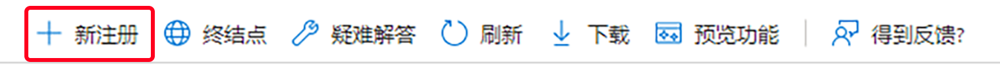

# 对邮件服务的 OAuth2 支持 {#oauth2-support-for-the-mail-service}

AEM as a Cloud Service 提供对其集成的邮件服务的 OAuth2 支持，以便各组织能够遵守安全电子邮件要求。

您可以为多个电子邮件提供商配置 OAuth。以下分步说明针对在 Microsoft Office 365 Outlook 中配置 AEM 邮件服务以通过 OAuth2 进行身份验证。可通过类似方式配置其他供应商。

有关 AEM as a Cloud Service 邮件服务的更多信息，请参阅[发送电子邮件](/help/implementing/developing/introduction/development-guidelines.md#sending-email)。

## Microsoft Outlook {#microsoft-outlook}

1. 转至 [https://portal.azure.com/](https://portal.azure.com/) 并登录。
1. 在搜索栏中搜索 **Azure Active Directory**，并单击搜索结果。或者，您可以直接浏览到 [https://portal.azure.com/#blade/Microsoft_AAD_IAM/ActiveDirectoryMenuBlade/Overview](https://portal.azure.com/#blade/Microsoft_AAD_IAM/ActiveDirectoryMenuBlade/Overview)
1. 单击&#x200B;**应用程序注册** - **新注册**

   

1. 根据您的要求填写信息，然后单击&#x200B;**注册**
1. 转至新创建的应用程序，并选择 **API 权限**
1. 转至&#x200B;**添加权限** - **图表权限** - **委派权限**
1. 为应用程序选择以下权限，然后单击&#x200B;**添加权限**：
   * `SMTP.Send`
   * `Mail.Read`
   * `Mail.Send`
   * `openid`
   * `offline_access`
1. 转至&#x200B;**身份验证** - **添加平台** - **Web**，然后在&#x200B;**重定向 URL** 部分中，添加以下 URL - 一个带正斜杠，一个不带正斜杠：
   * `http://localhost/`
   * `http://localhost`
1. 在添加每个 URL 后按&#x200B;**配置**，然后根据您的要求配置设置
1. 接下来，转至&#x200B;**证书和密码**，单击&#x200B;**新建客户端密码**，然后执行屏幕上显示的步骤来创建密码。请务必记下此密码供以后使用
1. 按左窗格中的&#x200B;**概述**，复制&#x200B;**应用程序（客户端）ID** 和&#x200B;**目录（租户）ID** 的值供以后使用

回顾一下，您将需要以下信息为 AEM 端的邮件服务配置 OAuth2：

* 将使用租户 ID 构建的身份验证 URL。它采用以下形式：`https://login.microsoftonline.com/<tenantID>/oauth2/v2.0/authorize`
* 将使用租户 ID 构建的令牌 URL。它采用以下形式：`https://login.microsoftonline.com/<tenantID>/oauth2/v2.0/token`
* 将使用租户 ID 构建的刷新 URL。它采用以下形式：`https://login.microsoftonline.com/<tenantID>/oauth2/v2.0/token`
* 客户端 ID
* 客户端密码

### 生成刷新令牌 {#generating-the-refresh-token}

接下来，您需要生成刷新令牌，它将是后续步骤中的 OSGi 配置的一部分。

可执行以下步骤来做到这一点：

1. 在将 `clientID` 和 `tenantID` 替换为您帐户的特定值后，在浏览器中打开以下 URL：`https://login.microsoftonline.com/<tenantID>/oauth2/v2.0/authorize?client_id=<clientId>&response_type=code&redirect_uri=http://localhost&response_mode=query&scope=https%3A%2F%2Foutlook.office365.com%2FSMTP.Send%20EWS.AccessAsUser.All%20https%3A%2F%2Foutlook.office365.com%2FSMTP.Send%20https%3A%2F%2Foutlook.office365.com%2FMail.Read%20https%3A%2F%2Foutlook.office365.com%2FMail.Send%20openid%20offline_access&state=12345`
1. 询问时允许权限
1. URL 将重定向到一个新位置，并采用以下格式：`http://localhost/?code=<code>&state=12345&session_state=4f984c6b-cc1f-47b9-81b2-66522ea83f81#`
1. 复制上述示例中的 `<code>` 的值
1. 使用以下 cURL 命令获取 refreshToken。您需要将 tenantID、clientID 和 clientSecret 替换为您帐户的值以及 `<code>` 的值：

   ```
   curl --location --request POST 'https://login.microsoftonline.com/<tenantId>/oauth2/v2.0/token' \
   --header 'Content-Type: application/x-www-form-urlencoded' \
   --header 'Cookie: buid=0.ARgAep0nU49DzUGmoP2wnvyIkcQjsx26HEpOnvHS0akqXQgYAAA.AQABAAEAAAD--DLA3VO7QrddgJg7Wevry9XPJSKbGVlPt5NWYxLtTl3K1W0LwHXelrffApUo_K02kFrkvmGm94rfBT94t25Zq4bCd5IM3yFOjWb3V22yDM7-rl112sLzbBQBRCL3QAAgAA; esctx=AQABAAAAAAD--DLA3VO7QrddgJg7Wevr4a8wBjYcNbBXRievdTOd15caaeAsQdXeBAQA3tjVQaxmrOXFGkKaE7HBzsJrzA-ci4RRpor-opoo5gpGLh3pj_iMZuqegQPEb1V5sUVQV8_DUEbBv5YFV2eczS5EAhLBAwAd1mHx6jYOL8LwZNDFvd2-MhVXwPd6iKPigSuBxMogAA; x-ms-gateway-slice=estsfd; stsservicecookie=estsfd; fpc=Auv6lTuyAP1FuOOCfj9w0U_5vR5dAQAAALDXP9gOAAAAwIpkkQEAAACT2T_YDgAAAA' \
   --data-urlencode 'client_id=<clientID>' \
   --data-urlencode 'scope=https://outlook.office365.com/SMTP.Send https://outlook.office365.com/Mail.Read https://outlook.office365.com/Mail.Send openid' \
   --data-urlencode 'redirect_uri=http://localhost' \
   --data-urlencode 'grant_type=authorization_code' \
   --data-urlencode 'client_secret=<clientSecret>' \
   --data-urlencode 'code=<code>'
   ```

1. 记下 refreshToken 和 accessToken。

### 验证令牌 {#validating-the-tokens}

继续在 AEM 端配置 OAuth 之前，确保使用以下过程验证 accessToken 和 refreshToken：

1. 使用上一个过程中生成的 refreshToken 生成 accessToken。可以使用以下 curl 并替换 `<client_id>`、`<client_secret>` 和 `<refreshToken>` 的值来实现这一点：

   ```
   curl --location --request POST 'https://login.microsoftonline.com/<tenetId>/oauth2/v2.0/token' \
   --header 'Content-Type: application/x-www-form-urlencoded' \
   --header 'Cookie: buid=0.ARgAep0nU49DzUGmoP2wnvyIkcQjsx26HEpOnvHS0akqXQgYAAA.AQABAAEAAAD--DLA3VO7QrddgJg7Wevry9XPJSKbGVlPt5NWYxLtTl3K1W0LwHXelrffApUo_K02kFrkvmGm94rfBT94t25Zq4bCd5IM3yFOjWb3V22yDM7-rl112sLzbBQBRCL3QAAgAA; esctx=AQABAAAAAAD--DLA3VO7QrddgJg7Wevr4a8wBjYcNbBXRievdTOd15caaeAsQdXeBAQA3tjVQaxmrOXFGkKaE7HBzsJrzA-ci4RRpor-opoo5gpGLh3pj_iMZuqegQPEb1V5sUVQV8_DUEbBv5YFV2eczS5EAhLBAwAd1mHx6jYOL8LwZNDFvd2-MhVXwPd6iKPigSuBxMogAA; x-ms-gateway-slice=estsfd; stsservicecookie=estsfd; fpc=Auv6lTuyAP1FuOOCfj9w0U_IezHLAQAAAPeNSdgOAAAA' \
   --data-urlencode 'client_id=<client_id>' \
   --data-urlencode 'scope=https://outlook.office365.com/SMTP.Send https://outlook.office365.com/Mail.Read https://outlook.office365.com/Mail.Send openid' \
   --data-urlencode 'redirect_uri=http://localhost' \
   --data-urlencode 'grant_type=refresh_token' \
   --data-urlencode 'client_secret=<client_secret>' \
   --data-urlencode 'refresh_token=<refreshToken>'
   ```

1. 使用 accessToken 发送邮件以查看它是否正常运行。

>[!NOTE]
>
> 您可以从[此位置](https://docs.microsoft.com/en-us/azure/active-directory/develop/v2-oauth2-auth-code-flow)获取 Postman API 收藏集。

### 与 AEM as a Cloud Service 集成 {#integration-with-aem-as-a-cloud-service}

1. 使用以下语法在 `/apps/<my-project>/osgiconfig/config` 下创建名为 `com.day.cq.mailer.oauth.impl.OAuthConfigurationProviderImpl.cfg.json` 的 OSGI 属性文件：

   ```
   {
       authUrl: "<Authorization Url>",
       tokenUrl: "<Token Url>",
       clientId: "<clientID>",
       clientSecret: "$[secret:SECRET_SMTP_OAUTH_CLIENT_SECRET]",
       scopes: [
          "scope1",
          "scope2"
       ],
       refreshUrl: "<Refresh token Url>",
       refreshToken: "$[secret:SECRET_SMTP_OAUTH_REFRESH_TOKEN]"
   }
   ```

1. 填写 `authUrl`、`tokenUrl` 和 `refreshURL`，方式是按上一部分所述来构造它们。
1. 将以下范围添加到配置：
   * `openid`
   * `offline_access`
   * `https://outlook.office365.com/Mail.Send`
   * `https://outlook.office365.com/Mail.Read`
   * `https://outlook.office365.com/SMTP.Send`
1. 使用以下语法创建 OSGI 属性文件 `called com.day.cq.mailer.impl.DefaultMailService.cfg.json`
（在 
`/apps/<my-project>/osgiconfig/config` 下）：

   ```
   {
    "smtp.host": "<smtp hostname>"
    "smtp.user": "<user account that logged into get the oauth tokens>",
    "smtp.password": "value not used",
    "smtp.port": 587,
    "from.address": "<from address used for sending>"
    "smtp.ssl": false,
    "smtp.starttls": true,
    "smtp.requiretls": true,
    "debug.email": false,
    "oauth.flow": true
   }
   ```

1. 对于 Outlook，`smtp.host` 配置值为 `smtp.office365.com`
1. 在运行时，使用 Cloud Manager 变量 API 传入 `refreshToken values` 和 `clientSecret` 密码，如[此处](/help/implementing/deploying/configuring-osgi.md#setting-values-via-api)所述。应定义变量 `SECRET_SMTP_OAUTH_REFRESH_TOKEN` 和 `SECRET_SMTP_OAUTH_CLIENT_SECRET` 的值。

### 疑难解答 {#troubleshooting}

如果邮件服务无法正常运行，则在大多数情况下，您将需要重新生成 `refreshToken`（如上所述），并通过 Cloud Manager API 传入新值。部署新值需要花费几分钟的时间。
