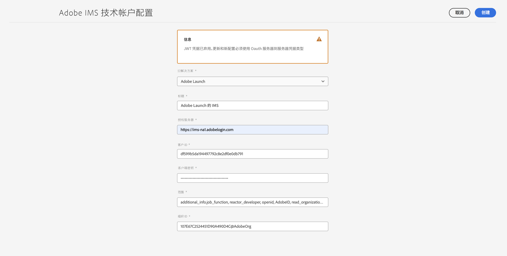
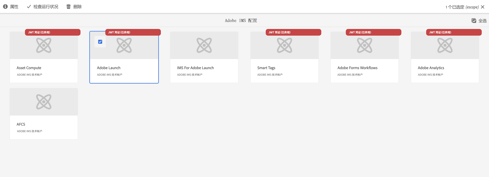
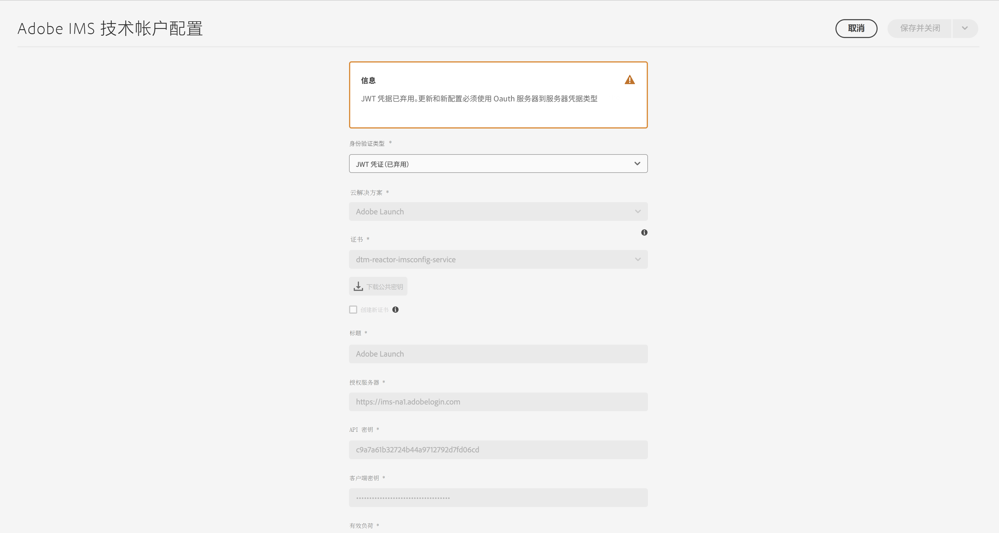
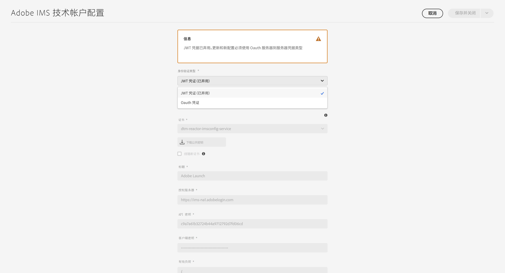
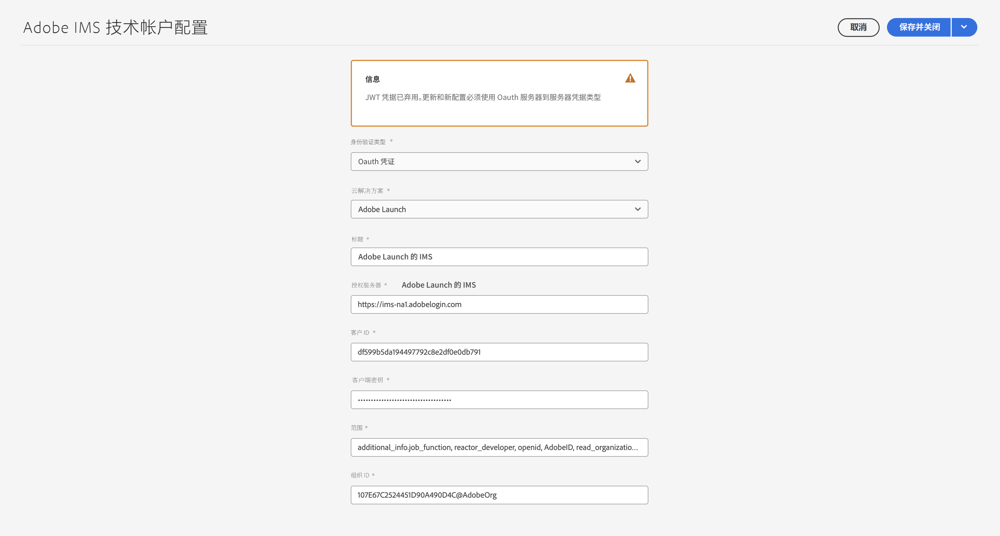

# 为 AEM as a Cloud Service 设置 IMS 集成 {#setting-up-ims-integrations-for-aemaacs}

>[!NOTE]
>
>自动配置的 JWT 配置不应手动迁移，因为 Adobe 将自动处理这些配置。

Adobe Experience Manager (AEM) as a Cloud Service 可以与许多其他 Adobe 解决方案集成。例如，Adobe Target、Adobe Analytics 等。

这些集成使用配置了 S2S OAuth 的 IMS 集成。

* 创建以下配置后：

   * [Developer Console 中的凭据](#credentials-in-the-developer-console)

* 然后您就可以：

   * 创建（新）[OAuth 配置](#creating-oauth-configuration)

   * [将现有 JWT 配置迁移到 OAuth 配置](#migrating-existing-JWT-configuration-to-oauth)

>[!CAUTION]
>
>以前，配置是使用 [JWT 凭据进行的，但现在这些凭据在 Adobe Developer Console 中已遭弃用](/help/security/jwt-credentials-deprecation-in-adobe-developer-console.md)。
>
>无法再创建或更新此类配置，但可以将它们迁移到 OAuth 配置。

## Developer Console 中的凭据 {#credentials-in-the-developer-console}

第一步，您需要在 Adobe Developer Console 中配置 OAuth 凭据。

有关如何执行此操作的详细信息，请参阅开发者控制台文档，具体取决于您的要求：

* 概述：

   * [服务器到服务器身份验证](https://developer.adobe.com/developer-console/docs/guides/authentication/ServerToServerAuthentication/)

* 创建新的 OAuth 凭据：

   * [OAuth 服务器到服务器凭据实施指南](https://developer.adobe.com/developer-console/docs/guides/authentication/ServerToServerAuthentication/implementation/)

* 将现有的 JWT 凭据迁移到 OAuth 凭据：

   * [从服务帐户 (JWT) 凭据迁移到 OAuth 服务器到服务器凭据](https://developer.adobe.com/developer-console/docs/guides/authentication/ServerToServerAuthentication/migration/)

例如：

## 创建 OAuth 配置 {#creating-oauth-configuration}

要使用 OAuth 创建新的 Adobe IMS 集成：

1. 在 AEM 中，导航到&#x200B;**工具**、**安全**、**Adobe IMS 集成**。

1. 选择&#x200B;**创建**。

1. 根据 [Developer Console](https://developer.adobe.com/developer-console/docs/guides/authentication/ServerToServerAuthentication/implementation/) 中的详细信息完成配置。例如：

   

1. **保存**&#x200B;您的更改。

## 将现有 JWT 配置迁移到 OAuth 配置 {#migrating-existing-JWT-configuration-to-oauth}

要迁移基于 JWT 凭据的现有 Adobe IMS 集成，请执行以下操作：

>[!NOTE]
>
>此示例显示启动 IMS 配置。

1. 在 AEM 中，导航到&#x200B;**工具**、**安全**、**Adobe IMS 集成**。

1. 选择需要迁移的 JWT 配置。JWT 配置标有 **JWT 凭据（已弃用）**&#x200B;警告。

1. 选择&#x200B;**属性**：

   

1. 配置将以只读模式打开：

   

1. 从&#x200B;**身份验证类型**&#x200B;下拉菜单中选择 **OAuth**：

   

1. 将更新可用的属性。使用 Developer Console 中的详细信息来完成以下操作：

   

1. 使用&#x200B;**保存并关闭**来保存您的更新。
当您返回控制台时，**JWT 凭据（已弃用）**&#x200B;警告将消失。