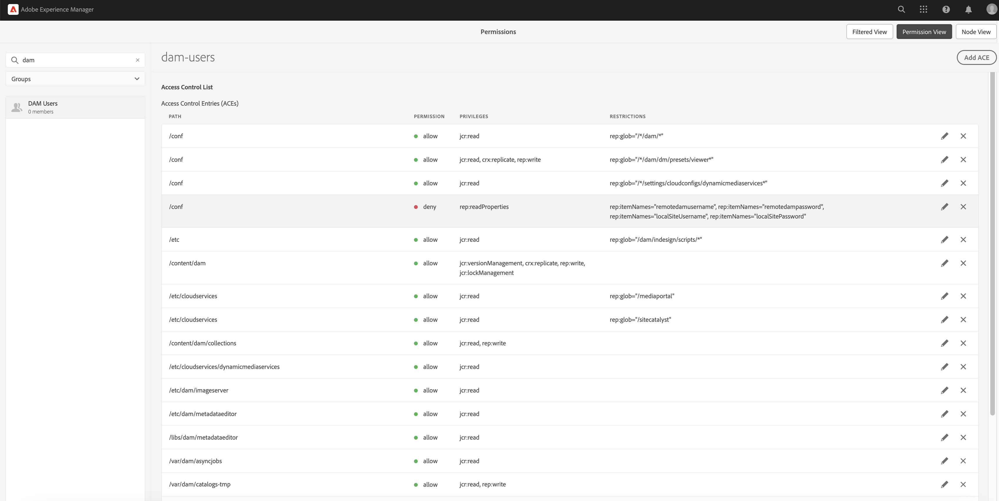
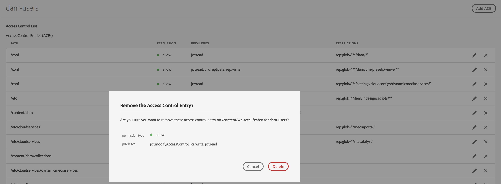

# 权限管理的主要视图 {#principal-view-for-permissions-management}

## 概述 {#overview}

AEM 引入了用户和群组的权限管理。主要功能与经典用户 UI 保持一致，但更加友好和高效。

## 访问 UI {#accessing-the-ui}

新的基于 UI 的权限管理可通过“安全性”下的“权限”信息卡访问，如下所示：

通过新视图，可以更轻松地查看给定主体在明确授予权限的所有路径上的整套特权和限制。这样就无需前往

CRXDE 来管理高级特权和限制。它已在同一个视图中得到合并。

有一个过滤器，允许用户通过查看&#x200B;**用户**、**群组**&#x200B;或&#x200B;**全部**&#x200B;来选择主体类型，并搜索任何主体&#x200B;**。**

## 查看主体的权限 {#viewing-permissions-for-a-principal}

左侧的框架允许用户向下滚动，以查找任何主体或根据所选过滤器搜索群组或用户，如下所示：

单击名称会在右侧显示分配的权限。权限窗格显示特定路径上的访问控制条目列表以及配置的限制。

## 为主体添加新的访问控制条目 {#adding-new-access-control-entry-for-a-principal}

可以通过添加访问控制条目来添加新权限。只需单击“添加 ACE”按钮即可。

这将打开如下所示的窗口，下一步是选择必须配置权限的路径。

这里选择了一条路径，您可以在其中为 **dam-users** 配置权限：

选择路径后，工作流返回到此屏幕，用户可以从可用的命名空间中选择一个或多个特权（如 `jcr`、`rep` 或 `crx`），如下所示。

可以通过使用文本字段搜索然后从列表中选择来添加特权。

>[!NOTE]
>
>有关特权和说明的完整列表，请参阅[用户、群组和访问权限管理](https://experienceleague.adobe.com/zh-hans/docs/experience-manager-65/content/security/user-group-ac-admin#access-right-management)。

 

选择特权列表后，用户可以选择权限类型：拒绝或允许，如下所示。

 

## 使用限制 {#using-restrictions}

除了给定路径上的特权列表和权限类型之外，此屏幕还允许您添加细粒度访问控制的限制，如下所示：

>[!NOTE]
>
>有关每个限制含义的更多信息，请参阅 [Jackrabbit Oak 文档](https://jackrabbit.apache.org/oak/docs/security/authorization/restriction.html)。

可以通过选择限制类型、输入值并点击 **+** 图标来添加限制，如下所示。

 

新的 ACE 反映在访问控制列表中，如下所示。请注意，`jcr:write` 是一项聚合特权，它包含上面添加的 `jcr:removeNode`，但由于它涵盖在 `jcr:write` 下，因此未在下方显示。

## 编辑 ACE {#editing-aces}

访问控制条目可以通过选择主体和选择要编辑的 ACE 来编辑。

例如，您可以单击右侧的铅笔图标来编辑以下 **dam-users** 条目：

编辑屏幕显示预先选择的已配置 ACE，可以通过单击旁边的十字图标来删除它们，或者可以为给定的路径添加新的特权，如下所示。

此处为给定路径上的 **dam-users** 添加了 `addChildNodes` 特权。

单击右上角的&#x200B;**保存**&#x200B;按钮即可保存更改，更改将反映在 **dam-users** 的新权限中，如下所示：

## 删除 ACE {#deleting-aces}

可以删除访问控制条目，以移除特定路径上给定主体的所有权限。可以用 ACE 旁边的 X 图标删除它，如下所示：

 

## 权限视图 {#permissions-view}

### 触屏 UI 权限视图 {#touch-ui-permisions-view}

管理员需要对节点层面的权限分配进行更精细的控制和可见性，以便在 AEM 内实现更好的安全性和管理。以前，只能使用基于主体的权限视图，从而限制了查看 ACL 如何应用于特定节点或筛选视图的能力。新的节点和筛选视图提供了权限分配的详细情况和上下文视角，从而可以更好地管理和审计安全配置。此功能增强了管理监督并简化了权限管理、提高了安全性、减少了错误配置，并简化了 AEM 中的用户访问控制。

您可以通过单击&#x200B;**工具 - 安全性 - 权限**&#x200B;来访问权限触屏 UI 视图，如下所示：

启动“权限”视图后，您可以根据观看偏好，单击位于屏幕的右上角的&#x200B;**节点视图**&#x200B;或&#x200B;**筛选视图**。

#### 节点视图

在此视图中，每个个体节点（路径）都显示 ACL。它提供以下信息：

所选节点的本地 ACL。
有效 ACL，包括应用于每个父节点直至根（“/”）的 ACL。
用户可以选择添加、移除或更新 ACL。单击某个路径时，左侧窗格会显示其子路径，而右侧窗格则会显示与该路径关联的所有 ACL 的表格视图。

#### 筛选视图

此视图允许用户有效地搜索指定路径和主体的权限。在此视图中，用户可以轻松确定授予所选路径的一组主体的权限类型。
此外，筛选视图还提供了对有效 ACL 的洞察。它显示与所选路径的父节点关联的 ACL，同时考虑所选主体和任何常见主体。

### 存储库浏览器权限视图 {#the-repository-browser-permissions-view}

还可以通过[存储库浏览器](/help/implementing/developing/tools/repository-browser.md)访问权限视图。

您可以通过以下方式访问：

1. 打开 Developer Console，单击&#x200B;**存储库浏览器**&#x200B;选项卡，然后&#x200B;**打开存储库浏览器**

   

1. 进入存储库浏览器后，单击&#x200B;**权限**&#x200B;选项卡

   

**注释**：要查看权限，需要管理员权限。按照提到的步骤在[此处](/help/implementing/developing/tools/repository-browser.md#navigate-the-hierarchy-navigate-the-hierarchy)访问权限。

## 经典 UI 特权组合 {#classic-ui-privilege-combinations}

新的权限 UI 明确使用基本特权集，而不是预定义的组合，因为预定义的组合不能真正反映授予的确切底层特权。

这导致人们对具体配置的内容感到困惑。下表列出了经典 UI 中的特权组合与构成它们的实际特权之间的映射：

<table>
 <tbody>
  <tr>
   <th>经典 UI 特权组合</th>
   <th>权限 UI 特权</th>
  </tr>
  <tr>
   <td>读取</td>
   <td><code>jcr:read</code></td>
  </tr>
  <tr>
   <td>修改</td>
   <td>
<code>jcr:modifyProperties</code>
 
<code>jcr:lockManagement</code>
 
<code>jcr:versionManagement</code>
 </td>
  </tr>
  <tr>
   <td>创建</td>
   <td>
<code>jcr:addChildNodes</code>
 
<code>jcr:nodeTypeManagement</code>
 </td>
  </tr>
  <tr>
   <td>删除</td>
   <td>
<code>jcr:removeNode</code>
 
<code>jcr:removeChildNodes</code>
 </td>
  </tr>
  <tr>
   <td>读取 ACL</td>
   <td><code>jcr:readAccessControl</code></td>
  </tr>
  <tr>
   <td>编辑 ACL</td>
   <td><code>jcr:modifyAccessControl</code></td>
  </tr>
  <tr>
   <td>复制</td>
   <td><code>crx:replicate</code></td>
  </tr>
 </tbody>
</table>
