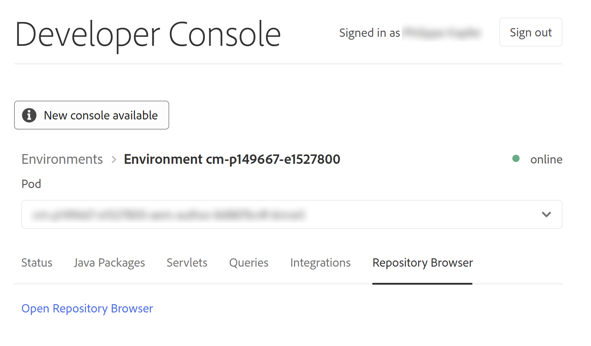

# 权限管理的主体视图 {#principal-view-for-permissions-management}

## 概述 {#overview}

AEM引入了用户和组的权限管理。 主要功能与经典UI相同，但更加用户友好且高效。

## 访问UI {#accessing-the-ui}

通过安全性下的权限卡访问新的基于UI的权限管理，如下所示：

通过新视图，可以更轻松地查看明确授予权限的所有路径上给定主体的整套权限和限制。 这样便无需转至

CRXDE用于管理高级权限和限制。 该报表已合并到同一视图中。

有一个筛选器允许用户选择承担者类型以查看&#x200B;**用户**、**组**&#x200B;或&#x200B;**所有**&#x200B;并搜索任何承担者&#x200B;**。**

## 查看承担者的权限 {#viewing-permissions-for-a-principal}

左侧的框架允许用户向下滚动以查找任何承担者或根据所选筛选器搜索组或用户，如下所示：

单击名称会在右侧显示分配的权限。 权限窗格显示特定路径上的访问控制条目列表以及配置的限制。

## 为主体添加新的访问控制条目 {#adding-new-access-control-entry-for-a-principal}

可以通过添加访问控制条目来添加新权限。 只需单击Add ACE按钮。

此时将显示以下窗口，下一步是选择必须配置权限的路径。

此处，选择一个路径，您可以在其中配置&#x200B;**dam-users**&#x200B;的权限：

选择路径后，工作流将返回此屏幕，用户随后可以从可用命名空间（如`jcr`、`rep`或`crx`）中选择一个或多个权限，如下所示。

可以通过使用文本字段进行搜索，然后从列表中选择来添加权限。

>[!NOTE]
>
>有关权限和说明的完整列表，请参阅[用户、组和访问权限管理](https://experienceleague.adobe.com/en/docs/experience-manager-65/content/security/user-group-ac-admin#access-right-management)。

给定路径的 

选择权限列表后，用户可以选择权限类型：拒绝或允许，如下所示。

 

## 使用限制 {#using-restrictions}

除了给定路径上的权限和权限类型列表之外，此屏幕还允许您为细粒度访问控制添加限制，如下所示：

>[!NOTE]
>
>有关每个限制含义的更多信息，请参阅[Jackrabbit Oak文档](https://jackrabbit.apache.org/oak/docs/security/authorization/restriction.html)。

可以通过选择限制类型、输入值并点击&#x200B;**+**&#x200B;图标来添加如下所示的限制。

 

新的ACE会反映在“访问控制列表”中，如下所示。 请注意，`jcr:write`是一个聚合特权，它包含上面添加的`jcr:removeNode`，但不显示于下面，因为它包含在`jcr:write`中。

## 编辑ACE {#editing-aces}

通过选择承担者并选择要编辑的ACE，可以编辑访问控制条目。

例如，您可以在此处通过单击右侧的铅笔图标来编辑&#x200B;**dam-users**&#x200B;的以下条目：

此时将显示编辑屏幕，其中已预先选择配置的ACE，单击它们旁边的交叉图标可以删除这些ACE，也可以为给定路径添加新权限，如下所示。

此处为给定路径上的&#x200B;**dam-users**&#x200B;添加了`addChildNodes`权限。

单击右上方的&#x200B;**保存**&#x200B;按钮可保存更改，更改将反映在&#x200B;**dam-users**&#x200B;的新权限中，如下所示：

## 删除ACE {#deleting-aces}

可以删除访问控制条目，以删除授予特定路径上的承担者的所有权限。 可以使用ACE旁边的X图标将其删除，如下所示：

 

## 权限视图 {#permissions-view}

### 触控UI权限视图 {#touch-ui-permisions-view}

管理员需要在节点级别更加精细地控制和查看权限分配，以便在AEM中实现更好的安全和管理。 以前，只有基于承担者的权限视图可用，这限制了查看ACL如何应用于特定节点或过滤视图的能力。 新节点和筛选视图提供了权限分配的详细情景化视角，允许更好地管理和审核安全配置。 此功能增强了管理监督并简化了权限管理，提高了安全性，减少了错误配置，并简化了AEM中的用户访问控制。

通过单击&#x200B;**工具 — 安全性 — 权限**，您可以访问“权限触屏UI”视图，如下所示：

启动“权限”视图后，您可以单击屏幕右上角的&#x200B;**节点视图**&#x200B;或&#x200B;**筛选视图**，具体取决于您的查看首选项。

#### 节点视图

在此视图中，为每个单独的节点（路径）显示ACL。 它提供了以下信息：

选定节点的本地ACL。
有效的ACL，包括应用于每个父节点直至根(“/”)的ACL。
用户可以添加、删除或更新ACL。 单击路径时，左侧窗格显示其子项，右侧显示与该路径关联的所有ACL的表视图。

#### 筛选视图

此视图允许用户高效地搜索指定路径和承担者的权限。 在此视图中，用户可以轻松确定针对所选路径授予一组承担者的权限类型。
此外，“过滤的视图”提供了对有效ACL的分析。 它显示与所选路径的父节点关联的ACL，其中考虑所选承担者和任何公共承担者。

### 存储库浏览器权限视图 {#the-repository-browser-permissions-view}

也可以通过[存储库浏览器](/help/implementing/developing/tools/repository-browser.md)访问权限视图。

您可以通过以下方式访问它：

1. 打开开发人员控制台，单击&#x200B;**存储库浏览器**&#x200B;选项卡，然后单击&#x200B;**打开存储库浏览器**

   

1. 进入存储库浏览器后，单击&#x200B;**权限**&#x200B;选项卡

   

**注意**：要查看权限，需要管理员权限。 按照[此处](/help/implementing/developing/tools/repository-browser.md#navigate-the-hierarchy-navigate-the-hierarchy)提及的步骤访问权限。

## 经典UI权限组合 {#classic-ui-privilege-combinations}

新权限UI明确使用基本权限集，而不是预定义的组合，这些组合不能真正反映所授予的确切基础权限。

这会导致混淆，不知到底在配置什么内容。 下表列出了从经典UI到组成权限组合的实际权限之间的映射：

<table>
 <tbody>
  <tr>
   <th>经典UI权限组合</th>
   <th>权限UI权限</th>
  </tr>
  <tr>
   <td>读取</td>
   <td><code>jcr:read</code></td>
  </tr>
  <tr>
   <td>修改</td>
   <td>
<code>jcr:modifyProperties</code>
 
<code>jcr:lockManagement</code>
 
<code>jcr:versionManagement</code>
 </td>
  </tr>
  <tr>
   <td>创建</td>
   <td>
<code>jcr:addChildNodes</code>
 
<code>jcr:nodeTypeManagement</code>
 </td>
  </tr>
  <tr>
   <td>删除</td>
   <td>
<code>jcr:removeNode</code>
 
<code>jcr:removeChildNodes</code>
 </td>
  </tr>
  <tr>
   <td>读取 ACL</td>
   <td><code>jcr:readAccessControl</code></td>
  </tr>
  <tr>
   <td>编辑 ACL</td>
   <td><code>jcr:modifyAccessControl</code></td>
  </tr>
  <tr>
   <td>复制</td>
   <td><code>crx:replicate</code></td>
  </tr>
 </tbody>
</table>
