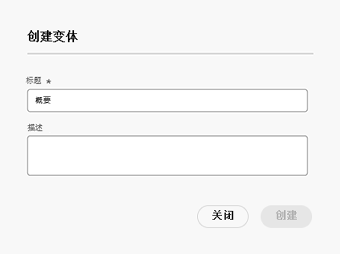

# 创作内容片段 {#authoring-content-fragments}

创作内容片段侧重于 Headless 投放和页面创作。

有两个编辑器用于创作内容片段。此部分中描述的编辑器：

* 专为投放 Headless 内容开发而成（但它们可用于所有场景）
* 可从&#x200B;**内容片段**&#x200B;控制台找到它

此编辑器提供：

* [自动保存](#saving-autosaving)，以防止意外丢失编辑内容。
* [直接上传资源作为内容引用](#reference-images)，而不必将它先上传到资源 DAM。
* [生成变体](#generate-variations-ai) 使用创作AI根据提示加快内容创建。
* [预览](#preview-content-fragment)内容片段投放的所呈现的体验。
* 可从编辑器[发布](#publish-content-fragment)和[取消发布](#unpublish-content-fragment)。
* 可在编辑器中[查看和打开关联的语言副本](#view-language-copies)。
* 可在编辑器中[查看版本详细信息](#view-version-history)。您还可恢复为所选版本。
* 可[查看和打开父引用](#view-parent-references)。
* 内容片段及其引用的分层视图，其中使用[结构树](#structure-tree)。

>[!WARNING]
>
>*只有**在线* Adobe Experience Manager (AEM) as a Cloud Service 中有此部分中所述的编辑器可用。

## 内容片段编辑器 {#content-fragment-editor}

首次打开内容片段编辑器时，您将看到四个主要区域：

* 顶部工具栏：用于关键信息和操作
   * 内容片段控制台的链接（主页图标）
   * 有关模型和文件夹的信息
   * 预览[链接（如果为模型配置了默认预览 URL 模式）](/help/sites-cloud/administering/content-fragments/content-fragment-models.md#content-fragment-model-properties)
   * [发布](#publish-content-fragment)和[取消发布](#unpublish-content-fragment)操作
   * 用于显示所有&#x200B;**父引用**&#x200B;的选项（链接图标）
   * 片段&#x200B;**[状态](/help/sites-cloud/administering/content-fragments/managing.md#statuses-content-fragments)**&#x200B;和上次保存的信息
   * 用于切换到原始（基于资源的）编辑器的开关

     >[!WARNING]
     >
     >原始编辑器将在同一选项卡中打开。 建议不要同时打开两个编辑器。

* 左侧面板：显示内容片段的&#x200B;**[变体](#variations)**&#x200B;及其&#x200B;**字段**：
   * 可使用这些链接[在内容片段结构中导航](#navigate-structure)
* 右侧面板：有多个选项卡，[其中显示属性（元数据）和标记](#view-properties-tags)、关于[版本历史记录](#view-version-history)的信息以及与任何[语言副本](#view-language-copies)相关的信息
   * 在&#x200B;**属性**&#x200B;选项卡中，可更新片段或&#x200B;**变体**&#x200B;的&#x200B;**标题**&#x200B;和&#x200B;**描述**
* 中央面板：显示所选变体的实际字段和内容
   * 使您可编辑内容
   * 如果 **制表符占位符** 这些字段是在模型内定义的，显示在此处，并可用于导航；它们将会水平显示或作为下拉列表显示。

  >[!NOTE]
  >
  >根据底层模型中的定义，字段可以遵循某些类型 [验证](/help/assets/content-fragments/content-fragments-models.md#validation).

## 在内容片段结构中导航 {#navigate-structure}

单个内容片段；

* 由两个级别组成：

   * 内容片段的&#x200B;**[变体](#variations)**
   * **字段** - 由内容片段模型定义，并由每个变体使用

* 可包含多种引用。

### 变体和字段 {#variations-and-fields}

在左侧面板中，您可以看到：

* 已为此片段创建的&#x200B;**[变体](#variations)**&#x200B;的列表：
   * **主控**&#x200B;是首次创建内容片段时出现的变体，稍后可以添加其他变体
   * 您可以使用生成变体(#generate-variations)来使用Adobe为特定用例创建的基于提示的模板。
   * 您也可以[创建变体](#create-variation)
* 片段及其变体中的&#x200B;**字段**：
   * 图标指示[数据类型](/help/sites-cloud/administering/content-fragments/content-fragment-models.md#data-types)
   * 文本是字段名称
   * 这些项目共同提供了中央面板中字段内容的直接链接（对于当前变体）

### 关注链接 {#follow-links}

在编辑器的各个部分中，您可以看到链接图标。 这可用于打开显示的项目；例如，内容片段模型、父引用或被引用的片段：

### 结构树 {#structure-tree}

从编辑器工具栏打开&#x200B;**结构树**&#x200B;选项卡以显示内容片段及其引用的层次结构。使用链接图标导航到引用。

>[!NOTE]
>
>有关更多详细信息，请参阅[分析内容片段结构 - 结构树](/help/sites-cloud/administering/content-fragments/analysis.md#structure-tree)。

## 保存和自动保存 {#saving-autosaving}

<!-- CHECK: cannot be saved, no undo, redo -->

每次进行更新时，内容片段都会自动保存。上次保存的时间将显示在顶部工具栏中。

## 变体 {#variations}

[变体](/help/sites-cloud/administering/content-fragments/overview.md#main-and-variations)是 AEM 的内容片段的一项重要功能。通过变体，可创建和编辑&#x200B;**主控**&#x200B;内容的副本以供在特定渠道和场景上使用，从而更加灵活地投放 Headless 内容和创作页面。

在编辑器中，您可以：

* 为&#x200B;**主控**&#x200B;内容[创建变体](#create-variation)

* [使用生成变体AI](#generate-variations-ai) 使用Generative AI来使用Adobe为特定用例创建的基于提示的模板。

* 选择所需的变体以编辑内容

* [重命名变体](#rename-variation)

* [删除变体](#delete-variation)

### 创建变体 {#create-variation}

要创建内容片段的变体，请执行以下操作：

1. 在左侧面板中，选择&#x200B;**变体**&#x200B;右侧的&#x200B;**加号**（**创建变体**）。

   >[!NOTE]
   >
   >创建第一个变体后，现有变体将在同一面板中列出。

   

1. 在对话框中，依次输入变体的&#x200B;**标题**&#x200B;和&#x200B;**描述**（如果需要）：

   

1. **创建**&#x200B;变体。它显示在列表中。

### 重命名变体 {#rename-variation}

要重命名&#x200B;**变体**，请执行以下操作：

1. 选择所需的变体。

1. 打开右侧面板中的&#x200B;**属性**&#x200B;选项卡。

1. 更新变体&#x200B;**标题**。

1. 按 **Return** 或移至另一个字段以自动保存更改。标题将在左侧的&#x200B;**变体**&#x200B;面板中更新。

### 使用带有“生成变体”的GenAI创建变体 {#generate-variations-ai}

使用创新型变体来利用创新型人工智能加快内容创建。

在内容片段编辑器中使用生成变量：

1. 打开内容片段编辑器。 在标题中，您将找到生成变体的入口点：

   

1. 生成变体将在新选项卡中打开。 在左边栏中，您可以看到要为其创建内容的AEM Cloud实例和内容片段。 选择要使用的提示或创建新提示。

   >[!NOTE]
   >
   >可用的Adobe提示模板现在有限，但在未来版本中将添加更多模板。

   

1. 通过填写提示来生成内容。 片段中的内容模型将通过GenAI自动用于生成内容。

   >[!NOTE]
   >
   >我们当前仅支持文本字段。

   

1. 选择所需的生成变体并选择“导出变体”。 确认内容片段变体的名称并选择以下任一项：

   * **导出**：将变体导出到内容片段并保留在生成变体应用程序中。
   * **导出并打开**：将变量导出到内容片段并打开一个新选项卡，该选项卡显示带有GenAI新变量的内容片段。

     

1. 生成的变体显示在主内容片段编辑器中。

   

您可以了解有关生成变体的更多信息 [此处](/help/generative-ai/generate-variations.md).

### 删除变体 {#delete-variation}

要删除内容片段的变体，请执行以下操作：

    >[！注意]
    >
    >您无法删除**Main**。

1. 选择变体。

1. 在&#x200B;**变体**&#x200B;面板中，选择删除图标（垃圾桶）：

   

1. 这将打开一个对话框。选择&#x200B;**删除**&#x200B;以确认操作。

## 编辑多行文本字段 - 纯文本或 Markdown {#edit-multi-line-text-fields-plaintext-markdown}

**[多行文本](/help/sites-cloud/administering/content-fragments/content-fragment-models.md#data-types)**&#x200B;字段可采用下列三种格式之一：

* 纯文本
* [Markdown](/help/sites-cloud/administering/content-fragments/markdown.md)
* [富文本](#edit-multi-line-text-fields-rich-text)

定义为纯文本或 Markdown 的字段具有一个简单的文本框，而没有（屏幕上）格式选项：

## 编辑多行文本字段 - 富文本 {#edit-multi-line-text-fields-rich-text}

对于定义为&#x200B;**富文本**&#x200B;的&#x200B;**[多行文本](/help/sites-cloud/administering/content-fragments/content-fragment-models.md#data-types)**&#x200B;字段，可以使用各种功能：

* 编辑内容：
   * 还原/重做
   * 粘贴/粘贴为文本
   * 复制
   * 选择段落格式
   * 创建/管理表
   * 设置文本格式；粗体、斜体、下划线、颜色
   * 设置段落对齐方式
   * 创建/管理列表；项目符号列表，编号列表
   * 缩进文本；减少，增加
   * 清除当前格式
   * 插入链接
   * 选择并插入对图像资源的引用
   * 添加特殊字符
* [全屏编辑器](#full-screen-editor-rich-text) - 在全屏和流量中之间切换
* [统计数据](#statistics-rich-text)
* [比较和同步](#compare-and-synchronize-rich-text)

例如：

>[!NOTE]
>
>多行文本字段也由&#x200B;**字段**&#x200B;面板中相应的[图标](#fields-datatypes-icons)指示。

### 全屏编辑器 - 富文本 {#full-screen-editor-rich-text}

全屏编辑器提供与流量中时相同的编辑选项 - 但为文本提供了更多空间。

例如：

### 统计数据 - 富文本 {#statistics-rich-text}

**统计数据**&#x200B;操作显示有关多行字段中的文本的一系列信息。

例如：

### 比较和同步 - 富文本 {#compare-and-synchronize-rich-text}

在打开一个&#x200B;**变体**&#x200B;后，可对多行字段执行&#x200B;**比较**&#x200B;操作。

这将在全屏模式下打开多行字段，并且：

* 并行显示&#x200B;**主控**&#x200B;和当前&#x200B;**变体**&#x200B;的内容，并突出显示任何差异

* 用颜色表示差异：

   * 绿色表示添加的内容（添加到变体）
   * 红色表示内容已移除（从变体中）
   * 蓝色表示替换的文本

* 提供&#x200B;**同步**&#x200B;操作，这会将内容从&#x200B;**主控**&#x200B;同步到当前变体

   * 如果已更新&#x200B;**主控**，这些更改将传输到变体中
   * 如果已更新变体，这些更改将由&#x200B;**主控**&#x200B;内容覆盖

  >[!CAUTION]
  >
  >同步仅可将更改&#x200B;*从&#x200B;**主控**复制到变体*。
  >
  >不提供将更改&#x200B;*从变体传输到&#x200B;**主控***的选项。

例如，在完全重写变体内容的场景中，同步会将新内容替换为&#x200B;**主控**&#x200B;内容：

## 管理引用 {#manage-references}

### 片段引用 {#fragment-references}

[片段引用](/help/sites-cloud/administering/content-fragments/content-fragment-models.md#fragment-reference-nested-fragments)可用于：

* [创建对现有内容片段的引用](#create-reference-existing-content-fragment)
* [创建一个内容片段，然后引用它](#create-reference-content-fragment)

#### 创建对现有内容片段的引用 {#create-reference-existing-content-fragment}

要创建对现有内容片段的引用，请执行以下操作：

1. 选择字段。
1. 选择&#x200B;**添加现有片段**。
1. 从片段选择器中选择所需的片段。

   >[!NOTE]
   >
   >您一次只能选择一个片段。

#### 创建内容片段和引用 {#create-reference-content-fragment}

或者，您可以[选择&#x200B;**创建新片段**&#x200B;以打开&#x200B;**创建**&#x200B;对话框](/help/sites-cloud/administering/content-fragments/managing.md#creating-a-content-fragment)。此片段一经创建便会被引用。

### 内容引用 {#content-references}

[内容引用](/help/sites-cloud/administering/content-fragments/content-fragment-models.md#content-reference)用于引用其他 AEM 内容类型，例如图像、页面和体验片段。

#### 引用图像 {#reference-images}

在&#x200B;**内容引用**&#x200B;字段中，您可以：

* 引用存储库中已存在的资源
* 直接将资源上传到字段；这样一来，便无需使用&#x200B;**资源**&#x200B;控制台进行上传

  >[!NOTE]
  >
  >要直接将图像上传到&#x200B;**内容引用**&#x200B;字段，它&#x200B;**必须**：
  >
  >* 已定义一个&#x200B;**根路径**（在[内容片段模型](/help/sites-cloud/administering/content-fragments/content-fragment-models.md#content-reference)中）。这将指定图像的存储位置。
  >* 在接受的内容类型列表中包括&#x200B;**图像**

要添加资源，您可以：

* 将新的资源文件直接（例如，从您的文件系统中）拖放到&#x200B;**内容引用**&#x200B;字段
* 使用&#x200B;**添加资源**&#x200B;操作，然后选择&#x200B;**浏览资源**&#x200B;或&#x200B;**上传**&#x200B;以打开适当的选择器进行使用：

  

#### 引用页面 {#reference-pages}

要将引用添加到AEM页面、体验片段或其他此类内容类型，请执行以下操作：

1. 选择&#x200B;**添加内容路径**。

1. 在输入字段中添加所需的路径。

1. 确认&#x200B;**添加**。

>[!NOTE]
>
>这不应用于引用以下内容：
>
>* 内容片段 — 使用 [片段引用](#fragment-references)
>* 图像 — 使用 [参考图像](#reference-images)

### 查看父引用 {#view-parent-references}

选择顶部工具栏中的链接图标将打开所有父引用的列表。

例如：

这将打开一个窗口，其中列出了所有相关引用。要打开引用，请选择名称或标题，或链接图标。

例如：

## 查看属性和标记 {#view-properties-tags}

在右侧面板的“属性”选项卡中，可以查看属性（元数据）和标记。属性可以面向：

* **内容片段** - 如果当前已选定&#x200B;**主控**
* 特定的&#x200B;**变体**

### 编辑属性和标记 {#edit-properties-tags}

在“属性”选项卡（右侧面板）中，您还可以编辑：

* **标题**
* **描述**
* **标记**：使用下拉列表或选择对话框

  

### 打开内容片段模型 {#open-content-fragment-model}

在选定&#x200B;**主控**&#x200B;后，底层内容片段模型的名称将显示在“属性”部分中。选择链接图标，在单独的选项卡中打开模型。

例如：

## 查看版本历史记录 {#view-version-history}

在右侧面板的&#x200B;**版本历史记录**&#x200B;选项卡中，将显示当前版本和早期版本的详细信息：

>[!NOTE]
>
>发布内容片段时将创建新版本。

### 比较版本 {#compare-version}

对于内容片段，您可以将以前的版本与当前版本进行比较。

要将以前的版本与当前版本进行比较，请执行以下操作：

1. 选择版本旁边的三个圆点图标。

1. 选择 **比较**.

此时将打开一个视图，其中显示内容的当前版本与内容片段的所选先前版本之间的差异。 从 **有更改的变体** 从下拉列表中，您可以选择查看与主内容的差异和/或变体中的内容。

差异以颜色表示：

* 绿色：表示添加的内容（添加到当前版本）
* 红色：表示内容已删除（从当前版本）

### 恢复到某个版本 {#revert-version}

您可以恢复到任何版本。

要恢复到特定版本，请执行以下操作：

1. 选择版本旁边的三个圆点图标。

1. 选择&#x200B;**恢复**。

## 查看语言副本 {#view-language-copies}

在&#x200B;**语言属性**&#x200B;选项卡中，将显示任何相关语言副本的详细信息。选择链接图标，在单独的选项卡中打开副本。

例如：

>[!NOTE]
>
>有关翻译内容片段和创建语言副本的更多详细信息，请参阅 [AEM Headless 翻译历程](/help/journey-headless/translation/overview.md)。

## 预览您的片段 {#preview-content-fragment}

利用内容片段编辑器中的选项，作者可以在外部前端应用程序中预览其编辑内容。

要使用此功能，您首先需要：

* 与您的 IT 团队一起设置外部前端应用程序，该应用程序将使用其 JSON 输出来渲染内容片段。
* 当设置外部前端应用程序时， **默认预览URL模式** 必须定义为 [相应内容片段模型的属性](/help/sites-cloud/administering/content-fragments/content-fragment-models.md#properties).

在定义 URL 后，**预览**&#x200B;按钮将处于活动状态。您可以选择此按钮来启动外部应用程序（在单独的选项卡中）以渲染内容片段。

## 发布您的片段 {#publish-content-fragment}

您可以将片段&#x200B;**发布**&#x200B;到：

* 预览实例
* 发布实例

您可以从编辑器或控制台发布片段。有关完整详细信息，请参阅[发布和预览片段](/help/sites-cloud/administering/content-fragments/managing.md#publishing-and-previewing-a-fragment)。

## 取消发布您的片段 {#unpublish-content-fragment}

您也可从以下项目中&#x200B;**取消发布**&#x200B;您的片段：

* 预览实例
* 发布实例

您可以从编辑器或控制台取消发布片段。有关完整详细信息，请参阅[取消发布片段](/help/sites-cloud/administering/content-fragments/managing.md#unpublishing-a-fragment)。

## 字段、数据类型和图标 {#fields-datatypes-icons}

**字段**&#x200B;面板列出了内容片段中的所有字段。图标指示&#x200B;**[数据类型](/help/sites-cloud/administering/content-fragments/content-fragment-models.md#data-types)**：

<table style="table-layout:auto">
 <tbody>
  <tr>
   <td>
<b>单行文本</b>
 </td>
   <td>
  
</td>
  </tr>
  <tr>
   <td>
<b>多行文本</b>
 </td>
   <td>
  
</td>
  </tr>
  <tr>
   <td>
<b>数字</b>
 </td>
   <td>
  
</td>
  </tr>
  <tr>
   <td>
<b>布尔值</b>
 </td>
   <td>
  
</td>
  </tr>
  <tr>
   <td>
<b>日期和时间</b>
 </td>
   <td>
  
</td>
  </tr>
  <tr>
   <td>
<b>枚举</b>
 </td>
   <td>
  
</td>
  </tr>
  <tr>
   <td>
<b>标记</b>
 </td>
   <td>
  
</td>
  </tr>
  <tr>
   <td>
<b>内容引用</b>
 </td>
   <td>
  
</td>
  </tr>
  <tr>
   <td>
<b>片段引用</b>
 </td>
   <td>
  
</td>
  </tr>
  <tr>
   <td>
<b>JSON 对象</b>
 </td>
   <td>
  
</td>
  </tr>
  <tr>
   <td>
<b>选项卡占位符</b>

<b>选项卡占位符</b>显示在左侧面板中，但未用实际图标表示。 它也显示在中心面板中，水平显示或下拉列表（当有太多内容无法水平显示时）中。
 </td>
   <td>
  
</td>
  </tr>
 </tbody>
</table>

## 应了解的要点 {#good-to-know}

* 要编辑内容片段，您需要[相应的权限](/help/implementing/developing/extending/content-fragments-customizing.md#asset-permissions)。如果您遇到问题，请联系您的系统管理员。

  例如，如果您没有 `edit` 权限，则编辑器将是只读的。

* 内容片段模型通常可以定义名为&#x200B;**标题**&#x200B;和&#x200B;**描述**&#x200B;的数据字段。如果存在这些字段，则它们是用户定义的字段，并在编辑片段时可在&#x200B;*中央面板*&#x200B;中更新这些字段。

  内容片段及其变体也具有名为&#x200B;**标题**&#x200B;和&#x200B;**描述**&#x200B;的元数据字段（变体属性）。这些字段是任何内容片段的组成部分，并在创建该片段时中定义这些字段。在编辑片段时可在&#x200B;*右侧面板*&#x200B;中更新这些字段。

* 有关[原始内容片段编辑器](/help/assets/content-fragments/content-fragments-variations.md)的完整信息，请参阅资源文档 - 从&#x200B;**资源**&#x200B;控制台和&#x200B;**内容片段**&#x200B;控制台均可找到此编辑器。

* 如有必要，您的项目团队可以自定义编辑器。 有关进一步详细信息，请参阅[自定义内容片段控制台和编辑器](/help/implementing/developing/extending/content-fragments-console-and-editor.md)。
