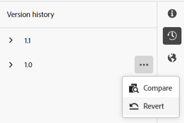

# 创作内容片段 {#authoring-content-fragments}

创作内容片段时，将重点放在headless投放和页面创作上。

有两个编辑器可用于内容片段。 本节中介绍的编辑器：

* 已针对headless内容投放开发（尽管可用于所有场景）
* 可从以下位置获取： **内容片段** 控制台

此编辑器提供：

* [自动保存](#saving-autosaving)，以防止意外丢失编辑。
* [将资产作为内容引用进行内联上传](#reference-images)，无需先将它们上传到资产DAM。
* [预览](#preview-content-fragment) 内容片段交付的渲染体验的版本。
* 能够 [Publish](#publish-content-fragment) 和 [取消发布](#unpublish-content-fragment) 从编辑器中删除。
* 能够 [查看和打开关联的语言副本](#view-language-copies) 在编辑器中。
* 能够 [查看版本详细信息](#view-version-history) 在编辑器中。
   * 您还可以还原到选定的版本。
* 能够 [查看和打开父引用](#view-parent-references).
* 内容片段及其引用的分级视图，使用 [结构树](#structure-tree).

>[!CAUTION]
>
>本节中介绍的编辑器是 *仅限* 中提供 *在线* Adobe Experience Manager (AEM)as a Cloud Service。

>[!CAUTION]
>
>要编辑内容片段，您需要 [相应的权限](/help/implementing/developing/extending/content-fragments-customizing.md#asset-permissions). 如果您遇到问题，请联系您的系统管理员。
> 
>例如，如果您没有 `edit` 权限编辑器的权限将为只读。

>[!NOTE]
>
>有关资产的完整信息，请参阅Assets文档 [原始内容片段编辑器](/help/assets/content-fragments/content-fragments-variations.md)  — 可从以下两个位置获得该服务： **资产** 控制台和 **内容片段** 控制台。

>[!NOTE]
>
>如果需要，您的项目团队可以自定义编辑器。 请参阅 [自定义内容片段控制台和编辑器](/help/implementing/developing/extending/content-fragments-console-and-editor.md) 以了解更多详细信息。

## 内容片段编辑器 {#content-fragment-editor}

首次打开内容片段编辑器时，您会看到四个主要区域：

* 顶部工具栏：有关关键信息和操作
   * 指向内容片段控制台（主页图标）的链接
   * 有关模型和文件夹的信息
   * 链接到 [预览（如果为模型配置了默认预览URL模式）](/help/sites-cloud/administering/content-fragments/content-fragment-models.md#content-fragment-model-properties)
   * [Publish](#publish-content-fragment)、和 [取消发布](#unpublish-content-fragment) 操作
   * 用于显示全部的选项 **父引用** （链接图标）
   * 片段 **[状态](/help/sites-cloud/administering/content-fragments/managing.md#statuses-content-fragments)**&#x200B;和上次保存的信息
   * 切换到原始（基于资产）编辑器的切换开关
* 左侧面板：显示 **[变体](#variations)** 用于内容片段及其 **字段**：
   * 这些链接可用于 [导航内容片段结构](#navigate-structure)
* 右侧面板：显示选项卡 [显示属性（元数据）和标记](#view-properties-tags)，此信息介绍了 [版本历史记录](#view-version-history)，以及与任何 [语言副本](#view-language-copies)
   * 在 **属性** 选项卡，您可以更新 **标题** 和 **描述** 用于片段，或 **变量**
* 中央面板：显示所选变体的实际字段和内容
   * 允许您编辑内容
   * 如果 **制表符占位符** 字段在模型内定义，它们显示在此处，并且可用于导航；它们将会水平显示或作为下拉列表显示

>[!CAUTION]
>
>内容片段模型通常可以定义名为的数据字段 **标题** 和 **描述**. 如果这些字段存在，则它们是用户定义的字段，可以在 *中央面板* 编辑片段时。
>
>内容片段及其变体还具有称为的元数据字段（变体属性） **标题** 和 **描述**. 这些字段是任何内容片段的组成部分，最初在片段时定义。 可以在以下位置更新它们： *右侧面板* 编辑片段时。

## 导航内容片段结构 {#navigate-structure}

单个内容片段；

* 包含两个级别：

   * **[变体](#variations)** 内容片段的
   * **字段**  — 由内容片段模型定义，并由每个变体使用

* 可以包含各种引用。

### 变量和字段 {#variations-and-fields}

在左侧面板中，您可以看到：

* 列表 **[变体](#variations)** 已为此片段创建的区段：
   * **主要** 是首次创建内容片段时存在的变量，您可以稍后添加其他变量
   * 您可以选择并打开变体进行编辑
   * 您还可以 [创建变体](#create-variation)
* 该 **字段** 在片段及其变体中：
   * 图标指示 [数据类型](/help/sites-cloud/administering/content-fragments/content-fragment-models.md#data-types)
   * 文本是字段名称
   * 所有这些都提供了指向中央面板中字段内容的直接链接（对于当前变体）

### 关注链接 {#follow-links}

在编辑器的各个部分中，您将看到链接图标。 这可用于打开显示的项目；例如，内容片段模型、父引用或被引用的片段：

### 结构树 {#structure-tree}

打开 **结构树** 选项卡中显示内容片段的层次结构及其引用。 使用链接图标导航到引用。

>[!NOTE]
>
>请参阅 [分析内容片段结构 — 结构树](/help/sites-cloud/administering/content-fragments/analysis.md#structure-tree) 以了解更多详细信息。

## 保存和自动保存 {#saving-autosaving}

<!-- CHECK: cannot be saved, no undo, redo -->

通过您进行的每次更新，都会自动保存内容片段。 上次保存的时间显示在顶部工具栏中。

## 变体 {#variations}

[变体](/help/sites-cloud/administering/content-fragments/overview.md#main-and-variations) 是AEM内容片段的一项重要功能。 它们允许您创建和编辑 **主要** 内容用于特定渠道和场景，使headless内容投放和页面创作更加灵活。

从该编辑器中，您可以：

* [创建变体](#create-variation) 的 **主要** 内容

* 选择编辑内容所需的变体

* [重命名变量](#rename-variation)

* [删除变体](#delete-variation)

### 创建变体 {#create-variation}

要创建内容片段的变体，请执行以下操作：

1. 在左侧面板中，选择 **加号** (**创建变量**)的右侧 **变体**.

   >[!NOTE]
   >
   >创建第一个变体后，现有变体将列出在同一面板中。

   

1. 在对话框中，输入 **标题** ，以及 **描述** 如果需要：

   

1. **创建** 变体。 它显示在列表中。

### 重命名变体 {#rename-variation}

要重命名 **变量**：

1. 选择所需的变体。

1. 打开 **属性** 选项卡。

1. 更新变量 **标题**.

1. 按 **返回** 或移至另一个字段以自动保存更改。 标题将在中更新 **变体** 左侧面板。

### 删除变体 {#delete-variation}

要删除内容片段的变体，请执行以下操作：

>[!NOTE]
>
>您无法删除 **主要**.

1. 选择变体。

1. 在 **变量** 面板中，选择删除图标（垃圾桶）：

   

1. 这将打开一个对话框。 选择 **删除** 以确认操作。

## 编辑多行文本字段 — 纯文本或Markdown {#edit-multi-line-text-fields-plaintext-markdown}

**[多行文本](/help/sites-cloud/administering/content-fragments/content-fragment-models.md#data-types)** 字段可以具有以下三种格式之一：

* 纯文本
* [Markdown](/help/sites-cloud/administering/content-fragments/markdown.md)
* [富文本](#edit-multi-line-text-fields-rich-text)

定义为纯文本或Markdown的字段具有一个简单的文本框，没有（屏幕上）格式选项：

## 编辑多行文本字段 — 富文本 {#edit-multi-line-text-fields-rich-text}

对象 **[多行文本](/help/sites-cloud/administering/content-fragments/content-fragment-models.md#data-types)** 定义为 **富文本**，提供了以下各种功能：

* 编辑内容：
   * 还原/重做
   * 粘贴/粘贴为文本
   * 复制
   * 选择段落格式
   * 创建/管理表
   * 设置文本格式；粗体、斜体、下划线、颜色
   * 设置段落对齐方式
   * 创建/管理列表；项目符号、编号
   * 缩进文本；减少、增加
   * 清除当前格式
   * 插入链接
   * 选择并插入对图像资源的引用
   * 添加特殊字符
* [全屏编辑器](#full-screen-editor-rich-text)  — 在全屏和流式传输之间切换
* [统计数据](#statistics-rich-text)
* [比较和同步](#compare-and-synchronize-rich-text)

例如：

>[!NOTE]
>
>多行文本字段也由相应的指示 [图标](#fields-datatypes-icons) 在 **字段** 面板。

### 全屏编辑器 — 富文本 {#full-screen-editor-rich-text}

全屏编辑器提供了与流入时相同的编辑选项，但为文本提供了更多空间。

例如：

### 统计数据 — 富文本 {#statistics-rich-text}

操作 **统计数据** 在多行字段中显示有关文本的一系列信息。

例如：

### 比较和同步 — 富文本 {#compare-and-synchronize-rich-text}

操作 **比较** 可用于多行字段，前提是 **变量** 打开。

这将以全屏方式打开多行字段，并且：

* 显示两者的内容 **主要** 和当前 **变量** 同时，突出显示任何差异

* 差异以颜色表示：

   * 绿色表示添加的内容（添加到变体）
   * 红色表示内容已移除（从变体中）
   * 蓝色表示替换的文本

* 提供 **同步** 操作，从同步内容 **主要** 到当前变量

   * 如果 **主要** 已更新，则这些更改将传输到变体
   * 如果更新了变体，则这些更改将由中的内容覆盖 **主要**

  >[!CAUTION]
  >
  >同步仅可用于复制更改 *从&#x200B;**主要**到变体*.
  >
  >正在传输更改 *从变体到&#x200B;**主要*** 不可作为选项使用。

例如，变体内容已完全重写的场景，因此同步将用来自的内容替换该新内容 **主要**：

## 管理引用 {#manage-references}

### 片段引用 {#fragment-references}

[片段引用](/help/sites-cloud/administering/content-fragments/content-fragment-models.md#fragment-reference-nested-fragments) 可用于：

* [创建对现有内容片段的引用](#create-reference-existing-content-fragment)
* [创建内容片段，然后引用它](#create-reference-content-fragment)

#### 创建对现有内容片段的引用 {#create-reference-existing-content-fragment}

要创建对现有内容片段的引用，请执行以下操作：

1. 选择字段。
1. 选择 **添加现有片段**.
1. 从片段选择器中选择所需的片段。

   >[!NOTE]
   >
   >一次只允许选择一个片段。

#### 创建内容片段，并引用 {#create-reference-content-fragment}

或者，您可以 [选择 **创建新片段** 以打开 **创建** 对话框](/help/sites-cloud/administering/content-fragments/managing.md#creating-a-content-fragment). 创建后，将引用此片段。

### 内容引用 {#content-references}

[内容引用](/help/sites-cloud/administering/content-fragments/content-fragment-models.md#content-reference) 用于引用其他AEM内容类型，如图像、页面和体验片段。

#### 参考图像 {#reference-images}

在 **内容引用** 字段可以：

* 引用存储库中已存在的资源
* 将它们直接上传到字段；这无需使用 **资产** 要上载的控制台

  >[!NOTE]
  >
  >要将图像直接上传到 **内容引用** 字段，it **必须**：
  >
  >* 有一个 **根路径** 已定义(在 [内容片段模型](/help/sites-cloud/administering/content-fragments/content-fragment-models.md#content-reference))。 这指定将存储图像的位置。
  >* include **图像** 在接受内容类型列表中

要添加资源，您可以：

* 将新的资源文件直接（例如，从您的文件系统）拖放到 **内容引用** 字段
* 使用 **添加资源** 操作，然后选择 **浏览资源** 或 **上传** 要打开相应的选择器以供您使用，请执行以下操作：

  

#### 参考页面 {#reference-pages}

要将引用添加到AEM页面、体验片段或其他内容类型，请执行以下操作：

1. 选择 **添加内容路径**.

1. 在输入字段中添加所需路径。

1. 确认 **添加**.

### 查看父引用 {#view-parent-references}

选择顶部工具栏中的链接图标会打开所有父引用的列表。

例如：

随即会打开一个窗口，列出所有相关参照。 要打开引用，请选择名称或标题，或链接图标。

例如：

## 查看属性和标记 {#view-properties-tags}

在右侧面板的属性选项卡中，可以查看属性（元数据）和标记。 属性可以是：

* 对于 **内容片段**  — 如果 **主要** 当前已选中
* 针对特定 **变量**

### 编辑属性和标记 {#edit-properties-tags}

在属性选项卡（右侧面板）中，您还可以编辑：

* **标题**
* **描述**
* **标记**：使用下拉菜单或选择对话框

  

### 打开内容片段模型 {#open-content-fragment-model}

如果您拥有 **主要** 选择后，底层内容片段模型的名称将显示在属性部分中。 选择链接图标，在单独的选项卡中打开模型。

例如：

## 查看版本历史记录 {#view-version-history}

在 **版本历史记录** 选项卡中，显示当前版本和以前版本的详细信息：

>[!NOTE]
>
>发布内容片段时将创建一个新版本。

### 恢复到某个版本 {#revert-version}

您可以还原到任何版本。

还原到特定版本：

1. 选择版本旁边的三个圆点图标。

1. 选择 **还原**.

## 查看语言副本 {#view-language-copies}

在 **语言属性** 将显示任何相关语言副本的选项卡详细信息。 选择链接图标，会在单独的选项卡中打开副本。

例如：

>[!NOTE]
>
>有关翻译内容片段和创建语言副本的更多详细信息，请参阅 [AEM Headless翻译历程](/help/journey-headless/translation/overview.md).

## 预览您的片段 {#preview-content-fragment}

内容片段编辑器为作者提供了在外部前端应用程序中预览其编辑内容的选项。

要使用此功能，您首先需要：

* 与您的IT团队合作设置外部前端应用程序，该应用程序将通过使用其JSON输出呈现内容片段。
* 一旦设置了外部前端应用程序， **默认预览URL模式** 需要定义为 [相应内容片段模型的属性](/help/sites-cloud/administering/content-fragments/content-fragment-models.md#properties).

定义URL后， **预览** 按钮处于活动状态。 您可以选择此按钮来启动外部应用程序（在单独的选项卡中）以呈现内容片段。

## 发布您的片段 {#publish-content-fragment}

您可以 **Publish** 将片段更改为：

* 预览实例
* 发布实例

您可以从编辑器或控制台发布片段。 请参阅 [发布和预览片段](/help/sites-cloud/administering/content-fragments/managing.md#publishing-and-previewing-a-fragment) 以了解全部详细信息。

## 取消发布您的片段 {#unpublish-content-fragment}

您还可以 **取消发布** 您的片段，来自：

* 预览实例
* 发布实例

您可以从编辑器或控制台中取消发布片段。 请参阅 [取消发布片段](/help/sites-cloud/administering/content-fragments/managing.md#unpublishing-a-fragment) 以了解全部详细信息。

## 字段、数据类型和图标 {#fields-datatypes-icons}

此 **字段** 面板列出了内容片段中的所有字段。 图标指示 **[数据类型](/help/sites-cloud/administering/content-fragments/content-fragment-models.md#data-types)**：

<table style="table-layout:auto">
 <tbody>
  <tr>
   <td>
<b>单行文本</b>
 </td>
   <td>
  
</td>
  </tr>
  <tr>
   <td>
<b>多行文本</b>
 </td>
   <td>
  
</td>
  </tr>
  <tr>
   <td>
<b>数字</b>
 </td>
   <td>
  
</td>
  </tr>
  <tr>
   <td>
<b>布尔值</b>
 </td>
   <td>
  
</td>
  </tr>
  <tr>
   <td>
<b>日期和时间</b>
 </td>
   <td>
  
</td>
  </tr>
  <tr>
   <td>
<b>枚举</b>
 </td>
   <td>
  
</td>
  </tr>
  <tr>
   <td>
<b>标记</b>
 </td>
   <td>
  
</td>
  </tr>
  <tr>
   <td>
<b>内容引用</b>
 </td>
   <td>
  
</td>
  </tr>
  <tr>
   <td>
<b>片段引用</b>
 </td>
   <td>
  
</td>
  </tr>
  <tr>
   <td>
<b>JSON 对象</b>
 </td>
   <td>
  
</td>
  </tr>
  <tr>
   <td>
<b>制表符占位符</b>

虽然不是以实际图标表示，但 <b>制表符占位符</b> 左侧面板和中央面板中都有表示。
 </td>
   <td>
  
</td>
  </tr>
 </tbody>
</table>
