# 内容片段模型 {#content-fragment-models}

Adobe Experience Manager (AEM)中的内容片段模型as a Cloud Service定义 [内容片段](/help/sites-cloud/administering/content-fragments/overview.md). 然后，这些片段可用于页面创作，或用作Headless内容的基础。

要使用内容片段模型，您可以：

1. [为您的实例启用内容片段模型功能](/help/sites-cloud/administering/content-fragments/setup.md)
1. [创建](#creating-a-content-fragment-model)和[配置](#defining-your-content-fragment-model)，内容片段模型
1. [启用您的内容片段模型](#enabling-disabling-a-content-fragment-model)，以便在创建内容片段时使用
1. 通过配置&#x200B;**策略**，[允许在所需的 Assets 文件夹上创建内容片段模型](#allowing-content-fragment-models-assets-folder)。

## 创建内容片段模型 {#creating-a-content-fragment-model}

1. 导航到&#x200B;**“工具”**、**“常规”**，然后打开&#x200B;**“内容片段模型”**。
1. 导航到适合您的文件夹 [配置或子配置](/help/sites-cloud/administering/content-fragments/setup.md).
1. 使用&#x200B;**“创建”**&#x200B;打开向导。

   >[!CAUTION]
   >
   >如果 [未启用内容片段模型](/help/sites-cloud/administering/content-fragments/setup.md)， **创建** 选项将不可用。

1. 指定&#x200B;**模型标题**。您还可以定义各种属性；例如，添加 **标记**， a **描述**，选择 **启用模型** 到 [启用模型](#enabling-disabling-a-content-fragment-model) 如果需要，可定义
   **默认预览 URL 模式**.

   >[!NOTE]
   >
   >请参阅 [内容片段模型 — 属性](#content-fragment-model-properties) 以了解全部详细信息。

   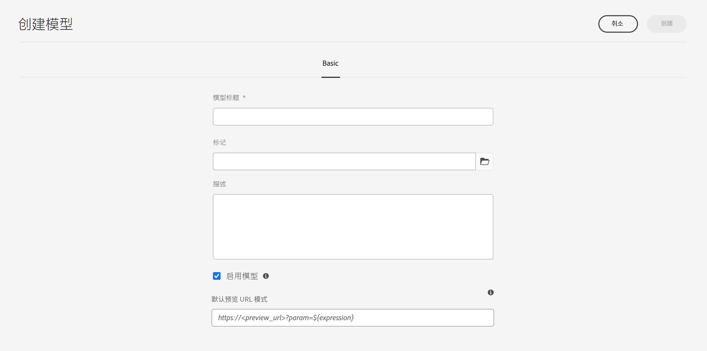

1. 使用&#x200B;**“创建”**&#x200B;以保存空模型。将显示一条消息，指示操作是否成功，您可以选择 **打开** 立即编辑模型，或 **完成** 返回控制台。

### 内容片段模型 – 属性 {#content-fragment-model-properties}

这些属性是在创建模型时定义的，以后可以使用进行编辑 **属性** 内容片段模型的选项：

* **基本**
   * **模型标题**
   * **标记**
   * **描述**
   * **启用模型**
   * **默认预览URL模式**
内容片段编辑器允许作者 **预览** 外部前端应用程序中的内容。 一旦 **预览服务** 配置，添加前端应用程序的URL。

     预览URL应遵循以下模式：
    `https://<preview_url>?param=${expression}`

     可用的表达式包括：

      * `${contentFragment.path}`
      * `${contentFragment.model.path}`
      * `${contentFragment.model.name}`
      * `${contentFragment.variation}`
      * `${contentFragment.id}`

   * **上传图像**

<!-- CHECK: currently under FT -->
<!--
* **GraphQL**
  Define names relevant for GraphQL.
  Changing the GraphQL API Name, or Query field names will impact client applications.
  * **API Name**
    Represents the GraphQL type and query field names in the GraphQL schema.
  * **Single Query Field Name**
    Represents the GraphQL single query field name in the GraphQL schema.
  * **Multiple Query Field Name**
    Represents the GraphQL multiple query field name in the GraphQL schema.
-->

## 定义内容片段模型 {#defining-your-content-fragment-model}

内容片段模型通过选择，有效地定义了结果内容片段的结构 **[数据类型](#data-types)**. 使用模型编辑器，您可以添加数据类型的实例，然后对其进行配置以创建必填字段：

>[!CAUTION]
>
>编辑现有内容片段已使用的模型可能会影响这些依赖片段。

1. 导航到&#x200B;**“工具”**、**“常规”**，然后打开&#x200B;**“内容片段模型”**。

1. 导航到包含内容片段模型的文件夹。
1. 打开所需的模型进行&#x200B;**“编辑”**；使用快速操作或选择模型，然后从工具栏中选择操作。

   打开模型编辑器后，会显示：

   * 左：字段已定义
   * 右侧：可用于创建字段的&#x200B;**数据类型**（可在创建字段后使用的&#x200B;**属性**）

   >[!NOTE]
   >
   >当字段定义为 **必填**， **标签** 左窗格中标有星号(**&#42;**)。

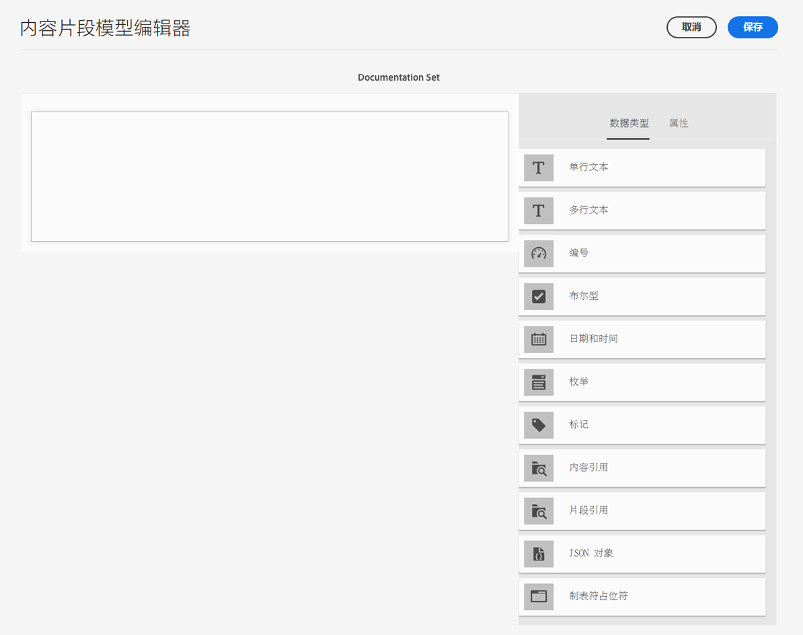

1. **添加字段**

   * 将字段的必需数据类型拖到所需位置：

     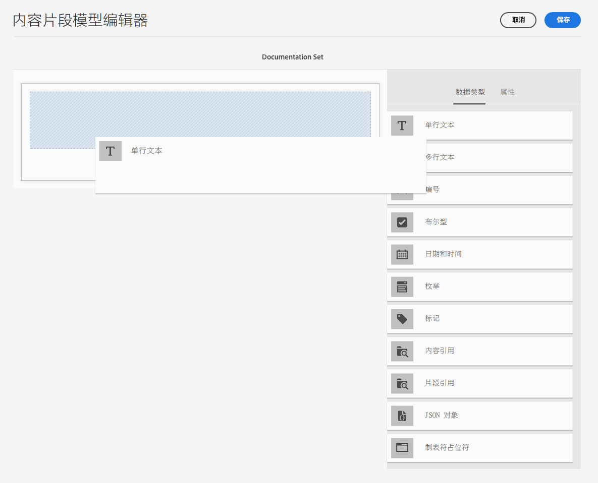

   * 将字段添加到模型后，右侧面板会显示 **属性** 可以为该特定数据类型定义的属性。 您可以在此定义该字段的必需内容。

      * 许多属性的含义一目了然，有关更多详细信息，请参阅[属性](#properties)。
      * 键入 **字段标签** 自动完成 **属性名称**   — 如果为空，则以后可以手动更新。

        >[!CAUTION]
        >
        >手动更新属性时 **属性名称** 对于数据类型，名称必须包含 *仅限* A-Z、a-z、0-9和下划线“_”作为特殊字符。
        >
        >如果在 AEM 早期版本中创建的模型包含非法字符，请移除或更新这些字符。

     例如：

     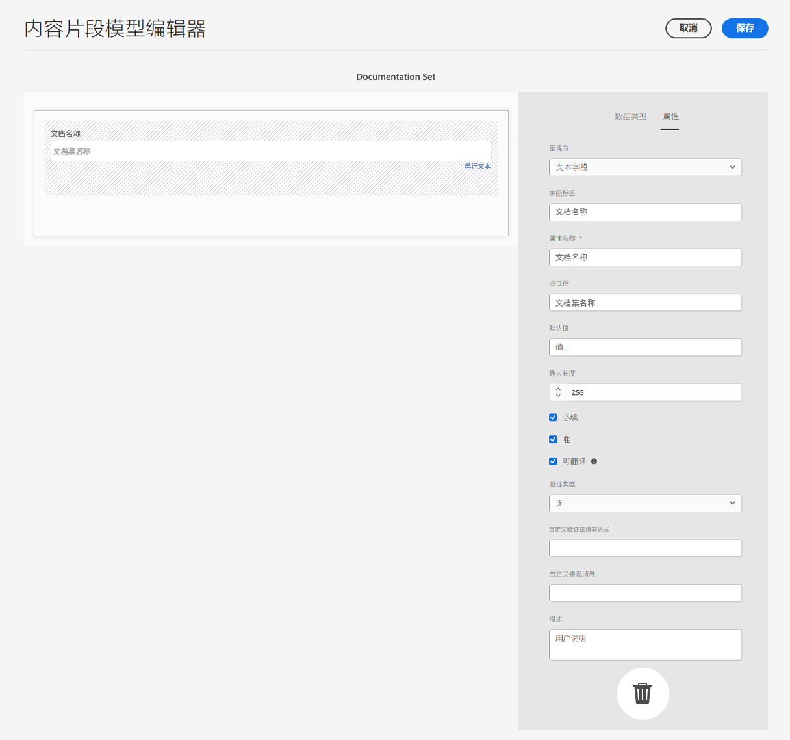

1. **移除字段**

   选择必填字段，然后单击/点按垃圾桶图标。系统会要求您确认该操作。

   

1. 添加所有必填字段，并根据需要定义相关属性。例如：

   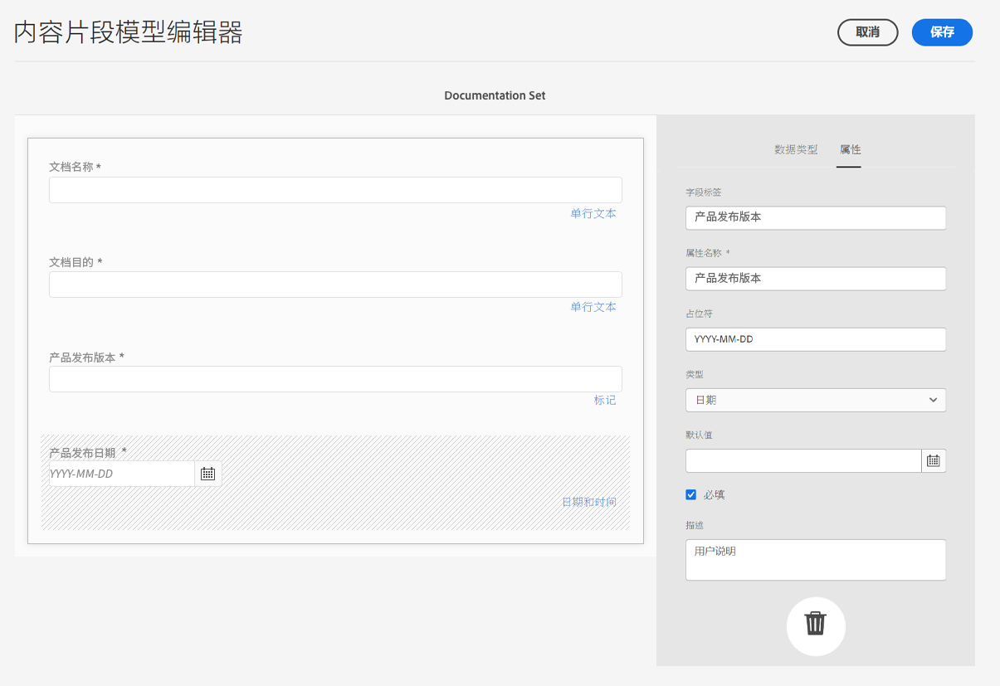

1. 选择&#x200B;**“保存”**&#x200B;来保留定义。

## 数据类型 {#data-types}

可以选择数据类型以定义模型：

* **单行文本**
   * 添加单行文本的一个或多个字段；可以定义最大长度
* **多行文本**
   * 可以是富文本、纯文本或标记下拉文本区域

  >[!NOTE]
  >
  >文本区域是富文本、纯文本还是Markdown，均由属性在模型中定义 **默认类型**.
  >
  >此格式不能从 [内容片段编辑器](/help/sites-cloud/administering/content-fragments/authoring.md)，但只能从模型中访问。

* **数字**
   * 添加一个或多个数字字段
* **布尔型**
   * 添加布尔复选框
* **日期和时间**
   * 添加日期和/或时间
* **枚举**
   * 添加一组复选框、单选按钮或下拉字段
* **标记**
   * 允许片段作者访问和选择标记区域
* **内容引用**
   * 引用任何类型的其他内容；可用于[创建嵌套内容](#using-references-to-form-nested-content)
   * 如果图像被引用，您可以选择显示缩略图
* **片段引用**
   * 引用其他内容片段；可用于 [创建嵌套内容](#using-references-to-form-nested-content)
   * 数据类型可配置为允许片段作者执行以下操作：
      * 直接编辑引用的片段。
      * 根据相应的模型创建新的内容片段
* **JSON 对象**
   * 允许内容片段作者在片段的相应元素中输入JSON语法。
      * 允许 AEM 存储您从其他服务复制/粘贴的直接 JSON。
      * JSON 将被传递，并在 GraphQL 中作为 JSON 输出。
      * 内容片段编辑器中包括JSON语法高亮显示、自动完成和错误高亮显示。
* **制表符占位符**
   * 允许引入选项卡，以在编辑内容片段内容时使用。

      * 这些内容在模型编辑器中显示为分隔符，用于分隔内容数据类型列表的各个部分。 每个实例表示新选项卡的开头。

      * 在片段编辑器中，每个实例都显示为选项卡。
     >[!NOTE]
     >
     >此数据类型仅用于格式设置，因此 AEM GraphQL 架构会忽略此数据类型。

## 属性 {#properties}

许多属性含义一目了然，对于某些属性，其他详细信息如下：

* **属性名称**

  为数据类型手动更新此属性时，名称 **必须** contain *仅限* A-Z、a-z、0-9和下划线“_”作为特殊字符。

  >[!CAUTION]
  >
  >如果在 AEM 早期版本中创建的模型包含非法字符，请移除或更新这些字符。

* **呈现为**
用于在片段中实现/呈现字段的各种选项。 通常，这允许您定义作者将看到字段的单个实例，还是允许作者创建多个实例。

* **字段标签**
输入 **字段标签** 自动生成 **属性名称**，之后可根据需要手动更新。

* **验证**
基本验证可由以下机制提供： **必需** 属性。某些数据类型具有附加的验证字段。请参阅[验证](#validation)，了解更多详细信息。

* 对于数据类型&#x200B;**多行文本**，可将&#x200B;**默认类型**&#x200B;定义为以下任一类型：

   * **富文本**
   * **Markdown**
   * **纯文本**

  如果未指定，则默认值&#x200B;**富文本**&#x200B;用于此字段。

  更改 **默认类型** 在内容片段模型中，仅当在编辑器中打开并保存现有的相关内容片段后，该片段才会生效。

* **独特**
对于从当前模型创建的所有内容片段，内容（适用于特定字段）必须是唯一的。

  用于确保内容作者不能重复已添加到同一模型的另一个片段中的内容。

  例如，内容片段模型中名为 `Country` 的&#x200B;**单行文本**&#x200B;字段在两个相关内容片段中不能具有值`Japan`。尝试第二个实例时会发出警告。

  >[!NOTE]
  >
  >确保每个语言根的唯一性。

  >[!NOTE]
  >
  >变体可以具有与同一片段变体相同的&#x200B;*唯一*&#x200B;值，但与其他片段变体中使用的值不同。

* 有关特定数据类型及其属性的更多详细信息，请参阅&#x200B;**[内容参考](#content-reference)**。

* 有关特定数据类型及其属性的更多详细信息，请参阅&#x200B;**[片段引用（嵌套片段）](#fragment-reference-nested-fragments)**。

* **可翻译**

  选中内容片段模型编辑器中字段上的&#x200B;**可翻译**&#x200B;复选框将：

   * 如果属性名称尚不存在，请确保字段的属性名称已添加到翻译配置上下文`/content/dam/<sites-configuration>`。
   * 对于 GraphQL：请将 `<translatable>`Content Fragment 字段上的属性设置为 `yes`，以允许 GraphQL 查询过滤仅包含可翻译内容的 JSON 输出。

## 验证 {#validation}

现在，各种数据类型都可以定义在结果片段中输入内容时的验证要求：

* **单行文本**
   * 与预定义正则表达式进行比较。
* **数字**
   * 检查特定值。
* **内容引用**
   * 测试特定类型的内容。
   * 只能引用指定文件大小或更小的资源。
   * 只能引用预定义的宽度和/或高度范围（以像素为单位）内的图像。
* **片段引用**
   * 测试特定内容片段模型。

## 使用引用表单嵌套内容 {#using-references-to-form-nested-content}

内容片段可以使用以下任一数据类型形成嵌套内容：

* **[内容引用](#content-reference)**
   * 提供对其他内容的简单引用；任何类型的。
   * 可以为一个或多个引用（在生成的片段中）配置。

* **[片段引用](#fragment-reference-nested-fragments)**（嵌套片段）
   * 引用其他片段，具体取决于指定的特定模型。
   * 允许您包含/检索结构化数据。
     >[!NOTE]
     >
     >当您使用时，此方法特别值得关注 [使用带有GraphQL的内容片段的Headless内容投放](/help/sites-cloud/administering/content-fragments/content-delivery-with-graphql.md).
   * 可以为一个或多个引用（在生成的片段中）配置。

>[!NOTE]
>
>AEM具有以下重复保护：
>
>* 内容引用
>  这会阻止用户添加对当前片段的引用，并可能导致出现空的片段引用选取器对话框。
>
>* GraphQL 中的片段引用
>  如果创建一个深层查询，且该查询返回多个相互引用的内容片段，则该查询在第一次出现时返回null。

### 内容引用 {#content-reference}

内容引用允许您呈现来自其他源的内容；例如，图像、页面或体验片段。

除了标准属性之外，您还可以指定：

* 此 **根路径**，指定存储任何引用内容的位置
  >[!NOTE]
  >
  >如果您要在使用内容片段编辑器时直接在此字段中上传和引用图像，则必须执行此操作。
  >
  >请参阅 [参考图像](/help/sites-cloud/administering/content-fragments/authoring.md#reference-images) 以了解更多详细信息。

* 可引用的内容类型
  >[!NOTE]
  >
  >这些必须包括 **图像** 在使用内容片段编辑器时，如果您要直接在此字段中上传和引用图像。
  >
  >请参阅 [参考图像](/help/sites-cloud/administering/content-fragments/authoring.md#reference-images) 以了解更多详细信息。

* 文件大小限制
* 如果引用了图像：
   * 显示缩略图
   * 图像高度和宽度的限制

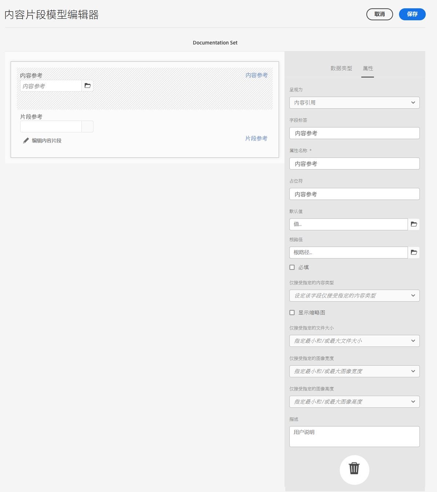

### 片段引用（嵌套片段） {#fragment-reference-nested-fragments}

片段引用引用一个或多个内容片段。 在检索应用程序中使用的内容时，此功能特别有意义，因为它允许您检索具有多个层的结构化数据。

例如：

* 定义员工详细信息的模型；包括：
   * 对定义雇主（公司）的模型的引用

```xml
type EmployeeModel {
    name: String
    firstName: String
    company: CompanyModel
}

type CompanyModel {
    name: String
    street: String
    city: String
}
```

>[!NOTE]
>
>片段引用对以下内容特别感兴趣 [使用带有GraphQL的内容片段的Headless内容投放](/help/sites-cloud/administering/content-fragments/content-delivery-with-graphql.md).

除了标准属性之外，您还可以定义：

* **呈现为**:

   * **多字段** – 片段作者可以创建多个单个引用

   * **片段** – 允许片段作者选择对片段的单个引用

* **模型类型**
可以选择多个模型。将引用添加到内容片段时，必须已使用这些模型创建了任何引用的片段。

* **根路径**
这会为引用的任何片段指定根路径。

* **允许创建片段**

  这允许片段作者根据相应的模型创建新片段。

   * **片段引用组合** – 允许片段作者通过选择多个片段来构建复合

  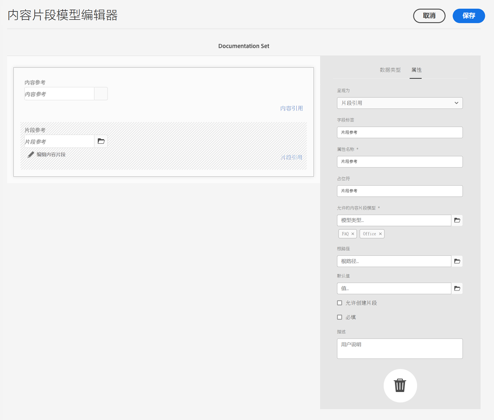

>[!NOTE]
>
>已建立重复保护机制。它禁止用户在片段引用中选择当前内容片段，并可能导致出现空的片段引用选取器对话框。
>
>GraphQL还对片段引用提供了重复保护。 如果在两个相互引用的内容片段之间创建深层查询，则将返回空值。

## 启用或禁用内容片段模型 {#enabling-disabling-a-content-fragment-model}

您可以 **启用** 或 **禁用** 您的内容片段模型，以便完全控制其使用。

### 启用内容片段模型 {#enabling-a-content-fragment-model}

创建模型后，必须启用该模型，以便：

* 可在创建新内容片段时进行选择。
* 可以在内容片段模型中引用。
* 可用于 GraphQL；这样就会生成架构。

要启用标记为以下任一类型的模型：

* **草稿** ：新建（从未启用）。
* **已禁用**：已被特别禁用。

您可以从以下任一位置使用&#x200B;**“启用”**&#x200B;选项：

* 选择所需的“模型”时，顶部工具栏。
* 相应的快速操作（将鼠标悬停在所需模型上）。

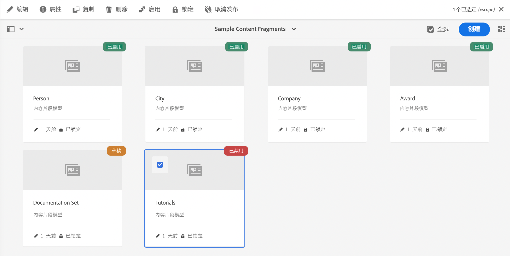

### 禁用内容片段模型 {#disabling-a-content-fragment-model}

也可以禁用模型，这样：

* 该模型将无法再用来创建&#x200B;*新*&#x200B;内容片段。
* 但是:
   * GraphQL 架构一直在生成，并且仍可查询（以避免影响 JSON API）。
   * 仍可以从 GraphQL 端点查询和返回任何基于模型的内容片段。
* 该模型无法再次引用，但现有引用将保持不变，并且仍可以从 GraphQL 端点查询和返回。

禁用标记为 **已启用**，您使用 **禁用** 选项来自：

* 选择所需的“模型”时，顶部工具栏。
* 相应的快速操作（将鼠标悬停在所需模型上）。

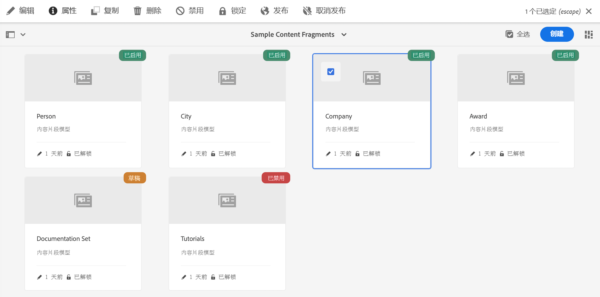

## 允许在 Assets 文件夹中使用内容片段模型 {#allowing-content-fragment-models-assets-folder}

要实施内容管理，您可以在 Assets 文件夹中配置&#x200B;**策略**，以控制允许在该文件夹中创建片段的内容片段模型。

>[!NOTE]
>
>该机制类似于[允许在页面的高级属性](/help/sites-cloud/authoring/features/templates.md#allowing-a-template-author)中为页面及其子页面设置页面模板。

要为&#x200B;**允许的内容片段模型**&#x200B;配置&#x200B;**策略**：

1. 导航并打开&#x200B;**属性**，以访问所需的 Assets 文件夹。

1. 打开&#x200B;**策略**&#x200B;选项卡，您可以在其中配置：

   * **继承自`<folder>`**

     创建新子文件夹时，会自动继承策略；如果子文件夹需要允许与父文件夹不同的模型，则可以重新配置策略（并中断继承）。

   * **按照路径允许的内容片段模型**

     可以允许使用多个模型。

   * **按标记允许的内容片段模型**

     可以允许使用多个模型。

   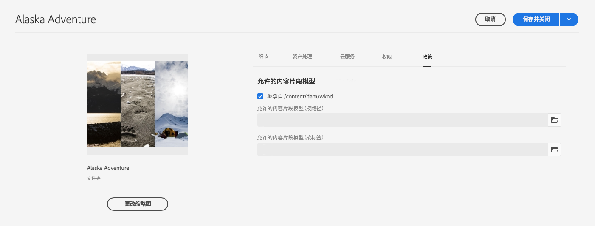

1. **保存**&#x200B;任何更改。

文件夹允许的内容片段模型解析如下：
* 针对&#x200B;**允许的内容片段模型**&#x200B;的&#x200B;**策略**。
* 如果为空，请尝试使用继承规则确定策略。
* 如果继承链未投放结果，请查看 **Cloud Services** 文件夹的配置（也请先直接配置，然后通过继承配置）。
* 如果以上所有内容均未提供任何结果，则该文件夹不允许使用模型。

## 删除内容片段模型 {#deleting-a-content-fragment-model}

>[!CAUTION]
>
>删除内容片段模型可能会影响从属片段。

要删除内容片段模型，请执行以下操作：

1. 导航到&#x200B;**“工具”**、**“常规”**，然后打开&#x200B;**“内容片段模型”**。

1. 导航到包含内容片段模型的文件夹。
1. 选择您的模型，然后从工具栏中&#x200B;**删除**。

   >[!NOTE]
   >
   >如果引用了模型，则会给出警告，以便您采取适当措施。

## 发布内容片段模型 {#publishing-a-content-fragment-model}

在发布任何相关内容片段时/之前，需要发布内容片段模型。

要发布内容片段模型，请执行以下操作：

1. 导航到&#x200B;**“工具”**、**“常规”**，然后打开&#x200B;**“内容片段模型”**。

1. 导航到包含内容片段模型的文件夹。
1. 选择您的模型，然后从工具栏中&#x200B;**“发布”**。
控制台将显示已发布状态。

   >[!NOTE]
   >
   >如果发布的内容片段尚未发布模型，则会显示一个选择列表来指示该情况，并且模型将随该片段一起发布。

## 取消发布内容片段模型 {#unpublishing-a-content-fragment-model}

如果任何片段未引用内容片段模型，则可以取消发布这些模型。

要取消发布内容片段模型，请执行以下操作：

1. 导航到&#x200B;**“工具”**、**“常规”**，然后打开&#x200B;**“内容片段模型”**。

1. 导航到包含内容片段模型的文件夹。
1. 选择您的模型，然后从工具栏中&#x200B;**“取消发布”**。
控制台中会指示已发布状态。

如果尝试取消发布一个或多个片段当前使用的模型，则会显示错误警告。 例如：

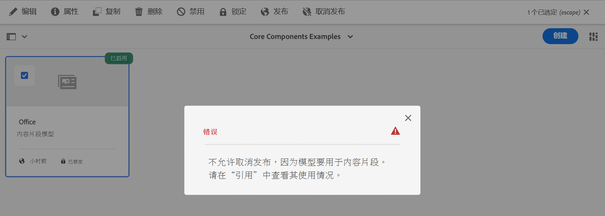

该消息建议您检查 [引用](/help/sites-cloud/authoring/getting-started/basic-handling.md#references) 小组进一步调查：

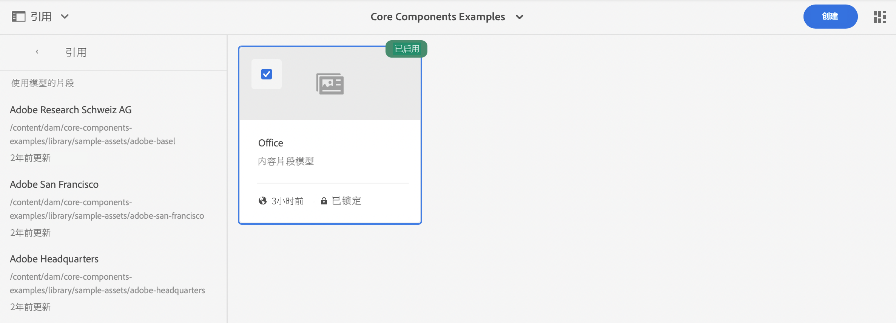

## 锁定（已发布）内容片段模型 {#locked-published-content-fragment-models}

此功能为已发布的内容片段模型提供管理服务。

### 挑战 {#the-challenge}

* 内容片段模型确定 AEM 中 GraphQL 查询的架构。

   * AEM GraphQL 架构在创建内容片段模型后即会创建，并且它们可以同时存在于创作和发布环境中。

   * 发布架构是最为关键，因为它们为 JSON 格式的内容片段的实时投放奠定了基础。

* 修改内容片段模型或进行其他编辑时，可能会出现问题。这意味着架构发生更改，进而可能影响现有 GraphQL 查询。

* 向内容片段模型添加新字段通常不应产生任何有害影响。但是，修改现有数据字段（例如，其名称）或删除字段定义时，将在请求这些字段时中断现有 GraphQL 查询。

### 要求 {#the-requirements}

* 使用户了解在编辑已用于实时内容投放的模型（即已发布的模型）时的风险。

* 此外，还可以避免意外的更改。

如果重新发布修改后的模型，这两种标准都可能会中断查询。

### 解决方案 {#the-solution}

为了解决这些问题，内容片段模型在发布后立即在作者上被&#x200B;*锁定为*&#x200B;只读模式。此状态由以下指示 **已锁定**：

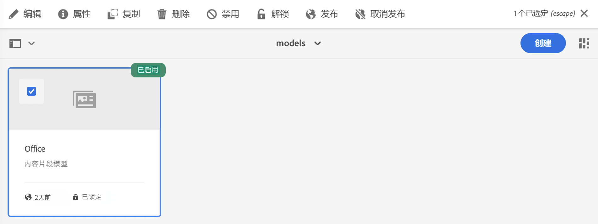

当模型&#x200B;**已锁定**（在“只读”模式下），您可以查看模型的内容和结构，但无法进行编辑。

您可以从控制台或模型编辑器中管理&#x200B;**已锁定**&#x200B;模型：

* 控制台

  从控制台中，您可以使用&#x200B;**解锁**&#x200B;和&#x200B;**锁定**&#x200B;操作管理制度模式：

  

   * 您可以&#x200B;**解锁**&#x200B;用于启用编辑的模型。

     如果您选择 **解锁** 此时将显示警告，您必须确认 **解锁** 操作：
     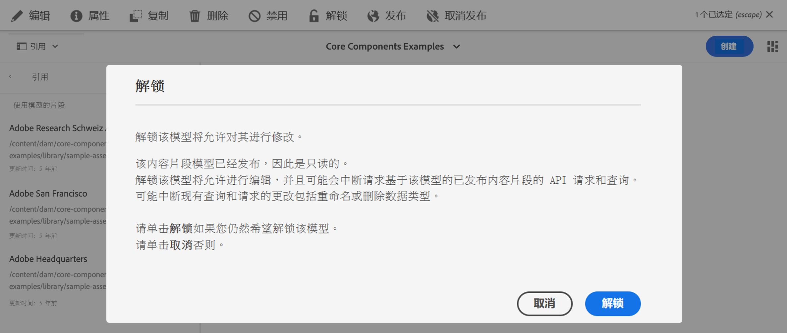

     然后，可以打开模型进行编辑。

   * 您之后还可以&#x200B;**锁定**&#x200B;模型。
   * 重新发布模型会立即将其返回到 **已锁定** （只读）模式。

* 模型编辑器

   * 打开锁定的模型时，系统会发出警告，并会显示三个操作：**取消**、**查看只读**、**编辑**：

     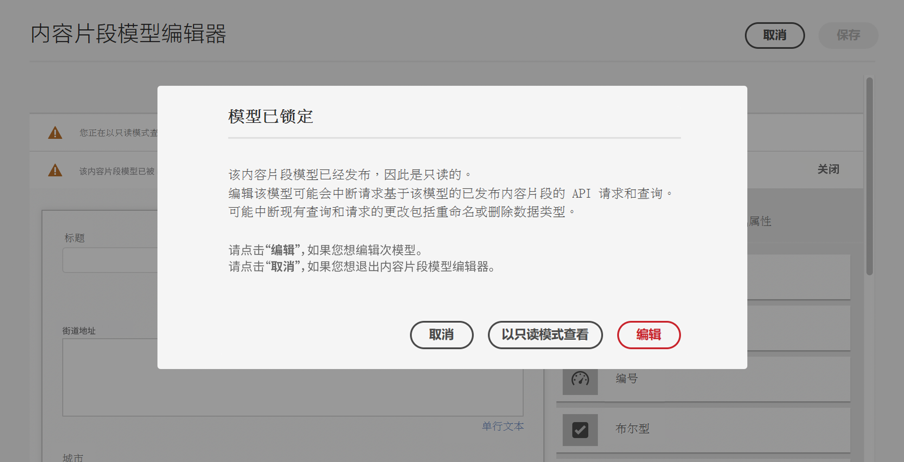

   * 如果您选择 **查看只读**，您可以查看模型的内容和结构：

     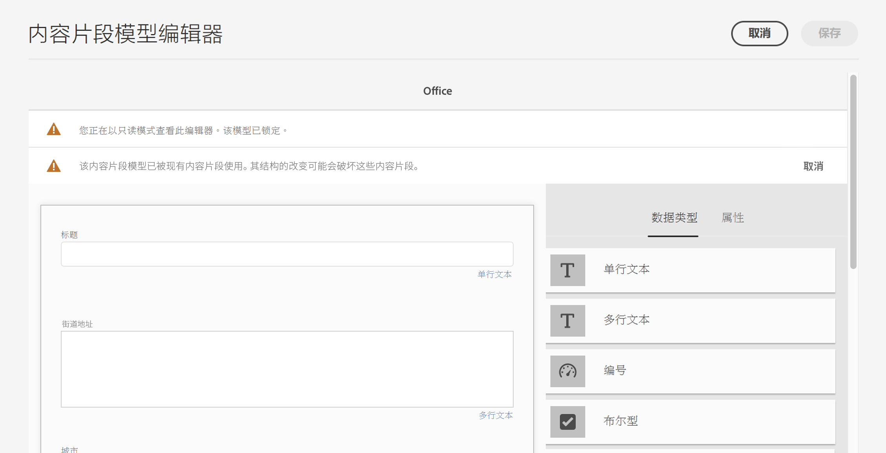

   * 如果您选择 **编辑**，您可以编辑并保存更新：

     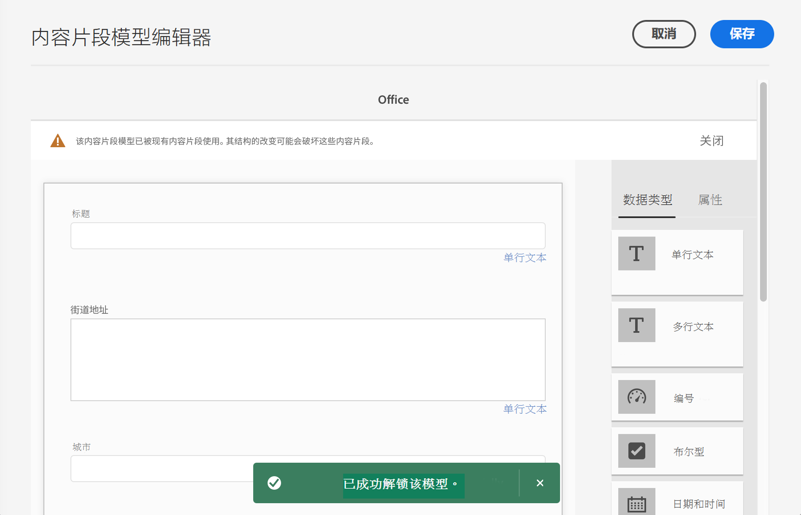

     >[!NOTE]
     >
     >顶部可能仍会显示警告，但此时模型已由现有内容片段使用。

   * **取消** 返回到控制台。
