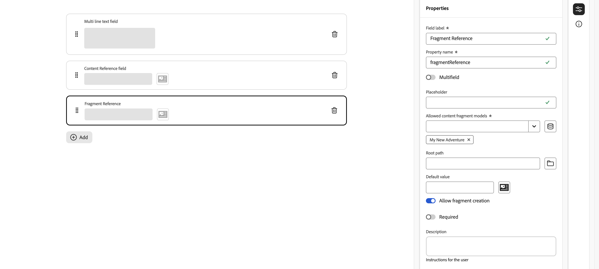

# 定义内容片段模型 {#defining-content-fragment-models}

Adobe Experience Manager (AEM) as a Cloud Service 中的内容片段模型定义[内容片段](/help/sites-cloud/administering/content-fragments/overview.md)的内容结构。随后可使用这些片段创作页面或作为 Headless 内容的基础。

本页介绍如何使用专用编辑器定义内容片段模型。 查看[管理您的内容片段模型](/help/sites-cloud/administering/content-fragments/managing-content-fragment-models.md)，了解创建片段后可用的进一步任务和选项，包括[从内容片段控制台中可用的操作](/help/sites-cloud/administering/content-fragments/managing-content-fragment-models.md#actions)、[在文件夹中允许模型](/help/sites-cloud/administering/content-fragments/managing-content-fragment-models.md#allowing-content-fragment-models-assets-folder)和[发布模型](/help/sites-cloud/administering/content-fragments/managing-content-fragment-models.md#publishing-a-content-fragment-model)。

>[!CAUTION]
>
>如果要查询多个引用的片段，则建议不要让各种片段模型具有具有相同名称但类型不同的字段名称。
>
>有关详细信息，请参阅用于内容片段的[AEM GraphQL API — 限制](/help/headless/graphql-api/content-fragments.md#limitations)

## 定义内容片段模型 {#defining-your-content-fragment-model}

内容片段模型使用一批&#x200B;**[数据类型](#data-types)**&#x200B;有效地定义所得内容片段的结构。可使用模型编辑器添加数据类型的实例，然后配置它们以创建必填字段：

>[!CAUTION]
>
>编辑现有内容片段已使用的模型可能会影响那些从属的片段。

1. 在内容片段控制台中，选择[内容片段模型](/help/sites-cloud/administering/content-fragments/managing-content-fragment-models.md#basic-structure-handling-content-fragment-models-console)的面板，然后导航到包含您的内容片段模型的文件夹。

   >[!NOTE]
   >
   >在[创建模型](/help/sites-cloud/administering/content-fragments/managing-content-fragment-models.md#creating-a-content-fragment-model)后，您也可以直接打开模型。

1. 打开所需的模型进行&#x200B;**“编辑”**；使用快速操作或选择模型，然后从工具栏中选择操作。

   打开模型编辑器后，会显示：

   * 左：字段已定义
   * 右侧：可用于创建字段的&#x200B;**数据类型**（可在创建字段后使用的&#x200B;**属性**）

   >[!NOTE]
   >
   >将字段定义为&#x200B;**必填**&#x200B;时，将为左侧窗格中所示的&#x200B;**标签**&#x200B;标星号 (**&#42;**)。

   

1. **添加字段**

   * 将字段的必需数据类型拖到所需位置：

     

   * 将字段添加到模型后，右侧面板将显示可以为该特定数据类型定义的&#x200B;**属性**。您可以在此定义该字段的必需内容。

      * 许多属性的含义一目了然，有关更多详细信息，请参阅[属性（数据类型）](#properties)。
      * 键入&#x200B;**字段标签**&#x200B;将自动补全&#x200B;**属性名称** - 如果为空，则以后可手动更新它。

        >[!CAUTION]
        >
        >在手动更新数据类型的&#x200B;**属性名称**&#x200B;属性时，名称必须&#x200B;*仅*&#x200B;包含 A-Z、a-z、0-9 和作为特殊字符的下划线“_”。
        >
        >如果在 AEM 早期版本中创建的模型包含非法字符，请移除或更新这些字符。

     例如：

     

1. **移除字段**

   选择必填字段，然后选择垃圾桶图标。 系统会要求您确认该操作。

   

1. 添加所有必填字段，并根据需要定义相关属性。例如：

   

1. 选择&#x200B;**“保存”**&#x200B;来保留定义。

## 数据类型 {#data-types}

有一批数据类型可用于定义您的模型：

* **单行文本**
   * 为单行文本添加字段；可以定义最大长度
   * 字段可以配置为允许片段作者创建新字段实例

* **多行文本**
   * 一个文本区域，它可为富文本、纯文本或 Markdown
   * 字段可以配置为允许片段作者创建新字段实例

  >[!NOTE]
  >
  >在模型中由&#x200B;**默认类型**&#x200B;属性定义该文本区域是富文本、纯文本还是 Markdown。
  >
  >无法从[内容片段编辑器](/help/sites-cloud/administering/content-fragments/authoring.md)更改此格式，而只能从模型更改。

* **数字**
   * 添加数字字段
   * 字段可以配置为允许片段作者创建新字段实例

* **布尔型**
   * 添加布尔复选框

* **日期和时间**
   * 添加日期和/或时间字段

* **枚举**
   * 添加一组复选框、单选按钮或下拉字段
      * 您可以指定对片段作者可用的选项

* **标记**
   * 允许片段作者访问和选择标记区域
* **片段引用**
   * 引用其他内容片段；可用于[创建嵌套内容](#using-references-to-form-nested-content)
   * 数据类型可配置为允许片段作者执行以下操作：
      * 直接编辑引用的片段。
      * 根据相应的模型创建新内容片段
      * 创建字段的新实例
   * 引用指定了引用资源的路径；例如`/content/dam/path/to/resource`
* **片段引用（UUID）**
   * 引用其他内容片段；可用于[创建嵌套内容](#using-references-to-form-nested-content)
   * 数据类型可配置为允许片段作者执行以下操作：
      * 直接编辑引用的片段。
      * 根据相应的模型创建新内容片段
      * 创建字段的新实例
   * 在编辑器中，引用的作用是指定被引用资源的路径。在内部，引用被视为引用资源的通用唯一 ID（UUID）
      * 您无需知道UUID；在片段编辑器中，您可以浏览到所需的片段

* **内容引用**
   * 引用任何类型的其他内容；可用于[创建嵌套内容](#using-references-to-form-nested-content)
   * 如果图像被引用，您可以选择显示缩略图
   * 字段可以配置为允许片段作者创建新字段实例
   * 引用指定了引用资源的路径；例如`/content/dam/path/to/resource`
* **内容引用（UUID）**
   * 引用任何类型的其他内容；可用于[创建嵌套内容](#using-references-to-form-nested-content)
   * 如果图像被引用，您可以选择显示缩略图
   * 字段可以配置为允许片段作者创建新字段实例
   * 在编辑器中，引用的作用是指定被引用资源的路径。在内部，引用被视为引用资源的通用唯一 ID（UUID）
      * 您无需知道UUID；在片段编辑器中，您可以浏览到所需的资源资源

* **JSON 对象**
   * 使内容片段作者可将 JSON 语法输入到片段的相应元素中。
      * 使 AEM 可存储您从另一服务复制/粘贴的直接 JSON。
      * JSON 将被传递，并在 GraphQL 中作为 JSON 输出。
      * 在内容片段编辑器中包括 JSON 语法高亮显示、自动补全和错误高亮显示。

* **选项卡占位符**
   * 允许引入选项卡，以供在编辑内容片段内容时使用。
      * 这些选项卡在模型编辑器中显示为分隔条，用于分隔内容数据类型的列表的各个部分。每个实例表示一个新选项卡的开始。
      * 在片段编辑器中，每个实例都显示为一个选项卡。

     >[!NOTE]
     >
     >此数据类型仅用于格式设置，因此 AEM GraphQL 架构会忽略此数据类型。

## 属性（数据类型） {#properties}

许多属性含义一目了然，对于某些属性，其他详细信息如下：

* **属性名称**

  在手动更新数据类型的此属性时，名称&#x200B;**必须***仅*&#x200B;包含 A-Z、a-z、0-9 和作为特殊字符的下划线“_”。

  >[!CAUTION]
  >
  >如果在 AEM 早期版本中创建的模型包含非法字符，请移除或更新这些字符。

* **呈现为**

  用于在片段中实现/呈现字段的各种选项。 通常，这允许您定义作者将看到字段的单个实例，还是允许作者创建多个实例。 当使用&#x200B;**多个字段**&#x200B;时，您可以定义项目的最小和最大数量 — 有关详细信息，请参阅[验证](#validation)。

* **字段标签**
输入&#x200B;**字段标签**&#x200B;将自动生成&#x200B;**属性名称**，如有必要，可以手动更新该名称。

* **验证**
基本验证可由以下机制提供： **必需** 属性。某些数据类型具有附加的验证字段。请参阅[验证](#validation)，了解更多详细信息。

* 对于数据类型&#x200B;**多行文本**，可将&#x200B;**默认类型**&#x200B;定义为以下任一类型：

   * **富文本**
   * **Markdown**
   * **纯文本**

  如果未指定，则默认值&#x200B;**富文本**&#x200B;用于此字段。

  在编辑器中打开并保存现有相关的内容片段后，更改内容片段模型中的&#x200B;**默认类型**&#x200B;才对该片段生效。

* **唯一**
（特定字段的）内容必须在从当前模型创建的所有内容片段上都唯一。

  用于确保内容作者不能重复已添加到同一模型的另一个片段中的内容。

  例如，内容片段模型中名为 `Country` 的&#x200B;**单行文本**&#x200B;字段在两个相关内容片段中不能具有值`Japan`。尝试第二个实例时会发出警告。

  >[!NOTE]
  >
  >确保每个语言根的唯一性。

  >[!NOTE]
  >
  >变体可以具有与同一片段变体相同的&#x200B;*唯一*&#x200B;值，但与其他片段变体中使用的值不同。

* 有关特定数据类型及其属性的更多详细信息，请参阅&#x200B;**[内容参考](#content-reference)**。

* 有关特定数据类型及其属性的更多详细信息，请参阅&#x200B;**[片段引用（嵌套片段）](#fragment-reference-nested-fragments)**。

* **可翻译**

  选中内容片段模型编辑器中字段上的&#x200B;**可翻译**&#x200B;复选框将：

   * 如果属性名称尚不存在，请确保字段的属性名称已添加到翻译配置上下文`/content/dam/<sites-configuration>`。
   * 对于 GraphQL：请将 `<translatable>`Content Fragment 字段上的属性设置为 `yes`，以允许 GraphQL 查询过滤仅包含可翻译内容的 JSON 输出。

## 验证 {#validation}

现在，各种数据类型都可以定义在结果片段中输入内容时的验证要求：

* **单行文本**
   * 与预定义正则表达式进行比较。
* **数字**
   * 检查特定值。
* **内容引用**
   * 测试特定类型的内容。
   * 只能引用指定文件大小或更小的资源。
   * 只能引用预定义的宽度和/或高度范围（以像素为单位）内的图像。
* **片段引用**
   * 为特定的内容片段模型测试。
* **最小项数** / **最大项数**

  已定义为&#x200B;**多个字段**（使用&#x200B;**渲染为**&#x200B;设置）的字段具有以下选项：

   * **最小项目数**
   * **最大项数**

  已在[内容片段编辑器](/help/sites-cloud/administering/content-fragments/authoring.md)中验证这些内容。

## 使用引用表单嵌套内容 {#using-references-to-form-nested-content}

内容片段可以使用以下任一数据类型形成嵌套内容：

* [内容引用](#content-reference)
   * 提供对其他内容的简单引用；任何类型的。
   * 由数据类型提供：
      * **内容引用** — 基于路径
      * **内容引用(UUID)** — 基于UUID
   * 可为（所得片段中的）一个或多个引用配置它。

* [片段引用](#fragment-reference-nested-fragments)（嵌套片段）
   * 引用其他片段，具体取决于指定的特定模型。
   * 由数据类型提供：
      * **片段引用** — 基于路径
      * **片段引用(UUID)** — 基于UUID
   * 允许您包含/检索结构化数据。

     >[!NOTE]
     >
     >当您使用[通过 GraphQL 使用内容片段投放 Headless 内容](/help/sites-cloud/administering/content-fragments/content-delivery-with-graphql.md)时，此方法尤其值得关注。
   * 可为（所得片段中的）一个或多个引用配置它。

>[!NOTE]
>
>有关内容/片段引用和内容/片段引用(UUID)以及升级到基于UUID的数据类型的详细信息，请参阅[为UUID引用升级内容片段](/help/headless/graphql-api/uuid-reference-upgrade.md)。

>[!NOTE]
>
>AEM 对于以下各项具有重复保护：
>
>* 内容引用
>这会阻止用户添加对当前片段的引用，并可能导致出现空的片段引用选取器对话框。
>
>* GraphQL中的片段引用
>如果创建一个深层查询，且该查询返回多个相互引用的内容片段，则该查询在第一次出现时返回null。

>[!CAUTION]
>
>如果要查询多个引用的片段，则建议不要让各种片段模型具有具有相同名称但类型不同的字段名称。
>
>有关详细信息，请参阅用于内容片段的[AEM GraphQL API — 限制](/help/headless/graphql-api/content-fragments.md#limitations)

### 内容引用 {#content-reference}

**内容引用**&#x200B;和&#x200B;**内容引用(UUID)**&#x200B;数据类型允许您呈现来自其他源的内容；例如，图像、页面或体验片段。

除了标准属性之外，您还可以指定：

* **根路径**，它指定或表示存储任何引用内容的位置
  >[!NOTE]
  >
  >如果您在使用内容片段编辑器时要在此字段中直接上传并引用图像，则必须指定此属性。
  >
  >有关进一步详细信息，请参阅[引用图像](/help/sites-cloud/administering/content-fragments/authoring.md#reference-images)。

* 可引用的内容类型
  >[!NOTE]
  >
  >如果您在使用内容片段编辑器时要直接在此字段中上传并引用图像，则其中必须包括&#x200B;**图像**。
  >
  >有关进一步详细信息，请参阅[引用图像](/help/sites-cloud/administering/content-fragments/authoring.md#reference-images)。

* 文件大小限制
* 如果引用了图像：
   * 显示缩略图
   * 图像高度和宽度的限制


### 片段引用（嵌套片段） {#fragment-reference-nested-fragments}

**片段引用**&#x200B;和&#x200B;**片段引用(UUID)**&#x200B;数据类型可以引用一个或多个内容片段。 在检索内容以供用于您的应用程序时，此功能尤其值得关注，因为通过此功能可检索有多层的结构化数据。

例如：

* 定义员工详细信息的模型；包括：
   * 对定义雇主（公司）的模型的引用

```xml
type EmployeeModel {
    name: String
    firstName: String
    company: CompanyModel
}

type CompanyModel {
    name: String
    street: String
    city: String
}
```

>[!NOTE]
>
>片段引用对于[通过 GraphQL 使用内容片段投放 Headless 内容](/help/sites-cloud/administering/content-fragments/content-delivery-with-graphql.md)尤其值得关注。

除了标准属性之外，您还可以定义：

* **呈现为**:

   * **多字段** – 片段作者可以创建多个单个引用

   * **片段** – 允许片段作者选择对片段的单个引用

* **模型类型**
可以选择多个模型。在添加对内容片段的引用时，必须使用这些模型创建任何引用的片段。

* **根路径**
这会指定或表示引用的任何片段的根路径。

* **允许创建片段**

  这将允许片段作者根据相应的模型创建片段。

   * **片段引用组合** – 允许片段作者通过选择多个片段来构建复合

  

>[!NOTE]
>
>已建立重复保护机制。它禁止用户在片段引用中选择当前内容片段，可能导致片段引用选取器对话框为空。
>
>GraphQL 中也有针对片段引用的重复保护。如果在两个互相引用的内容片段之间创建深层查询，则它返回 null。
