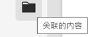
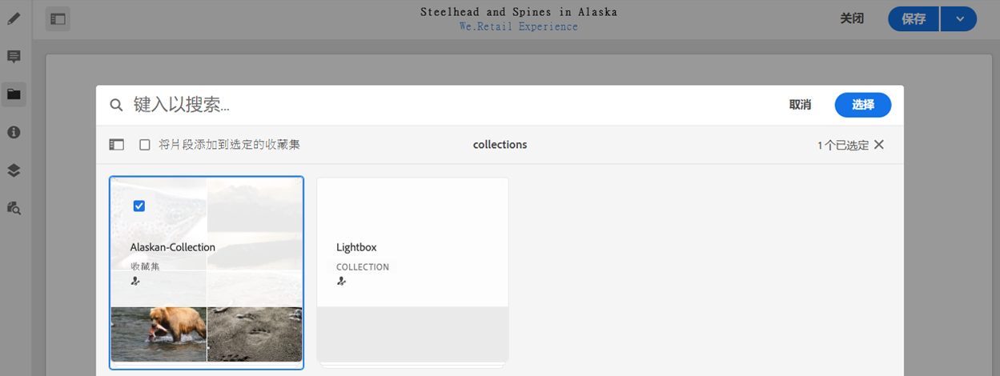
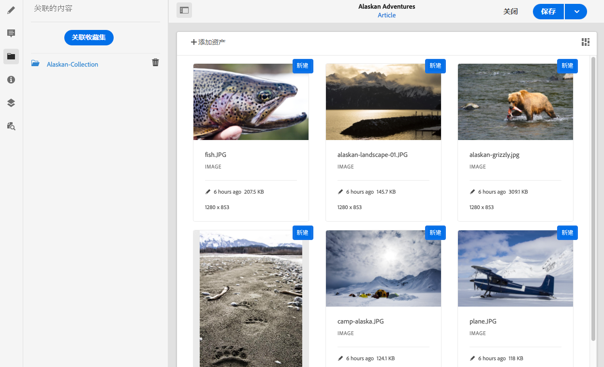

# 关联的内容{#associated-content}

AEM 的关联内容功能提供了连接，以便在将片段添加到内容页面时可以选择将资产与片段一起使用，方法是[在页面上使用内容片段时提供要访问的一系列资产，](/help/sites-cloud/authoring/fundamentals/content-fragments.md#using-associated-content)同时还有助于减少搜索适当资产所需的时间。 这还为 headless 内容投放提供了灵活性。

## 添加关联内容 {#adding-associated-content}

>[!NOTE]
>
>添加的方法有多种 [可视资产（例如，图像）](/help/sites-cloud/administering/content-fragments/content-fragments.md#fragments-with-visual-assets) 到片段和/或页面。

要建立关联，您首先需要 [将媒体资产添加到收藏集](/help/assets/manage-collections.md)。 完成该操作后，您可以：

1. 打开片段，然后从侧面板中选择&#x200B;**关联的内容**。

   

1. 根据是否已关联任何收藏集，选择以下任一选项：

   * **关联内容** – 这将是第一个关联的集合
   * **关联集合** – 关联的集合已配置

1. 选择所需的集合。

   您可以选择将片段本身添加到选定的集合中； 这有助于跟踪。

   

1. 确认（使用&#x200B;**选择**）。 收藏集将列为关联的。

   

## 编辑关联内容 {#editing-associated-content}

关联收藏集后，您可以：

* **删除**&#x200B;关联。
* **添加资产**&#x200B;到收藏集。
* 选择资产以执行进一步操作。
* 编辑资产。
