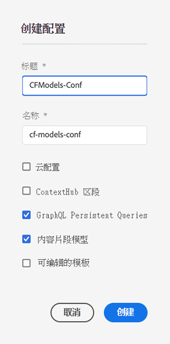
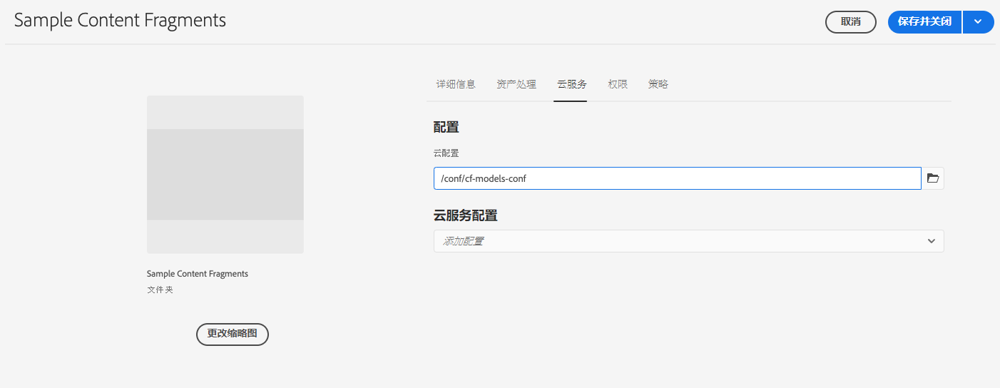

# 内容片段 – 配置浏览器{#content-fragments-configuration-browser}

了解如何在配置浏览器中启用特定的内容片段功能。

## 为您的实例启用内容片段功能 {#enable-content-fragment-functionality-instance}

在使用内容片段之前，您需要使用 **配置浏览器** 启用：

* **内容片段模型** – 强制
* **GraphQL 持久查询** – 可选

>[!CAUTION]
>
>如果未启用&#x200B;**内容片段模型**：
>
>* **“创建”**&#x200B;选项将不可用于创建新模型。
>* 你将无法[选择 Sites 配置来创建相关的端点](/help/headless/graphql-api/graphql-endpoint.md)。

要启用内容片段功能，您需要：

* 通过配置浏览器启用内容片段功能
* 将配置应用到 Assets 文件夹

### 在配置浏览器中启用内容片段功能 {#enable-content-fragment-functionality-in-configuration-browser}

要[使用某些内容片段功能，](#creating-a-content-fragment-model) **必须**&#x200B;首先通过&#x200B;**配置浏览器**&#x200B;启用它们：

>[!NOTE]
>
>有关更多详细信息，另请参阅[配置浏览器：](/help/implementing/developing/introduction/configurations.md#using-configuration-browser)。

>[!NOTE]
>
>[子配置](/help/implementing/developing/introduction/configurations.md#configuration-resolution)（嵌套在另一个配置中的配置）完全支持与内容片段、内容片段模型和 GraphQL 查询一起使用。
>
>请注意：
>
>
>* 在子配置中创建模型后，无法将模型移动或复制到另一个子配置。
>
>* GraphQL 端点将（仍然）基于父（根）配置。
>
>* 将（仍）保存与父（根）配置相关的持久查询。

1. 导航到&#x200B;**工具**、**常规**，然后打开&#x200B;**配置浏览器**。

1. 使用&#x200B;**“创建”**&#x200B;来打开对话框，您需要：

   1. 指定&#x200B;**标题**。
   1. **名称**&#x200B;将成为存储库中的节点名称。
      * 它会根据标题自动生成，并根据 [AEM 命名约定](/help/implementing/developing/introduction/naming-conventions.md)进行调整。
      * 如有必要，您可以对其进行调整。
   1. 要启用其用法，请选择
      * **内容片段模型**
      * **GraphQL 持久查询**

      

1. 选择&#x200B;**“创建”**&#x200B;以保存定义。

<!-- 1. Select the location appropriate to your website. -->

### 将配置应用到文件夹 {#apply-the-configuration-to-your-folder}

**全球**&#x200B;配置已启用内容片段功能后，该功能随后会应用到任何资产文件夹 – 可通过访问 **Assets** 控制台。

要将其他配置（即不包括全局配置）与类似的 Assets 文件夹一起使用，您必须定义连接。这是通过在适当文件夹的&#x200B;**文件夹属性**&#x200B;的 **Cloud Services** 选项卡中选择适当的&#x200B;**配置**&#x200B;来完成的。

