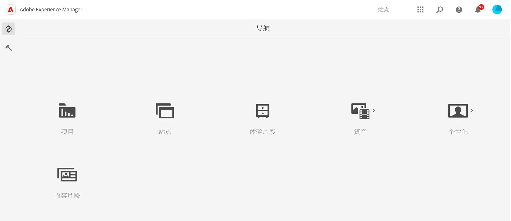
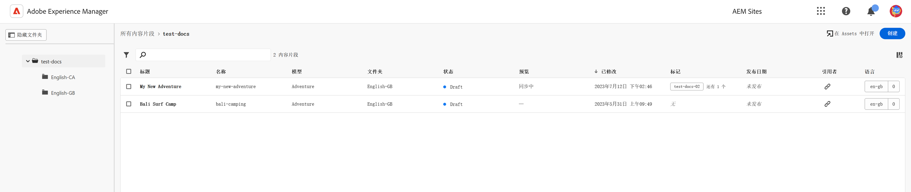
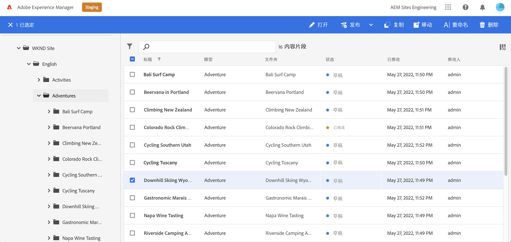
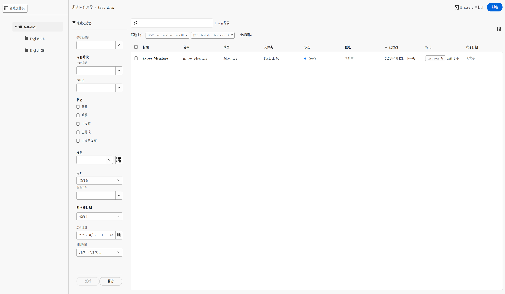
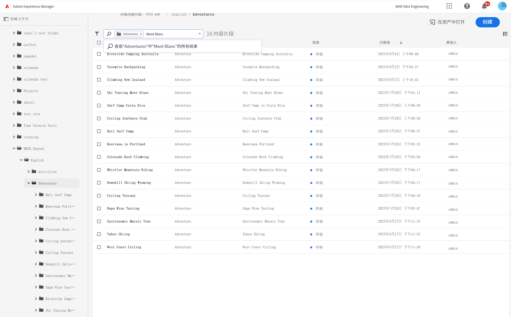
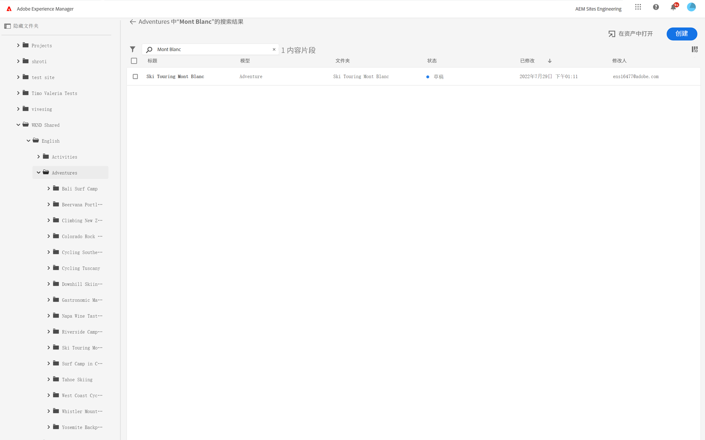
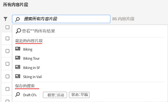

# 内容片段控制台  {#content-fragments-console}

了解内容片段控制台如何优化对内容片段的访问，帮助您通过执行发布、取消发布、复制等管理操作来创建、搜索和管理内容片段。

内容片段控制台专门用于管理、搜索和创建内容片段。 它已针对在无标题上下文中使用进行了优化，但在创建内容片段以用于页面创作时也会使用。

>[!NOTE]
>
>此控制台仅显示内容片段。 它不会显示其他资产类型，如图像和视频。

>[!NOTE]
>
>当前可通过以下方式访问您的内容片段：
>
>* 此 **内容片段** 控制台
>* the **资产** 控制台 — 请参阅 [管理内容片段](/help/assets/content-fragments/content-fragments-managing.md)

可以从全局导航的顶级直接访问内容片段控制台：

选择 **内容片段** 将在新选项卡中打开控制台。

在这里，您可以看到以下三个主要区域：

* 顶部工具栏
   * 提供标准AEM功能
   * 还会显示您的IMS组织
* 左侧面板
   * 在此，可以隐藏或显示文件夹树
   * 您可以选择树的特定分支
* 主/右侧面板 — 从此处，您可以：
   * 查看树选定分支中的所有内容片段列表
      * 痕迹导航指示位置；它们还可用于更改位置
      * 选定文件夹中的内容片段，将显示所有子文件夹
         * 有关内容片段的各种信息字段提供了链接；这些操作可以在编辑器中打开相应的片段
      * 可以选择列标题，以根据该列对表进行排序；再次选择，以在升序和降序之间进行切换
   * **[创建](#creating-new-content-fragment)** 新的内容片段
   * [过滤器](#filtering-fragments) 内容片段，并保存过滤器以供将来使用
   * [搜索](#searching-fragments) 内容片段
   * 自定义表视图以显示选定的信息列
   * 使用 **在资产中打开** 直接在 **资产** 控制台。

      >[!NOTE]
      >
      >的 **资产** 控制台用于访问资产，如图像、视频等。  此控制台可以访问：
      >
      >* 使用 **在资产中打开** 链接（在“内容片段”控制台中）
      >* 直接从全局导航窗格

选择特定片段将打开一个工具栏，其中重点介绍可用于该片段的操作。 您还可以选择多个片段 — 操作的选择将相应地进行调整。

## 创建新内容片段 {#creating-new-content-fragment}

选择 **创建** 打开契约 **新内容片段** 对话框：

## 筛选片段 {#filtering-fragments}

过滤器面板提供：

* 可以选择和组合的谓词选择
* 机会 **保存** 您的配置
* 用于检索保存的搜索过滤器以供重复使用的选项

## 搜索片段 {#searching-fragments}

搜索框支持全文搜索。 在搜索框中输入搜索词：

将提供选定的结果：

通过搜索框，还可以快速访问 **近期内容片段** 和 **保存的搜索**:

