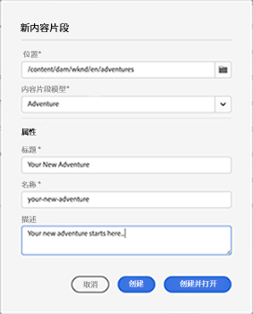

# 内容片段控制台  {#content-fragments-console}

了解内容片段控制台如何优化对内容片段的访问，帮助您通过执行发布、取消发布、复制等管理操作来创建、搜索和管理内容片段。

内容片段控制台专门用于管理、搜索和创建内容片段。 它已针对在 Headless 上下文中使用进行了优化，但在创建内容片段以用于页面创作时也会使用。

>[!NOTE]
>
>此控制台仅显示内容片段。 它不会显示其他资产类型，如图像和视频。

>[!NOTE]
>
>当前可通过以下方式访问您的内容片段：
>
>* 此&#x200B;**内容片段**&#x200B;控制台
>* **资产**&#x200B;控制台 – 参见[管理内容片段](/help/assets/content-fragments/content-fragments-managing.md)

>[!NOTE]
>
>可以在该控制台中使用一系列[键盘快捷键](/help/sites-cloud/administering/content-fragments/content-fragments-console-keyboard-shortcuts.md)。

可以从全局导航的顶级直接访问内容片段控制台：

## 控制台的基本结构和处理 {#basic-structure-handling-content-fragments-console}

选择&#x200B;**内容片段**&#x200B;将在新选项卡中打开控制台。

在这里，您可以看到以下三个主要区域：

* 顶部工具栏
   * 提供标准 AEM 功能
   * 还会显示您的 IMS 组织
* 左侧面板
   * 在此，可以隐藏或显示文件夹树
   * 您可以选择树的特定分支
* 主/右侧面板 – 从此处，您可以：
   * 查看树选定分支中的所有内容片段列表: 
      * 痕迹导航指示位置；它们还可用于更改位置
      * 选定文件夹中的内容片段，将显示所有子文件夹: 
         * 有关内容片段的[各种信息字段](#selectuse-available-columns)提供了相应的链接；根据字段，这些链接可以：
            * 在编辑器中打开相应的片段
            * 显示有关参考内容的信息
            * 显示有关片段的语言版本的信息
         * 您可以[选择一个或多个内容片段来显示可用的操作](#actions-selected-content-fragment)
      * 可以选择列标题，以根据该列对表进行排序；再次选择，以在升序和降序之间进行切换
   * **[创建](#creating-new-content-fragment)**&#x200B;新内容片段
   * [筛选](#filtering-fragments)内容片段，并保存过滤器以供将来使用
   * [搜索](#searching-fragments)内容片段
   * [自定义表视图以显示选定的信息列](#selectuse-available-columns)
   * 使用&#x200B;**在资源中打开**&#x200B;直接在&#x200B;**资源**&#x200B;控制台中打开当前位置。

      >[!NOTE]
      >
      >**资产**&#x200B;控制台用于访问资产，例如图像、视频等。  此控制台可以访问：
      >
      >* 使用&#x200B;**在资产中打开**&#x200B;链接（在“内容片段”控制台中）
      >* 直接从全局导航窗格

## 针对（选定的）内容片段的操作 {#actions-selected-content-fragment}

选择特定片段将打开一个工具栏，其中重点介绍可用于该片段的操作。 您还可以选择多个片段 – 操作的选择将相应地进行调整。

* **打开**
* **发布**（和 **取消发布**）
* **复制**
* **移动**
* **重命名**
* **删除**

>[!NOTE]
>
>“发布”、“取消发布”、“删除”、“移动”、“重命名”、“复制”等操作会触发异步作业。 可以通过 AEM 异步作业 UI 监控该作业的进度。

## 提供的有关您的内容片段的信息 {#information-content-fragments}

控制台的主/右侧面板（表格视图）提供了有关您的内容片段的一系列信息。有些项目还提供了进一步操作和/或信息的直接链接：

* **名称**
   * 提供用于在编辑器中打开片段的链接。
* **模型**
   * 提供用于在编辑器中打开片段的链接。
* **文件夹**
   * 提供用于在控制台中打开文件夹的链接。将鼠标悬停在文件夹名称上将显示 JCR 路径。
* **状态**
   * 仅供参考
* **修改时间**
   * 仅供参考
* **修改人**
   * 仅供参考
* **发布时间**
   * 仅供参考
* **发布者**
   * 仅供参考
* **引用者**

   * 提供一个链接来打开一个列出该片段的所有父引用的对话框，包括引用内容片段、体验片段和页面。要打开某个特定的引用，请单击对话框中的&#x200B;**标题**。

      

* **语言**

   * 指示内容片段的区域设置，以及与内容片段关联的区域设置/语言副本的总数。

      

      * 单击/点击计数可打开显示所有语言副本的对话框。要打开某个特定的语言副本，请单击对话框中的&#x200B;**标题**。

         

## 选择可用列 {#select-available-columns}

与其他控制台一样，您可以配置可见且可操作的列：

这将显示您可以隐藏或显示的列的列表：

## 创建新的内容片段 {#creating-new-content-fragment}

选择&#x200B;**“创建”**&#x200B;打开紧凑的&#x200B;**新内容片段**&#x200B;对话框：

## 筛选片段 {#filtering-fragments}

过滤器面板提供：

* 可以选择和组合的谓词选择
* **保存**&#x200B;您的配置的机会
* 用于检索保存的搜索过滤器以供重复使用的选项

## 搜索片段 {#searching-fragments}

搜索框支持全文搜索。 在搜索框中输入搜索词：

将提供选定的结果：

通过搜索框，还可以快速访问&#x200B;**近期内容片段**&#x200B;和&#x200B;**保存的搜索**：

