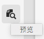
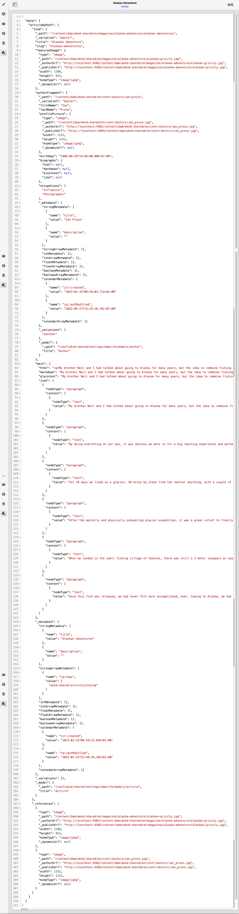

# 预览 – JSON 呈现 {#preview-json-representation}

在将内容片段的模型作为 AEM headless 实施的一部分进行开发时，您可能希望查看内容片段的 JSON 示例输出（基于模型）。 例如，了解最终输出的外观。 验证模型 JSON 结构时，这可能会很有帮助，每种数据类型可能包含默认示例内容。

使用&#x200B;**预览**&#x200B;图标：

您可以查看当前片段的 JSON 表示形式。 例如：

