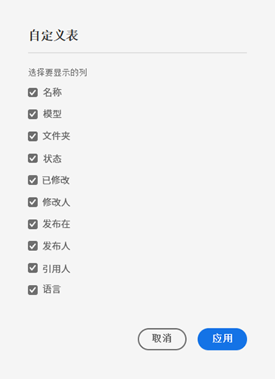

# 管理内容片段 {#managing-content-fragments}

了解如何使用&#x200B;**内容片段** 管理 AEM 内容片段的控制台。 这些参数可用于页面创作，或用作 headless 内容的基础。

定义完您的[内容片段模型](#creating-a-content-model)后，您可以使用这些模型[创建您的内容片段](#creating-a-content-fragment)。

[内容片段编辑器](#opening-the-fragment-editor)提供各种[模式](#modes-in-the-content-fragment-editor)，使您能够：

* [编辑内容](#editing-the-content-of-your-fragment)和[管理变量](#creating-and-managing-variations-within-your-fragment)
* [在片段中添加批注](/help/sites-cloud/administering/content-fragments/content-fragments-variations.md#annotating-a-content-fragment)
* [将内容与片段关联](#associating-content-with-your-fragment)
* [配置元数据](#viewing-and-editing-the-metadata-properties-of-your-fragment)
* [查看结构树](/help/sites-cloud/administering/content-fragments/content-fragments-structure-tree.md)
* [预览 JSON 表示形式](/help/sites-cloud/administering/content-fragments/content-fragments-json-preview.md)

>[!NOTE]
>
>可以使用内容片段：
>
>* 创作页面时；请参阅[使用内容片段进行页面创作](/help/sites-cloud/authoring/fundamentals/content-fragments.md)。
>* 用于[使用带有 GraphQL 的内容片段](/help/sites-cloud/administering/content-fragments/content-fragments-graphql.md)的 Headless 内容投放。

>[!NOTE]
>
>内容片段存储为&#x200B;**资产**。 它们主要通过&#x200B;**内容片段**&#x200B;控制台进行管理，但也可以从&#x200B;**资产**&#x200B;控制台进行管理。

## 创建内容片段 {#creating-content-fragments}

### 创建内容模型 {#creating-a-content-model}

[内容片段模型](/help/sites-cloud/administering/content-fragments/content-fragments-models.md)可在使用结构化内容创建内容片段之前启用和创建。

### 创建内容片段 {#creating-a-content-fragment}

创建内容片段：

1. 从&#x200B;**内容片段**&#x200B;控制台，选择&#x200B;**创建**（右上方）。

   >[!NOTE]
   >
   >要预定义新片段的位置，您可以导航到要创建片段的文件夹，也可以在创建过程中指定该位置。

1. **新内容片段**&#x200B;对话框随即会打开，您可以从此处指定：

   * **位置** – 这将使用当前位置自动完成，但您可以根据需要选择其他位置
   * **内容片段模型** – 从下拉列表中选择要用作片段基础的模型
   * **标题**
   * **名称** – 此操作将根据&#x200B;**标题**，但您可以根据需要进行编辑
   * **描述**

   

1. 选择 **创建**&#x200B;或 **创建并打开**&#x200B;以保留您的定义。

## 内容片段的状态 {#statuses-content-fragments}

内容片段在存在期间可以具有多种状态，如 [内容片段控制台](/help/sites-cloud/administering/content-fragments/content-fragments-console.md)：

* **新建**
已在内容片段编辑器中创建但从未编辑或打开新的内容片段。
* **草稿**
有人在内容片段编辑器中编辑或打开了（新）内容片段 – 但尚未发布。
* **已发布**
内容片段已发布。
* **已修改**
内容片段在发布后（但在发布修改之前）进行了编辑。
* **未发布**
内容片段已取消发布。

## 内容片段控制台中的内容片段的操作 {#actions-content-fragment-console}

在&#x200B;**内容片段**&#x200B;控制台工具栏中为您的内容片段提供了一系列操作：

* **在资产中打开**
* **创建**
* **引用者**&#x200B;列还提供了显示该片段的所有父引用的直接链接；包括引用内容片段、体验片段和页面。
* 将鼠标悬停在文件夹名称上将显示 JCR 路径。

选择片段后，所有适当的操作均可用：

* **打开**
* **发布**（和 **取消发布**）
* **复制**
* **移动**
* **重命名**
* **删除**

>[!NOTE]
>
>“发布”、“取消发布”、“删除”、“移动”、“重命名”、“复制”等操作会触发异步作业。 可以通过 AEM 异步作业 UI 监控该作业的进度。

## 在内容片段控制台中自定义视图 {#viewing-content-fragment-console}

控制台在当前文件夹和所有子文件夹中显示有关内容片段的信息。

您可以使用&#x200B;**自定义表**&#x200B;图标自定义显示的信息：

这将打开&#x200B;**自定义表**&#x200B;对话框中，您可以选择/取消选择可用列：

## 在内容片段控制台中搜索和过滤 {#search-filter-content-fragment-console}

您可以搜索和/或筛选要在控制台中显示的内容片段。

您可以：

* 选择所需的文件夹
* 选择带有&#x200B;**显示过滤器**&#x200B;图标的过滤器并同时使用搜索框：

提供了一系列过滤器：

还可以保存过滤器和搜索组合，供以后参考。

## 打开片段编辑器 {#opening-the-fragment-editor}

打开片段进行编辑：

>[!CAUTION]
>
>要编辑内容片段，您需要[相应的权限](/help/implementing/developing/extending/content-fragments-customizing.md#asset-permissions)。 如果您遇到问题，请联系您的系统管理员。

1. 使用&#x200B;**内容片段**&#x200B;控制台以导航到内容片段的位置。
1. 打开片段进行编辑，通过选择片段，然后从工具栏中选择&#x200B;**打开**。

1. 将打开片段编辑器。 根据需要进行更改：

   

1. 进行更改后，请使用&#x200B;**保存**，**保存并关闭**&#x200B;或&#x200B;**关闭**。

   >[!NOTE]
   >
   >**保存并关闭** 可通过&#x200B;**保存**&#x200B;下拉菜单使用。

   >[!NOTE]
   >
   >**保存并关闭**&#x200B;和&#x200B;**关闭**&#x200B;都将退出编辑器 – 请参阅[保存、关闭和版本](#save-close-and-versions)了解有关内容片段的各种选项如何操作的完整信息。

## 内容片段编辑器中的模式和操作 {#modes-actions-content-fragment-editor}

内容片段编辑器中提供了多种模式和操作。

### 内容片段编辑器中的模式 {#modes-in-the-content-fragment-editor}

使用侧面板中的图标在各种模式中导航：

* 变体：[编辑内容](#editing-the-content-of-your-fragment)和[管理变量](#creating-and-managing-variations-within-your-fragment)

* [注释](/help/sites-cloud/administering/content-fragments/content-fragments-variations.md#annotating-a-content-fragment)
* [关联的内容](#associating-content-with-your-fragment)
* [元数据](#viewing-and-editing-the-metadata-properties-of-your-fragment)
* [结构树](/help/sites-cloud/administering/content-fragments/content-fragments-structure-tree.md)
* [预览](/help/sites-cloud/administering/content-fragments/content-fragments-json-preview.md)

### 内容片段编辑器中的工具栏操作 {#toolbar-actions-in-the-content-fragment-editor}

顶部工具栏中的某些功能可以从多种模式使用：

* 当内容页面上已引用片段时，将显示一条消息。 您可以&#x200B;**关闭**&#x200B;消息。

* 可以使用&#x200B;**切换侧面板**&#x200B;图标来隐藏/显示侧面板。

* 在片段名称下方，您可以看到用于创建当前片段的[内容片段模型](/help/sites-cloud/administering/content-fragments/content-fragments-models.md)的名称：

   * 该名称还是一个将打开模型编辑器的链接。

* 查看片段的状态；例如，有关创建、修改或发布时间的信息。 状态也采用颜色编码：

   * **新建**：灰色
   * **草稿**：蓝色
   * **已发布**：绿色
   * **已修改**：橙色
   * **已停用**：红色

* **保存**&#x200B;提供对&#x200B;**保存并关闭**&#x200B;选项的访问。

* 三个圆点(**...**)下拉列表提供了对其他操作的访问权限：
   * **更新页面引用**
      * 这会更新任何页面引用。
   * **[快速发布](#publishing-and-referencing-a-fragment)**
   * **[管理发布](#publishing-and-referencing-a-fragment)**

<!--
This updates any page references and ensures that the Dispatcher is flushed as required. -->

## 保存、关闭和版本 {#save-close-and-versions}

>[!NOTE]
>
>版本也可以从时间线[创建、比较和还原](/help/sites-cloud/administering/content-fragments/content-fragments-managing.md#timeline-for-content-fragments)。

编辑器具有各种选项：

* **保存**&#x200B;和&#x200B;**保存并关闭**

   * **保存**&#x200B;将保存最新更改并保留在编辑器中。
   * **保存并关闭**&#x200B;将保存最新更改并退出编辑器。

   >[!CAUTION]
   >
   >要编辑内容片段，您需要[相应的权限](/help/implementing/developing/extending/content-fragments-customizing.md#asset-permissions)。 如果您遇到问题，请联系您的系统管理员。

   >[!NOTE]
   >
   >在保存之前，可以保留在编辑器中并进行一系列更改。

   >[!CAUTION]
   >
   >除了仅保存您的更改外，这些操作还会更新任何引用，并确保 Dispatcher 按需要刷新。 这些更改可能需要一些时间才能处理。 因此，对于大型/复杂/重载系统，性能可能会受到影响。
   >
   >在使用&#x200B;**保存并关闭**&#x200B;时请记住这一点，然后快速重新进入片段编辑器以进行并保存进一步的更改。

* **关闭**

   将退出编辑器，而不保存最新更改（即自上次&#x200B;**保存**）。

在编辑您的内容片段时，AEM 会自动创建版本，以确保在您取消更改时可以恢复先前的内容（使用&#x200B;**关闭**&#x200B;而不保存）：

1. 打开内容片段以编辑 AEM 时，会检查是否存在基于 Cookie 的令牌，以指示&#x200B;*编辑会话*&#x200B;存在：

   1. 如果找到令牌，则该片段将被视为现有编辑会话的一部分。
   2. 如果令牌为&#x200B;*不*&#x200B;可用，用户便开始编辑内容，并创建一个版本，并将此新编辑会话的令牌发送到客户端，客户端将保存在 Cookie 中。

2. 当有一个&#x200B;*活动*&#x200B;编辑会话时，正在编辑的内容每 600 秒自动保存一次（默认）。

   >[!NOTE]
   >
   >自动保存间隔可使用`/conf`机制进行配置。
   >
   >默认值，请参阅：
   >  `/libs/settings/dam/cfm/jcr:content/autoSaveInterval`

3. 如果用户取消编辑，则会恢复在编辑会话开始时创建的版本，并删除令牌以结束编辑会话。
4. 如果用户选择&#x200B;**保存**&#x200B;编辑，将保留更新的元素/变体，并删除令牌以结束编辑会话。

## 编辑片段的内容 {#editing-the-content-of-your-fragment}

打开片段后，您可以使用[变体](/help/sites-cloud/administering/content-fragments/content-fragments-variations.md)选项卡来创作内容。

## 创建和管理片段中的变体 {#creating-and-managing-variations-within-your-fragment}

创建主控内容后，即可创建和管理[变体](/help/sites-cloud/administering/content-fragments/content-fragments-variations.md)内容的一部分。

## 将内容与片段关联 {#associating-content-with-your-fragment}

您还可以[关联内容](/help/sites-cloud/administering/content-fragments/content-fragments-assoc-content.md)与片段。 这提供了一个连接，以便在将资产（即图像）添加到内容页面时，可以（可选）与片段一起使用资产（即图像）。

## 查看和编辑片段的元数据（属性） {#viewing-and-editing-the-metadata-properties-of-your-fragment}

您可以使用[元数据](/help/sites-cloud/administering/content-fragments/content-fragments-metadata.md)选项卡查看和编辑片段的属性。

## 发布和引用片段 {#publishing-and-referencing-a-fragment}

>[!CAUTION]
如果您的片段基于模型，则应确保[模型已发布](/help/sites-cloud/administering/content-fragments/content-fragments-models.md#publishing-a-content-fragment-model)。
如果发布的内容片段的模型尚未发布，则会显示一个选择列表来指示该情况，并且模型将随该片段一起发布。

必须发布内容片段才能在发布环境中使用。 可使用标准资产功能完成此操作

* 从[内容片段控制台](#actions-content-fragment-console)工具栏中的&#x200B;**发布**&#x200B;选项
   * **现在** – 确认后，片段将立即发布
   * **计划** – 您可以选择片段的发布日期和时间

   必要时，您需要指定&#x200B;**激活日期**和引用发布的内容。 例如：
   

* 从[内容片段编辑器](#toolbar-actions-in-the-content-fragment-editor)
   * [**快速发布**](/help/assets/manage-publication.md#quick-publish)
   * [**管理发布**](/help/assets/manage-publication.md#manage-publication)

此外，当您[发布使用片段的页面](/help/sites-cloud/authoring/fundamentals/content-fragments.md#publishing)；片段将在页面引用中列出。

>[!CAUTION]
片段发布和/或引用后，当作者再次打开片段进行编辑时，AEM 将显示警告。 这是为了警告，对片段所做的更改也会影响引用的页面。

## 取消发布片段 {#unpublishing-a-fragment}

要取消发布内容片段，请选择一个或多个片段，然后&#x200B;**取消发布**。

>[!NOTE]
在可用已发布的片段时，**取消发布**&#x200B;操作将可见。

>[!CAUTION]
如果片段已从其他片段或页面引用，您将看到一条警告消息，需要您确认是否继续。

## 删除片段 {#deleting-a-fragment}

删除片段：

1. 在&#x200B;**内容片段**&#x200B;控制台导航到内容片段的位置。
2. 选择片段。

   >[!NOTE]
   **删除**&#x200B;操作不能作为快速操作使用。

3. 从工具栏中选择&#x200B;**删除**。
4. 确认&#x200B;**删除**&#x200B;操作。

   >[!CAUTION]
   如果该片段已被另一个片段或页面引用，您将看到一条警告消息，并且需要确认您要继续执行&#x200B;**强制删除**。 片段及其内容片段组件将从任何内容页面中删除。

## 内容片段的时间线 {#timeline-for-content-fragments}

>[!NOTE]
此功能仅在&#x200B;**资产**&#x200B;控制台中可用

除了标准选项外，[时间线](/help/assets/manage-digital-assets.md#timeline)提供特定于内容片段的信息和操作：

* 查看有关版本、注释和批注的信息
* 版本操作

   * **[还原到此版本](#reverting-to-a-version)**（选择现有片段，然后选择特定版本）

   * **[与当前比较](#comparing-fragment-versions)**（选择现有片段，然后选择特定版本）

   * 添加&#x200B;**标签**&#x200B;和/或&#x200B;**注释**（选择现有片段，然后选择特定版本）

   * **保存为版本**（选择现有片段，然后选择时间线底部的向上箭头）

* 注释操作

   * **删除**

>[!NOTE]
评论包括：
* 所有资产的标准功能
* 在时间线中制造
* 与片段资产相关
>
注释（适用于内容片段）包括：
* 在片段编辑器中输入
* 特定于片段中选定的文本区段
>

例如：

## 比较片段版本 {#comparing-fragment-versions}

>[!NOTE]
此功能仅在&#x200B;**资产**&#x200B;控制台中可用

选择特定版本后，[时间线](/help/sites-cloud/administering/content-fragments/content-fragments-managing.md#timeline-for-content-fragments)中的&#x200B;**与当前比较**&#x200B;操作可用。

此时将打开：

* **当前**（最新）版本（左）

* 所选版本 **v&lt;*x.y*>**（右）

它们将并排显示，其中：

* 任何差异都会突出显示

   * 已删除的文本 – 红色
   * 插入的文本 – 绿色
   * 替换文本 – 蓝色

* 全屏图标允许您自行打开任一版本；然后切换回并行视图
* 您可以&#x200B;**还原**&#x200B;到特定版本
* **完成**&#x200B;将返回控制台

>[!NOTE]
比较片段时无法编辑片段内容。

## 恢复到某个版本  {#reverting-to-a-version}

>[!NOTE]
此功能仅在&#x200B;**资产**&#x200B;控制台中可用

您可以还原到片段的特定版本：

* 直接从[时间线](/help/sites-cloud/administering/content-fragments/content-fragments-managing.md#timeline-for-content-fragments)。

   选择所需的版本，然后&#x200B;**还原到此版本**&#x200B;操作。

* [将版本与当前版本进行比较](/help/sites-cloud/administering/content-fragments/content-fragments-managing.md#comparing-fragment-versions)时，您可以&#x200B;**还原**&#x200B;到所选版本。
