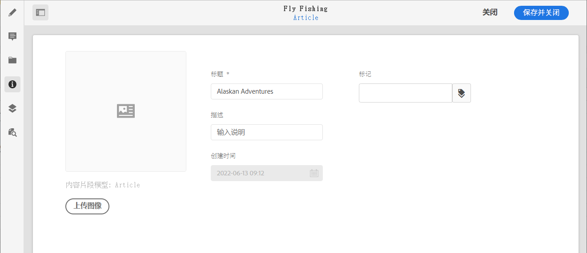

# 元数据 - 片段属性 {#metadata-fragment-properties}

了解如何查看和编辑AEM内容片段的元数据属性。

## 编辑属性/元数据 {#editing-properties-meta-data}

您可以查看和编辑内容片段的元数据（属性）：

1. 在 **资产** 控制台导航到内容片段的位置。
2. 可以任选其一：

   * 选择 [**查看属性** 打开对话框](/help/assets/manage-digital-assets.md#editing-properties). 打开进行查看后，您还可以编辑。
   * 打开内容片段进行编辑，然后选择 **元数据** 的上界。

   

3. 的 **基本** 选项卡提供了可查看或编辑的选项：

   * 缩览图，您可以 **上传图像**
   * **内容片段模型** 指示用于创建当前片段的模型
   * **标题**
   * **描述**
   * **标记**
      * [标记](/help/sites-cloud/authoring/features/tags.md) 在组织片段时特别强大，因为它们可用于内容分类和分类。 标记可用于查找内容（按标记）和应用批量操作。
例如，您可以将相关片段标记为“圣诞节启动”，以仅允许作为子集浏览这些片段，或复制这些片段以供将来在新文件夹中的另一个启动项使用。
   * 已创建（仅显示）
   
