# 变量 - 创作片段内容{#variations-authoring-fragment-content}

[变体](/help/sites-cloud/administering/content-fragments/content-fragments.md#constituent-parts-of-a-content-fragment) 是AEM内容片段的一项重要功能，因为它们允许您创建和编辑主控内容的副本以用于特定渠道和/或方案，从而使页面创作和无标题内容交付更加灵活。

从 **变体** 选项卡：

* [输入内容](#authoring-your-content) 对于片段，
* [创建和管理变体](#managing-variations) 的 **主控** 内容，

根据所编辑的数据类型执行一系列其他操作；例如：

* [将可视化资产插入片段](#inserting-assets-into-your-fragment) （图像）

* 在 [富文本](#rich-text), [纯文本](#plain-text) 和 [Markdown](#markdown) 编辑

* [上传内容](#uploading-content)

* [查看关键统计信息](#viewing-key-statistics) （关于多行文本）

* [总结文本](#summarizing-text)

* [使变体与主控内容同步](#synchronizing-with-master)

>[!CAUTION]
>
>发布和/或引用片段后，当作者打开片段进行再次编辑时，AEM将显示警告。 这是为了警告，对片段所做的更改也会影响引用的页面。

## 创作内容 {#authoring-your-content}

当您打开内容片段进行编辑时， **变体** 选项卡。 在此，您可以为主控或您拥有的任何变体创作内容。 结构化片段包含在内容模型中定义的各种数据类型的字段。

例如：

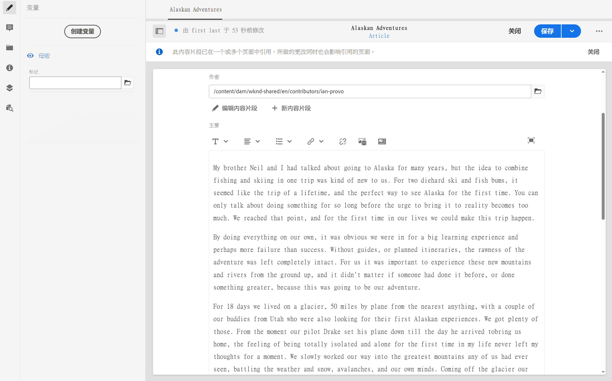
您可以：

* 直接在中进行编辑 **变体** 选项卡

   * 每种数据类型提供不同的编辑选项

* 表示 **多行文本** 字段 [全屏编辑器](#full-screen-editor) 至：

   * 选择 [格式](#formats)
   * 请参阅更多编辑选项( [富文本](#rich-text) format)
   * 访问 [操作](#actions)

* 对于 **片段引用** 字段 **[编辑内容片段](#fragment-references-edit-content-fragment)** 选项可用，具体取决于模型定义。

### 全屏编辑器 {#full-screen-editor}

编辑多行文本字段时，可以打开全屏编辑器；点按或单击实际文本，然后选择以下操作图标：

这将打开全屏文本编辑器：

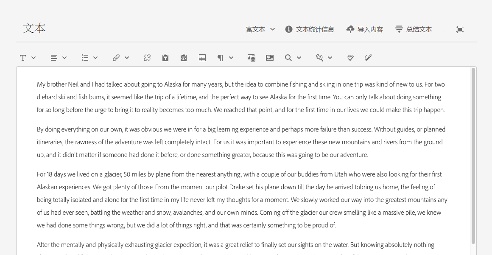

全屏文本编辑器提供：

* 访问各种 [操作](#actions)
* 根据 [格式](#formats)，其他格式选项([富文本](#rich-text))

### 操作 {#actions}

以下操作也可用(适用于 [格式](#formats)):

* 选择 [格式](#formats) ([富文本](#rich-text), [纯文本，](#plain-text) [Markdown](#markdown))

* [上传内容](#uploading-content)

* [显示文本统计信息](#viewing-key-statistics)

* [与主控同步](#synchronizing-with-master) （编辑变量时）

* [总结文本](#summarizing-text)

### 格式 {#formats}

用于编辑多行文本的选项取决于所选的格式：

* [富文本](#rich-text)
* [纯文本](#plain-text)
* [Markdown](#markdown)

全屏编辑器时可以选择格式。

### 富文本 {#rich-text}

富文本编辑允许您设置格式：

* 粗体
* 斜体
* 下划线
* 对齐方式：左，中，右
* 项目符号列表
* 编号列表
* 缩进：增加，减少
* 创建/中断超链接
* 粘贴文本/从Word
* 插入表
* 段落样式：第1/2/3段
* [插入资产](#inserting-assets-into-your-fragment)
* 打开全屏编辑器，其中提供了以下格式选项：
   * 搜索
   * 查找/替换
   * 拼写检查程序
   * [注释](/help/sites-cloud/administering/content-fragments/content-fragments-variations.md#annotating-a-content-fragment)
* [插入内容片段](#inserting-content-fragment-into-your-fragment);在 **多行文本** 字段配置为 **允许片段引用**.

的 [操作](#actions) 也可以从全屏编辑器访问。

### 纯文本 {#plain-text}

纯文本允许快速输入内容，而无需设置格式或标记信息。 您还可以打开全屏编辑器以进一步 [操作](#actions).

>[!CAUTION]
>
>如果您选择&#x200B;**纯文本**，则可能会丢失已插入&#x200B;**富文本**&#x200B;或&#x200B;**标记**&#x200B;中的任何格式、标记和/或资产。

### Markdown {#markdown}

>[!NOTE]
>
>有关完整信息，请参阅 [Markdown](/help/sites-cloud/administering/content-fragments/content-fragments-markdown.md) 文档。

这允许您使用标记设置文本格式。 您可以定义：

* 标题
* 段落和换行符
* 链接
* 图像
* 块引号
* 列表
* 强调
* 代码块
* 反斜线转义

您还可以打开全屏编辑器以进一步 [操作](#actions).

>[!CAUTION]
>
>如果在&#x200B;**富文本**&#x200B;和&#x200B;**标记**&#x200B;之间切换，您可能会在“引述块”和“代码块”中遇到意料之外的体验效果，因为这两种格式在处理方式上可能有所不同。

### 片段引用 {#fragment-references}

如果内容片段模型包含片段引用，则片段作者可能具有其他选项：

* [编辑内容片段](#fragment-references-edit-content-fragment)
* [新内容片段](#fragment-references-new-content-fragment)

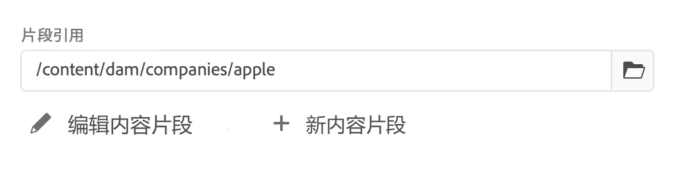

#### 编辑内容片段 {#fragment-references-edit-content-fragment}

选项 **编辑内容片段** 将在新编辑器选项卡中（在同一浏览器选项卡中）打开该片段。

再次选择原始选项卡(例如， **小马公司**)，将关闭此辅助选项卡(在本例中， **亚当·斯密**)。

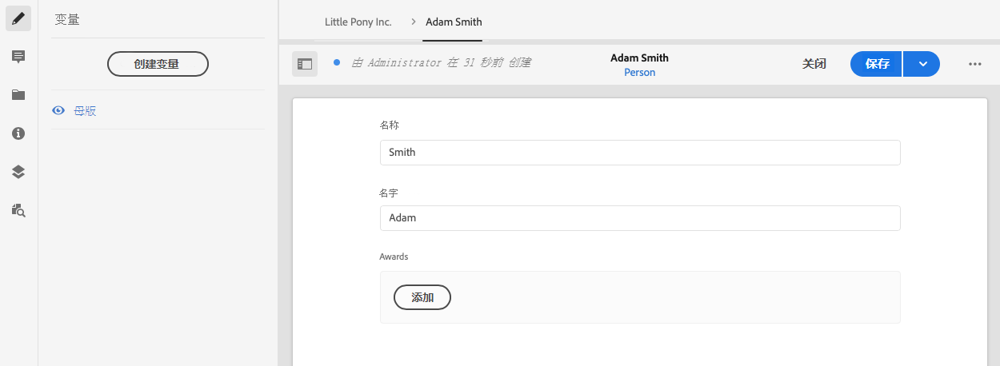

#### 新内容片段 {#fragment-references-new-content-fragment}

选项 **新内容片段** 将允许您创建一个全新的片段。 要实现此目的，将在编辑器中打开创建内容片段向导的变体。

然后，您将能够通过以下方式创建新片段：

1. 导航到所需的文件夹，然后选择该文件夹。
1. 选择 **下一个**.
1. 指定属性；例如 **标题**.
1. 选择 **创建**.
1. 最后：
   1. **完成** 将返回（到原始片段）并引用新片段。
   1. **打开** 将引用新片段，以及在新浏览器选项卡中打开新片段进行编辑。

### 查看关键统计信息 {#viewing-key-statistics}

当打开全屏编辑器时，**文本统计信息**&#x200B;操作将显示有关文本的一系列信息。

例如：

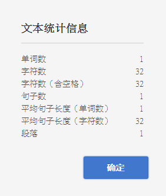

### 上传内容 {#uploading-content}

为简化内容片段创作过程，您可以上传在外部编辑器中准备的文本，并将其直接添加到片段中。

### 摘要文本 {#summarizing-text}

摘要文本旨在帮助用户将其文本的长度减少为预定义的单词数，同时保留关键点和总体含义。

>[!NOTE]
>
>在更技术性的层面上，系统保留它评分的句子作为提供 *信息密度和唯一性的最佳比率* 根据具体算法。

>[!CAUTION]
>
>内容片段必须具有有效的语言文件夹（ISO代码）作为上级；用于确定要使用的语言模型。
>
>例如， `en/` 与以下路径一样：
>
>  `/content/dam/my-brand/en/path-down/my-content-fragment`

>[!CAUTION]
现成提供英语。
其他语言作为Software Distribution中的语言模型包提供：
* [法语(fr)](https://experience.adobe.com/#/downloads/content/software-distribution/en/aem.html?package=/content/software-distribution/en/details.html/content/dam/aem/public/adobe/packages/cq630/product/smartcontent-model-fr)
* [德语(de)](https://experience.adobe.com/#/downloads/content/software-distribution/en/aem.html?package=/content/software-distribution/en/details.html/content/dam/aem/public/adobe/packages/cq630/product/smartcontent-model-de)
* [意大利语(it)](https://experience.adobe.com/#/downloads/content/software-distribution/en/aem.html?package=/content/software-distribution/en/details.html/content/dam/aem/public/adobe/packages/cq630/product/smartcontent-model-it)
* [西班牙语(es)](https://experience.adobe.com/#/downloads/content/software-distribution/en/aem.html?package=/content/software-distribution/en/details.html/content/dam/aem/public/adobe/packages/cq630/product/smartcontent-model-es)
>

1. 选择 **主控** 或所需的变量。
1. 打开全屏编辑器。

1. 选择 **摘要文本** 中。

   

1. 指定目标词语数并选择 **开始**:
1. 原始文本与建议的摘要并排显示：

   * 任何要删除的句子都以红色突出显示，并带有点进。
   * 单击任何高亮显示的句子以将其保留在摘要内容中。
   * 单击任何未突出显示的句子以将其删除。

1. 选择 **概述** 以确认更改。

1. 原始文本与建议的摘要并排显示：

   * 任何要删除的句子都以红色突出显示，并带有点进。
   * 单击任何高亮显示的句子以将其保留在摘要内容中。
   * 单击任何未突出显示的句子以将其删除。
   * 显示了总结统计信息： **实际** 和 **Target**-
   * 您可以 **预览** 更改。

   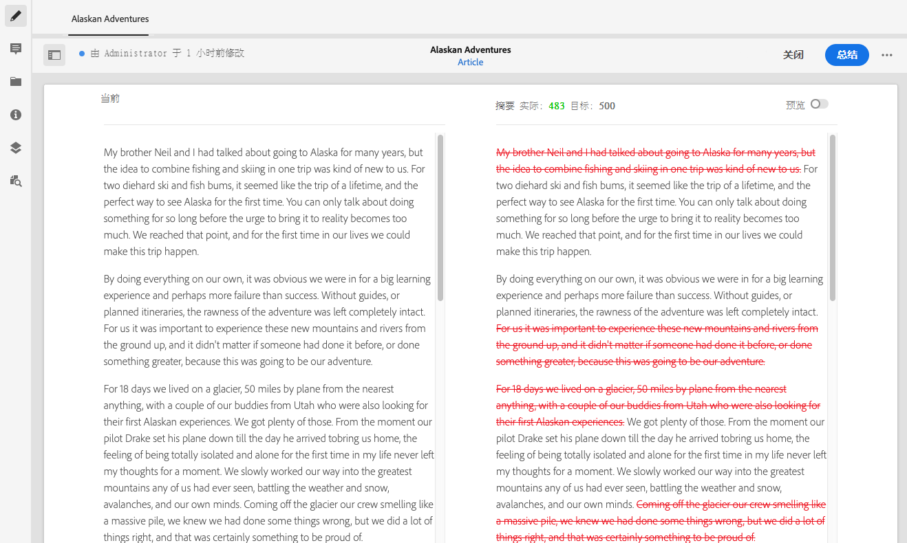

### 对内容片段添加注释 {#annotating-a-content-fragment}

要对片段添加注释：

1. 选择 **主控** 或所需的变量。

1. 打开全屏编辑器。

1. 的 **注释** 图标。 您可以根据需要选择一些文本。

   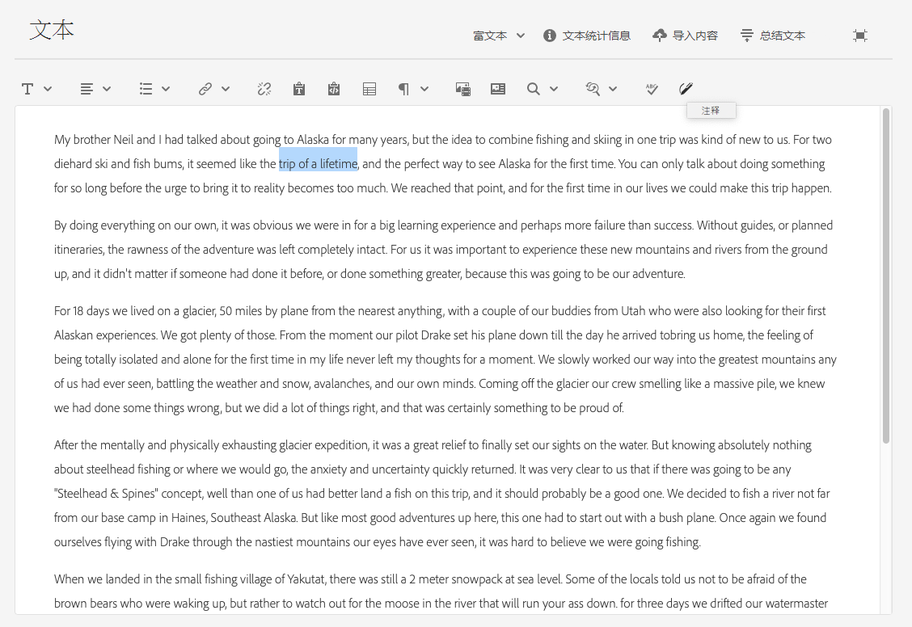

1. 此时将打开一个对话框。您可以在此输入注释。

   

1. 选择 **应用** 对话框。

   

   如果将注释应用于选定文本，则该文本将保持高亮显示状态。

   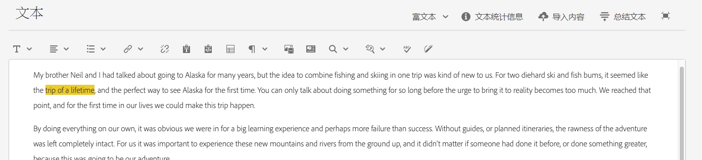

1. 关闭全屏编辑器时，批注仍会高亮显示。 如果选中，将打开一个对话框，以便您进一步编辑注释。

1. 选择&#x200B;**保存**。

1. 关闭全屏编辑器时，批注仍会高亮显示。 如果选中，将打开一个对话框，以便您进一步编辑注释。

   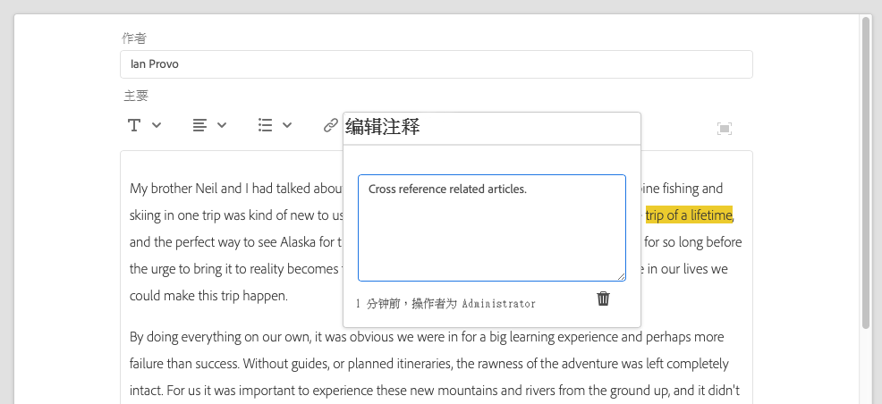

### 查看、编辑和删除批注 {#viewing-editing-deleting-annotations}

注释:

* 在编辑器的全屏和正常模式下，文本上的突出显示均可指示。 然后，可通过单击高亮显示的文本，查看、编辑和/或删除注释的完整详细信息，此时将重新打开对话框。

   >[!NOTE]
   如果对一段文本应用了多个注释，则会提供一个下拉选择器。

* 删除应用了注释的整个文本时，也会删除注释。

* 可以通过选择 **批注** 选项卡。

   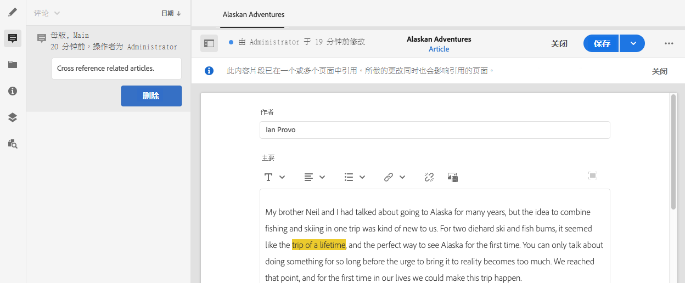

* 可在 [时间轴](/help/sites-cloud/administering/content-fragments/content-fragments-managing.md#timeline-for-content-fragments) 的值。

### 将资产插入片段 {#inserting-assets-into-your-fragment}

要简化创作内容片段的过程，您可以添加 [资产](/help/assets/manage-digital-assets.md) （图像）直接到片段。

将它们添加到片段的段落序列中，且不加任何格式；格式设置 [片段在页面上使用/引用](/help/sites-cloud/authoring/fundamentals/content-fragments.md).

>[!CAUTION]
无法在引用页面上移动或删除这些资产，必须在片段编辑器中完成此操作。
但是，必须在 [页面编辑器](/help/sites-cloud/authoring/fundamentals/content-fragments.md). 资产在片段编辑器中的表示形式仅用于创作内容流。

>[!NOTE]
添加的方法有多种 [图像](/help/sites-cloud/administering/content-fragments/content-fragments.md#fragments-with-visual-assets) 到片段和/或页面。

1. 将光标定位到要添加图像的位置。
1. 使用插入 **资产图标** ，打开搜索对话框。

   

1. 在对话框中，您可以：

   * 导航到DAM中的所需资产
   * 在DAM中搜索资产

   找到后，单击缩略图以选择所需的资产。

1. 使用&#x200B;**选择**&#x200B;将资产添加到当前位置的内容片段的段落系统中。

   >[!CAUTION]
   如果在添加资产后，您将格式更改为：
   * **纯文本**：资产将从片段中完全丢失。
   * **标记**：资产将不可见，但在您恢复为&#x200B;**富文本**&#x200B;时仍将存在。

### 将内容片段插入片段 {#inserting-content-fragment-into-your-fragment}

为了简化内容片段创作过程，您还可以向片段中添加其他内容片段。

它们将作为引用添加到片段中的当前位置。

>[!NOTE]
此选项在 **多行文本** 已配置 **允许片段引用**.

>[!CAUTION]
无法在引用页面上移动或删除这些资产，必须在片段编辑器中完成此操作。
但是，必须在 [页面编辑器](/help/sites-cloud/authoring/fundamentals/content-fragments.md). 资产在片段编辑器中的表示形式仅用于创作内容流。

>[!NOTE]
添加的方法有多种 [图像](/help/sites-cloud/administering/content-fragments/content-fragments.md#fragments-with-visual-assets) 到片段和/或页面。

1. 将光标放在要添加片段的位置。
1. 使用 **插入内容片段** 图标以打开搜索对话框。

   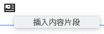

1. 在对话框中，您可以：

   * 导航到Assets文件夹中的所需片段
   * 搜索片段

   找到后，单击缩略图以选择所需的片段。

1. 使用 **选择** 将对所选内容片段的引用添加到当前内容片段（在当前位置）。

   >[!CAUTION]
   如果在添加对其他片段的引用后，您将格式更改为：
   * **纯文本**:引用将从片段中完全丢失。
   * **Markdown**:引用将保留。

## 管理变量 {#managing-variations}

### 创建变体 {#creating-a-variation}

各种变量允许您 **主控** 内容，并根据不同目的（如有需要）进行更改。

要创建新变体，请执行以下操作：

1. 打开片段并确保侧面板可见。
1. 选择 **变体** 图标栏。
1. 选择 **创建变量**.
1. 将打开一个对话框，为新变 **体指** 定 **标题和说** 明。
1. 选择 **添加**;片段 **主** (Master)将被复制到新变体中，该变体现在打开进行 [编辑](#editing-a-variation)。

   >[!NOTE]
   创建新变体时，始终 **主控** 而不是当前打开的变量。

### 编辑变量 {#editing-a-variation}

在执行以下任一操作后，您可以对变体内容进行更改：

* [创建变体](#creating-a-variation).
* 打开现有片段，然后从侧面板中选择所需的变量。

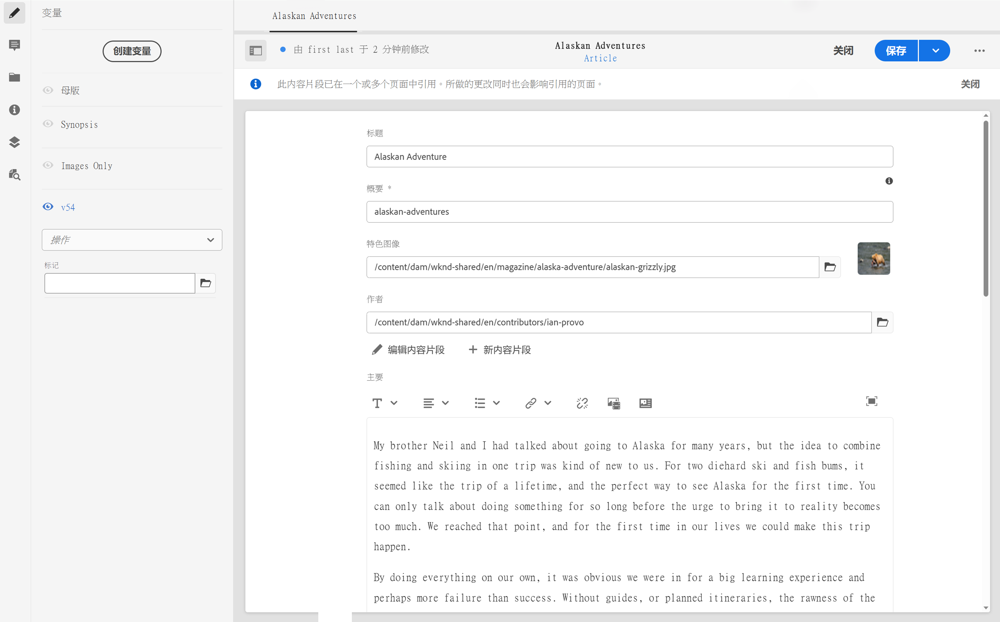

### 重命名变量 {#renaming-a-variation}

要重命名现有变量，请执行以下操作：

1. 打开片段并选择 **变体** 的上界。
1. 选择所需的变量。
1. 选择 **重命名** 从 **操作** 下拉。

1. 在生成的对 **话框中** ，输入新的 **标题和** /或说明。

1. 确认 **重命名** 操作。

>[!NOTE]
这仅影响变量 **标题**.

### 删除变量 {#deleting-a-variation}

要删除现有变量，请执行以下操作：

1. 打开片段并选择 **变体** 的上界。
1. 选择所需的变量。
1. 选择 **删除** 从 **操作** 下拉。

1. 确认 **删除** 操作。

>[!NOTE]
无法删除 **主控**.

### 与主控同步 {#synchronizing-with-master}

**主控** 是内容片段的一个组成部分，从定义上讲，它包含内容的主控副本，而变体则包含该内容的单独更新和定制版本。 更新主控时，这些更改可能也与变体相关，因此需要传播到这些变体中。

在编辑变体时，您有权使用将变体的当前元素与主控同步的操作。 这样，您就可以自动将对主控所做的更改复制到所需的变量。

>[!CAUTION]
同步仅可将更改从&#x200B;***主**复制到变体*。
将仅同步变量的当前元素。
同步仅适用于&#x200B;**多行文本**&#x200B;数据类型。
不提供将更改&#x200B;*从变体传输到&#x200B;**母版***选项。

1. 在片段编辑器中打开内容片段。 确保 **主控** 已编辑。

1. 选择一个特定的变体，然后从以下任一位置选择相应的同步操作：

   * the **操作** 下拉选择器 —  **将当前元素与主控**

      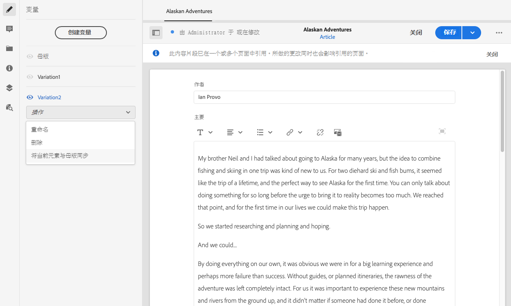

   * 全屏编辑器的工具栏 —  **与主控同步**

      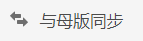

1. 主控，并且变体将并排显示：

   * 绿色表示添加的内容（添加到变量）
   * 红色表示内容已删除（从变量中）
   * 蓝色表示替换的文本

   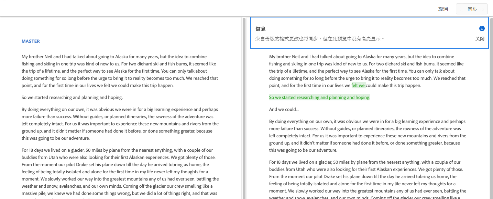

1. 选择 **同步**，则将更新并显示变量。
