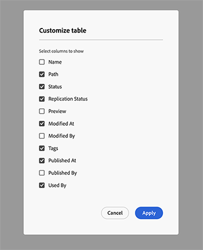
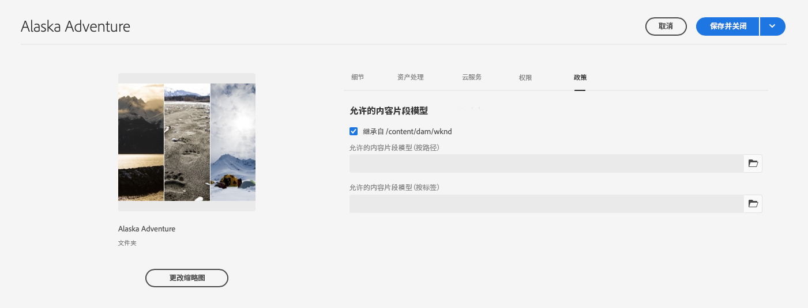
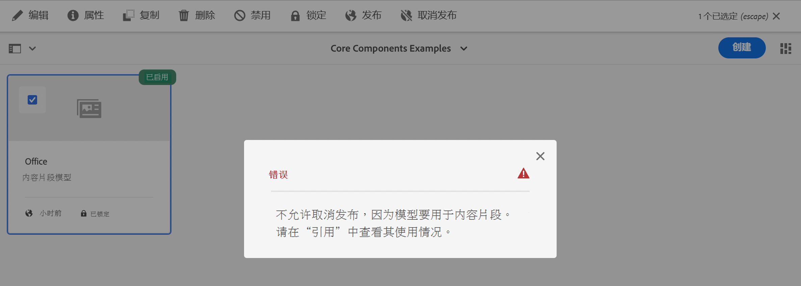
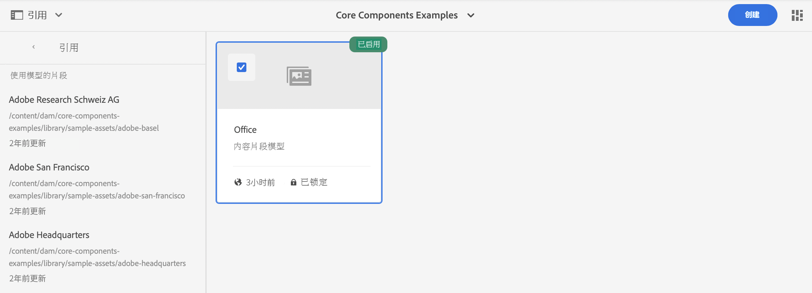

# 管理内容片段模型 {#managing-content-fragment-models}

从内容片段控制台中，您可以管理内容片段模型，然后[打开编辑器](/help/sites-cloud/administering/content-fragments/content-fragment-models.md)以定义结构。

Adobe Experience Manager (AEM) as a Cloud Service 中的内容片段模型定义[内容片段](/help/sites-cloud/administering/content-fragments/overview.md)的内容结构。然后，这些片段可以用作Headless内容的基础，或用于页面创作。

>[!NOTE]
>
>本页介绍了（仅）显示内容片段模型的控制台部分。 有关其他面板，请参阅：
>
>* [管理内容片段](/help/sites-cloud/administering/content-fragments/managing.md)
>* [在内容片段控制台中查看和管理Assets](/help/sites-cloud/administering/content-fragments/assets-content-fragments-console.md)

>[!NOTE]
>
>内容片段存储为&#x200B;**资源**。内容片段模型主要从&#x200B;**内容片段**&#x200B;控制台进行管理，但也可以从[Assets](/help/assets/content-fragments/content-fragments-managing.md)控制台以及从&#x200B;**工具** - **常规**&#x200B;中提供的选项[内容片段模型](/help/assets/content-fragments/content-fragments-models.md)进行管理。

## 如何使用内容片段模型 {#how-to-work-with-content-fragment-models}

作为一个非常快速的概述，要使用内容片段模型，您：

1. [为您的实例启用内容片段模型功能](/help/sites-cloud/administering/content-fragments/setup.md)
1. [创建](#creating-a-content-fragment-model)您的内容片段模型。
   * 此时，您还可以&#x200B;**启用**&#x200B;模型（在创建内容片段时使用）。
1. [定义](/help/sites-cloud/administering/content-fragments/content-fragment-models.md#defining-your-content-fragment-model)模型的结构。
1. [启用您的内容片段模型](#enabling-a-content-fragment-model)（如果尚未启用）。
1. 通过配置[策略](#allowing-content-fragment-models-assets-folder)，**允许在所需的 Assets 文件夹上创建内容片段模型**。

## 控制台中内容片段模型的基本结构和处理 {#basic-structure-handling-content-fragment-models-console}

您可以使用[内容片段控制台](/help/sites-cloud/administering/content-fragments/overview.md#content-fragments-console)最左侧的面板选择&#x200B;**内容片段模型**&#x200B;作为查看、浏览和管理的资源类型：

这将打开内容片段模型的视图：

在这里，您可以看到以下三个主要区域：

* 顶部工具栏
   * 提供标准 AEM 功能
   * 还会显示您的 IMS 组织
   * 提供多种[操作](#actions-unselected)
* 左侧面板
   * 显示作为文件夹列出的所有配置](/help/sites-cloud/administering/content-fragments/setup.md#enable-content-fragment-functionality-configuration-browser)的[路径
   * 在此，可以隐藏或显示文件夹树
   * 您可以选择树的特定文件夹
   * 这可以调整为显示嵌套文件夹（子配置）
   * 除了内容片段模型之外，您还可以查看[内容片段](/help/sites-cloud/administering/content-fragments/managing.md)或[Assets](/help/sites-cloud/administering/content-fragments/assets-content-fragments-console.md)；您还可以压缩或展开指向面板的链接
* 主/右侧面板 – 从此处，您可以：
   * 查看所选文件夹下保存的所有内容片段模型的列表：
      * 选定文件夹中的内容片段模型，将显示所有子文件夹：
         * 由痕迹导航指示位置；还可使用痕迹导航更改位置：
      * [将显示有关每个模型的信息](#information-content-fragment-models)
         * [您可以选择要显示的列](#select-columns-console)
      * [有关内容片段模型的各种信息字段](#information-content-fragment-models)提供了链接；根据字段，这些链接可以：
         * 在编辑器中打开相应的模型
         * 显示有关配置路径的信息
         * 显示有关模型状态的信息
      * [有关内容片段模型的某些其他信息字段](#information-content-fragments)可用于[快速筛选](#fast-filtering)：
         * 在列中选择一个值，该值将立即作为过滤器应用
         * **Modified By**、**Published By**&#x200B;和&#x200B;**Status**&#x200B;列支持快速筛选。
      * 将鼠标悬停在列标题上方，可显示下拉操作选择器和宽度滑块。使用它们可以：
         * 排序 – 选择适当的升序或降序操作
该操作将根据该列对整个表进行排序。排序仅适用于相应的列。
         * 调整列的大小 – 使用操作或宽度滑块
      * 选择一个或多个模型以执行进一步的[操作](#actions-selected-content-fragment-models)
   * 打开[过滤器面板](#filter-content-fragment-models)
   * 有一批[键盘快捷键](/help/sites-cloud/administering/content-fragments/keyboard-shortcuts.md)在此控制台中可用

## 提供的有关您的内容片段模型的信息 {#information-content-fragment-models}

控制台的主/右侧面板（表格视图）提供了有关您的内容片段模型的一系列信息。 有些项目还提供了进一步操作和/或信息的直接链接：

* **名称**
   * 提供用于在编辑器中打开模型的链接。
* **已锁定** （挂锁图标）
   * 当模型被锁定时，用挂锁图标指示。
* **路径**
   * 提供路径作为链接，以在控制台中打开配置。
将鼠标悬停在文件夹名称上将显示 JCR 路径。
* **状态**
   * 仅供参考。
   * 可用于[快速筛选](#fast-filtering)
* **修改时间**
   * 仅供参考。
* **修改人**
   * 仅供参考。
   * 可用于[快速筛选](#fast-filtering)。
* **标记**
   * 仅供参考。
   * 显示与模型相关的所有标记。
   * 可用于[快速筛选](#fast-filtering)。
* **发布时间**
   * 仅供参考。
* **发布者**
   * 仅供参考。
   * 可用于[快速筛选](#fast-filtering)。

## 模型属性 {#model-properties}

选择特定模型时，将显示该模型的属性（如[创建模型](#creating-a-content-fragment-model)时定义）。 如果模型不是&#x200B;**锁定**，则可以更新某些项。 您还可以使用信息图标（模型&#x200B;**标题**&#x200B;旁边）打开和关闭此信息面板。

的信息

* **[路径](/help/sites-cloud/administering/content-fragments/setup.md#enable-content-fragment-functionality-configuration-browser)**
* **[状态](#enabling-a-content-fragment-model)**
* **标题**
* **标记**
* **描述**
* **预览URL模式**

  内容片段模型允许作者在外部前端应用程序中&#x200B;**预览**&#x200B;其内容。 在配置&#x200B;**预览服务**&#x200B;后，添加该前端应用程序的 URL。

  预览 URL 应遵循此模式：
`https://<preview_url>?param=${expression}`

  可用的表达式为：

   * `${contentFragment.path}`
   * `${contentFragment.model.path}`
   * `${contentFragment.model.name}`
   * `${contentFragment.variation}`
   * `${contentFragment.id}`

<!-- CHECK: currently under FT -->
<!--
* **GraphQL**
  Define names relevant for GraphQL.
  Changing the GraphQL API Name, or Query field names will impact client applications.
  * **API Name**
    Represents the GraphQL type and query field names in the GraphQL schema.
  * **Single Query Field Name**
    Represents the GraphQL single query field name in the GraphQL schema.
  * **Multiple Query Field Name**
    Represents the GraphQL multiple query field name in the GraphQL schema.
-->

## 操作 {#actions}

选择文件夹（在左侧面板中）后，您可以直接或在选择特定模型后使用一系列操作：

* 各种操作直接[从控制台可用](#actions-unselected)
* 您可以[选择一个或多个内容片段模型以显示相应的操作](#actions-selected-content-fragment)

### 操作（未选择） {#actions-unselected}

某些操作在选择文件夹后从控制台中可用，但无需选择特定的内容片段模型：

* **[创建](#creating-a-content-fragment-model)**&#x200B;新的（空）模型

### 内容片段控制台中的内容片段模型的操作 {#actions-selected-content-fragment-models}

选择特定模型会打开一个工具栏，其中重点介绍可用于该模型的操作。 您还可以选择多个模型 — 可用的操作将相应地进行调整。

* **[编辑](/help/sites-cloud/administering/content-fragments/content-fragment-models.md)**&#x200B;以定义您的内容片段模型。
* **将**&#x200B;发布到[发布](/help/implementing/cloud-manager/manage-environments.md#environment-types)或[预览](/help/implementing/cloud-manager/manage-environments.md#access-preview-service)层。
* **锁定**/**解锁**&#x200B;以控制是否允许用户修改模型。
* **[启用](#enabling-a-content-fragment-model)**/**[禁用](#disabling-a-content-fragment-model)**&#x200B;以控制是否允许用户基于此模型创建内容片段。

选择单个模型也会在右侧面板中显示[模型属性](#properties)。

## 选择在控制台中显示的列 {#select-columns-console}

与其他控制台一样，您可以配置可见且可操作的列：

这将显示您可以隐藏或显示的列的列表：

## 筛选内容片段模型 {#filter-content-fragment-models}

过滤器面板提供：

* 一批谓词；
   * 包括状态字段、标记、用户等
   * 可以选择并组合一个或多个谓词来创建筛选条件

<!--
* the opportunity to **Save** your filter
* the option to retrieve a saved search filter for reuse
-->

选择后，将显示&#x200B;**过滤依据**&#x200B;选项（在主面板顶部）。 可以从该位置将其取消选择。例如：

### 快速筛选 {#fast-filtering}

您还可以通过单击列表中的特定列值来选择谓词。您可以选择一个或多个值来组合谓词。

例如，在&#x200B;**状态**&#x200B;列中选择&#x200B;**已启用**。 选择后，将显示为过滤器谓词，并相应地筛选列表。

>[!NOTE]
>
>仅对&#x200B;**Status**、**Modified By**、**Tags**&#x200B;和&#x200B;**Published By**&#x200B;列支持快速筛选。

>[!NOTE]
>
>快速筛选的操作方式与控制台中[内容片段](/help/sites-cloud/administering/content-fragments/managing.md#fast-filtering)的操作方式相同。

## 创建内容片段模型 {#creating-a-content-fragment-model}

1. 导航到适合您的[配置或子配置](/help/sites-cloud/administering/content-fragments/setup.md)的文件夹。
1. 使用&#x200B;**创建**&#x200B;打开对话框。

   >[!CAUTION]
   >
   >**创建**&#x200B;选项将仅可用：
   >
   >* 如果已启用[使用内容片段模型](/help/sites-cloud/administering/content-fragments/setup.md)
   >* 选择要在其中创建模型的文件夹后。

1. 选择配置的&#x200B;**路径**&#x200B;并指定&#x200B;**名称**。

   >[!NOTE]
   >
   >该配置将自动填写当前配置（您当前所在的文件夹）。
   >
   >您还可以通过单击文件夹图标来更改配置。

   您还可以定义各种属性：

   * **标题**
如果您先输入**Title**，则将从中生成&#x200B;**Name**。
   * **描述**
   * **启用模型**&#x200B;以[启用模型](#enabling-disabling-a-content-fragment-model)

   >[!NOTE]
   >
   >有关完整详细信息，请参阅[内容片段模型 - 属性](#model-properties)。

   

1. 使用&#x200B;**创建**&#x200B;保存空模型，或者&#x200B;**创建并打开**。

### 启用内容片段模型 {#enabling-a-content-fragment-model}

创建模型后必须启用它，以使其：

* 可在创建内容片段时进行选择。
* 可以在内容片段模型中引用。
* 可用于 GraphQL；这样就会生成架构。

您可以&#x200B;**启用**&#x200B;模型：

* 创建新模型时
   * 对话框中会显示一个选项。
* 当模型已被特别&#x200B;**禁用**&#x200B;时
   * 选择所需的模型后，顶部工具栏中会显示&#x200B;**启用**&#x200B;操作。

### 禁用内容片段模型 {#disabling-a-content-fragment-model}

也可以禁用模型，这样：

* 该模型将无法再用来创建&#x200B;*新*&#x200B;内容片段。
* 但是:
   * GraphQL 架构一直在生成，并且仍可查询（以避免影响 JSON API）。
   * 仍可以从 GraphQL 端点查询和返回任何基于模型的内容片段。
* 该模型无法再次引用，但现有引用将保持不变，并且仍可以从 GraphQL 端点查询和返回。

要禁用标记为&#x200B;**已启用**&#x200B;的模型，您可以使用以下位置的&#x200B;**禁用**&#x200B;选项：

* 选择所需的“模型”时，顶部工具栏。

## 允许在 Assets 文件夹中使用内容片段模型 {#allowing-content-fragment-models-assets-folder}

要实施内容管理，您可以在 Assets 文件夹中配置&#x200B;**策略**，以控制允许在该文件夹中创建片段的内容片段模型。

>[!NOTE]
>
>该机制类似于[允许在页面的高级属性](/help/sites-cloud/authoring/page-editor/templates.md#allowing-a-template-author)中为页面及其子页面设置页面模板。

要为&#x200B;**允许的内容片段模型**&#x200B;配置&#x200B;**策略**：

1. 导航并打开&#x200B;**属性**，以访问所需的 Assets 文件夹。

1. 打开&#x200B;**策略**&#x200B;选项卡，您可以在其中配置：

   * **继承自`<folder>`**

     在创建新的子文件夹时自动继承策略；如果子文件夹需要允许模型与父文件夹不同，则可重新配置策略（并中断继承）。

   * **按照路径允许的内容片段模型**

     可以允许使用多个模型。

   * **按标记允许的内容片段模型**

     可以允许使用多个模型。

   

1. **保存**&#x200B;任何更改。

文件夹允许的内容片段模型解析如下：

* 针对&#x200B;**允许的内容片段模型**&#x200B;的&#x200B;**策略**。
* 如果为空，请尝试使用继承规则确定策略。
* 如果继承链未投放结果，请查看 **Cloud Services** 文件夹的配置（也请先直接配置，然后通过继承配置）。
* 如果以上所有内容均未提供任何结果，则该文件夹不允许使用模型。

<!--
## Deleting a Content Fragment Model {#deleting-a-content-fragment-model}

>[!CAUTION]
>
>Deleting a Content Fragment model can impact dependent fragments.

To delete a Content Fragment model:

1. Navigate to, and select your Content Fragment Model. You can select multiple models.

1. Select **Delete** from the toolbar.

   >[!NOTE]
   >
   >If the model is referenced a warning is given, so that you can take appropriate action.
-->

## 发布内容片段模型 {#publishing-a-content-fragment-model}

需要在发布任何从属的内容片段时/之前发布内容片段模型。

要发布内容片段模型，请执行以下操作：

1. 导航到并选择您的内容片段模型。 您可以选择多个模型。

1. 从工具栏中选择&#x200B;**发布**。

1. 在“发布”对话框中，选择&#x200B;**目标**：

   * **发布服务**
   * **预览服务**

1. 将启动用于发布所选模型及其引用的工作流。 随后，控制台中将显示已发布状态。

<!--
## Unpublishing a Content Fragment Model {#unpublishing-a-content-fragment-model}

Content Fragment Models can be unpublished if they are not referenced by any fragments.

To unpublish a Content Fragment Model:

1. Navigate to, and select your Content Fragment Model.
1. Select **Unpublish** from the toolbar.
   The published status is indicated in the console. 

If you try to unpublish a model that is currently used by one or more fragments, then an error warning is shown. For example: 

The message suggests that you check the [References](/help/sites-cloud/authoring/basic-handling.md#references) panel to investigate further:

-->

## 锁定的内容片段模型 {#locked-content-fragment-models}

此功能允许您控制模型是否可以更新，但它也为已发布的内容片段模型提供了管理。

### 挑战 {#the-challenge}

* 内容片段模型确定 AEM 中 GraphQL 查询的架构。

   * AEM GraphQL 架构在创建内容片段模型后即会创建，并且它们可以同时存在于创作和发布环境中。

   * 发布架构是最为关键，因为它们为 JSON 格式的内容片段的实时投放奠定了基础。

* 修改内容片段模型或进行其他编辑时，可能会出现问题。这意味着架构发生更改，进而可能影响现有 GraphQL 查询。

* 向内容片段模型添加新字段通常不应产生任何有害影响。但是，修改现有数据字段（例如，其名称）或删除字段定义时，将在请求这些字段时中断现有 GraphQL 查询。

### 要求 {#the-requirements}

* 使用户了解在编辑已用于实时内容投放的模型（即已发布的模型）时的风险。

* 此外，还可以避免意外的更改。

如果重新发布经过修改的模型，则这些条件中的任意一项都可能会中断查询。

### 解决方案 {#the-solution}

为了解决这些问题，内容片段模型在发布后立即在作者上被&#x200B;*锁定为*&#x200B;只读模式。此状态由&#x200B;**锁定**&#x200B;指示。

当模型&#x200B;**已锁定**（在“只读”模式下），您可以查看模型的内容和结构，但无法进行编辑。

您可以从控制台或模型编辑器中管理&#x200B;**已锁定**&#x200B;模型：

* 控制台

  从控制台中，您可以使用工具栏中的&#x200B;**解锁**&#x200B;和&#x200B;**锁定**&#x200B;操作来管理只读模式。

   * 您可以&#x200B;**解锁**&#x200B;用于启用编辑的模型。

     如果选择&#x200B;**解锁**，将显示警告，您必须确认&#x200B;**解锁**&#x200B;操作。

     然后，可以打开模型进行编辑。

   * 您之后还可以&#x200B;**锁定**&#x200B;模型。
   * 重新发布模型将立即使它恢复&#x200B;**已锁定**（只读）模式。

* 模型编辑器

   * 当您打开锁定的模型时，系统会发出警告，并显示三个操作： **取消**、**查看只读**、**编辑**。

   * 如果选择&#x200B;**查看只读**，则可以查看模型的内容和结构。

   * 如果您选择&#x200B;**编辑**，则您可以编辑并保存您的更新：

     

     >[!NOTE]
     >
     >顶部可能仍会显示警告，但此时模型已由现有内容片段使用。

   * **取消**&#x200B;将带您返回控制台。
