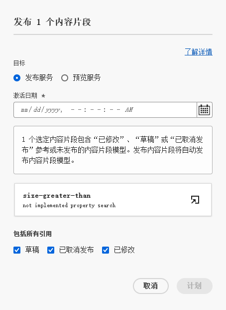

# 管理内容片段 {#managing-content-fragments}

了解如何管理您的 **内容片段** 在Adobe Experience Manager (AEM)as a Cloud Service中，从 [内容片段控制台](#content-fragments-console)、和 [内容片段编辑器](/help/sites-cloud/administering/content-fragments/authoring.md#content-fragment-editor). 这些内容片段可用作Headless内容的基础，或用于页面创作。

>[!NOTE]
>
>如果需要，您的项目团队可以自定义控制台和编辑器。 请参阅 [自定义内容片段控制台和编辑器](/help/implementing/developing/extending/content-fragments-console-and-editor.md) 以了解更多详细信息。

定义您的 [内容片段模型](#creating-a-content-model) 您可以使用这些功能来：

* [创建您的内容片段](#creating-a-content-fragment).
* 然后打开 [内容片段编辑器](#opening-the-fragment-editor) 到 [创作内容和管理变体](#editing-the-content-of-your-fragment).
* [管理标记](#manage-tags)
* [查看和编辑属性（元数据）](#viewing-and-editing-properties)
* [查看结构树](/help/sites-cloud/administering/content-fragments/authoring.md#structure-tree)

>[!NOTE]
>
>可以使用内容片段：
>
>* 对象 [使用带有GraphQL的内容片段的Headless内容投放](/help/sites-cloud/administering/content-fragments/content-delivery-with-graphql.md)，
>* 创作页面时；请参阅[使用内容片段进行页面创作](/help/sites-cloud/authoring/fundamentals/content-fragments.md)。

>[!NOTE]
>
>内容片段存储为&#x200B;**资源**。它们主要通过&#x200B;**内容片段**&#x200B;控制台进行管理，但也可以从[ Assets ](/help/assets/content-fragments/content-fragments-managing.md)控制台进行管理。

## 内容片段控制台 {#content-fragments-console}

内容片段控制台专门用于管理、搜索和创建内容片段。 它已针对在 Headless 上下文中使用进行了优化，但在创建内容片段以用于页面创作时也会使用。

内容片段控制台提供对片段和相关任务的直接访问。可以从全局导航的顶级直接访问该控制台。

有关更多信息，请参阅：

* [内容片段控制台的基本结构和处理](#basic-structure-handling-content-fragments-console)

* [提供的有关您的内容片段的信息](#information-content-fragments)

* [内容片段控制台中的内容片段的操作](#actions-selected-content-fragment)

* [选择控制台中显示的列](#select-columns-console)

* [在内容片段控制台中搜索和过滤](#filtering-fragments)

* 选择 [键盘快捷键](/help/sites-cloud/administering/content-fragments/keyboard-shortcuts.md) 可以在此控制台中使用

>[!NOTE]
>
>此控制台仅显示内容片段。 它不会显示其他资源类型，如图像和视频。

>[!CAUTION]
>
>此控制台为 *仅限* 可在在线Adobe Experience Manager (AEM)as a Cloud Service中获取。

### 控制台的基本结构和处理 {#basic-structure-handling-content-fragments-console}

选择&#x200B;**内容片段**&#x200B;将在新选项卡中打开控制台。

在这里，您可以看到以下三个主要区域：

* 顶部工具栏
   * 提供标准 AEM 功能
   * 还会显示您的 IMS 组织
   * 提供各种 [操作](#actions-unselected)
* 左侧面板
   * 在此，可以隐藏或显示文件夹树
   * 您可以选择树的特定分支
   * 可以调整其大小以显示嵌套文件夹
* 主/右侧面板 – 从此处，您可以：
   * 查看树选定分支中的所有内容片段列表: 
      * 选定文件夹中的内容片段，将显示所有子文件夹:
         * 痕迹导航指示位置；它们还可用于更改位置:
      * [将显示有关每个片段的信息](#information-content-fragments)
         * [您可以选择要显示的列](#select-columns-console)
      * 有关内容片段的[各种信息字段](#information-content-fragments)提供了相应的链接；根据字段，这些链接可以：
         * 在编辑器中打开相应的片段
         * 显示有关参考内容的信息
         * 显示有关片段的语言版本的信息
      * [某些其他信息字段](#information-content-fragments) 关于内容片段可用于 [快速筛选](#fast-filtering)：
         * 在列中选择一个值，并立即作为过滤器应用
         * 支持快速筛选 **模型**， **状态**， **修改者**， **标记** 和 **发布者** 列。
      * 将鼠标悬停在列标题上方，可显示下拉操作选择器和宽度滑块。使用它们可以：
         * 排序 – 选择适当的升序或降序操作
该操作将根据该列对整个表进行排序。排序仅适用于相应的列。
         * 调整列的大小 – 使用操作或宽度滑块
      * 选择一个或多个片段以进一步了解 [操作](#actions-selected-content-fragment)
   * 使用 [Search](#searching-fragments) 框
   * 打开 [过滤器面板](#filtering-fragments)

### 操作 {#actions}

在控制台中，您可以直接或在选择特定片段后使用一系列操作：

* 各种操作直接[从控制台可用](#actions-unselected)
* 您可以[选择一个或多个内容片段来显示相应的操作](#actions-selected-content-fragment)

#### 操作（未选择） {#actions-unselected}

可以从控制台执行某些操作 - 无需选择特定的内容片段：

* **[创建](#creating-a-content-fragment)**&#x200B;新内容片段
* [筛选](#filtering-fragments)内容片段，并保存过滤器以供将来使用
* [搜索](#searching-fragments)内容片段
* [自定义表视图以显示选定的信息列](#select-columns-console)
* 使用&#x200B;**在资源中打开**&#x200B;直接在&#x200B;**资源**&#x200B;控制台中打开当前位置。

  >[!NOTE]
  >
  >**资源**&#x200B;控制台用于访问资源，例如图像、视频等。  此控制台可以访问：
  >
  >* 使用&#x200B;**在资源中打开**&#x200B;链接（在“内容片段”控制台中）
  >* 直接从全局 **导航** 窗格

#### 针对（选定的）内容片段的操作 {#actions-selected-content-fragment}

选择特定片段将打开一个工具栏，其中重点介绍可用于该片段的操作。 您还可以选择多个片段 – 操作的选择将相应地进行调整。

* **[在新编辑器中打开](#editing-the-content-of-your-fragment)**
* **[打开](/help/assets/content-fragments/content-fragments-variations.md)** （在原始编辑器中）
* **[发布](#publishing-and-previewing-a-fragment)**（和 **[取消发布](#unpublishing-a-fragment)**）
* **[管理标记](#manage-tags)**
* **[复制](/help/assets/manage-digital-assets.md)**
* **[移动](/help/assets/manage-digital-assets.md)**
* **[重命名](/help/assets/manage-digital-assets.md)**
* **[删除](#deleting-a-fragment)**

<!--
* **[Replace](#find-and-replace)**
-->

>[!NOTE]
>
>使用 **打开** 在中打开选定的片段 *原有* 编辑者。

>[!NOTE]
>
>“发布”、“取消发布”、“删除”、“移动”、“重命名”和“复制”等操作都会触发异步作业。 可以通过 AEM 异步作业 UI 监控该作业的进度。

### 提供的有关您的内容片段的信息 {#information-content-fragments}

控制台的主/右侧面板（表格视图）提供了有关您的内容片段的一系列信息。有些项目还提供了进一步操作和/或信息的直接链接：

* **名称**
   * 提供用于在编辑器中打开片段的链接。
* **模型**
   * 仅供参考。
   * 可用于[快速筛选](#fast-filtering)
* **文件夹**
   * 提供用于在控制台中打开文件夹的链接。将鼠标悬停在文件夹名称上将显示 JCR 路径。
* **状态**
   * 仅供参考。
   * 可用于[快速筛选](#fast-filtering)
* **预览**
   * 仅供参考:
      * **同步中**：内容片段在&#x200B;**创作**&#x200B;和&#x200B;**预览**&#x200B;服务中同步。
      * **不同步**：内容片段在&#x200B;**创作**&#x200B;和&#x200B;**预览**&#x200B;服务中不同步。您需要&#x200B;**发布**&#x200B;到&#x200B;**预览**，以确保两个实例恢复同步。
      * 空白：**预览**&#x200B;服务上不存在内容片段。
* **修改时间**
   * 仅供参考。
* **修改人**
   * 仅供参考。
   * 可用于[快速筛选](#fast-filtering)。
* **标记**
   * 仅供参考。
   * 显示与内容片段相关的所有标记；同时包括主要和任何变体。
   * 可用于[快速筛选](#fast-filtering)。
* **发布时间**
   * 仅供参考。
* **发布者**
   * 仅供参考。
   * 可用于[快速筛选](#fast-filtering)。
* **引用者**:
   * 提供一个链接以打开一个列出所有 [父引用](#parent-references-fragment)  片段；包括引用内容片段、体验片段和页面。 要打开某个特定的引用，请单击对话框中的&#x200B;**标题**。

     

* **语言**：表示任意 [语言](#language-copies-fragment) 份数

   * 指示内容片段的区域设置，以及本地/的总数[语言](#language-copies-fragment)  与内容片段关联的副本。

     

   * 单击/点击计数可打开显示所有语言副本的对话框。要打开某个特定的语言副本，请单击对话框中的&#x200B;**标题**。

     

## 创建内容片段 {#creating-content-fragments}

在创建内容片段之前，必须创建底层内容片段模型。

### 创建内容模型 {#creating-a-content-model}

[内容片段模型](/help/sites-cloud/administering/content-fragments/content-fragment-models.md) 必须先启用并创建，然后才能使用结构化内容创建内容片段。

### 创建内容片段 {#creating-a-content-fragment}

创建内容片段：

1. 从&#x200B;**内容片段**&#x200B;控制台，选择&#x200B;**创建**（右上方）。

   >[!NOTE]
   >
   >要预定义新片段的位置，您可以导航到要创建片段的文件夹，也可以在创建过程中指定该位置。

1. **新内容片段**&#x200B;对话框随即会打开，您可以从此处指定：

   * **位置** – 这将使用当前位置自动完成，但您可以根据需要选择其他位置
   * **内容片段模型** – 从下拉列表中选择要用作片段基础的模型
   * **标题**
   * **名称** – 此操作将根据&#x200B;**标题**，但您可以根据需要进行编辑
   * **描述**

   

1. 选择 **创建**&#x200B;或 **创建并打开**&#x200B;以保留您的定义。

## 内容片段的状态 {#statuses-content-fragments}

内容片段在存在期间可以具有多种状态，如 [内容片段控制台](/help/sites-cloud/administering/content-fragments/managing.md#content-fragments-console) 和 [内容片段编辑器](/help/sites-cloud/administering/content-fragments/authoring.md)：

* **新建** （灰色）已创建新的内容片段，但没有内容，因为它从未在内容片段编辑器中编辑或打开。
* **草稿** （蓝色）有人在内容片段编辑器中编辑或打开了（新）内容片段 — 但尚未发布。
* **已发布** （绿色）内容片段已发布。
* **修改时间** （橙色）内容片段在发布后（但在发布修改之前）进行了编辑。
* **已取消发布** （红色）内容片段已取消发布。

## 编辑片段（和变体）的内容 {#editing-the-content-of-your-fragment}

>[!IMPORTANT]
>
>有关完整的详细信息， [请参阅创作内容片段](/help/sites-cloud/administering/content-fragments/authoring.md)

打开片段进行编辑：

1. 使用&#x200B;**内容片段**&#x200B;控制台以导航到内容片段的位置。
1. 打开片段进行编辑，通过选择片段，然后 **在新编辑器中打开** 工具栏中。

1. 将打开片段编辑器。选择所需的 **变量** amd根据需要进行更改（这些更改将自动保存）：

   

## 查看和管理标记 {#manage-tags}

从内容片段控制台，您可以查看 **标记** 列；在确保 [列正在显示](#select-columns-console).

### 管理标记（控制台） {#manage-tags-console}

要管理标记，请执行以下操作：

1. 导航到内容片段控制台。
1. 选择内容片段。
1. 选择 **管理标记** 工具栏中。
1. 使用标记选择器选择要应用的标记，或移除以下标记：

   

1. **保存** 更新。 这会将您返回到控制台。

### 查看和编辑标记（编辑器） {#viewing-and-editing-tags}

您还可以查看和编辑应用于片段的标记 [属性](/help/sites-cloud/administering/content-fragments/authoring.md) 选项卡中。 显示的信息因以下各项而异 **主要** 和任意 **变体**.

## 查看和编辑属性（编辑器） {#viewing-and-editing-properties}

您可以使用查看和编辑片段的属性（元数据） [属性](/help/sites-cloud/administering/content-fragments/authoring.md) 选项卡中。 显示的信息因以下各项而异 **主要** 和任意 **变体**.

## 发布和预览片段 {#publishing-and-previewing-a-fragment}

您可以将您的内容片段发布到：

* **[发布服务](/help/headless/deployment/architecture.md)** – 完全公开访问

* **[预览服务](/help/headless/deployment/architecture.md)** – 在完全可用之前预览内容

  >[!CAUTION]
  >
  >只能通过内容片段控制台使用将内容片段发布到&#x200B;**预览服务**&#x200B;的功能；使用&#x200B;**发布**&#x200B;操作。

  >[!NOTE]
  >
  >有关预览环境的更多详细信息，请参阅：
  >
  >* [管理环境](/help/implementing/cloud-manager/manage-environments.md#access-preview-service)
  >* [配置预览层的 OSGi 设置](/help/implementing/preview-tier/preview-tier-configuring-osgi.md#configuring-osgi-settings-for-the-preview-tier)
  >* [使用 Developer Console 调试预览](/help/implementing/preview-tier/preview-tier-configuring-osgi.md#debugging-preview-using-the-developer-console)

>[!CAUTION]
>
>如果您的片段基于模型，则应确保[模型已发布](/help/sites-cloud/administering/content-fragments/content-fragment-models.md#publishing-a-content-fragment-model)。
>
>如果发布的内容片段的模型尚未发布，则会显示一个选择列表来指示该情况，并且模型将随该片段一起发布。

### 发布 {#publishing}

您可以使用以下工具发布内容片段 **Publish** 选项来自：

* 的工具栏 [内容片段控制台](#actions-selected-content-fragment)

   * 从列表中选择一个或多个片段。

* 的工具栏 [内容片段编辑器](/help/sites-cloud/administering/content-fragments/authoring.md#content-fragment-editor)

选择 **Publish** 操作：

1. 选择以下任一选项以打开相应的对话框：

   * **现在** – 选择&#x200B;**发布服务**，或者&#x200B;**预览服务**；确认后，片段将立即发布
   * **计划** – 除了所需服务外，您还可以选择片段的发布日期和时间

1. 在对话框中提供所有详细信息。 例如，对于计划的发布请求：

   

   >[!NOTE]
   >
   >必要时，您需要指定要发布的引用。默认情况下，引用也会发布到预览服务，以确保内容中没有中断。

1. 确认发布操作。

发布后，片段状态将更新并在编辑器和控制台中可见。 如果已指定计划发布，则会显示信息。

>[!NOTE]
>
>此外，当您[发布使用片段的页面](/help/sites-cloud/authoring/fundamentals/content-fragments.md#publishing)；片段将在页面引用中列出。

## 取消发布片段 {#unpublishing-a-fragment}

您可以取消发布内容片段：

* 的工具栏 [内容片段控制台](#actions-selected-content-fragment)

   * 从列表中选择一个或多个片段。

* 的工具栏 [内容片段编辑器](/help/sites-cloud/administering/content-fragments/authoring.md#content-fragment-editor)

在这两种情况下，选择 **取消发布** 工具栏中，然后执行以下任一操作 **现在** 或 **已计划**.

在打开相关对话框时，您可以选择相应的服务：

>[!NOTE]
>
>仅在可用已发布的片段时，**取消发布**&#x200B;操作才可见。

>[!CAUTION]
>
>如果片段已从其他片段或页面引用，您将看到一条警告消息，需要您确认是否继续。

<!--
## Find and Replace {#find-and-replace}

The **Replace** option is available to find, and replace, specified text in your selected Content Fragment:

-->

## 删除片段 {#deleting-a-fragment}

删除片段：

1. 在&#x200B;**内容片段**&#x200B;控制台导航到内容片段的位置。
1. 选择片段。
1. 从工具栏中选择&#x200B;**删除**。
1. 确认&#x200B;**删除**&#x200B;操作。

>[!NOTE]
>
>此 **删除** 当前发布的片段不可用，必须先取消发布这些片段。

## 查找片段的父引用 {#parent-references-fragment}

可从以下位置访问父引用的详细信息：

* **引用** 内容片段控制台的列
* 该 [内容片段编辑器顶部工具栏中的父引用链接](/help/sites-cloud/administering/content-fragments/authoring.md#view-parent-references)

两者都提供一个链接，该链接会打开一个列出该片段的所有父引用的对话框，包括引用内容片段、体验片段和页面。 要打开特定的引用，请单击 **标题**，或链接图标。

例如：

## 查找片段的语言副本 {#language-copies-fragment}

可以从以下位置访问语言副本的详细信息：

* 该 **语言** 列 [内容片段控制台](#information-content-fragments)
* 该 [内容片段编辑器的“语言副本”选项卡](/help/sites-cloud/administering/content-fragments/authoring.md#view-language-copies)

图标指示内容片段的区域设置，以及与内容片段关联的区域设置/语言副本总数。 例如，从控制台：

单击/点击计数可打开显示所有语言副本的对话框。要打开某个特定的语言副本，请单击对话框中的&#x200B;**标题**。

## 选择控制台中显示的列 {#select-columns-console}

与其他控制台一样，您可以配置可见且可操作的列：

这将显示您可以隐藏或显示的列的列表：

## 筛选片段 {#filtering-fragments}

过滤器面板提供：

* 一系列谓词；
   * 包括内容片段模型、本地化、标记、状态字段等
   * 可以选择并组合一个或多个谓词来创建筛选条件
* **保存**&#x200B;您的配置的机会
* 用于检索保存的搜索过滤器以供重复使用的选项

一旦选定，将显示&#x200B;**筛选依据**&#x200B;选项（在“搜索”框下方）。可以从该位置将其取消选择。例如：

### 快速筛选 {#fast-filtering}

您还可以通过单击列表中的特定列值来选择谓词。您可以选择一个或多个值来组合谓词。

例如，选择&#x200B;**状态**&#x200B;列中的&#x200B;**已发布**：

>[!NOTE]
>
>仅&#x200B;**模型**、**状态**、**修改者**、**标记**&#x200B;和&#x200B;**发布者**&#x200B;列支持快速筛选。

选择后，将显示为筛选谓词，并且将相应地筛选列表：

## 搜索片段 {#searching-fragments}

搜索框支持全文搜索。 在搜索框中输入搜索词：

将提供选定的结果：

通过搜索框，还可以快速访问&#x200B;**近期内容片段**&#x200B;和&#x200B;**保存的搜索**：

