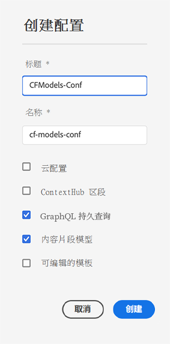

# 内容片段 - 设置 {#content-fragments-setup}

通过 Adobe Experience Manager (AEM) as a Cloud Service 中的内容片段，可为内容做好准备，以供在多个位置和多个渠道上使用。这是 Headless 投放和页面创作的理想之选。

要为您的实例启用内容片段功能，您需要启用：

* **内容片段模型** – 强制

  >[!CAUTION]
  >
  >如果未启用&#x200B;**内容片段模型**，则：
  >
  >* 对于创建模型将无&#x200B;**创建**&#x200B;选项可用。
  >* 您将无法[选择 Sites 配置以创建相关的端点](/help/headless/graphql-api/graphql-endpoint.md)。

* **GraphQL 持久查询** – 可选

设置您的实例的途径是：

* 通过[在配置浏览器中启用功能](#enable-content-fragment-functionality-configuration-browser)
* 然后[将配置应用于您的个别 Assets 文件夹](#apply-the-configuration-to-your-folder)

## 在配置浏览器中启用内容片段功能 {#enable-content-fragment-functionality-configuration-browser}

要使用内容片段模型和 GraphQL 持久查询的内容片段功能，您&#x200B;**必须**&#x200B;首先通过&#x200B;**配置浏览器**&#x200B;启用这些功能：

>[!NOTE]
>
>有关更多详细信息，请参阅[配置浏览器](/help/implementing/developing/introduction/configurations.md#using-configuration-browser)。

>[!NOTE]
>
>[子配置](/help/implementing/developing/introduction/configurations.md#configuration-resolution)（嵌套在另一个配置中的配置）完全支持与内容片段、内容片段模型和 GraphQL 查询一起使用。
>
>请注意：
>
>* 在子配置中创建模型后，无法将模型移动或复制到另一个子配置。
>
>* GraphQL 端点将（仍然）基于父（根）配置。
>
>* 将（仍）保存与父（根）配置相关的持久查询。

1. 导航到&#x200B;**工具**、**常规**，然后打开&#x200B;**配置浏览器**。

1. 使用&#x200B;**“创建”**&#x200B;来打开对话框，您需要：

   1. 指定&#x200B;**标题**。
   1. 创建后，**名称**&#x200B;成为存储库中的节点名称。您可输入名称。如果将该字段留空，则将根据标题自动生成该名称，然后根据 [AEM 命名约定](/help/implementing/developing/introduction/naming-conventions.md)调整该名称；如有必要，可让您调整结果。
   1. 要启用其用法，请选择
      * **内容片段模型**
      * **GraphQL 持久查询**

      

1. 选择&#x200B;**“创建”**&#x200B;以保存定义。

## 将配置应用到文件夹 {#apply-the-configuration-to-your-folder}

为内容片段功能启用了 **global** 配置后，随后该功能即适用于任何 Assets 文件夹 - 可通过 **Assets** 控制台访问这些文件夹。

要将其他配置（因此不包括 global）与类似的 Assets 文件夹一起使用，您必须定义连接。为此，要在相应文件夹的&#x200B;**文件夹属性**&#x200B;的 **Cloud Services** 选项卡中选择相应的&#x200B;**配置**。

