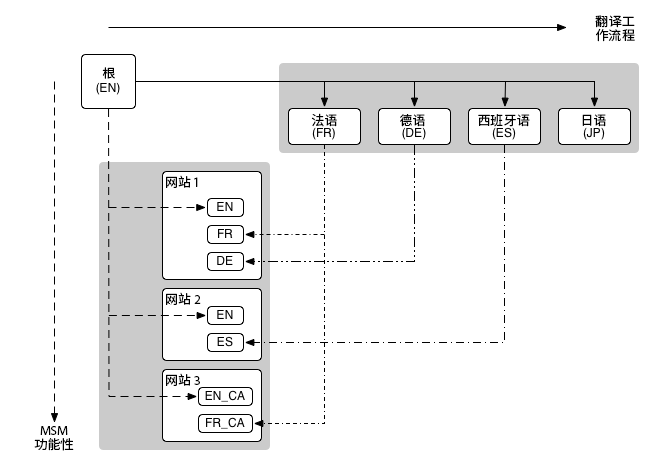

# 多站点管理器与翻译 {#msm-and-translation}

Adobe Experience Manager内置的多站点管理器和翻译工具简化了内容本地化过程。

* 多站点管理器(MSM)及其Live Copy功能允许您在多个位置使用相同的站点内容，同时允许进行以下变量：
   * [重用内容：多站点管理器和Live Copy](msm/overview.md)
* 翻译允许您自动翻译页面内容以创建和维护多语言网站：
   * [翻译多语言站点的内容](translation/overview.md)

这两项功能可以结合使用，以满足[跨国网站和多语言网站](#multinational-and-multilingual-sites)的需求。

## 多国和多语言站点 {#multinational-and-multilingual-sites}

通过组合使用多站点管理器和翻译工作流，您可以高效地为跨国和多语言站点创建内容。

通常，您会使用一种语言和特定国家/地区创建一个主控网站，然后根据需要使用翻译将该内容用作其他网站的基础。

1.  将主控站点翻译成不同的语言。
1. 使用[多站点管理器](msm/overview.md)可以：
   1. 重新使用主控网站及其翻译中的内容，为其他国家和文化创建网站。
   1. 根据需要，分离Live Copy的元素以添加本地化详细信息。

>[!TIP]
>
>将多站点管理器的使用限制为使用一种语言的内容。
>
>例如，使用英语主控为美国、加拿大、英国等地创建页面的英文版本。 页面，并使用法语主控为法国、瑞士、加拿大等地创建法语版页面。

下图说明了主要概念如何交叉（但不显示涉及的所有级别/元素）：

在此类情况和类似情况下，MSM不会管理不同的语言版本。

*  MSM可管理语言边界内将已翻译内容从Blueprint(即全局主控)部署到Live Copy（即本地站点）。
* AEM的[翻译](translation/overview.md)集成功能与第三方翻译管理服务一起管理语言并将内容翻译成这些不同的语言。

对于更高级的用例，也可以跨语言母版使用MSM。

>[!TIP]
>
>对于所有用例，建议阅读以下最佳实践：
>
>* [MSM最佳实践](msm/best-practices.md)
* [翻译最佳实践](translation/best-practices.md)

