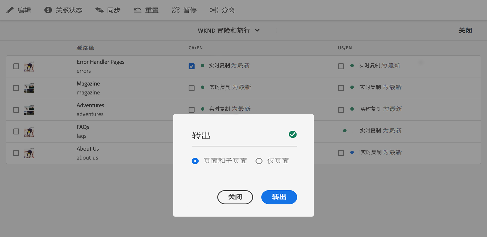

# 创建并同步 Live Copy {#creating-and-synchronizing-live-copies}

您可以从页面或Blueprint配置创建Live Copy，以便在整个站点中重复使用该内容。 管理继承和同步，您可以控制内容更改的传播方式。

## 管理Blueprint配置 {#managing-blueprint-configurations}

Blueprint配置可标识要用作一个或多个Live Copy页面源的现有网站。

>[!TIP]
>
>Blueprint配置允许您将内容更改推送到Live Copy。 请参阅 [Live Copy — 源、Blueprint和Blueprint配置](overview.md#source-blueprints-and-blueprint-configurations).

在创建Blueprint配置时，您需要选择一个模板来定义Blueprint的内部结构。 默认的Blueprint模板假定源网站具有以下特征：

* 网站具有根页面。
* 根的直接子页面是网站的语言分支。 创建Live Copy时，语言将作为可选内容显示，以包含在副本中。
* 每个语言分支的根具有一个或多个子页面。 创建Live Copy时，会显示子页面，以便您可以包含在Live Copy中。

>[!NOTE]
>
>不同的结构需要不同的Blueprint模板。

在创建Blueprint配置后，您可以配置以下属性：

* **名称**:Blueprint配置的名称
* **源路径**:您用作源(Blueprint)的站点的根页面的路径
* **描述**. （可选）Blueprint配置的描述，该描述显示在创建站点时要从中进行选择的Blueprint配置列表中

使用Blueprint配置时，您可以将其与转出配置关联，该转出配置可确定源/Blueprint的Live Copy如何同步。 请参阅 [指定要使用的转出配置](live-copy-sync-config.md#specifying-the-rollout-configurations-to-use).

### 创建和编辑Blueprint配置 {#creating-editing-blueprint-configurations}

Blueprint配置被视为不可变数据，因此在运行时不可编辑。 因此，必须通过Git使用CI/CD管道部署任何配置更改。

有关更多信息，请参阅文章 [对Adobe Experience Manager(AEM)as a Cloud Service的显着更改。](/help/release-notes/aem-cloud-changes.md)

本地开发实例上的管理员只能执行以下步骤以进行测试和开发。 这些选项在任何AEMaaCS云实例中都不可用。

#### 在本地创建Blueprint配置 {#creating-a-blueprint-configuration}

要创建Blueprint配置，请执行以下操作：

1. [导航](/help/sites-cloud/authoring/getting-started/basic-handling.md#global-navigation) 到 **工具** 菜单，然后选择 **站点** 菜单。
1. 选择 **蓝图** 打开 **Blueprint配置** 控制台：

   

1. 选择&#x200B;**创建**。
1. 选择Blueprint模板，然后 **下一个** 继续。
1. 选择要用作Blueprint的源页面；then **下一个** 继续。
1. 定义：

   * **标题**:blueprint的必填标题
   * **描述**:可选描述，用于提供更多详细信息。

1. **创建** 将根据您的规范创建Blueprint配置。

### 在本地编辑或删除Blueprint配置{#editing-or-deleting-a-blueprint-configuration}

您可以编辑或删除现有的Blueprint配置：

1. [导航](/help/sites-cloud/authoring/getting-started/basic-handling.md#global-navigation) 到 **工具** 菜单，然后选择 **站点** 菜单。
1. 选择 **蓝图** 打开 **Blueprint配置** 控制台：

   

1. 选择所需的Blueprint配置 — 相应的操作将在工具栏中变得可用：

   * **属性**;您可以使用它查看和编辑配置的属性。
   * **删除**

## 创建 Live Copy {#creating-a-live-copy}

有多种方法可创建Live Copy。

### 创建页面的Live Copy {#creating-a-live-copy-of-a-page}

您可以创建任何页面或分支的Live Copy。 创建Live Copy时，您可以指定用于同步内容的转出配置：

* 选定的转出配置将应用于Live Copy页面及其子页面。
* 如果未指定任何转出配置，MSM会确定要使用的转出配置。 请参阅 [指定要使用的转出配置](live-copy-sync-config.md#specifying-the-rollout-configurations-to-use).

您可以创建任何页面的Live Copy:

* 由 [Blueprint配置](#creating-a-blueprint-configuration)
* 和与配置无连接的页面
* 另一个Live Copy的页面中的Live Copy([嵌套Live Copy](overview.md#nested-live-copies))

唯一的区别在于 **转出** 源/blueprint页面上的命令取决于Blueprint配置是否引用了源：

* 如果您从源页面创建Live Copy，该页面 **is** 在blueprint配置中引用，则“转出”命令将在源/blueprint页面上可用。
* 如果您从源页面创建Live Copy，该页面 **不是** 在blueprint配置中引用，则“转出”命令在源/blueprint页面上将不可用。

要创建Live Copy，请执行以下操作：

1. 在 **站点** 控制台选择 **创建**，则 **Live Copy**.

   

1. 选择源页面，然后单击或点按 **下一个**. 例如：

   

1. 指定Live Copy的目标路径（打开Live Copy的父文件夹/页面），然后单击或点按 **下一个**.

   

   >[!NOTE]
   >
   >目标路径不能在源路径内。

1. 输入：

   * a **标题** 中。
   * a **名称**，在URL中使用。

   

1. 使用 **排除子页面** 复选框：

   * 已选择：仅创建选定页面的Live Copy（简化Live Copy）
   * 未选择：创建一个包含选定页面的所有子项（深层Live Copy）的Live Copy

1. （可选）要指定要用于Live Copy的一个或多个转出配置，请使用 **转出配置** 下拉列表中选择它们。 选定的配置将显示在下拉选择器下方。
1. 单击或点按&#x200B;**创建**。此时将显示确认消息，您可以从此处选择 **打开** 或 **完成**.

### 从Blueprint配置创建站点的Live Copy {#creating-a-live-copy-of-a-site-from-a-blueprint-configuration}

使用Blueprint配置创建Live Copy ，以基于Blueprint（源）内容创建站点。 从Blueprint配置创建Live Copy时，您需要选择要复制的Blueprint源的一个或多个语言分支，然后从语言分支中选择要复制的章节。 请参阅 [创建Blueprint配置](#creating-a-blueprint-configuration).

如果在Live Copy中忽略某些语言分支，则以后可以添加它们。 请参阅 [在Live Copy中创建Live Copy（Blueprint配置）](#creating-a-live-copy-inside-a-live-copy-blueprint-configuration) 以了解详细信息。

>[!CAUTION]
>
>当Blueprint源包含链接和引用以在其他分支中定位段落时，目标不会在Live Copy页面中更新，而是会保持指向原始目标。

创建网站时，请提供以下属性的值：

* **初始语言**:要包含在Live Copy中的Blueprint源的语言分支
* **初始章节**:要包含在Live Copy中的Blueprint语言分支的子页面
* **目标路径**:Live Copy站点的根页面的位置
* **标题**:Live Copy站点的根页面的标题
* **名称**:（可选）存储Live Copy的根页面的JCR节点的名称（默认值基于标题）
* **网站所有者**:（可选）有关负责Live Copy的一方的信息
* **Live Copy**:选择此选项可与源站点建立实时关系。 如果未选择此选项，则将创建Blueprint的副本，但随后不会与源同步。
* **转出配置**:（可选）选择一个或多个用于同步Live Copy的转出配置。 默认情况下，转出配置继承自Blueprint。 请参阅 [指定要使用的转出配置](live-copy-sync-config.md#specifying-the-rollout-configurations-to-use) 以了解更多详细信息。

要从Blueprint配置创建站点的Live Copy，请执行以下操作：

1. 在 **站点** 控制台，选择 **创建**，则 **网站** 从下拉选择器中。
1. 选择要用作Live Copy源的Blueprint配置，然后继续 **下一个**:

   

1. 使用 **初始语言** 选择器，以指定用于Live Copy的Blueprint站点的语言。

   默认情况下，会选择所有可用语言。 要删除语言，请单击或点按 **X** 显示在语言旁边。

   例如：

   

1. 使用 **初始章节** 下拉列表，选择要包含在Live Copy中的Blueprint部分。 默认情况下，所有可用的章节都包含在内，但可以删除。
1. 提供其余属性的值，然后选择 **创建**. 在确认对话框中，选择 **完成** 返回 **站点** 控制台，或 **打开网站** 打开站点的根页面。

### 在Live Copy中创建Live Copy（Blueprint配置） {#creating-a-live-copy-inside-a-live-copy-blueprint-configuration}

在现有Live Copy中创建Live Copy（使用Blueprint配置创建）时，可以插入最初创建Live Copy时未包含的任何语言副本或章节。

## 监控Live Copy {#monitoring-your-live-copy}

### 查看Live Copy的状态 {#seeing-the-status-of-a-live-copy}

Live Copy页面的属性显示有关Live Copy的以下信息：

* **来源**:Live Copy页面的源页面
* **状态**:Live Copy的同步状态，包括Live Copy是否与源保持最新、上次同步发生的时间以及执行同步的人员
* **配置**:

   * 页面是否仍受Live Copy继承的约束
   * 配置是否继承自父页面
   * Live Copy使用的任何转出配置

要查看属性，请执行以下操作：

1. 在 **站点** 控制台中，选择Live Copy页面并打开属性。
1. 选择 **Live Copy** 选项卡。

   例如：

   

   请参阅部分 [使用Live Copy概述](live-copy-overview.md#using-the-live-copy-overview) ，以了解更多详细信息。

### 查看Blueprint页面的Live Copy {#seeing-the-live-copies-of-a-blueprint-page}

Blueprint页面（在Blueprint配置中引用）为您提供了使用当前(Blueprint)页面作为源的Live Copy页面列表。 使用此列表可跟踪Live Copy。 该列表显示在 **Blueprint** 选项卡 [页面属性](/help/sites-cloud/authoring/fundamentals/page-properties.md).

## 同步Live Copy {#synchronizing-your-live-copy}

有多种方法可同步您的Live Copy。

### 推出Blueprint {#rolling-out-a-blueprint}

展开Blueprint页面以将内容更改推送到Live Copy。 A **转出** 操作会执行使用 [转出时](live-copy-sync-config.md#rollout-triggers) 触发器。

>[!NOTE]
>
>如果在Blueprint分支和从属Live Copy分支中创建具有相同页面名称的新页面，则可能会发生冲突。
>
>此类 [在转出时需要处理和解决冲突](rollout-conflicts.md).

#### 从页面属性中转出Blueprint {#rolling-out-a-blueprint-from-page-properties}

1. 在 **站点** 控制台中，选择Blueprint中的页面并打开属性。
1. 打开 **Blueprint** 选项卡。
1. 选择 **转出**.

   

1. 指定页面和任何子页面，然后使用复选标记进行确认：

   

1. 指定是否应立即执行转出作业(**现在**)或在其他日期/时间(**稍后**)。

   

转出将作为异步作业处理，并可在 [***异步作业状态** 页面。](/help/operations/asynchronous-jobs.md#monitor-the-status-of-asynchronous-operations)

#### 从参考边栏中推出Blueprint {#roll-out-a-blueprint-from-the-reference-rail}

1. 在 **站点** 控制台中，选择live copy中的页面并打开 **[引用](/help/sites-cloud/authoring/getting-started/basic-handling.md#references)** 面板（从工具栏中）。
1. 选择 **Blueprint** 选项来显示与此页面关联的蓝图。
1. 从列表中选择所需的Blueprint。
1. 单击或点按 **转出**.

   

1. 系统将要求您确认转出的详细信息：

   * **转出范围**:

      指定范围是仅针对所选页面，还是应包含子页面。

   * **计划**：

      指定是否应立即执行转出作业(**现在**)或稍后的日期/时间(**稍后**)。

      

1. 确认这些详细信息后，选择 **转出** 以执行操作。

转出将作为异步作业处理，并可在 [**异步作业状态** 页面。](/help/operations/asynchronous-jobs.md#monitor-the-status-of-asynchronous-operations)

#### 从Live Copy概述中推出Blueprint {#roll-out-a-blueprint-from-the-live-copy-overview}

的 [**转出** 操作也可在Live Copy概述中找到](live-copy-overview.md#using-the-live-copy-overview)，时。

1. 打开 [Live Copy概述](live-copy-overview.md#using-the-live-copy-overview) ，然后选择Blueprint页面。
1. 选择 **转出** 中。

   

1. 指定页面和任何子页面，然后使用复选标记进行确认：

   

1. 指定是否应立即执行转出作业(**现在**)或在其他日期/时间(**稍后**)。

   

转出将作为异步作业处理，并可在 [**异步作业状态** 页面。](/help/operations/asynchronous-jobs.md#monitor-the-status-of-asynchronous-operations)

### 同步Live Copy {#synchronizing-a-live-copy}

同步Live Copy页面，以将内容更改从源提取到Live Copy。

#### 从页面属性同步Live Copy {#synchronize-a-live-copy-from-page-properties}

同步Live Copy以将更改从源提取到Live Copy。

>[!NOTE]
>
>同步会执行使用 [转出时](live-copy-sync-config.md#rollout-triggers) 触发器。

1. 在 **站点** 控制台中，选择Live Copy页面并打开属性。
1. 打开 **Live Copy** 选项卡。
1. 单击或点按 **同步**.

   

   将请求确认，使用 **同步** 以继续。

#### 从Live Copy中同步Live Copy概述 {#synchronize-a-live-copy-from-the-live-copy-overview}

的 [Live Copy概述中还提供了“同步”操作](live-copy-overview.md#using-the-live-copy-overview)，在选择Live Copy页面时。

1. 打开 [Live Copy概述](live-copy-overview.md#using-the-live-copy-overview) ，然后选择Live Copy页面。
1. 选择 **同步** 中。
1. 确认 **转出** 指定是否要包含后，在对话框中执行操作：

   * **页面和子页面**
   * **仅页面**

   

## 更改Live Copy内容 {#changing-live-copy-content}

要更改Live Copy内容，您可以：

* 将段落添加到页面。
* 通过中断任何页面或组件的Live Copy继承来更新现有内容。

>[!TIP]
>
>如果您在Live Copy中手动创建新页面，则新页面是Live Copy的本地页面，这意味着该页面没有相应的源页面附加到该页面。
>
>创建属于关系一部分的本地页面的最佳做法是在源中创建本地页面并执行深层转出。 这将在本地将页面创建为Live Copy。

>[!NOTE]
>
>如果在Blueprint分支和从属Live Copy分支中创建具有相同页面名称的新页面，则可能会发生冲突。
>
>此类 [在转出时需要处理和解决冲突](rollout-conflicts.md).

### 将组件添加到Live Copy页面 {#adding-components-to-a-live-copy-page}

您可以随时将组件添加到Live Copy页面。 Live Copy及其段落系统的继承状态无法控制您添加组件的功能。

将Live Copy页面与源页面同步后，添加的组件将保持不变。 另请参阅 [更改Live Copy页面上组件的顺序。](#changing-the-order-of-components-on-a-live-copy-page)

>[!TIP]
>
>在本地对标记为容器的组件所做的更改将不会被转出中Blueprint的内容覆盖。 请参阅 [MSM最佳实践](best-practices.md#components-and-container-synchronization) 以了解更多信息。

### 暂停页面的继承 {#suspending-inheritance-for-a-page}

创建Live Copy时， Live Copy配置会保存在复制页面的根页面上。 根页面的所有子页面都将继承Live Copy配置。 Live Copy页面上的组件也会继承Live Copy配置。

您可以暂停Live Copy页面的Live Copy继承，以便更改页面属性和组件。 暂停继承时，页面属性和组件不再与源同步。

>[!TIP]
>
>您还可以 [分离Live Copy](#detaching-a-live-copy) 从其blueprint中删除所有连接。 与暂停继承不同，分离操作是永久的，不可撤销的。

#### 暂停页面属性中的继承 {#suspending-inheritance-from-page-properties}

要暂停页面上的继承，请执行以下操作：

1. 使用 **查看属性** 命令 **站点** 控制台或使用 **页面信息** 中。
1. 单击或点按 **Live Copy** 选项卡。
1. 选择 **暂停** 中。 然后，您可以选择以下任一项：

   * **暂停**:仅暂停当前页面。
   * **暂停（包含子项）**:将当前页面与任何子页面一起暂停。

1. 选择 **暂停** 在确认对话框中。

#### 暂停Live Copy中的继承概述 {#suspending-inheritance-from-the-live-copy-overview}

的 [Live Copy概述中还提供了暂停操作](live-copy-overview.md#using-the-live-copy-overview)，在选择Live Copy页面时。

1. 打开 [Live Copy概述](live-copy-overview.md#using-the-live-copy-overview) ，然后选择Live Copy页面。
1. 选择 **暂停** 中。
1. 从以下位置选择相应的选项：

   * **暂停**
   * **与子项一起暂停**

   

1. 确认 **暂停** 中的操作 **暂停Live Copy** 对话框：

   

### 恢复页面的继承 {#resuming-inheritance-for-a-page}

暂停页面的Live Copy继承是一项临时操作。 一旦暂停 **恢复** 操作将变为可用，允许您恢复实时关系。

重新启用继承时，页面不会自动与源同步。 如果需要，您可以请求同步：

* 在 **恢复**/**还原** 对话；例如：

   

* 在稍后阶段，通过手动选择同步操作。

>[!NOTE]
>
>重新启用继承时，页面不会自动与源同步。 如果需要，您可以在恢复时或稍后手动请求同步。

#### 恢复页面属性的继承 {#resuming-inheritance-from-page-properties}

一次 [暂停](#suspending-inheritance-from-page-properties) the **恢复** 操作将变为页面属性的工具栏中：

选择后，将显示对话框。 您可以根据需要选择同步，然后确认操作。

#### 从Live Copy概述中恢复Live Copy页面 {#resume-a-live-copy-page-from-the-live-copy-overview}

的 [Live Copy概述中还提供了恢复操作](live-copy-overview.md#using-the-live-copy-overview)，在选择Live Copy页面时。

1. 打开 [Live Copy概述](live-copy-overview.md#using-the-live-copy-overview) 并选择一个已暂停的Live Copy页面。 页面将显示为 **继承已取消**.
1. 选择 **恢复** 中。
1. 指示是否要在还原继承后同步页面，然后确认 **恢复** 中的操作 **恢复Live Copy** 对话框。

### 更改继承深度（浅层/深层） {#changing-inheritance-depth-shallow-deep}

在现有Live Copy中，您可以更改页面的深度，即是否包含子页面。

* 切换到浅层Live Copy:

   * 将立即生效，并且不可撤销。

   * 从Live Copy中显式分离子页面。 如果撤消，则无法保留对子项的进一步修改。

   * 将删除任何子体 `LiveRelationships` 即使存在嵌套 `LiveCopies`.

* 切换到深层Live Copy:

   * 保持子页面不变。
   * 要了解交换机的效果，您可以进行转出，任何内容修改都将根据转出配置进行应用。

* 切换到浅层Live Copy，然后返回深层：

   * 将（以前称为）浅层Live Copy的所有子项都视为已手动创建，因此会使用 `[oldname]_msm_moved name`.

要指定或更改深度，请执行以下操作：

1. 使用 **查看属性** 命令 **站点** 控制台或使用 **页面信息** 中。
1. 单击或点按 **Live Copy** 选项卡。
1. 在 **配置** 设置或清除 **Live Copy继承** 选项，具体取决于是否包含子页面：

   * 选中 — 深层Live Copy（包含子页面）
   * 未选中 — 浅层Live Copy（排除子页面）

   >[!CAUTION]
   >
   >切换到浅层Live Copy将立即生效，并且是不可撤销的。
   >
   >请参阅 [Live Copy — 合成](overview.md#live-copies-composition) 以了解更多信息。

1. 单击或点按 **保存** 以保留更新。

### 取消组件的继承 {#cancelling-inheritance-for-a-component}

取消组件的Live Copy继承，以便该组件不再与源组件同步。 如果需要，您可以稍后启用继承。

>[!NOTE]
>
>重新启用继承时，组件不会自动与源同步。 如果需要，您可以手动请求同步。

取消继承以更改组件内容或删除组件：

1. 单击或点按要取消继承的组件。

   

1. 在组件工具栏上，单击或点按 **取消继承** 图标。

   

1. 在“取消继承”对话框中，通过 **是**.

   组件工具栏已更新以包含所有（相应）编辑命令。

### 为组件重新启用继承 {#re-enabling-inheritance-for-a-component}

要为组件启用继承，请单击或点按 **重新启用继承** 图标。

### 更改Live Copy页面上组件的顺序 {#changing-the-order-of-components-on-a-live-copy-page}

如果Live Copy包含属于段落系统的组件，则该段落系统的继承遵循以下规则：

* 即使已建立继承，也可以修改继承段落系统中组件的顺序。
* 转出后，组件的顺序将从Blueprint中恢复。 如果在转出之前已将新组件添加到Live Copy，则会对它们以及上面添加这些组件的组件进行重新排序。
* 如果取消段落系统的继承，组件的顺序将在转出时不会恢复，并将保持在Live Copy中的原样。

>[!NOTE]
>
>在段落系统上还原已取消的继承时，组件的顺序 **不会自动恢复** 从蓝图中。 如果需要，您可以手动请求同步。

请按照以下过程取消段落系统的继承。

1. 打开Live Copy页面。
1. 将现有组件拖动到页面上的新位置。
1. 在 **取消继承** 对话框，确认操作 **是**.

### 覆盖Live Copy页面的属性 {#overriding-properties-of-a-live-copy-page}

默认情况下，Live Copy页面的页面属性会从源页面继承，并且不可编辑。

当您需要更改Live Copy的属性值时，可以取消属性的继承。 链接图标表示已为属性启用继承。

取消继承时，可以更改属性值。 断开链接图标表示继承已取消。

您稍后可以根据需要为属性重新启用继承。

>[!NOTE]
>
>重新启用继承后，Live Copy页面属性不会自动与源属性同步。 如果需要，您可以手动请求同步。

1. 使用 **查看属性** 的 **站点** 控制台或 **页面信息** 图标。
1. 要取消属性的继承，请单击或点按资产右侧显示的链接图标。

   

1. 在 **取消继承** 确认对话框，单击或点按 **是**.

### 还原Live Copy页面的属性 {#revert-properties-of-a-live-copy-page}

要启用属性的继承，请单击或点按 **还原继承** 图标。

### 重置Live Copy页面 {#resetting-a-live-copy-page}

您可以重置Live Copy页面，以：

* 删除所有继承取消和
* 将页面返回到与源页面相同的状态。

重置会影响您对页面属性、段落系统和组件所做的更改。

#### 从“页面属性”中重置Live Copy页面 {#reset-a-live-copy-page-from-the-page-properties}

1. 在 **站点** 控制台中，选择Live Copy页面，然后选择 **查看属性**.
1. 打开 **Live Copy** 选项卡。
1. 选择 **重置** 中。

   

1. 在 **重置Live Copy** 对话框，通过确认 **重置**.

#### 从Live Copy概述中重置Live Copy页面 {#reset-a-live-copy-page-from-the-live-copy-overview}

的 [**重置** 操作也可在Live Copy概述中找到](live-copy-overview.md#using-the-live-copy-overview)，在选择Live Copy页面时。

1. 打开 [Live Copy概述](live-copy-overview.md#using-the-live-copy-overview) ，然后选择Live Copy页面。
1. 选择 **重置** 中。
1. 确认 **重置** 中的操作 **重置Live Copy** 对话框：

   

## 比较Live Copy页面与Blueprint页面 {#comparing-a-live-copy-page-with-a-blueprint-page}

要跟踪您所做的更改，您可以在 **引用** 并将其与其Live Copy页面进行比较：

1. 在 **站点** 控制台， [导航到Blueprint或Live Copy页面并将其选中。](/help/sites-cloud/authoring/getting-started/basic-handling.md#viewing-and-selecting-resources)
1. 打开 **[引用](/help/sites-cloud/authoring/getting-started/basic-handling.md#references)** 面板，根据上下文选择以下选项之一：

   * **Blueprint**
   * **Live Copy**

1. 根据上下文选择您的特定Live Copy ，然后选择以下任一选项：

   * **与 Blueprint 比较**
   * **与 Live Copy 比较**

   例如：

   

1. Live Copy和Blueprint页面将并排打开。

   有关使用比较功能的完整信息，请参阅 [页面差异](/help/sites-cloud/authoring/features/page-diff.md).

## 分离Live Copy {#detaching-a-live-copy}

“分离”操作会永久删除Live Copy及其源/Blueprint页面之间的Live关系。 所有与MSM相关的属性都将从Live Copy中删除，并且Live Copy页面将成为独立副本。

>[!CAUTION]
>
>在分离Live Copy后，无法恢复Live关系。
>
>要删除与以后恢复的选项的实时关系，您可以 [取消Live Copy继承](#suspending-inheritance-for-a-page) 中。

在您使用的树中的位置会产生影响 **分离**:

* **在Live Copy的根页面上分离**

   在Live Copy的根页面上执行此操作时，会删除Blueprint的所有页面与其Live Copy之间的Live关系。

   对Blueprint中的页面进行进一步更改 **将不会** 会影响Live Copy。

* **在Live Copy的子页面上分离**

   在Live Copy的子页面（或分支）上执行此操作时：

   * 将删除该子页面（或分支）的实时关系，并
   * Live Copy分支中的（子）页面会被视为已手动创建。

   但是，子页面仍受父分支的实时关系的约束，因此进一步转出Blueprint页面将同时执行以下操作：

   1. 重命名分离的页面：

      * 这是因为MSM将它们视为手动创建的页面，这些页面会导致冲突，因为它们的名称与其尝试创建的Live Copy页面的名称相同。
   1. 使用原始名称创建新的Live Copy页面，其中包含转出中的更改。

   >[!NOTE]
   >
   >请参阅 [MSM转出冲突](rollout-conflicts.md) 详细了解这些情况。

### 在页面属性中分离Live Copy页面 {#detach-a-live-copy-page-from-the-page-properties}

要分离Live Copy，请执行以下操作：

1. 在 **站点** 控制台中，选择Live Copy页面，然后单击或点按 **查看属性**.
1. 打开 **Live Copy** 选项卡。
1. 在工具栏中，选择 **分离**.

   

1. 将显示确认对话框，选择 **分离** 以完成操作。

### 在Live Copy概述中分离Live Copy页面 {#detach-a-live-copy-page-from-the-live-copy-overview}

的 [Live Copy概述中还提供了“分离”操作](live-copy-overview.md#using-the-live-copy-overview)，在选择Live Copy页面时。

1. 打开 [Live Copy概述](live-copy-overview.md#using-the-live-copy-overview) ，然后选择Live Copy页面。
1. 选择 **分离** 中。
1. 确认 **分离** 中的操作 **分离Live Copy** 对话框：

   
