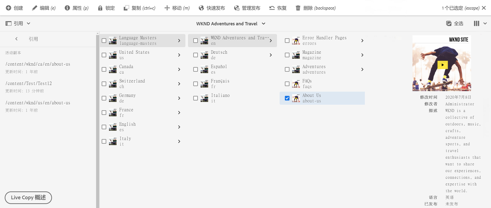
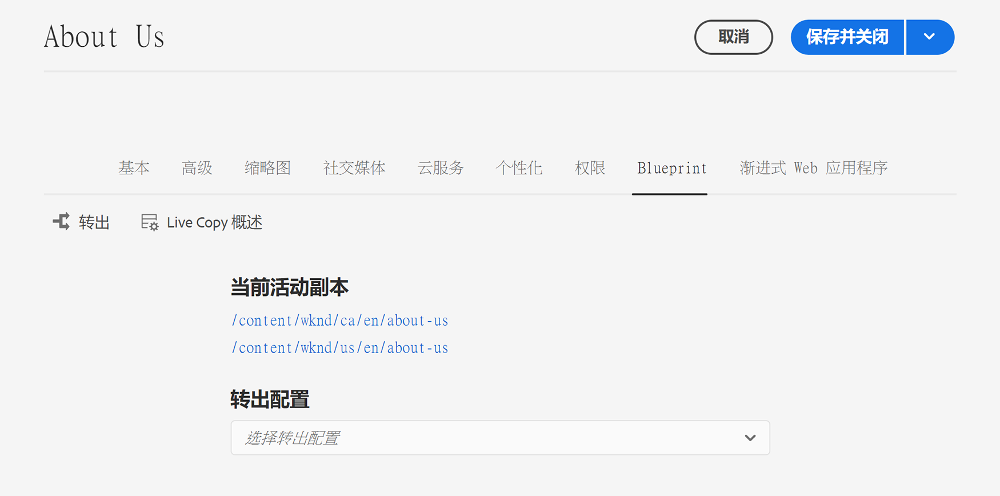
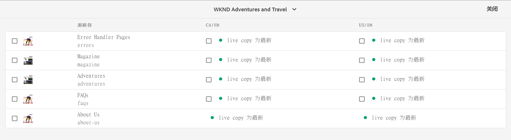
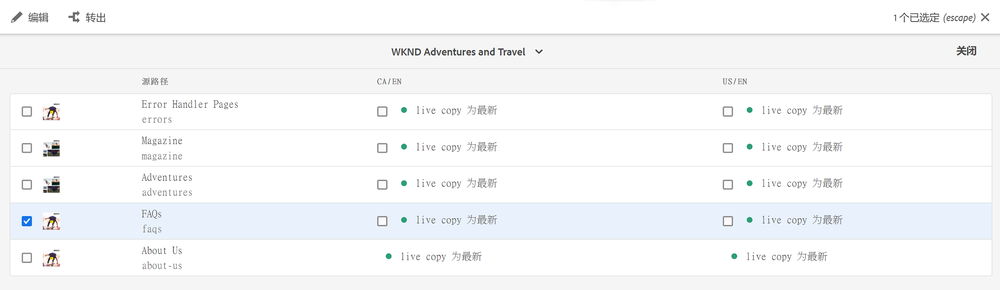
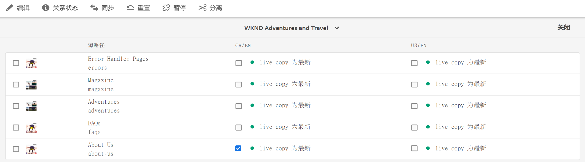
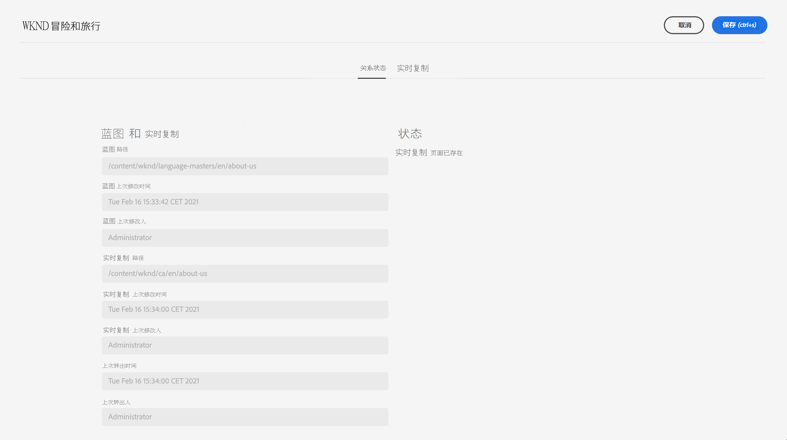
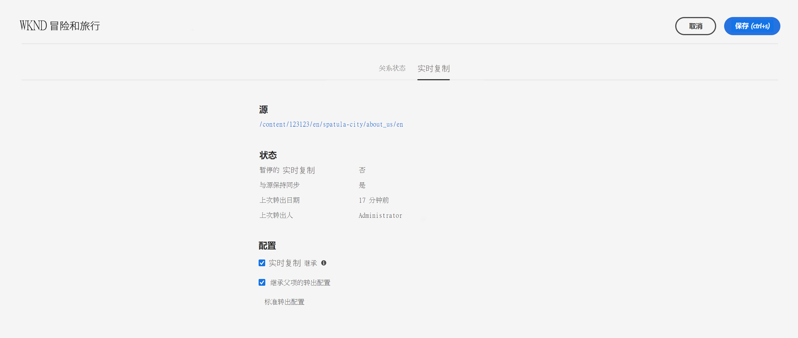

# Live Copy概述控制台 {#live-copy-overview-console}

通过&#x200B;**Live Copy概述**&#x200B;控制台，您可以：

* 查看/管理站点中的继承。
   * 查看Blueprint树和相应的Live Copy结构及其继承状态
   * 更改继承状态，如暂停和恢复
   * 查看Blueprint和Live Copy属性
* 执行转出操作。

## 打开Live Copy概述 {#opening-the-live-copy-overview}

您可以从以下位置打开Live Copy概述：

* [Blueprint页面（站点控制台）的引用侧面板](#opening-live-copy-overview-references-for-a-blueprint-page)
* [Blueprint页面的属性](#opening-live-copy-overview-properties-of-a-blueprint-page)

### 对Blueprint页面的引用 {#references-to-a-blueprint-page}

**Live Copy概述**&#x200B;可以从&#x200B;**Sites**&#x200B;控制台的&#x200B;**References**&#x200B;侧面板中打开：

1. 在&#x200B;**站点**&#x200B;控制台中， [导航到您的Blueprint页面并将其选中。](/help/sites-cloud/authoring/getting-started/basic-handling.md#viewing-and-selecting-resources)
1. 打开&#x200B;**[References](/help/sites-cloud/authoring/getting-started/basic-handling.md#references)**&#x200B;边栏，然后选择&#x200B;**Live Copy**。

   

   >[!TIP]
   >
   >您还可以先打开引用，然后选择Blueprint。

1. 选择&#x200B;**Live Copy概述**&#x200B;以显示和使用与选定Blueprint相关的所有Live Copy的概述。
1. 使用&#x200B;**Close**&#x200B;退出并返回到&#x200B;**Sites**&#x200B;控制台。

### Blueprint页面的属性 {#properties-of-a-blueprint-page}

在查看Blueprint页面的属性时，可以打开&#x200B;**Live Copy概述**:

1. 打开相应Blueprint页面的&#x200B;**属性** 。
1. 打开&#x200B;**Blueprint**&#x200B;选项卡 — **Live Copy概述**&#x200B;选项将显示在顶部工具栏中：

   

1. 选择&#x200B;**Live Copy概述**&#x200B;以显示和使用与当前Blueprint相关的所有Live Copy的概述。

1. 使用&#x200B;**Close**&#x200B;退出并返回到&#x200B;**Sites**&#x200B;控制台。

## 使用Live Copy概述 {#using-the-live-copy-overview}

**Live Copy概述**&#x200B;窗口提供并概述与选定页面相关的Live Copy的状态。

转出取决于在特定转出配置中定义的同步操作。 某些操作取决于对内容的修改。 但是，还有许多操作不依赖于对内容的修改，而依赖于页面激活等事件。 此类事件不会修改内容，而是会修改与内容相关的内部属性。

状态字段还取决于特定转出配置中定义的同步操作，并指示自上次成功转出以来Blueprint或Live Copy是否存在任何此类操作。 状态字段将仅反映特定转出配置中的操作。 如果尚未对Live Copy执行任何成功转出，则状态将始终显示为最新。

例如，转出配置被定义为`targetActivate`。 因此，转出将仅依赖于激活事件。 状态字段将仅指示自上次成功转出后是否发生了任何激活事件。

**Live Copy概述**&#x200B;还可用于对Live Copy执行以下操作：

1. 打开&#x200B;**Live Copy概述**。
1. 选择所需的Blueprint或Live Copy页面，此时工具栏将更新以显示可用的操作。 可用的[操作](overview.md#terms-used)取决于您是选择[blueprint](#actions-for-a-blueprint-page)还是[Live Copy](#actions-for-a-live-copy-page)页面。

### Blueprint页面的操作 {#actions-for-a-blueprint-page}

选择Blueprint页面时，可以执行以下操作：

* **编辑**  — 打开Blueprint页面进行编辑。
* **[转出](overview.md#rollout-and-synchronize)**  — 执行转出以将更改从源推送到Live Copy。

### Live Copy页面的操作 {#actions-for-a-live-copy-page}

选择Live Copy页面时，可以执行以下操作：

* **编辑**  — 打开Live Copy页面进行编辑。
* **[关系状态](#relationship-status)**  — 查看有关状态和继承的信息。
* **[同步](overview.md#rollout-and-synchronize)**  — 同步Live Copy以将更改从源提取到Live Copy。
* **[重置](creating-live-copies.md#resetting-a-live-copy-page)**  — 重置Live Copy页面可删除所有继承取消，并将页面返回到与源页面相同的状态。
* **[暂停](overview.md#suspending-and-cancelling-inheritance-and-synchronization)**  — 暂时停用Live Copy及其Blueprint页面之间的Live关系。
* **[恢复](creating-live-copies.md#resuming-inheritance-for-a-page)**  — 恢复可用于恢复已暂停的关系。
* **[分离](overview.md#detaching-a-live-copy)**  — 永久删除Live Copy及其Blueprint页面之间的Live关系。

## 关系状态 {#relationship-status}

**关系状态**&#x200B;控制台具有两个选项卡，提供了一系列功能。

* [关系状态](#relationship-status-tab)
* [Live Copy](#live-copy-tab)

### 关系状态 {#relationship-status-tab}

此选项卡提供了有关Blueprint与Live Copy之间关系状态的详细信息。

### Live Copy {#live-copy-tab}

利用此选项卡，可查看和编辑Live Copy配置。

