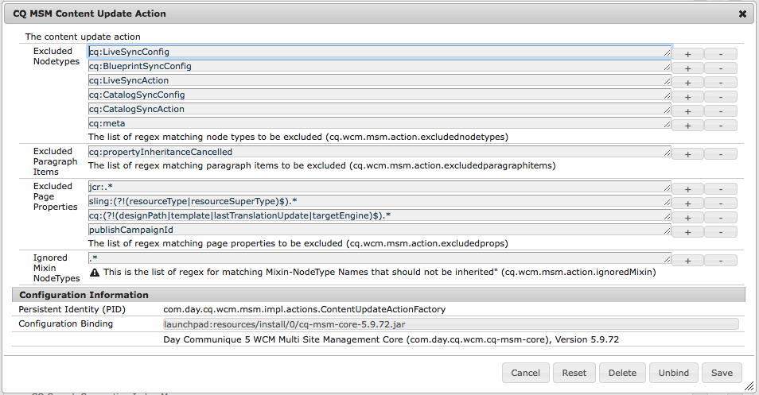
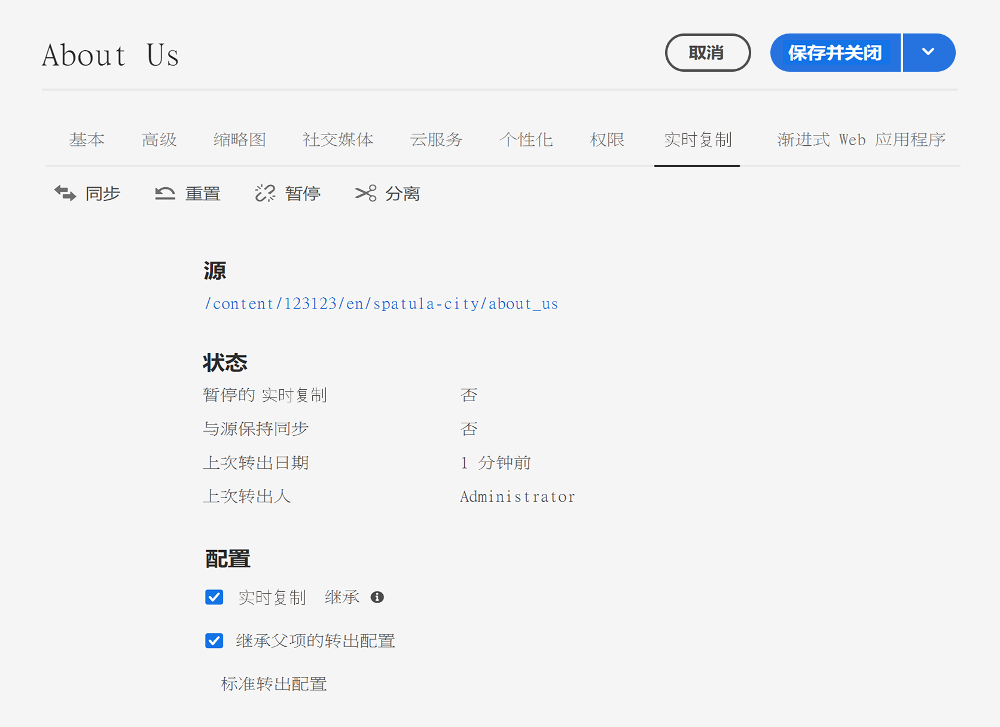
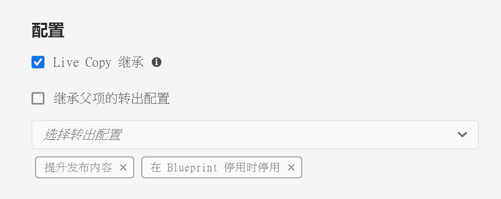

# 配置 Live Copy 同步 {#configuring-live-copy-synchronization}

Adobe Experience Manager 提供了大量现成的同步配置。在使用 Live Copy 之前，您应考虑以下内容来定义 Live Copy 与其源内容同步的方式和时间。

1. 确定现有转出配置是否满足您的要求
1. 如果现有转出配置未满足您的要求，请决定是否需要创建自己的转出配置。
1. 指定要用于 Live Copy 的转出配置。

## 已安装的自定义转出配置 {#installed-and-custom-rollout-configurations}

本部分提供有关已安装转出配置、其所使用的同步操作以及如何在需要时创建自定义配置的信息。

>[!CAUTION]
>
>建议&#x200B;**不要**&#x200B;更新或更改现成的转出配置。如果需要自定义实时操作，则应将其添加到自定义转出配置中。

### 转出触发器 {#rollout-triggers}

每个转出配置都使用一个可执行转出的转出触发器。转出配置可以使用以下触发器之一：

* **转出**：在 Blue Print 页面上使用&#x200B;**转出**&#x200B;命令，或者在 Live Copy 页面上使用&#x200B;**同步**&#x200B;命令。
* **修改**：修改源页面。
* **激活**：激活源页面。
* **停用**：停用源页面。

>[!NOTE]
>
>使用&#x200B;**修改**&#x200B;触发器可能会影响性能。请参阅 [MSM 最佳实践](best-practices.md#onmodify)以了解更多信息。

### 转出配置 {#rollout-configurations}

下表列出了随 AEM 一起提供的现成的转出配置。该表包含每个转出配置的触发器和同步操作。

<!--
If the installed rollout configuration actions do not meet your requirements, you can [create a new rollout configuration](#creating-a-rollout-configuration).
-->

| 名称 | 描述 | 触发器 | [同步操作](#synchronization-actions) |
|---|---|---|---|
| 标准转出配置 | 标准转出配置，允许在触发转出时启动转出流程，并执行以下操作：创建、更新、删除内容和对子节点进行排序 | 转出 | `contentUpdate` `contentCopy` `contentDelete` `referencesUpdate` `productUpdate` `orderChildren` |
| 在 Blueprint 激活时激活 | 在发布源时发布 Live Copy | 激活 | `targetActivate` |
| 在 Blueprint 停用时停用 | 在停用源时停用 Live Copy | 停用 | `targetDeactivate` |
| 修改时推送 | 修改源时将内容推送到 Live Copy 谨慎使用此转出配置，因为它使用“修改”触发器。 | 修改 | `contentUpdate` `contentCopy` `contentDelete` `referencesUpdate` `orderChildren` |
| 修改时推送（简略） | 修改 Blueprint 页面时将内容推送到 Live Copy，而不更新引用 谨慎使用此转出配置，因为它使用“修改”触发器。 | 修改 | `contentUpdate` `contentCopy` `contentDelete` `orderChildren` |
| 提升启动项 | 用于提升启动项页面的标准转出配置。 | 转出 | `contentUpdate` `contentCopy` `contentDelete` `referencesUpdate` `orderChildren` `markLiveRelationship` |

### 同步操作 {#synchronization-actions}

下表列出了随 AEM 一起提供的现成的同步操作。

<!--If the installed actions do not meet your requirements, you can [Create a New Synchronization Action](/help/sites-developing/extending-msm.md#creating-a-new-synchronization-action).-->

| 操作名称 | 描述 | 属性 |
|---|---|---|
| `contentCopy` | 当源节点在 Live Copy 上不存在时，此操作会将节点复制到 Live Copy。[配置 **CQ MSM 内容复制操作**&#x200B;服务](#excluding-properties-and-node-types-from-synchronization)，以指定要排除的节点类型、段落项和页面属性。 |  |
| `contentDelete` | 此操作删除源上不存在的 Live Copy 的节点。[配置 **CQ MSM 内容删除操作**&#x200B;服务](#excluding-properties-and-node-types-from-synchronization)，以指定要排除的节点类型、段落项和页面属性。 |  |
| `contentUpdate` | 此操作使用来自源的更改来更新 Live Copy 内容。[配置 **CQ MSM 内容更新操作**&#x200B;服务](#excluding-properties-and-node-types-from-synchronization)，以指定要排除的节点类型、段落项和页面属性。 |  |
| `editProperties` | 此操作编辑 Live Copy 的属性。`editMap` 属性确定编辑哪些属性及其值。`editMap` 属性的值必须采用以下格式： `[property_name_n]#[current_value]#[new_value]` `current_value` 和 `new_value` 是正则表达式，`n` 是递增整数。 例如，考虑 `editMap` 的以下值： `sling:resourceType#/(contentpage`‖`homepage)#/mobilecontentpage,cq:template#/contentpage#/mobilecontentpage` 此值编辑 Live Copy 节点的属性，如下所示：将设置为 `contentpage` 或 `homepage` 的  `sling:resourceType` 属性设置为 `mobilecontentpage`。 将设置为 `contentpage` 的 `cq:template` 属性设置为 `mobilecontentpage`。 | `editMap: (String)` 标识属性、当前值和新值。有关更多信息，请参阅描述。 |
| `notify` | 此操作发送已转出的页面的页面事件。要接收通知，首先需要订阅转出事件。 |  |
| `orderChildren` | 此操作根据 Blueprint 上的顺序对子节点进行排序。 |  |
| `referencesUpdate` | 此同步操作会更新 Live Copy 上的引用。 它将搜索 Live Copy 页面中指向 Blueprint 内资源的路径。找到后，它会更新路径以指向 Live Copy 内的相关资源。具有 Blueprint 外部目标的引用不会发生更改。 [配置 **CQ MSM 引用更新操作**&#x200B;服务](#excluding-properties-and-node-types-from-synchronization)，以指定要排除的节点类型、段落项和页面属性。 |  |
| `targetVersion` | 此操作创建 Live Copy 的版本。 此操作必须是转出配置中包含的唯一同步操作。 |  |
| `targetActivate` | 此操作激活 Live Copy。 此操作必须是转出配置中包含的唯一同步操作。 |  |
| `targetDeactivate` | 此操作停用 Live Copy。 此操作必须是转出配置中包含的唯一同步操作。 |  |
| `workflow` | 此操作启动由 Target 属性定义的工作流（仅适用于页面），并将 Live Copy 作为有效负载。 目标路径是模型节点的路径。 | `target: (String)` 是工作流模型的路径。 |
| `mandatory` | 此操作为特定用户组将 Live Copy 页面上多个 ACL 的权限设置为只读。配置以下 ACL： `ActionSet.ACTION_NAME_REMOVE` `ActionSet.ACTION_NAME_SET_PROPERTY` `ActionSet.ACTION_NAME_ACL_MODIFY` 仅对页面使用此操作。 | `target: (String)` 是要为其设置权限的组的 ID。 |
| `mandatoryContent` | 此操作为特定用户组将 Live Copy 页面上多个 ACL 的权限设置为只读。配置以下 ACL： `ActionSet.ACTION_NAME_SET_PROPERTY` `ActionSet.ACTION_NAME_ACL_MODIFY` 仅对页面使用此操作。 | `target: (String)` 是要为其设置权限的组的 ID。 |
| `mandatoryStructure` | 此操作为特定用户组将 Live Copy 页面上 `ActionSet.ACTION_NAME_REMOVE` ACL 的权限设置为只读。 仅对页面使用此操作。 | `target: (String)` 是要为其设置权限的组的 ID。 |
| `VersionCopyAction` | 如果已至少发布过一次 Blueprint/源页面，则使用发布的版本创建 Live Copy 页面。注意：此操作仅适用于基于已发布的源页面创建 Live Copy 页面，而不能用于更新现有的 Live Copy 页面。 |  |
| `PageMoveAction` | 当页面在 Blueprint 中移动时将应用 `PageMoveAction`。 该操作会将（相关的）Live Copy 页面从移动前的位置复制到移动后的位置，而不是移动页面。 `PageMoveAction` 不会更改位于移动前位置的 Live Copy 页面。因此，对于连续转出配置，它具有不带 Blueprint 的实时关系状态。 [配置 **CQ MSM 页面移动操作**&#x200B;服务](#excluding-properties-and-node-types-from-synchronization)，以指定要排除的节点类型、段落项和页面属性。 此操作必须是转出配置中包含的唯一同步操作。 | 将 `prop_referenceUpdate: (Boolean)` 设置为 true（默认）可更新引用。 |
| `markLiveRelationship` | 此操作指示启动项创建的内容存在实时关系。 |  |

<!--
### Creating a Rollout Configuration {#creating-a-rollout-configuration}

You can [create a rollout configuration](/help/sites-developing/extending-msm.md#creating-a-new-rollout-configuration) when the installed rollout configurations do not meet your application requirements by performing the following steps.

1. [Create the rollout configuration](/help/sites-developing/extending-msm.md#create-the-rollout-configuration).
1. [Add synchronization actions to the rollout configuration](/help/sites-developing/extending-msm.md#add-synchronization-actions-to-the-rollout-configuration).

The new rollout configuration is then available to you when configuring rollout configurations on a blueprint or Live Copy page.
-->

### 从同步中排除属性和节点类型 {#excluding-properties-and-node-types-from-synchronization}

您可以配置多个支持相应同步操作的 OSGi 服务，以便它们不会影响特定的节点类型和属性。例如，许多与 AEM 内部功能相关的属性和子节点不应包含在 Live Copy 中。只应复制与页面用户相关的内容。

使用 AEM 时，可通过多种方法管理此类服务的配置设置。请参阅[配置 OSGi](/help/implementing/deploying/configuring-osgi.md)，以了解更多详细信息和建议的做法。

下表列出了可以为其指定要排除节点的同步操作。该表提供了要使用 Web 控制台进行配置的服务名称以及要使用存储库节点进行配置的 PID。

| 同步操作 | Web 控制台中的服务名称 | 服务 PID |
|---|---|---|
| `contentCopy` | CQ MSM 内容复制操作 | `com.day.cq.wcm.msm.impl.actions.ContentCopyActionFactory` |
| `contentDelete` | CQ MSM 内容删除操作 | `com.day.cq.wcm.msm.impl.actions.ContentDeleteActionFactory` |
| `contentUpdate` | CQ MSM 内容更新操作 | `com.day.cq.wcm.msm.impl.actions.ContentUpdateActionFactory` |
| `PageMoveAction` | CQ MSM 页面移动操作 | `com.day.cq.wcm.msm.impl.actions.PageMoveActionFactory` |
| `referencesUpdate` | CQ MSM 引用更新操作 | `com.day.cq.wcm.msm.impl.actions.ReferencesUpdateActionFactory` |

下表描述了您可以配置的属性：

| Web 控制台属性 | OSGi 属性 | 描述 |
|---|---|---|
| 排除的节点类型 | `cq.wcm.msm.action.excludednodetypes` | 匹配要从同步操作中排除的节点类型的正则表达式 |
| 排除的段落项 | `cq.wcm.msm.action.excludedparagraphitems` | 匹配要从同步操作中排除的段落项的正则表达式 |
| 排除的页面属性 | `cq.wcm.msm.action.excludedprops` | 匹配要从同步操作中排除的页面属性的正则表达式 |
| 忽略的 Mixin 节点类型 | `cq.wcm.msm.action.ignoredMixin` | 匹配要从同步操作中排除的 mixin 节点类型名称的正则表达式（或适用于 `contentUpdate` 操作） |

#### CQ MSM 内容更新操作 - 排除项 {#cq-msm-content-update-action-exclusions}

默认情况下，将排除多个属性和节点类型，这些属性和节点类型在 **CQ MSM 内容更新操作**&#x200B;的&#x200B;**排除的页面属性**&#x200B;下的 OSGi 配置中定义。

默认情况下，在转出时排除（即不更新）与以下正则表达式匹配的属性：

您可以根据需要更改定义排除列表的表达式。

例如，如果您希望将页面&#x200B;**标题**&#x200B;包含在考虑转出的更改中，请从排除项中删除 `jcr:title`。例如，使用正则表达式：

`jcr:(?!(title)$).*`

### 配置同步以更新引用 {#configuring-synchronization-for-updating-references}

您可以配置多个 OSGi 服务以支持与更新引用相关的对应同步操作。

使用 AEM 时，可通过多种方法管理此类服务的配置设置。请参阅[配置 OSGi](/help/implementing/deploying/configuring-osgi.md)，以了解更多详细信息和建议的做法。

下表列出了可以为其指定引用更新的同步操作。该表提供了要使用 Web 控制台进行配置的服务名称以及要使用存储库节点进行配置的 PID。

| Web 控制台属性 | OSGi 属性 | 描述 |
|---|---|---|
| 跨嵌套 Live Copy 更新引用 | `cq.wcm.msm.impl.action.referencesupdate.prop_updateNested` | 在 Web 控制台中选择此选项，或使用存储库配置将此布尔属性设置为 `true`，将替换目标为位于最顶层 Live Copy 分支内任何资源的引用。仅适用于 `referencesUpdate` 操作。 |
| 更新引用页面 | `cq.wcm.msm.impl.actions.pagemove.prop_referenceUpdate` | 在 Web 控制台中选择此选项，或使用存储库配置将此布尔属性设置为 `true`，更新任何引用以使用原始页面来引用 Live Copy 页面。仅适用于 `PageMoveAction`。 |

## 指定要使用的转出配置 {#specifying-the-rollout-configurations-to-use}

MSM 允许您指定一般使用的转出配置集，并可在需要时覆盖特定 Live Copy 的转出配置。MSM 提供了多个位置来指定要使用的转出配置。该位置将确定配置是否适用于特定的 Live Copy。

下文列出了可在其中指定要使用的转出配置的位置，并描述了 MSM 如何确定要用于 Live Copy 的转出配置：

* **[Live Copy 页面属性](live-copy-sync-config.md#setting-the-rollout-configurations-for-a-live-copy-page)：**&#x200B;当 Live Copy 页面配置为使用一个或多个转出配置时，MSM 将使用这些转出配置。
* **[Blueprint 页面属性](live-copy-sync-config.md#setting-the-rollout-configuration-for-a-blueprint-page)：**&#x200B;当 Live Copy 基于 Blueprint 且 Live Copy 页面未配置转出配置时，将使用与 Blueprint 源页面关联的转出配置。
* **Live Copy 父页面属性：**&#x200B;当 Live Copy 页面和 Blueprint 源页面均未配置转出配置时，将使用适用于 Live Copy 页面的父页面的转出配置。
* **[系统默认值](live-copy-sync-config.md#setting-the-system-default-rollout-configuration)：**&#x200B;当无法确定 Live Copy 父页面的转出配置时，将使用系统默认转出配置。

例如，某个 Blueprint 使用 [WKND 教程](/help/implementing/developing/introduction/develop-wknd-tutorial.md)站点作为源内容。从该 Blueprint 创建一个网站。以下列表中的每个项都描述了有关使用转出配置的不同场景：

* 所有 Blueprint 页面或 Live Copy 页面均未配置为使用转出配置。MSM 对所有 Live Copy 页面使用系统默认转出配置。
* WKND 站点的根页面配置了多个转出配置。MSM 对所有 Live Copy 页面使用这些转出配置。
* WKND 站点的根页面配置了多个转出配置，并且 Live Copy 站点的根页面配置了一组不同的转出配置。MSM 使用在 Live Copy 站点根页面上配置的转出配置。

### 为 Live Copy 页面设置转出配置 {#setting-the-rollout-configurations-for-a-live-copy-page}

使用要在转出源页面时使用的转出配置对 Live Copy 页面进行配置。子页面默认情况下会继承该配置。在配置要使用的转出配置时，可能会覆盖 Live Copy 页面从其父页面继承的配置。

您还可以在[创建 Live Copy](creating-live-copies.md#creating-a-live-copy-of-a-page) 时为 Live Copy 页面配置转出配置。

1. 使用&#x200B;**站点**&#x200B;控制台选择 Live Copy 页面。
1. 从工具栏中选择&#x200B;**属性**。
1. 打开 **Live Copy** 选项卡。

   **配置**&#x200B;部分将显示页面继承的转出配置。

   

1. 如果需要，可调整 **Live Copy 继承**&#x200B;标记。如果选中，Live Copy 配置将在所有子项上都有效。

1. 清除&#x200B;**继承父项的转出配置**&#x200B;属性，然后从列表中选择一个或多个转出配置。

   选择的转出配置将显示在下拉列表下。

   

1. 单击或点按&#x200B;**保存并关闭**。

### 为 Blueprint 页面设置转出配置 {#setting-the-rollout-configuration-for-a-blueprint-page}

使用要在转出 Blueprint 页面时使用的转出配置对 Blueprint 页面进行配置。

请注意，Blueprint 页面的子页面将继承该配置。在配置要使用的转出配置时，可能会覆盖页面从其父页面继承的配置。

1. 使用&#x200B;**站点**&#x200B;控制台选择 Blueprint 的根页面。
1. 从工具栏中选择&#x200B;**属性**。
1. 打开 **Blueprint** 选项卡。
1. 使用下拉选择器选择一个或多个&#x200B;**转出配置**。
1. 使用&#x200B;**保存**&#x200B;持久存储您的更新。

### 设置系统默认转出配置 {#setting-the-system-default-rollout-configuration}

要指定转出配置以用作系统默认值，请配置以下 OSGi 服务。

* **Day CQ WCM Live Relationship Manager**，服务 PID 为 `com.day.cq.wcm.msm.impl.LiveRelationshipManagerImpl`

使用 [Web 控制台](/help/implementing/deploying/configuring-osgi.md#osgi-configuration-with-the-web-console)或[存储库节点](/help/implementing/deploying/configuring-osgi.md#osgi-configuration-in-the-repository)配置服务。

* 在 Web 控制台中，要配置的属性名称是&#x200B;**默认转出配置**。
* 使用存储库节点，要配置的属性的名称是 `liverelationshipmgr.relationsconfig.default`。

将此属性值设置为要用作系统默认值的转出配置的路径。默认值为 `/libs/msm/wcm/rolloutconfigs/default`，这是&#x200B;**标准转出配置**。
