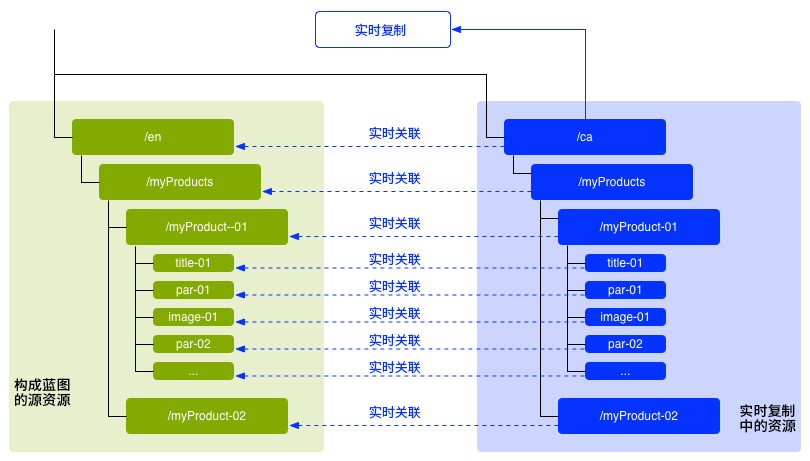
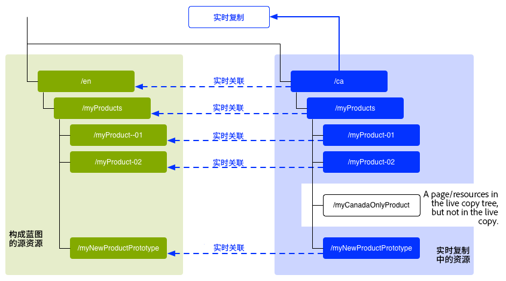
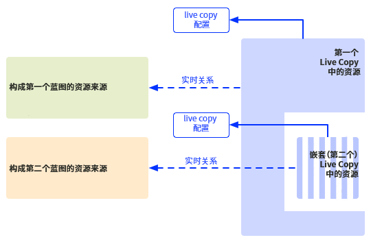
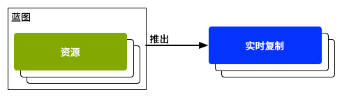

# 重用内容：多站点管理器和Live Copy {#multi-site-manager-and-live-copy}

多站点管理器(MSM)允许您在多个位置使用相同的站点内容。 MSM使用其Live Copy功能来实现此操作。

* 通过MSM，您可以：
   * 一次性创建内容
   * 在其他区域中重复使用此内容(通过 [Live Copy](#live-copies))。
* 然后，MSM会维护源内容与其Live Copy之间的实时关系，以便：
   * 更改源内容时，将同步源和Live Copy。
   * 您只能通过断开单个子页面和/或组件的实时关系来调整Live Copy的内容。

本页概述了如何通过MSM重用内容。 以下页面详细介绍了相关问题。

* [创建并同步 Live Copy](creating-live-copies.md)
* [Live Copy 概述控制台](live-copy-overview.md)
* [配置 Live Copy 同步](live-copy-sync-config.md)
* [MSM转出冲突](rollout-conflicts.md)
* [MSM 最佳实践](best-practices.md)

## 可能的情景 {#possible-scenarios}

MSM和Live Copy有许多用例。 某些情况包括：

* **跨国公司 — 全球到本地公司**

   MSM支持的一个典型用例是，在多个跨国同语言站点中重复使用内容。 这样，核心内容便可重复使用，同时也允许国家变更。

   例如， [WKND教程示例](/help/implementing/developing/introduction/develop-wknd-tutorial.md) 为美国的客户创建。 此站点中的大多数内容也可用于其他WKND站点，这些站点面向不同国家/地区和文化中讲英语的客户。 所有站点的核心内容都保持不变，而区域性可以进行调整。

   以下结构可用于美国和加拿大的地点。 注意方式 `language-masters` 节点不仅维护英语，还维护其他语言内容的主控副本。 此内容可用作英语旁边其他区域语言内容的基础。

   ```xml
   /content
       |- wknd
           |- language-masters
               |- en
               |- es
               |- fr
           |- us
               |- en
               |- es
           |- ca
               |- en
               |- fr
   ```

   >[!NOTE]
   >
   >MSM不翻译内容。 它用于创建所需的结构和部署内容。
   >
   >
   >请参阅 [翻译多语言站点的内容](/help/sites-cloud/administering/translation/overview.md) 例如。

* **国家 — 总部至区域分支机构**

   或者，拥有经销商网络的公司可能希望为其各个经销商单独建立网站，每个网站都是总部提供的主要网站的变体。 这可能适用于具有多个地区办事处的单一公司，或由中央特许人和多个当地特许人组成的全国特许制度。

   总部可提供核心信息，而区域实体可添加当地信息，如联系详情、开业时间和活动。

   ```xml
   /content
       |- head-office-berlin
       |- branch-hamburg
       |- branch-stuttgart
       |- branch-munich
       |- branch-frankfurt
   ```

* **多个版本**

   MSM可以创建特定子分支的版本。 例如，支持子站点可以保存特定产品不同版本的详细信息，其中基本信息保持不变，只需更改更新的功能：

   ```xml
   /content
       |- game-support
           |- polybius
               |- v5.0
               |- v4.0
               |- v3.0
               |- v2.0
               |- v1.0
   ```

   >[!TIP]
   >
   >在这种情况下，问题在于是制作直接副本还是使用Live Copy，这是以下两方面的平衡：
   >
   >* 多少核心内容需要在多个版本中进行更新。
   >
   >反对：
   >
   >* 需要调整多少个副本。


## UI中的MSM {#msm-from-the-ui}

可以使用相应控制台中的各种选项，在UI中直接访问MSM。

* **创建网站** (**站点**)

   * MSM可帮助您管理共享常用内容的多个网站。 例如，网站通常为国际受众提供，使大多数内容在所有国家/地区都是通用的，并且其中一部分内容是特定于各个国家/地区的。 MSM允许您 [创建Live Copy ，以便根据您的源站点自动更新一个或多个站点](creating-live-copies.md#creating-a-live-copy-of-a-site-from-a-blueprint-configuration). 这还有助于您实施通用的基础结构、跨多个网站使用通用内容、保持通用的外观，并将精力集中在管理网站之间实际不同的内容上。 以下方式创建站点：
      * 需要预定义的Blueprint配置来指定源。
      * 创建（预定义）源的Live Copy。
      * 为用户提供 **转出** 按钮。

* **创建Live Copy** (**站点**)

   * MSM允许您 [为网站的单个页面或子分支创建临时（一次性）Live Copy。](creating-live-copies.md#creating-a-live-copy-of-a-page) 例如，复制子分支以提供有关产品新/更新版本的信息。 以下方式创建Live Copy:
      * 创建临时Live Copy（无需Blueprint配置）。
      * 可用于（立即）创建任何页面/分支的Live Copy。
      * 需要 **同步** (不提供 **转出** 按钮)。

* **查看属性** (**站点**)

   * 在适当情况下，此选项可帮助您 [监控Live Copy](creating-live-copies.md#monitoring-your-live-copy) 提供有关 **Live Copy** 或 **Blueprint**.

* **引用** (**站点**)

   * 的 [引用](/help/sites-cloud/authoring/getting-started/basic-handling.md#references) 边栏提供了有关 **Live Copy** 以及相应操作的访问权限。

* **Live Copy概述** (**站点**)

   * 此控制台允许您 [查看并管理您的Blueprint及其Live Copy。](live-copy-overview.md)

* **蓝图** (**工具** - **站点**)

   * 此控制台允许您 [创建和管理Blueprint配置。](creating-live-copies.md#creating-a-blueprint-configuration)

>[!NOTE]
>
>MSM功能的某些方面可用于其他一些AEM功能，如启动项。 在这些情况下，Live Copy由该功能管理。

### 使用的术语 {#terms-used}

下表概述了与MSM一起使用的主要术语。 后续章节和页面中将详细介绍这些内容。

| 术语 | 定义 | 更多详细信息 |
|---|---|---|
| 来源 | 用作Live Copy基础的原始页面 | 与Blueprint和/或Blueprint页面同义 |
| Live Copy | 由转出配置定义的同步操作维护的源副本() |  |
| Live Copy配置 | Live Copy配置详细信息的定义 |  |
| 实时关系 | 对给定资源的继承的有效定义，即源和Live Copy之间的连接 | 确保对源所做的更改可以与Live Copy同步 |
| Blueprint | 与源同义 | 可由Blueprint配置定义 |
| Blueprint配置 | 指定源路径的预定义配置 | 在Blueprint配置中引用Blueprint页面时，“转出”命令将变为可用 |
| 章节 | 要包含在Live Copy中的Blueprint部分 | 这些通常是根的子页面 |
| 同步 | 用于在源和Live Copy之间同步内容的通用术语（由两者同时使用） **转出** 和 **同步** 选项) |  |
| 转出 | 从源同步到Live Copy | 可以由作者（在Blueprint页面上）或系统事件（由转出配置定义）触发 |
| 转出配置 | 确定将同步哪些属性、同步方式和同步时间的规则 |  |
| 同步 | 从Live Copy页面发出的手动同步请求 |  |
| 继承 | 发生同步时，Live Copy页面/组件会从其源页面/组件继承内容 |  |
| 暂停 | 临时删除Live Copy及其Blueprint页面之间的Live关系 |  |
| 分离 | 永久删除Live Copy及其Blueprint页面之间的Live关系 |  |
| 重置 | 重置Live Copy页面可删除所有取消的继承，并将页面返回到与源页面相同的状态 | 重置会影响您对页面属性、段落系统和组件所做的任何更改。 |
| 浅 | 单个页面的Live Copy |  |
| 深 | 页面的Live Copy及其子页面 |  |

<!--
>[!TIP]
>
>See [Overview of the Java API](/help/sites-developing/extending-msm.md#overview-of-the-java-api) for the object names.
-->

## Live Copy {#live-copies}

MSM Live Copy是特定站点内容的副本，其与原始源的Live关系保持不变：

* Live Copy从其源中继承内容。
* 当对源进行更改时，同步会执行内容的实际传输。
* Live Copy可以视为：
   * 浅层：单个页面
   * 深层：页面及其子页面
* 同步规则（称为转出配置）可确定要同步的属性以及同步发生的时间。

在上一个示例中， `/content/wknd/language-masters/en` 是全球主控的英文网站。 要重复使用此站点的内容，请创建MSM Live Copy:

* 以下内容 `/content/wknd/language-masters/en` 是源。
* 以下内容 `/content/wknd/language-masters/en` 复制于 `/content/wknd/us/en/` 和 `/content/wknd/ca/en` 节点。 这些是Live Copy。
* 作者对以下页面进行了更改 `/content/wknd/language-masters/en`.
* 触发时，MSM会将这些更改同步到Live Copy。

### Live Copy — 合成 {#live-copies-composition}

>[!NOTE]
>
>此部分中的图表和说明表示潜在Live Copy的快照。 这些功能并不全面，但提供了概述以突出特定特性。

最初创建Live Copy时，所选源页面会以1:1的方式反映在Live Copy中。 之后，还可以直接在Live Copy中创建新资源（页面和/或段落），以便了解这些变体以及它们对同步的影响。 可能的组合包括：

* [包含非Live-Copy页面的Live Copy](#live-copy-with-non-live-copy-pages)
* [嵌套Live Copy](#nested-live-copies)

Live Copy的基本形式有：

* 反映所选源页面的Live Copy页面比例为1:1。
* 一个配置定义。
* 为每个资源定义的实时关系：
   * 将Live Copy资源与其Blueprint/源链接。
   * 在实现继承和转出时使用。

更改可以是 [已同步](creating-live-copies.md#synchronizing-your-live-copy) 根据要求。



#### 包含非Live-Copy页面的Live Copy {#live-copy-with-non-live-copy-pages}

在AEM中创建Live Copy时，您可以查看并浏览Live Copy分支，并在Live Copy分支中使用常规的AEM功能。 这意味着您（或某个流程）可以在Live Copy中创建新资源（页面和/或段落）。 例如，特定地区或国家/地区的产品。

* 此类资源与源/Blueprint页面没有实时关系，因此不会同步。
* MSM会作为特殊情况处理的情景。 例如，当您（或某个进程）在源/Blueprint和Live Copy分支中创建具有相同位置和名称的页面时。 对于此类情况，请参阅 [MSM转出冲突](rollout-conflicts.md) 以了解更多信息。



#### 嵌套Live Copy {#nested-live-copies}

当您（或某个进程）创建 [现有Live Copy中的新页面](#live-copy-with-non-live-copy-pages) 此新页面还可设置为其他Blueprint的Live Copy。 这称为嵌套的Live Copy。 在嵌套的Live Copy中，第二个或内部Live Copy的行为会受到第一个或外部Live Copy的影响，其方式如下：

* 可以将为顶级Live Copy触发的深层转出继续放入嵌套的Live Copy中。
* 源之间的任何链接都将在Live Copy中重写。

例如，从第二个Live Copy到第一个Blueprint的链接将重写为指向从嵌套/第二个Live Copy到第一个Live Copy的链接。



>[!NOTE]
>
>如果您在Live Copy分支中移动或重命名页面，则该页面将被视为嵌套的Live Copy，以启用AEM来跟踪关系。

#### 堆叠式Live Copy {#stacked-live-copies}

将Live Copy创建为浅层Live Copy的子项时，它称为堆叠式Live Copy。 其行为方式与 [嵌套Live Copy](#nested-live-copies).

### 源、Blueprint和Blueprint配置 {#source-blueprints-and-blueprint-configurations}

任何页面或页面分支都可用作Live Copy的源。 但是，MSM还允许您定义用于指定源路径的Blueprint配置。 使用Blueprint配置的好处是：

* 允许作者使用 **转出** 选项。 例如，将修改明确推送到从此Blueprint继承的Live Copy。
* 允许作者使用 **创建网站**. 这允许用户轻松选择语言并配置Live Copy的结构。
* 为与Blueprint有关的Live Copy定义默认转出配置。

Live Copy的源可以是常规页面或Blueprint配置包含的页面。 这两种方法都是有效的用例。

源将构成Live Copy的蓝图。 当您执行以下任一操作时，将定义Blueprint:

* [创建Blueprint配置](creating-live-copies.md#creating-a-blueprint-configuration)  — 配置会预先定义用于创建Live Copy的页面。
* [创建页面的Live Copy](creating-live-copies.md#creating-a-live-copy-of-a-page)  — 用于创建Live Copy（源页面）的页面是Blueprint页面。 源页面可能被Blueprint配置引用，也可能未被Blueprint配置引用。

### 转出并同步 {#rollout-and-synchronize}

转出是与Live Copy及其源同步的中央MSM操作。 您可以手动执行转出，也可以自动执行转出。

* A [转出配置](#rollout-configurations) 可以定义，以便 [事件](live-copy-sync-config.md#rollout-triggers) 可能会导致自动转出。
* 在创作Blueprint页面时，您可以使用 **[转出](creating-live-copies.md#rolling-out-a-blueprint)** 命令将更改推送到Live Copy。
   * 的 **转出** 命令在Blueprint配置引用的Blueprint页面上可用。

   

* 在创作Live Copy页面时，您可以使用 **[同步](creating-live-copies.md#synchronizing-a-live-copy)** 命令将更改从源拉入Live Copy。
   * 的 **同步** 命令始终在Live Copy页面上可用，无论源/Blueprint页面是否包含在Blueprint配置中。

   

### 转出配置 {#rollout-configurations}

转出配置定义Live Copy何时以及如何与源内容同步。 转出配置由触发器和一个或多个同步操作组成：

* **触发器**  — 触发器是导致实时操作同步发生的事件，例如激活源页面。 MSM定义可使用的触发器。
* **同步操作**  — 对Live Copy执行同步操作，以将其与源同步。 例如，复制内容、对子节点排序以及激活Live Copy页面。 MSM提供了许多同步操作。

>[!NOTE]
>
>您可以使用Java API为实例创建自定义操作。

转出配置可以重复使用，以便多个Live Copy可以使用相同的转出配置。 几个 [转出配置](live-copy-sync-config.md#installed-rollout-configurations) 包含在标准安装中。

### 转出冲突 {#rollout-conflicts}

转出可能会变得复杂，尤其是当作者同时在源和Live Copy中编辑内容时。 因此，了解AEM如何处理任何 [转出过程中可能发生的冲突。](rollout-conflicts.md)

### 暂停和取消继承和同步 {#suspending-and-cancelling-inheritance-and-synchronization}

Live Copy中的每个页面和组件都通过Live关系与其源页面和组件相关联。 实时关系配置源中Live Copy内容的同步。

您可以 **暂停** Live Copy页面的Live Copy继承，以便您可以更改页面属性和组件。 暂停继承时，页面属性和组件不再与源同步。

在编辑单个页面时，作者可以 **取消继承** ，以查看相关信息。 取消继承后，实时关系将挂起，并且该组件不会进行同步。 当需要自定义内容的子部分时，取消继承和同步非常有用。

### 分离Live Copy {#detaching-a-live-copy}

您还可以 [分离Live Copy](creating-live-copies.md#detaching-a-live-copy) 从其blueprint中删除所有连接。

>[!CAUTION]
>
>“分离”操作是永久性的，且不可撤消。

“分离”操作会永久删除Live Copy及其Blueprint页面之间的Live关系。 所有与MSM相关的属性都将从Live Copy中删除，并且Live Copy页面将成为独立副本。

>[!TIP]
>
>请参阅 [分离Live Copy](creating-live-copies.md#detaching-a-live-copy) ，包括对子页面和父页面的相关影响。

## 使用MSM的标准步骤 {#standard-steps-for-using-msm}

以下步骤描述了使用MSM重复使用内容和将更改同步到Live Copy的标准过程。

1. 开发源站点的内容。
1. 确定要使用的转出配置。

   1. MSM [安装多个转出配置](live-copy-sync-config.md#installed-rollout-configurations) 能满足许多用例。
   1. 您也可以选择 [创建转出配置](live-copy-sync-config.md#creating-a-rollout-configuration) （如果需要）。

1. 确定您需要在何处 [指定要使用的转出配置](live-copy-sync-config.md#specifying-the-rollout-configurations-to-use) 并根据需要进行配置。
1. 如果需要， [创建Blueprint配置](creating-live-copies.md#creating-a-blueprint-configuration) 来标识Live Copy的源内容。
1. [创建Live Copy。](creating-live-copies.md#creating-a-live-copy)
1. 根据需要更改源内容。 您应采用贵组织已建立的常规内容审阅和批准流程。
1. [转出](creating-live-copies.md#rolling-out-a-blueprint) 蓝图，或 [同步Live Copy](creating-live-copies.md#synchronizing-a-live-copy) 中。

## 自定义MSM {#customizing-msm}

MSM提供了一些工具，以便您的实施能够适应共享内容时可能存在的异常复杂情况。

* **自定义转出配置** - [创建转出配置](live-copy-sync-config.md#creating-a-rollout-configuration) 安装的转出配置不符合您的要求时。 您可以使用任何可用的转出触发器和同步操作。

<!--
* **Custom Synchronization Actions** - [Create a custom synchronization action](/help/sites-developing/extending-msm.md#creating-a-new-synchronization-action) when the installed actions do not meet your specific application requirements. MSM provides a Java API for creating custom synchronization actions.
-->

## 最佳实践 {#best-practices}

的 [MSM最佳实践](best-practices.md) 页面包含有关您的实施的重要信息。
