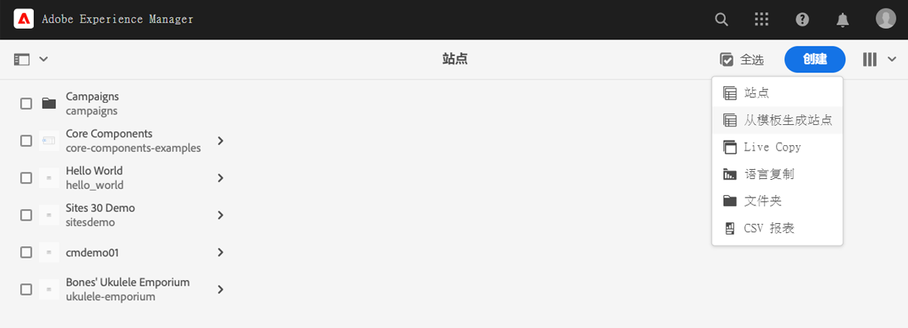
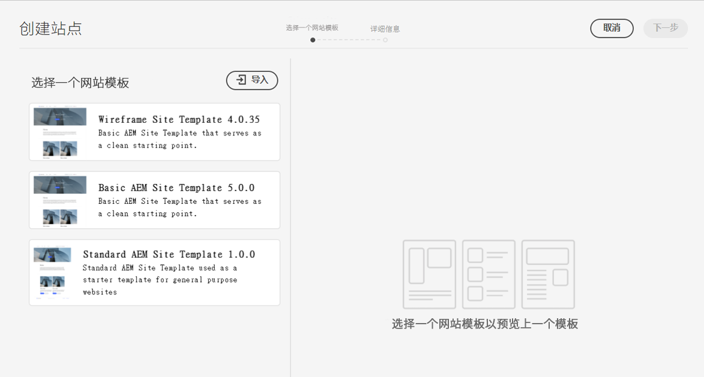
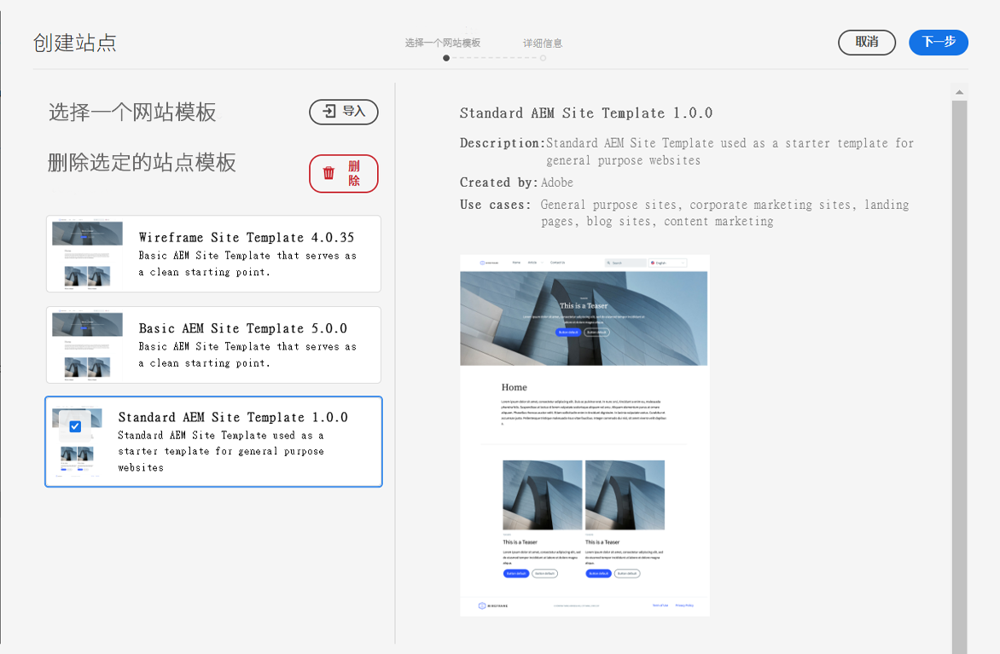
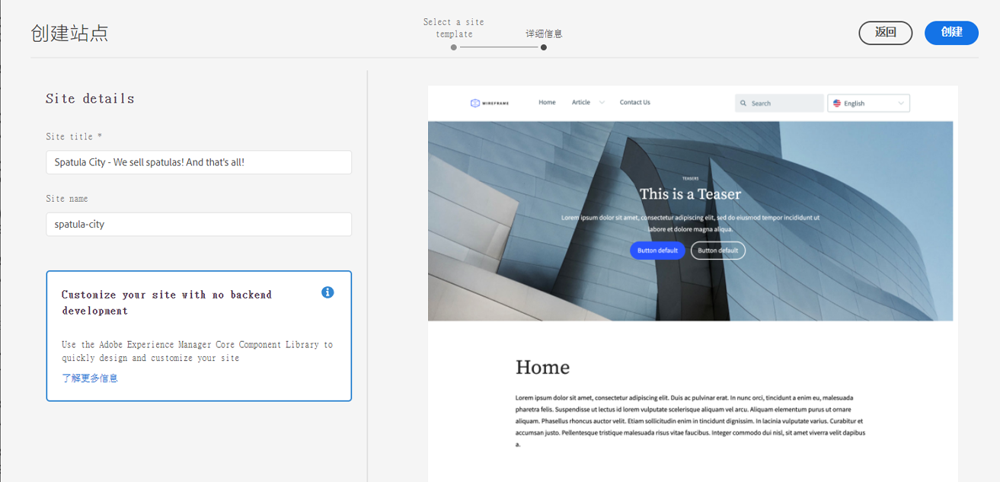
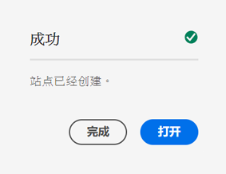
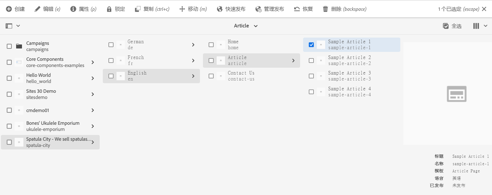

# 创建网站 {#creating-site}

了解如何使用AEM使用网站模板创建网站以定义网站的样式和结构。

>[!CAUTION]
>
>快速网站创建工具当前为技术预览。 它可用于测试和评估目的，并且除非与Adobe支持部门达成协议，否则不会用于生产。

## 概述 {#overview}

在内容作者创建包含内容的页面之前，必须先创建网站。 这通常由定义网站初始结构的AEM管理员执行。 使用网站模板可快速灵活地创建网站。

AEM快速站点创建工具允许非开发人员使用站点模板从头开始快速创建新站点。

创建网站后，快速创建工具还允许快速自定义AEM网站（JavaScript、CSS和静态资源）的主题和样式。 这允许需要零AEM知识的前端开发人员与内容创建者分开工作并与之并行工作。 AEM管理员只需下载网站主题并将其提供给前端开发人员，该开发人员使用自己喜爱的工具对其进行自定义，然后将更改提交到AEM代码存储库，然后将其部署。

本文档重点介绍使用“快速网站创建”工具创建网站。 如果您想要概述网站创建和自定义工作流程，请参阅 [AEM快速网站创建历程](/help/journey-sites/quick-site/overview.md)

## 规划站点结构 {#structure}

请提前考虑网站的用途和计划内容。 这将推动您设计网站结构的方式。 良好的网站结构支持网站访客轻松导航和内容发现，并支持各种AEM功能，例如 [多站点管理和翻译。](/help/sites-cloud/administering/msm-and-translation.md)

>[!TIP]
>
>[WKND参考站点](https://wknd.site) 提供功能完备的户外体验品牌网站的最佳实践实施。 浏览一下，了解构建良好的AEM网站的结构。

## 站点模板 {#site-templates}

由于网站结构对网站的成功至关重要，因此，可以方便地使用预定义的结构来根据一组现有标准快速部署新网站。 网站模板是将基本网站内容整合到方便、可重用的包中的一种方式。

网站模板通常包含基本网站内容和结构以及网站样式信息，以便快速开始新网站。 模板功能强大，因为它们可重复使用且可自定义。 由于AEM安装中可以有多个模板，因此您可以灵活地创建不同的站点以满足各种业务需求。

>[!TIP]
>
>有关网站模板的更多详细信息，请查看 [网站模板](site-templates.md) 文章。

>[!NOTE]
>
>网站模板不要与页面模板混淆。 网站模板可定义网站的整体结构。 页面模板可定义单个页面的结构和初始内容。

## 创建网站 {#create-site}

使用模板创建网站非常简单。

1. 登录到AEM创作环境，然后导航到站点控制台

   * `https://<your-author-environment>.adobeaemcloud.com/sites.html/content`

1. 点按或单击 **创建** 从屏幕右上方的下拉菜单中选择 **模板中的网站**.

   

1. 在创建站点向导中，点按或单击左侧面板中的现有模板，或单击 **导入** 来导入新模板。

   

   1. 如果选择导入，请在文件浏览器中找到要使用的模板，然后点按或单击 **上传**.

   1. 上传后，该模板会显示在可用模板列表中。

1. 选择模板时，会在右列显示有关模板的信息。 选择所需的模板后，点按或单击 **下一个**.

   

1. 为您的网站提供标题。 如果忽略，则可以提供或将从标题生成网站名称。

   * 网站标题会显示在浏览器标题栏中。
   * 网站名称将成为URL的一部分。
   * 网站名称必须符合 [AEM页面命名约定。](/help/sites-cloud/authoring/fundamentals/organizing-pages.md#page-name-restrictions-and-best-practices)

1. 点按或单击 **创建** 并且会使用网站模板创建网站。

   

1. 在显示的确认对话框中，点按或单击 **完成**.

   

1. 在“站点”控制台中，新站点可见，可以导航到浏览其由模板定义的基本结构。

   

内容作者现在可以开始创作！

## 网站自定义 {#site-customization}

如果您的网站需要自定义超出可用模板的范围，则可以选择多个选项。

* 如果网站结构或初始内容需要调整， [可以自定义网站模板以满足您的要求。](site-templates.md)
* 如果网站样式需要调整， [可以下载和自定义网站主题。](/help/journey-sites/quick-site/overview.md)
* 如果需要调整网站功能， [可以完全自定义网站。](/help/implementing/developing/introduction/develop-wknd-tutorial.md)

任何定制都应在开发小组的支持下进行。
