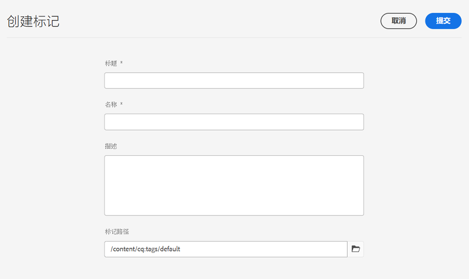

# 管理标记 {#administering-tags}

标记是对内容进行分类的直观方法。它们可以被视为用于更快找到内容的关键字或标签（元数据）。

在 Adobe Experience Manager (AEM) 中，标记可以是以下项的属性：

* 页面的内容节点
   * 有关更多信息，请参阅[使用标记](/help/sites-cloud/authoring/features/tags.md)文档。
* 资源的元数据节点
   * 有关更多信息，请参阅文档[管理数字资源的元数据](/help/assets/manage-metadata.md)文档。

>[!TIP]
>
>最佳实践是最大限度地减少与相同构思相关的标记数。例如，如果您管理的是户外用品店的内容，则可能无需对&#x200B;**鞋类**&#x200B;和&#x200B;**鞋**&#x200B;使用一个标记。

## 标记功能 {#tag-features}

标记提供了用于整理和管理内容的强大功能。

* 标记可以分组到各种命名空间中。
   * 命名空间可以被视为允许构建分类的层次结构。
   * 这些分类在整个 AEM 中是全局性的。
* 标记可以由作者应用并由网站访客使用。
* 在分配给页面或进行搜索时，所有形式的标记都可供选择，而无论标记创建者如何。
* 标记由[列表组件](https://experienceleague.adobe.com/docs/experience-manager-core-components/using/wcm-components/list.html)用来根据所选标记生成动态列表。

## 标记要求 {#requirements}

在创建和管理标记时，需要记住几个技术细节。

* 标记在特定的命名空间中必须是唯一的。
* 标记的名称不能包含标记分隔符：
   * 冒号 (`:`) - 分隔命名空间标记
   * 斜杠 (`/`) - 分隔子标记
* 如果标记的标题包含标记分隔符，它们将在 UI 中被禁止显示。
* `tag-administrators` 组的成员和有权修改 `/content/cq:tags` 的成员可以创建标记并修改其分类。
   * 包含子标记的标记称作容器标记。
   * 不是容器标记的标记称作叶标记。
   * 标记命名空间可以是叶标记或容器标记。

有关标记的工作方式的更多技术细节，请参阅 [AEM 标记框架](/help/implementing/developing/introduction/tagging-framework.md)文档。

## 标记控制台 {#tagging-console}

标记控制台用于创建和管理标记及其分类。利用标记控制台，可通过以下方式管理标记：

* 将标记分组到命名空间中。
* 在创建新的标记之前检查现有标记的使用情况。
* 重新整理标记，而不断开标记与当前引用的内容的连接。

要访问标记控制台，请执行以下操作：

1. 使用管理权限登录创作环境。
1. 在全局导航菜单中，选择&#x200B;**`Tools`** -> **`General`** ->
   **`Tagging`**。

## 创建新标记 {#creating-new-tags}

创建和使用标记来整理内容需执行多个步骤。

1. [为标记创建命名空间](#creating-namespaces)（或选择一个现有的命名空间以重用）。
1. [新建标记。](#creating-tags)
1. [发布标记。](#publishing-tags)

### 创建命名空间 {#creating-namespaces}

命名空间用于整理其他标记。它可以被视为最低级别的标记，通常用于对其他标记进行分组。

1. 要创建命名空间，请打开 [标记控制台](#tagging-console) 然后点按或单击 **创建** 工具栏中的按钮，然后 **创建命名空间**.

   

1. 提供必要的信息。

   * **标题** - UI 中向用户显示的命名空间的标题（可选）
   * **名称** - 如果未指定名称，则从&#x200B;**标题**&#x200B;创建有效的节点名称。有关更多信息，请参阅 [AEM 标记框架](/help/implementing/developing/introduction/tagging-framework.md#tagid)文档。
   * **描述** - 命名空间的描述（可选）

1. 输入所需信息后，点按或单击&#x200B;**创建**。

将创建命名空间。请注意，在标记控制台中，命名空间位于最低级别（控制台的最左侧栏），并由文件夹图标表示，这反映了它们作为“容器”或其他标记分组的性质。

您现在可以在此命名空间中[创建新标记](#creating-tags)或[管理现有标记](#managing-tags)。

命名空间无需包含任何子标记。由于命名空间本身是一个标记，因此它可以像任何其他标记一样用来整理内容。但是，要继续创建结构化标记分类，您可以根据项目要求在该命名空间内[创建子标记](#creating-tags)。

### 创建标记 {#creating-tags}

标记通常将添加到命名空间中。

1. 要创建标记，请打开 [标记控制台。](#tagging-console)

1. 选择要在其中创建标记的命名空间。或者选择另一个标记以在其下方创建子标记。

1. 点按或单击工具栏上的&#x200B;**创建**&#x200B;按钮，然后点按或单击&#x200B;**创建标记**。

1. **创建标记**&#x200B;对话框随即打开。提供新标记所需的信息。

   * **标题** - 标记的显示标题（必需）
   * **名称** - 标记的名称（必需）。如果未指定，可从&#x200B;**标题**&#x200B;创建有效的节点名称。请参阅 [TagID](/help/implementing/developing/introduction/tagging-framework.md#tagid)。
   * **描述** - 标记的描述
   * **标记路径** - 默认为您在标记控制台中选择的命名空间（或标记）。可以通过点按或单击路径选择器图标来手动更新。

   

1. 点按或单击 **提交**。

这将创建标记，并更新控制台以显示新标记。

可使用标记根据组织需求灵活创建您自己的分类。

* 在创建新标记之前，可以通过在控制台中选择父标记来创建现有标记的子标记。
* 如果您创建标记而没有选择命名空间或其他标记，则实际上可以创建命名空间。

### 发布标记 {#publishing-tags}

与在AEM中创建任何其他内容一样，在创建标记（或命名空间）后，它仅存在于创作环境中。 要使您的标记可供用户使用，您必须发布标记。

1. 要发布标记，请打开[标记控制台](#tagging-console)。

1. 选择要发布的一个或多个标记，然后在工具栏中选择&#x200B;**发布**。

   

1. **发布标记**&#x200B;对话框要求确认发布所选标记。点按或单击&#x200B;**发布**。

   

1. 通过&#x200B;**成功**&#x200B;对话框确认发布操作。

   

将对选定标记排队以进行发布。与页面内容类似，仅发布选定的标记，无论它是否有子标记。

要发布整个分类（命名空间和子标记），最佳实践是创建命名空间[包](/help/implementing/developing/tools/package-manager.md)（请参见[分类根节点](/help/implementing/developing/introduction/tagging-framework.md#taxonomy-root-node)）。

<!--
Be sure to [apply permissions](#setting-tag-permissions) to the namespace before creating the package.
-->

## 管理标记 {#managing-tags}

您可以对现有标记和命名空间执行大量操作以管理和组织它们。 只需在[标记控制台](#tagging-console)中选择一个标记或命名空间，即可在工具栏中显示可用的操作。

* [查看属性](#viewing-tag-properties)
* [编辑](#editing-tags)
* [取消发布](#unpublishing-tags)
* [引用](#viewing-tag-references)
* [移动](#moving-tags)
* [合并](#merging-tags)
* [删除](#deleting-tags)

请注意，当工具栏上的可用空间不足时，省略号图标后面会提供其他选项。

### 查看标记属性 {#viewing-tag-properties}

在标记控制台中选择单个标记/命名空间或其他标记时，所选标记的基本详细信息（例如，上次编辑时间和上次发布时间）将显示在标记列左侧的列中。

您可以通过将控制台切换到&#x200B;**属性**&#x200B;视图来查看有关标记的更多详细信息（包括标记的上次发布者和上次发布时间）。

1. 要查看标记的属性，请打开[标记控制台](#tagging-console)。

1. 选择要查看其属性的标记，然后在左边栏中选择&#x200B;**属性**。

   

1. 所选标记的详细属性显示在左边栏中。

   

有关选择查看模式和边栏的更多详细信息，请参阅[基本处理](/help/sites-cloud/authoring/getting-started/basic-handling.md#rail-selector)文档。

### 编辑标记 {#editing-tags}

可以在创建标记和命名空间后对其进行编辑。

1. 要编辑标记，请打开[标记控制台](#tagging-console)。

1. 选择要编辑的标记，然后在工具栏中选择&#x200B;**编辑**。

1. 进行所需的更改。可以更改：

   * **标题**
   * **描述**
   * [**本地化**](#managing-tags-in-different-languages)

1. 完成编辑后，点按或单击&#x200B;**提交**。

有关添加语言翻译的详细信息，请参阅[管理不同语言的标记](#managing-tags-in-different-languages)部分。

如果您对已发布的标记进行了更改，则可能需要[重新发布它](#publishing-tags)。

### 取消发布标记 {#unpublishing-tags}

要在创作实例上停用标记并将其从发布实例中删除，您可以取消发布它。

1. 要取消发布标记，请打开[标记控制台](#tagging-console)。

1. 选择要取消发布的一个或多个标记，然后在工具栏中选择&#x200B;**取消发布**。

   

1. **取消发布标记**&#x200B;对话框要求确认发布所选标记。点按或单击&#x200B;**发布**。

   

1. 通过&#x200B;**成功**&#x200B;对话框确认取消发布操作。

   

将对选定标记排队以进行取消发布。如果所选标记是容器标记，则其所有子标记都将在创作环境中停用，并从发布环境中删除。

### 查看标记引用 {#viewing-tag-references}

查看特定标记应用于哪些内容可能很有用。您可以使用标记控制台中的&#x200B;**引用**&#x200B;视图执行此操作。

1. 要查看标记的引用，请打开[标记控制台](#tagging-console)。

1. 选择要查看其引用的标记，然后在左边栏中选择&#x200B;**引用**。

   

1. 所选标记的引用总数显示在左边栏中。

   

1. 点按或单击标记引用的数量可查看分配给标记的内容的详细列表。

   

将鼠标悬停在列表中的引用内容上方或点按它可显示内容的完整路径。

有关选择查看模式和边栏的更多详细信息，请参阅[基本处理](/help/sites-cloud/authoring/getting-started/basic-handling.md#rail-selector)文档。

### 移动标记 {#moving-tags}

可能需要通过将标记移动到新位置或重命名标记来清理或重新整理标记分类。

>[!TIP]
>
>最佳实践是仅允许管理员移动和重命名标记。

1. 要移动或重命名标记，请打开[标记控制台](#tagging-console)。

1. 选择要移动或重命名的标记，然后点按或单击工具栏中的&#x200B;**移动**。

1. 在&#x200B;**移动标记**&#x200B;对话框中，指定要更改的属性。

   * **重命名为** - 您希望为标记指定的新名称
      * 此字段预先填充了标记的当前名称。
      * 如果您只想移动标记而不对其重命名，请将此字段保持不变。
   * **移动到** - 您想将标记移动到的位置
      * 此字段预先填充了标记的当前位置。
      * 如果您只想重命名标记而不移动它，请将此字段保持不变。

   

1. 点按或单击 **提交**。

将重命名标记和/或将它移动到新位置。当所选标记是容器标记时，移动该标记也会移动所有子标记。

### 合并标记 {#merging-tags}

如果您的标记分类具有重复项或相似的标记，则合并这些标记可能会很有用。在将标记 `A` 合并到标记 `B` 中时，所有带标记 `A` 的页面将用标记 `B` 进行标记，并且标记 `A` 不再对作者可用。

1. 要合并两个标记，请打开[标记控制台](#tagging-console)。

1. 选择要合并到一个标记中的另一个标记，然后点按或单击工具栏中的&#x200B;**合并**。

1. 在&#x200B;**合并标记**&#x200B;对话框中，点按或单击&#x200B;**合并为**&#x200B;字段的&#x200B;**浏览**&#x200B;图标，以指定要将所选标记合并到其中的标记。

   

1. 点按或单击 **提交**。

控制台中选择的标记将合并到对话框中指定的标记中。在移动或合并引用的标记时，该标记不会被物理删除，以便能够维护引用。有关更多信息，请参阅 [AEM 标记框架](/help/implementing/developing/introduction/tagging-framework.md#moving-and-merging-tags)文档。

### 删除标记 {#deleting-tags}

如果您的标记分类发生变化，并使标记或命名空间变得不必要，则可以将其删除。

1. 要删除标记，请打开[标记控制台](#tagging-console)。

1. 选择要删除的标记，然后点按或单击工具栏中的&#x200B;**删除**。

1. **删除标记**&#x200B;对话框要求确认删除所选标记。点按或单击&#x200B;**删除**。

   

1. AEM 检查以确保标记未被引用。

   1. 如果未找到引用，AEM 会要求最终确认删除。点按或单击&#x200B;**删除**

      

   1. 如果找到了引用，AEM 会显示它们并要求最终确认删除。

      

选定的标记将被删除，并且会从创作环境中永久被删除。如果标记已发布，也会将其从发布环境中删除。如果选定标记是容器标记，则其所有子标记也会被删除。

<!--

## Setting Tag Permissions {#setting-tag-permissions}

Tag permissions are ['secure (by default)'](/help/sites-administering/production-ready.md); a best practice for the publish environment that requires read permission to be explicitly allowed for tags. Bascially, this is done by creating a package of the Tag Namespace after permissions have been set on author, and installing the package on all publish instances.

* on author instance

    * sign in with administrative privileges
    * access the [Security Console](/help/sites-administering/security.md#accessing-user-administration-with-the-security-console),

        * for example, browse to http://localhost:4502/useradmin

    * in the left pane, select the group (or user) for which [read permission](/help/sites-administering/security.md#permissions) is to be granted
    * in the right pane, locate the **Path **to the Tag Namespace

        * for example, `/content/cq:tags/mycommunity`

    * select the `checkbox`in the **Read** column
    * select **Save**

* ensure all publish instances have same permissions

    * one approach is to [create a package](/help/sites-administering/package-manager.md#package-manager) of the namespace on author

        * on `Advanced` tab, for `AC Handling` select `Overwrite`

    * replicate the package

        * choose `Replicate` from package manager

-->

## 管理不同语言的标记 {#managing-tags-in-different-languages}

标记的 `title` 属性可翻译为多种语言。翻译后，可以根据用户或内容语言显示适当的标记标题。

假设我们有一个名为 `Animals` 的标记，我们想将它翻译成德语和法语。

1. 打开[标记控制台](#tagging-console)。

1. 选择要翻译的标记，然后点按或单击工具栏中的&#x200B;**编辑**。

1. 在&#x200B;**编辑标记**&#x200B;对话框中的&#x200B;**本地化**&#x200B;列中，选择目标语言，例如德语。

1. 在显示的&#x200B;**德语**&#x200B;字段中，提供翻译后的标题。

1. 对法语重复前两个步骤。

   

1. 点按或单击 **提交**。

对于内容页面，为标记选择的语言取自页面语言（如果可用）。

但在创作环境中，AEM 使用用户语言设置。在标记控制台中，对于 `Animals` 标记，将为其用户属性中的语言设置为法语的用户显示 `Animaux`。

要向对话框中添加新语言，请参阅[将标记构建到 AEM 应用程序中](/help/implementing/developing/introduction/tagging-applications.md#adding-a-new-language-to-the-edit-tag-dialog)文档

>[!TIP]
>
>如果您想详细了解 AEM 本地化功能，请参阅[为多语言站点翻译您的内容](/help/sites-cloud/administering/translation/overview.md)文档。
