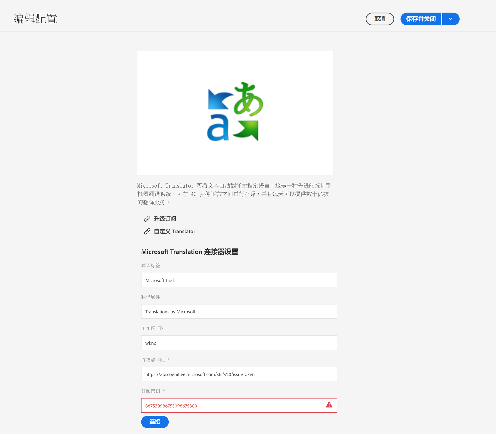

# 连接到 Microsoft Translator {#connecting-to-microsoft-translator}

为 [Microsoft Translator](https://hub.microsofttranslator.com) 云服务，以使用您的Microsoft翻译帐户翻译AEM页面内容或资产。

>[!TIP]
>
>如果您是翻译内容的新用户，请参阅 [站点翻译历程、](/help/journey-sites/translation/overview.md) 这是使用AEM强大的翻译工具翻译AEM Sites内容的指导路径，非常适合那些没有AEM或翻译经验的用户。

>[!NOTE]
>
>AEM提供试用版Microsoft翻译帐户，每月最多允许2 000 000个免费翻译字符。 要获取适合生产系统的帐户订阅，请参阅 [升级Microsoft Translator试用版许可证配置](#upgrading-the-microsoft-translator-trial-license-configuration).

| 属性 | 描述 |
|---|---|
| 翻译标签 | 翻译服务的显示名称 |
| 翻译归因 | （可选）对于用户生成的内容，例如，在翻译文本旁边显示的归因 `Translations by Microsoft` |
| 工作区ID | （可选）要使用的自定义Microsoft Translator引擎的ID |
| 订阅密钥 | 您的MicrosoftMicrosoft Translator订阅密钥 |

创建配置后，您需要 [激活](#activating-the-translator-service-configurations).

以下过程创建Microsoft Translator配置。

1. 在 [导航面板，](/help/sites-cloud/authoring/getting-started/basic-handling.md#first-steps) 单击或点按 **工具** -> **Cloud Services** -> **翻译Cloud Services**.
1. 导航到要创建配置的位置。 通常情况下，此配置位于您的站点根目录中，或者可以是全局默认配置。
1. 点按或单击 **创建** 按钮。
1. 定义配置。
   1. 选择 **Microsoft Translator** 中。
   1. 键入配置的标题。 标题可标识“Cloud Services”控制台以及“页面属性”下拉列表中的配置。
   1. （可选）键入用于存储配置的存储库节点的名称。

   

1. 单击&#x200B;**创建**。
1. 在 **编辑配置** ，请提供上表所述的翻译服务的值。

   

1. 点按或单击 **连接** 来验证连接。
1. 点击或单击&#x200B;**保存并关闭**。

## 升级Microsoft Translator试用版许可证配置 {#upgrading-the-microsoft-translator-trial-license-configuration}

Microsoft翻译配置页面提供了指向Microsoft网站的便捷链接，以便获取适合生产系统的帐户订阅。

1. 在 [导航面板，](/help/sites-cloud/authoring/getting-started/basic-handling.md#first-steps) 点按或单击 **工具** -> **Cloud Services** -> **翻译Cloud Services**.
1. 点按或单击您现有的Microsoft Translator配置。
1. 点按或单击 **编辑**.
1. 在 **编辑配置** 窗口，点按或单击 **升级订阅**. 此时将打开一个Microsoft网页，其中包含有关该服务的更多详细信息。

## 自定义Microsoft Translator引擎 {#customizing-your-microsoft-translator-engine}

Microsoft翻译配置页面提供了一个指向Microsoft网站的便捷链接，用于自定义Microsoft翻译器引擎。

1. 在 [导航面板，](/help/sites-cloud/authoring/getting-started/basic-handling.md#first-steps) 点按或单击 **工具** -> **Cloud Services** -> **翻译Cloud Services**.
1. 点按或单击您现有的Microsoft Translator配置。
1. 点按或单击 **编辑**.
1. 在 **编辑配置** 窗口，点按或单击 **自定义翻译器**. 使用打开的Microsoft网页自定义您的服务。

## 激活Translator服务配置 {#activating-the-translator-service-configurations}

您需要激活云服务配置以支持复制到发布实例的翻译内容。 使用的方法 [发布树](/help/sites-cloud/authoring/fundamentals/publishing-pages.md#publishing-and-unpublishing-a-tree) 激活存储Microsoft Translator配置的存储库节点。 节点位于以下父节点下：

* `/libs/settings/cloudconfigs/translation/msft-translation`
