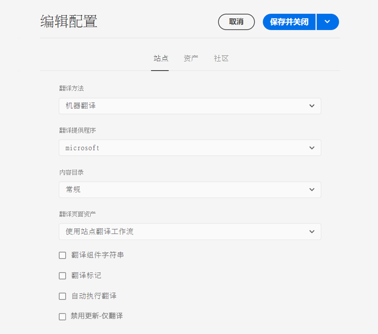
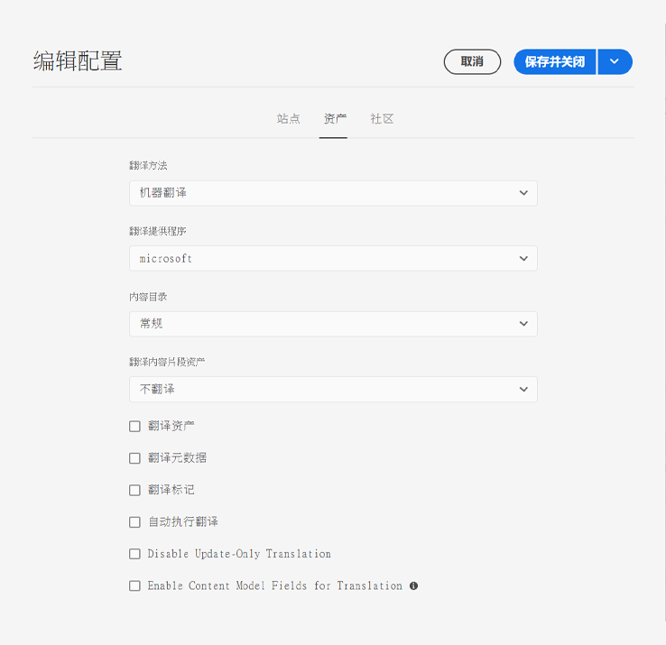

# 配置翻译集成框架 {#configuring-the-translation-integration-framework}

翻译集成框架与第三方翻译服务集成，以编排 AEM 内容的译文。其中涉及三个基本步骤。

1. [连接到您的翻译服务提供商。](#connecting-to-a-translation-service-provider)
1. [创建翻译集成框架配置。](#creating-a-translation-integration-configuration)
1. [将云配置与您的页面关联。](#configuring-pages-for-translation)

有关 AEM 中内容翻译功能的概述，请参阅[翻译多语言站点的内容](overview.md)。

>[!TIP]
>
>如果不熟悉如何翻译内容，请参阅我们的[站点翻译历程](/help/journey-sites/translation/overview.md)，将指导您使用 AEM 强大的翻译工具翻译您的 AEM Sites 内容，非常适合没有 AEM 或翻译经验的人士。

## 连接到翻译服务提供商 {#connecting-to-a-translation-service-provider}

创建用于将 AEM 连接到您的翻译服务提供商的云配置。默认情况下，AEM 具有[连接到 Microsoft Translator](connect-ms-translator.md) 的功能。

以下翻译供应商为翻译项目提供 AEM API 的实现。

* [Microsoft Translator](connect-ms-translator.md)
* [Translations.com](https://exchange.adobe.com/experiencecloud.details.90104.globallink-connect-plus-for-aem.html)（Adobe Exchange 首选合作伙伴）
* [Clay Tablet Technologies](https://exchange.adobe.com/experiencecloud.details.90064.clay-tablet-translation-for-experience-manager.html)
* [Lionbridge](https://exchange.adobe.com/experiencecloud.details.100064.lionbridge-connector-for-experience-manager-63.html)
* [Memsource](https://exchange.adobe.com/experiencecloud.details.103166.memsource-connector-for-adobe-experience-manager.html)
* [Cloudwords](https://exchange.adobe.com/experiencecloud.details.90019.html)
* [XTM Cloud](https://exchange.adobe.com/experiencecloud.details.105037.xtm-connect-for-adobe-experience-manager.html)
* [Lingotek](https://exchange.adobe.com/experiencecloud.details.90088.lingotek-collaborative-translation-platform.html)
* [RWS](https://partners.adobe.com/exchangeprogram/experiencecloud/exchange.details.108277.html)
* [Smartling](https://exchange.adobe.com/experiencecloud.details.90101.smartling-connector-for-adobe-experience-manager.html)
* [Systran](https://exchange.adobe.com/experiencecloud.details.90233.systran-for-adobe-experience-manager.html)

安装连接器软件包后，即可为连接器创建云配置。一般需要提供凭据，以便向翻译服务进行身份验证。有关为 Microsoft Translator 连接器添加云配置的信息，请参阅[与 Microsoft Translator 集成](connect-ms-translator.md)。

如果需要，可为同一个连接器创建多个云配置。例如，为您在同一供应商的每个帐户或项目都创建一个配置。

配置连接后，即可创建使用它的翻译集成框架配置。

## 创建翻译集成配置 {#creating-a-translation-integration-configuration}

创建翻译集成框架配置以指定如何翻译您的内容。该配置包括以下信息：

* 要使用哪个翻译服务提供商
* 要执行人工翻译还是机器翻译
* 是否翻译与页面或资产关联的其他内容，如标记

创建框架配置后，请将云配置与要根据该配置翻译的页面关联。开始翻译过程后，将根据关联的框架配置执行翻译工作流。

当网站的不同部分有不同的翻译要求时，请相应地创建多个框架配置。例如，多语言网站可能包括英语、西班牙语和日语版本。站点所有者使用两个不同的翻译服务提供商生成西班牙语和日语译文。因此，配置了两个框架配置。每个配置使用一个不同的翻译服务提供商。

配置翻译集成框架后，可[将它与使用它的页面关联](preparation.md)。

>[!TIP]
>
>有关 AEM 中内容翻译功能的概述，请参阅[翻译多语言站点的内容](overview.md)。

只有一个框架配置可控制如何翻译页面内容和资产。要创建新的翻译配置，请执行以下操作：

1. 在[全局导航菜单](/help/sites-cloud/authoring/getting-started/basic-handling.md#global-navigation)中，单击或点按&#x200B;**工具 -> 云服务 -> 翻译云服务**。
1. 在您的内容结构中导航到要创建该配置的位置。这一般为站点专属的位置，但也可为全局位置。
1. 在字段中提供以下信息，然后单击或点按&#x200B;**创建**。
   1. 在下拉列表中选择&#x200B;**配置类型**。
   1. 为您的配置输入一个&#x200B;**标题**。**标题**&#x200B;在&#x200B;**云服务**&#x200B;控制台中以及页面属性下拉列表中标识该配置。
   1. （可选）键入一个&#x200B;**名称**&#x200B;以用于存储该配置的存储库节点。
1. 在&#x200B;**编辑配置**&#x200B;窗口中，配置&#x200B;**站点**&#x200B;和&#x200B;**资产**&#x200B;选项卡上的属性，然后单击或点按&#x200B;**保存并关闭**。

### 站点配置属性 {#sites-configuration-properties}

**站点**&#x200B;选项卡控制如何执行页面内容的翻译。

| 属性 | 描述 |
|---|---|
| 翻译方法 | 此属性定义框架为站点内容执行的翻译方法： - 机器翻译：翻译提供商使用机器翻译实时执行翻译。 - 人工翻译：将内容发送到翻译提供商，以供译员进行翻译。 - 不翻译：不发送内容以供翻译。这是为了跳过某些不翻译但可用最新内容更新的内容分支。 |
| 翻译提供商 | 此属性定义执行翻译的翻译提供商。安装提供商对应的连接器后，列表中即出现该提供商。 |
| 内容类别 | （仅限机器翻译）此属性是描述所翻译的内容的类别。在翻译内容时，类别可能会影响术语和措辞的选择。 |
| 翻译标记 | 此选项允许翻译与页面关联的标记。 |
| 翻译页面资产 | 此属性定义如何翻译从文件系统添加到组件或从资产引用的资产： - 不翻译：不翻译页面资产。 - 使用站点翻译工作流：根据在&#x200B;**站点**&#x200B;选项卡上配置的属性处理资产。 - 使用资产翻译工作流：根据在&#x200B;**资产**&#x200B;选项卡上配置的属性处理资产。 |
| 自动执行翻译 | 启用此属性可在创建翻译项目后自动执行翻译作业。选择此选项时，无法复查翻译作业和划定其范围。 |
| 禁用仅更新翻译 | 选中此选项后，更新翻译项目将提交所有可翻译的字段以供翻译，而非仅提交自上次翻译以来更改的字段。 |

### 资产配置属性 {#assets-configuration-properties}

资产属性控制如何配置资产。有关翻译资产的更多信息，请参阅[创建资产的语言副本](/help/assets/translate-assets.md)。

| 属性 | 描述 |
|---|---|
| 翻译方法 | 此属性选择框架为资产执行的翻译的类型： - 机器翻译：翻译提供商使用机器翻译立即执行翻译。 - 人工翻译：自动将内容发送到翻译提供商，以供人工翻译。 - 不翻译：不发送资产以供翻译。 |
| 翻译提供商 | 此属性定义执行翻译的翻译提供商。安装提供商对应的连接器后，列表中即出现该提供商。 |
| 内容类别 | （仅限机器翻译）此属性描述所翻译的内容。在翻译内容时，类别可能会影响术语和措辞的选择。 |
| 翻译资产 | 激活此属性以在翻译项目中包括资产。 |
| 翻译元数据 | 激活此属性以翻译资产元数据。 |
| 翻译标记 | 激活此属性以翻译与资产关联的标记。 |
| 自动执行翻译 | 选择此属性可在创建翻译项目后自动执行翻译作业。选择此选项时，无法复查翻译作业或划定其范围。 |
| 禁用仅更新翻译 | 选中此选项后，更新翻译项目将提交所有可翻译的字段以供翻译，而非仅提交自上次翻译以来更改的字段。 |
| 为翻译启用内容模型字段 | 启用此选项将使用[内容片段模型](/help/sites-cloud/administering/content-fragments/content-fragments-models.md#properties)上的&#x200B;**可翻译**&#x200B;字段确定是否翻译了该字段，并相应地自动创建[翻译规则](rules.md)。此选项取代了您可能已创建的任何翻译规则。 |

## 配置页面以供翻译 {#configuring-pages-for-translation}

要配置如何将您的源页面翻译为其他语言，请将这些页面与以下云配置关联：

* 用于将 AEM 连接到您的翻译服务提供商的云配置。
* 用于配置翻译细节的翻译集成框架。

请注意，翻译集成框架云配置标识要用于连接到服务提供商的云配置。将源页面与框架云配置关联时，该页面必须与该框架云配置使用的服务提供商云配置关联。

将页面与云配置关联时，该页面的后代页面继承这种关联。例如，如果将 `/content/wknd/language-masters/en/magazine` 页面与翻译集成框架关联，则根据该框架翻译 `magazine` 页面及其下方的子页面。

必要时，可在后代页面上取代该关联。例如，站点的内容主要涉及旅行和生活方式，但某个分支的页面介绍公司情况。在这种情况下，站点的根页面可能与指定使用“生活方式”类别进行机器翻译的翻译集成框架关联，而介绍公司情况的分支将使用按“通用”类别执行机器翻译的框架。

### 将页面与翻译提供商关联 {#associating-a-page-with-a-translation-provider}

将页面与您用于翻译该页面和后代页面的翻译提供商关联。

1. 在站点控制台中，选择要配置的页面，然后单击或点按&#x200B;**查看属性**。
1. 单击或点按&#x200B;**云服务**&#x200B;选项卡。
1. 在&#x200B;**添加配置**&#x200B;下拉列表中选择配置。
1. 单击或点按&#x200B;**保存并关闭**。

### 将页面与翻译集成框架关联 {#associating-pages-with-a-translation-integration-framework}

将页面与定义您要如何为该页面和后代页面执行翻译的翻译集成框架关联。

1. 在站点控制台中，选择要配置的页面，然后单击或点按&#x200B;**查看属性**。
1. 单击或点按&#x200B;**云服务**&#x200B;选项卡。
1. 在&#x200B;**添加配置**&#x200B;下拉列表中选择配置。
1. 单击或点按&#x200B;**保存并关闭**。
