# 管理翻译项目 {#managing-translation-projects}

翻译项目可让您管理 AEM 内容的翻译。翻译项目是一类 AEM [项目](/help/sites-cloud/authoring/projects/overview.md)，其中包含要翻译成其他语言的资源。这些资源是从语言母版创建的[语言副本](preparation.md)的页面和资产。

>[!TIP]
>
>如果不熟悉如何翻译内容，请参阅我们的[站点翻译历程](/help/journey-sites/translation/overview.md)，将指导您使用 AEM 强大的翻译工具翻译您的 AEM Sites 内容，非常适合没有 AEM 或翻译经验的人士。

在将资源添加到翻译项目时，将为其创建翻译作业。作业提供用于管理对资源执行的人工翻译和机器翻译工作流的命令和状态信息。

翻译项目是长期运行的项目，它们由语言和翻译方法/提供商定义，以便与全球化的组织治理保持一致。它们应该在初始翻译期间启动一次或手动启动一次，并在整个内容和翻译更新活动中保持有效。

翻译项目和作业是通过翻译准备工作流创建的。这些工作流具有三个选项，适用于初始翻译（创建和翻译）和更新（更新翻译）：

1. [新建项目](#creating-translation-projects-using-the-references-panel)
1. [添加到现有项目](#adding-pages-to-a-translation-project)
1. [仅内容结构](#creating-the-structure-of-a-language-copy)

AEM 检测是否正在为内容的初始翻译创建翻译项目，或更新已翻译的语言副本。在为页面创建翻译项目并指明要翻译的语言副本时，AEM 会检测源页面是否已存在于目标语言副本中：

* **语言副本不包含页面：** AEM 将此情况视为初始翻译。该页面将立即复制到语言副本，并包含在项目中。将翻译后的页面导入 AEM 后，AEM 会将此页面直接复制到语言副本。
* **语言副本已包含页面：** AEM 将此情况视为更新后的翻译。将创建一个启动项，页面副本将添加到该启动项，并包含在项目中。利用启动项，您可以先查看更新后的翻译，然后再将它提交给语言副本：

   * 将翻译后的页面导入 AEM 时，它将覆盖启动项中的页面。
   * 翻译后的页面仅在提升启动项时覆盖语言副本。

例如，为 `/content/wknd/en` 主语言的法语翻译创建 `/content/wknd/fr` 语言根。法语副本中没有任何其他页面。

* 为 `/content/wknd/en/products` 页面及其所有子页面创建翻译项目，并以法语副本为目标。由于语言副本不包含 `/content/wknd/fr/products` 页面，因此，AEM 会立即将 `/content/wknd/en/products` 页面及其所有子页面复制到法语副本。这些副本也包含在翻译项目中。
* 为 `/content/wknd/en` 页面及其所有子页面创建翻译项目，并以法语副本为目标。由于语言副本包含与 `/content/wknd/en` 页面对应的页面（语言根），因此，AEM 将复制 `/content/wknd/en` 页面及其所有子页面，并将它们添加到启动项。这些副本也包含在翻译项目中。

## 站点控制台中的翻译 {#performing-initial-translations-and-updating-existing-translations}

可以直接从站点控制台创建或更新翻译项目。

### 使用“引用”面板创建翻译项目 {#creating-translation-projects-using-the-references-panel}

创建翻译项目，以便您能执行和管理用于翻译语言母版的工作流。在创建项目时，您可以指定正在翻译的语言母版中的页面，并指定正在为其执行翻译的语言副本：

* 与所选页面关联的翻译集成框架的云配置决定了翻译项目的多个属性，例如要使用的翻译工作流。
* 为每个选定的语言副本创建一个项目。
* 将创建所选页面和相关资产的副本，并将它们添加到每个项目中。这些副本稍后将发送到翻译提供商进行翻译。

您可以指定也选定所选页面的子页面。在此情况下，子页面的副本也将添加到每个项目中以便进行翻译。当任何子页面与不同的翻译集成框架配置关联时，AEM 会创建其他项目。

您也可以[手动创建翻译项目](#creating-a-translation-project-using-the-projects-console)。

>[!NOTE]
>
>要创建项目，您的帐户必须是 `project-administrators` 组的成员。

### 初始翻译和更新翻译 {#initial-and-updating}

“引用”面板指示您是更新现有语言副本还是创建语言副本的第一个版本。当所选页面存在语言副本时，将显示“更新语言副本”选项卡以提供对项目相关命令的访问。

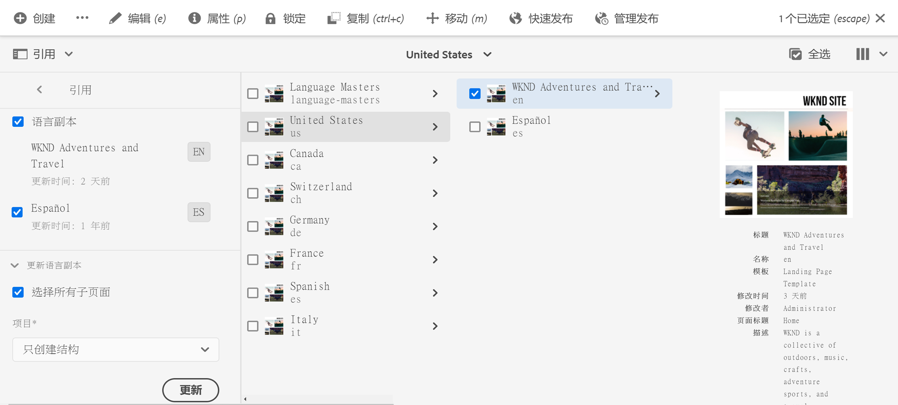

翻译后，您可以先[查看翻译](#reviewing-and-promoting-updated-content)，然后再用它覆盖语言副本。当所选页面没有语言副本时，将显示“创建并翻译”选项卡以提供对项目相关命令的访问。

### 为新语言副本创建翻译项目 {#create-translation-projects-for-a-new-language-copy}

1. 使用站点控制台选择要添加到翻译项目的页面。

1. 利用工具栏，打开&#x200B;**引用**&#x200B;边栏。

   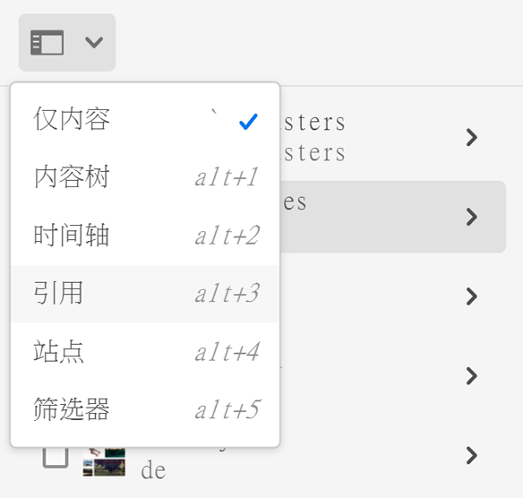

1. 选择&#x200B;**语言副本**，然后选择要为其翻译源页面的语言副本。
1. 单击或点按&#x200B;**创建并翻译**，然后配置翻译作业：

   * 使用&#x200B;**语言**&#x200B;下拉列表选择要翻译的语言副本。根据需要选择其他语言。列表中显示的语言与[创建的语言根](preparation.md#creating-a-language-root)对应。
      * 选择多种语言会创建一个项目，其中为每一种语言包含一个翻译作业。
   * 要翻译选定的页面和所有子页面，请选择&#x200B;**选择所有子页面**。要仅翻译选定的页面，请清除此选项。
   * 对于&#x200B;**项目**，请选择&#x200B;**创建翻译项目**。
   * （可选）对于&#x200B;**项目母版**，选择要从中继承用户角色和权限的项目。
   * 在&#x200B;**标题**&#x200B;中，键入项目的名称。

   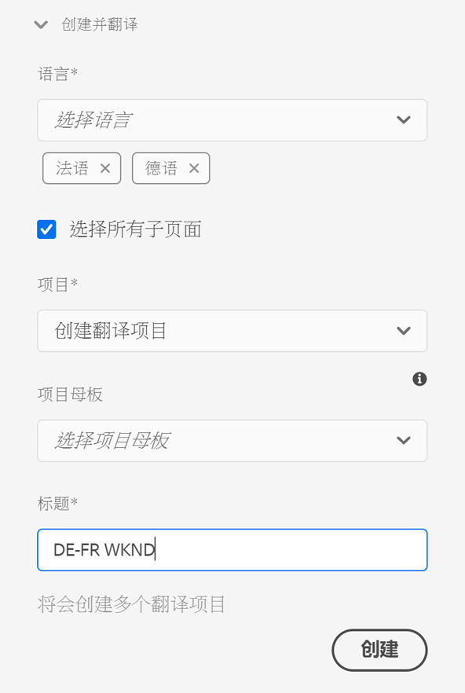

1. 单击或点按&#x200B;**创建**。

### 为现有语言副本创建翻译项目 {#create-translation-projects-for-an-existing-language-copy}

1. 使用站点控制台选择要添加到翻译项目的页面。

1. 利用工具栏，打开&#x200B;**引用**&#x200B;边栏。

   

1. 选择&#x200B;**语言副本**，然后选择要为其翻译源页面的语言副本。
1. 单击或点按&#x200B;**更新语言副本**，然后配置翻译作业：

   * 要翻译选定的页面和所有子页面，请选择&#x200B;**选择所有子页面**。要仅翻译选定的页面，请清除此选项。
   * 对于&#x200B;**项目**，请选择&#x200B;**创建翻译项目**。
   * （可选）对于&#x200B;**项目母版**，选择要从中继承用户角色和权限的项目。
   * 在&#x200B;**标题**&#x200B;中，键入项目的名称。

   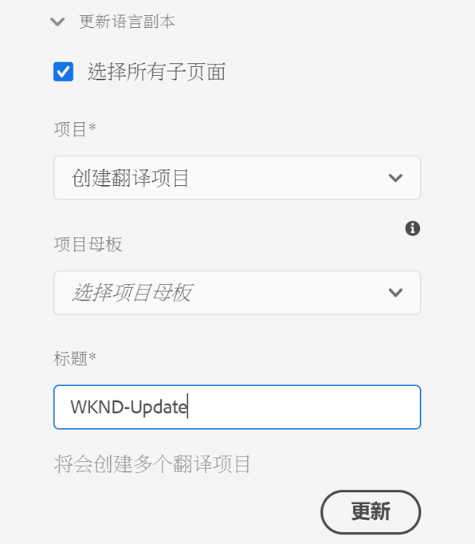

1. 单击或点按&#x200B;**创建**。

### 将页面添加到翻译项目 {#adding-pages-to-a-translation-project}

创建翻译项目后，您可以使用&#x200B;**资源**&#x200B;边栏将页面添加到项目。在同一个项目中包含来自不同分支的页面时，添加页面会很有用。

在将页面添加到翻译项目时，页面将包含在新的翻译作业中。您也可以[将页面添加到现有作业](#adding-pages-assets-to-a-translation-job)。

与创建新项目时一样，在添加页面时，页面的副本会在必要时添加到启动项中，避免覆盖现有语言副本。（请参阅[为现有语言副本创建翻译项目](#performing-initial-translations-and-updating-existing-translations)。）

1. 使用站点控制台选择要添加到翻译项目的页面。

1. 利用工具栏，打开&#x200B;**引用**&#x200B;边栏。

   

1. 选择&#x200B;**语言副本**，然后选择要为其翻译源页面的语言副本。

   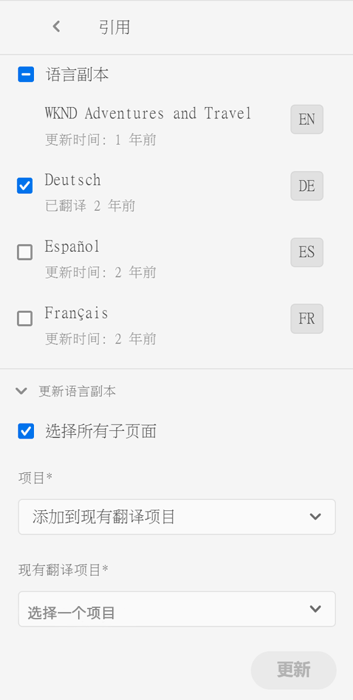

1. 单击或点按&#x200B;**更新语言副本**，然后配置属性：

   * 要翻译选定的页面和所有子页面，请选择&#x200B;**选择所有子页面**。要仅翻译选定的页面，请清除此选项。
   * 对于&#x200B;**项目**，选择&#x200B;**添加到现有翻译项目**。
   * 在&#x200B;**现有翻译项目**&#x200B;中选择项目。

   >[!NOTE]
   >
   >翻译项目中设置的目标语言应与引用边栏中显示的语言副本的路径匹配。

1. 单击或点按&#x200B;**更新**。

### 创建语言副本的结构 {#creating-the-structure-of-a-language-copy}

可以只创建语言副本的结构，这可让您将语言母版中的内容和结构更改复制到（未翻译的）语言副本。这与翻译作业或项目无关。即使没有翻译，您也可以使用此项来使您的语言母版保持同步。

填充您的语言副本，使它包含您正在翻译的主语言的内容。您必须先为语言副本[创建语言根](preparation.md#creating-a-language-root)，然后再填充语言副本。

1. 使用站点控制台选择用作源的主语言的语言根。
1. 通过单击或点按工具栏中的&#x200B;**引用**&#x200B;来打开引用边栏。

   

1. 选择&#x200B;**语言副本**，然后选择要填充的语言副本。

   

1. 单击或点按&#x200B;**更新语言副本**&#x200B;以显示翻译工具并配置属性：

   * 选择&#x200B;**选择所有子页面**&#x200B;选项。
   * 对于&#x200B;**项目**，请选择&#x200B;**仅创建结构**。

   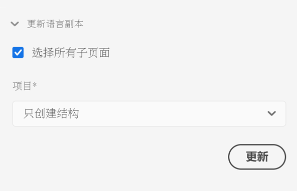

1. 单击或点按&#x200B;**更新**。

### 更新翻译记忆库 {#updating-translation-memory}

翻译内容的手动编辑可以同步回翻译管理系统 (TMS)，以训练其翻译记忆。

1. 在站点控制台中，更新已翻译页面中的文本内容后，选择&#x200B;**更新翻译记忆库**。
1. 列表视图显示每个已编辑的文本组件的源和翻译的并排比较。选择应将哪些翻译更新同步到翻译记忆库，然后选择&#x200B;**更新记忆库**。

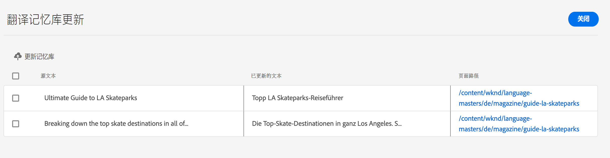

AEM 会更新已配置的 TMS 的翻译记忆中现有字符串的翻译。

* 该操作会更新已配置的 TMS 的翻译记忆中现有字符串的翻译。
* 它不会创建新的翻译工作。
* 它通过 AEM 翻译 API（见下文）将翻译发送回 TMS。

要使用此功能：

* TMS 必须配置为可与 AEM 一起使用。
* 连接器需要执行该方法[`storeTranslation`](https://developer.adobe.com/experience-manager/reference-materials/cloud-service/javadoc/com/adobe/granite/translation/api/TranslationService.html)。
   * 此方法中的代码确定翻译记忆更新请求的情况。
   * AEM 翻译框架通过实施该方法来将字符串值对（原始和更新的翻译）发送回 TMS。

对于使用专有翻译记忆的情况，可以拦截翻译记忆更新并将其发送到自定义目标。

### 检查页面翻译状态 {#check-translation-status}

可以在站点控制台的列表视图中选择一个属性，该属性指示页面是已翻译、正在翻译还是尚未翻译。

1. 在站点控制台中，切换到[列表视图](/help/sites-cloud/authoring/getting-started/basic-handling.md#viewing-and-selecting-resources)。
1. 点按或单击视图下拉列表中的&#x200B;**视图设置**。
1. 在对话框中，选中&#x200B;**已翻译**&#x200B;属性，并点按或单击&#x200B;**更新**。

站点控制台现在显示&#x200B;**已翻译**&#x200B;列，其中显示已列出页面的翻译状态。

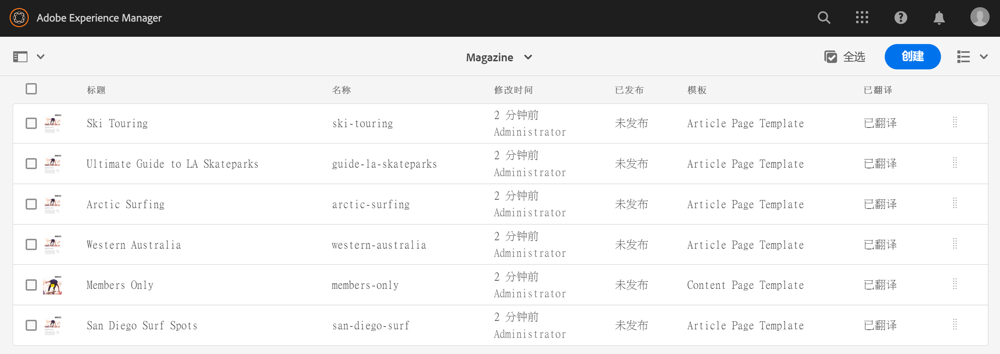

## 从项目控制台管理翻译项目

可以在项目控制台中访问许多翻译任务和高级选项。

### 了解项目控制台

AEM 中的翻译项目使用标准 [AEM 项目控制台。](/help/sites-cloud/authoring/projects/overview.md)如果您不熟悉 AEM 项目，请查看该文档。

与任何其他项目一样，翻译项目由显示项目任务概述的拼贴组成。

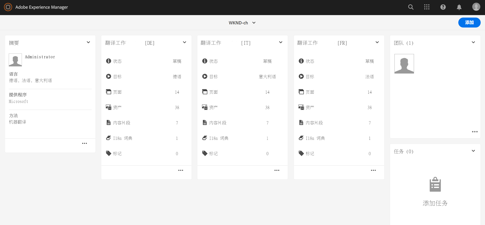

* **摘要** – 项目概述
* **任务** – 一个或多个翻译任务
* **团队** – 共同处理翻译项目的用户
* **任务** – 需作为翻译工作的一部分完成的项目

相应地使用拼贴顶部和底部的命令和省略号按钮来访问各种拼贴的控件和选项。

### 使用项目控制台创建翻译项目 {#creating-a-translation-project-using-the-projects-console}

如果您更喜欢使用项目控制台而不是站点控制台，则可以手动创建翻译项目。

>[!NOTE]
>
>要创建项目，您的帐户必须是 `project-administrators` 组的成员。

在手动创建翻译项目时，必须为以下与翻译相关的属性以及[基本属性](/help/sites-cloud/authoring/projects/managing.md#creating-a-project)提供值：

* **名称：**&#x200B;项目名称
* **源语言：**&#x200B;源内容的语言
* **目标语言：**&#x200B;内容将翻译成的一种或多种语言
   * 如果选择多种语言，则将为项目中的每种语言创建一个作业。
* **翻译方法：**&#x200B;选择&#x200B;**人工翻译**&#x200B;以指示要手动执行翻译。

1. 在项目控制台的工具栏上，单击或点按&#x200B;**创建**。
1. 选择&#x200B;**翻译项目**&#x200B;模板，然后单击或点按&#x200B;**下一步**。
1. 输入&#x200B;**基本属性**&#x200B;选项卡的值。
1. 单击或点按&#x200B;**高级**，并提供与翻译相关的属性的值。
1. 单击或点按&#x200B;**创建**。在确认对话框中，单击或点按&#x200B;**完成**&#x200B;以返回项目控制台，或者单击或点按&#x200B;**打开项目**&#x200B;以打开并开始管理项目。

### 将页面和资产添加到翻译作业 {#adding-pages-assets-to-a-translation-job}

您可以将页面、资产或标记添加到翻译项目的翻译作业中。要添加页面或资产，请执行以下操作：

1. 在翻译项目的翻译作业拼贴的底部，单击或点按省略号。

   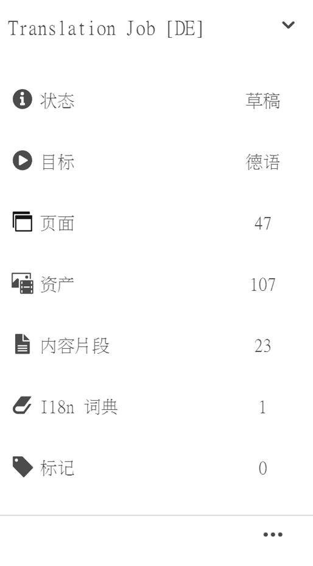

1. 在下一个窗口中，单击或点按工具栏中的&#x200B;**添加**&#x200B;按钮，然后选择&#x200B;**资产/页面**。

   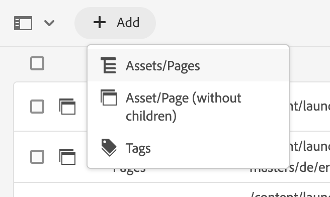

1. 在模式窗口中，选择要添加的分支的最顶部项目，然后单击或点按复选标记图标。在此窗口中启用了多选。

   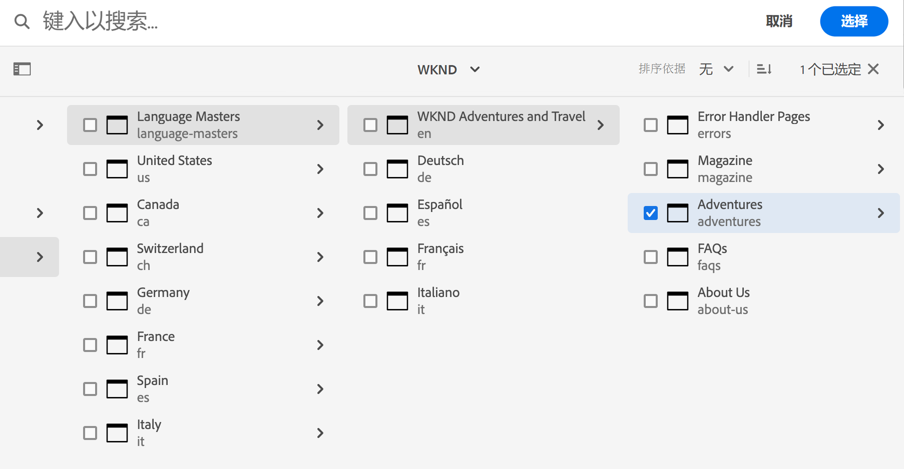

1. 或者，您可以选择搜索图标以轻松查找要添加到翻译作业的页面或资产。

   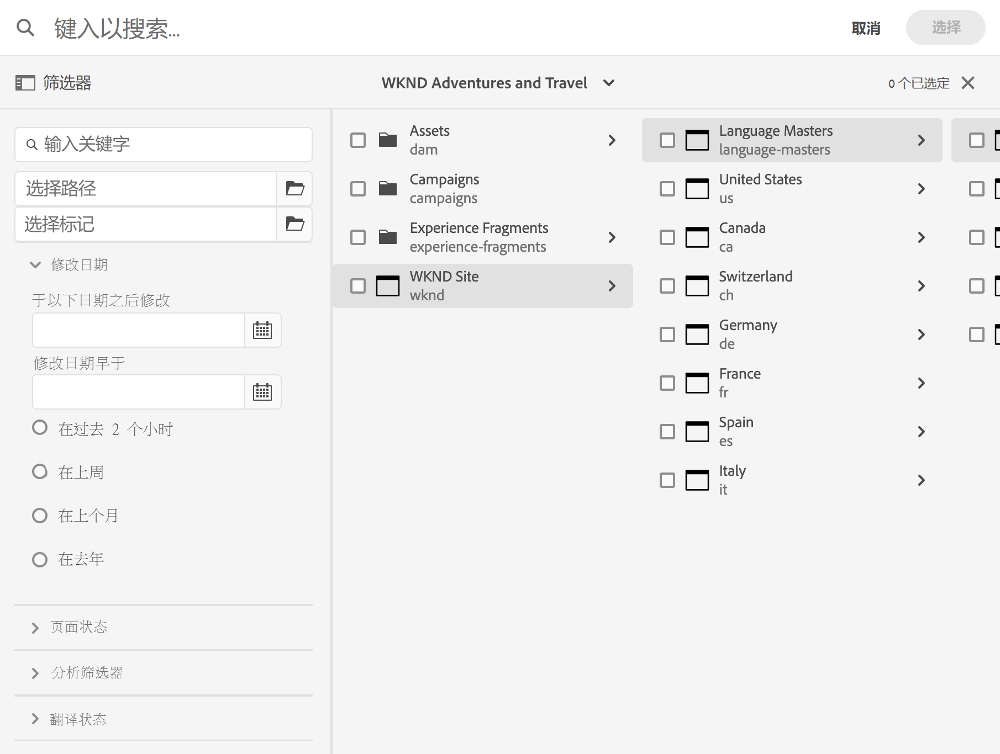

1. 选定后，点按或单击&#x200B;**选择**。您的页面和/或资产已添加到翻译作业中。

>[!TIP]
>
>此方法将页面/资产及其子级添加到项目中。如果只需添加父级，请选择&#x200B;**资产/页面(不带子级)**。

### 将标记添加到翻译作业 {#adding-tags-to-a-translation-job}

您可以将标记添加到翻译项目，类似于[将资产和页面添加到项目。](#adding-pages-assets-to-a-translation-job)只需选择&#x200B;**添加**&#x200B;菜单下的&#x200B;**标记**，然后执行相同的步骤。

### 查看翻译项目详细信息 {#seeing-translation-project-details}

可通过项目摘要拼贴的省略号按钮访问翻译项目属性。除了一般[项目信息](/help/sites-cloud/authoring/projects/overview.md#project-info)之外，翻译项目属性还包含翻译特定的信息。

在您的翻译项目中，单击或点按“翻译摘要”拼贴底部的省略号。大多数项目特定的属性位于&#x200B;**高级**&#x200B;选项卡上。

* **源语言：**&#x200B;正在翻译的页面的语言
* **目标语言：**&#x200B;页面将翻译成的一种或多种语言
* **云配置：**&#x200B;用于项目的翻译服务连接器的云配置
* **翻译方法：**&#x200B;翻译工作流，即&#x200B;**人工翻译**&#x200B;或&#x200B;**机器翻译**
* **翻译提供商：**&#x200B;执行翻译的翻译服务提供商
* **内容类别：**（机器翻译）用于翻译的内容类别
* **翻译提供商凭据：**&#x200B;用于登录提供商的凭据
* **自动提升翻译启动项：**&#x200B;收到已翻译内容后，翻译启动项将自动提升
   * **提升后删除启动项：**&#x200B;如果翻译启动项自动提升，则在提升后删除启动项
* **自动批准翻译：**&#x200B;收到已翻译内容后，将自动批准翻译作业
* **重复翻译：**&#x200B;通过选择项目将自动创建和执行翻译作业的频率来配置翻译项目的重复执行

在使用页面的引用边栏创建项目时，会根据源页面的属性自动配置这些属性。

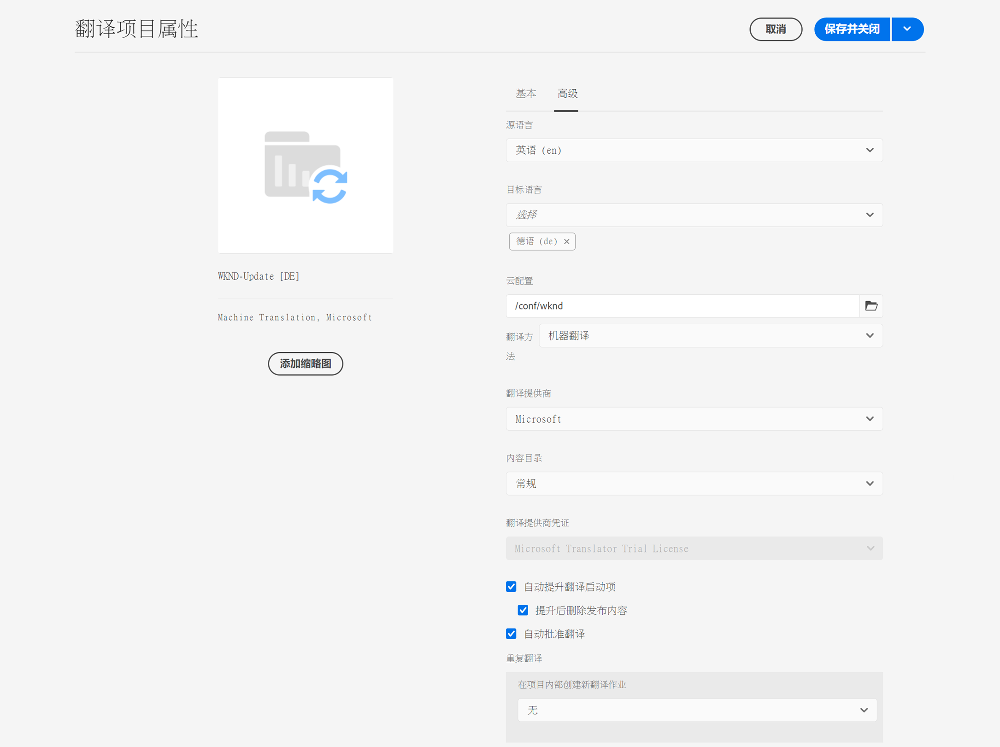

### 监控翻译作业状态 {#monitoring-the-status-of-a-translation-job}

翻译项目的翻译作业拼贴提供了翻译作业的状态，以及作业中页面和资产的数量。

下表描述了作业或作业中的项目可以具有的每种状态：

| 状态 | 描述 |
|---|---|
| **草稿** | 翻译作业尚未开始。翻译作业在创建时处于&#x200B;**草稿****状态。 |
| **已提交** | 在将翻译作业中的文件成功发送到翻译服务后，这些文件具有此状态。在发出&#x200B;**请求设定范围**&#x200B;命令或&#x200B;**开始**&#x200B;命令后，将出现此状态。 |
| **已请求设定范围** | 对于人工翻译工作流，作业中的文件已提交给翻译供应商来设定范围。在发出&#x200B;**请求设定范围**&#x200B;命令后，将出现此状态。 |
| **已完成范围的设定** | 供应商尚未设定翻译作业的范围。 |
| **已提交进行翻译** | 项目所有者已接受范围。此状态表示翻译供应商应开始翻译作业中的文件。 |
| **正在进行翻译** | 对于作业，此状态表示作业中一个或多个文件的翻译尚未完成。对于作业中的项目，此状态表示正在翻译项目。 |
| **已翻译** | 对于作业，此状态表示作业中所有文件的翻译已完成。对于作业中的项目，此状态表示已翻译项目。 |
| **准备好审查** | 作业中的项目已翻译，并且文件已导入 AEM 中。 |
| **完成** | 项目所有者已表示翻译合同已完成。 |
| **取消** | 表示翻译供应商应停止处于翻译作业。 |
| **错误更新** | 在 AEM 和翻译服务之间传输文件时出错。 |
| **状态未知** | 出现未知错误。 |

要查看作业中每个文件的状态，请单击或点按拼贴底部的省略号。

### 设置翻译作业的截止日期 {#setting-the-due-date-of-translation-jobs}

指定一个日期，翻译供应商需在该日期之前发送回已翻译文件。仅在您使用的翻译供应商支持此功能时，才能正确设置截止日期。

1. 单击或点按“翻译摘要”拼贴底部的省略号。

   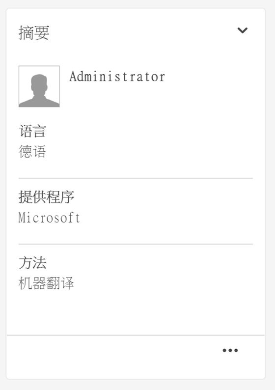

1. 在&#x200B;**基本**&#x200B;选项卡上，使用&#x200B;**截止日期**&#x200B;属性的数据选取器来选择截止日期。

   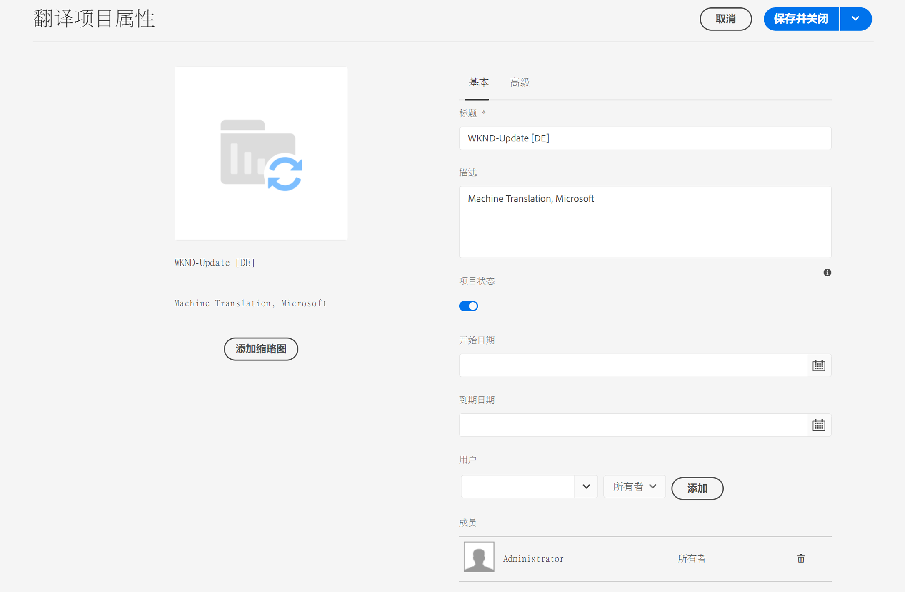

1. 单击或点按&#x200B;**保存并关闭**。

### 设定翻译作业的范围 {#scoping-a-translation-job}

设定翻译作业的范围，从翻译服务提供商处获得翻译成本的估计值。在设定作业范围时，源文件将提交给翻译供应商，后者会将文本与其存储的翻译池（翻译记忆库）进行比较。通常，范围是需要翻译的字数。

要获取有关范围设定结果的更多信息，请联系您的翻译供应商。

>[!NOTE]
>
>范围设定是可选的，仅适用于人工翻译。您无需设定范围即可开始翻译作业。

在设定翻译作业的范围时，作业的状态为&#x200B;**已请求设定范围**。当翻译供应商返回范围时，状态将更改为&#x200B;**已完成范围的设定**。在完成范围的设定后，您可以使用&#x200B;**显示范围**&#x200B;命令来查看范围设定结果。

仅在您使用的翻译供应商支持此功能时，才能正确设定范围。

1. 在项目控制台中，打开您的翻译项目。
1. 在翻译作业的标题上，点按或单击命令菜单，然后点按或单击&#x200B;**请求设定范围**。
1. 当作业状态变为&#x200B;**已完成范围的设定**&#x200B;时，单击或点按命令菜单，然后单击或点按&#x200B;**显示范围**。

### 开始翻译作业 {#starting-translation-jobs}

开始翻译作业，将源页面翻译成目标语言。根据“翻译摘要”拼贴的属性值执行翻译。

您可以从项目中开始单独的作业。

1. 在项目控制台中，打开翻译项目。
1. 在翻译作业拼贴上，单击或点按命令菜单，然后单击或点按&#x200B;**开始**。
1. 在用于确认开始翻译的操作对话框中，单击或点按&#x200B;**关闭**。

开始翻译作业后，翻译作业拼贴将显示处于&#x200B;**正在进行**&#x200B;状态的翻译。

您也可以开始项目的所有翻译作业。

1. 在项目控制台中，选择翻译项目。
1. 在工具栏上，点按或单击&#x200B;**开始翻译作业**。
1. 在对话框中，查看将开始的作业的列表，然后通过&#x200B;**开始**&#x200B;进行确认，或通过&#x200B;**取消**&#x200B;进行中止。

### 取消翻译作业 {#canceling-a-translation-job}

取消翻译作业可停止翻译过程并阻止翻译供应商执行任何进一步的翻译。当作业处于&#x200B;**已提交进行翻译**&#x200B;或&#x200B;**正在进行翻译**&#x200B;状态时，可以将其取消。

1. 在项目控制台中，打开翻译项目。
1. 在翻译作业拼贴上，单击或点按命令菜单，然后单击或点按&#x200B;**取消**。
1. 在用于确认取消翻译的操作对话框中，单击或点按&#x200B;**确定**。

### 接受拒绝工作流 {#accept-reject-workflow}

当内容在翻译后返回并处于&#x200B;**准备好审查**&#x200B;状态时，您可以进入翻译作业并接受/拒绝内容。

如果您选择&#x200B;**拒绝翻译**，则可以选择添加批注。

如果拒绝内容，则会将内容发送回翻译供应商，以便他们查看批注。

### 完成并存档翻译作业 {#completing-and-archiving-translation-jobs}

在查看来自供应商的已翻译文件后完成翻译作业。

1. 在项目控制台中，打开翻译项目。
1. 在翻译作业拼贴上，单击或点按命令菜单，然后单击或点按&#x200B;**完成**。
1. 作业此时的状态为&#x200B;**完成**。

对于人工翻译工作流，完成翻译会向供应商表明翻译合同已履行，他们应将翻译保存到其翻译记忆库中。

在翻译作业完成后将其存档，并且您不再需要查看作业状态详细信息。

1. 在项目控制台中，打开翻译项目。
1. 在翻译作业拼贴上，单击或点按命令菜单，然后单击或点按&#x200B;**存档**。

在存档作业时，将从项目中删除翻译作业拼贴。

## 审查并使用已翻译的内容 {#reviewing-and-promoting-updated-content}

您可以使用站点控制台审查内容、比较语言副本和激活内容。

### 提升更新的内容 {#promoting-updated-content}

在为现有语言副本翻译内容时，审查翻译并在必要时进行更改，然后提升翻译以将其移至语言副本。可以在翻译作业显示&#x200B;**准备好审查**&#x200B;状态时审查已翻译文件。

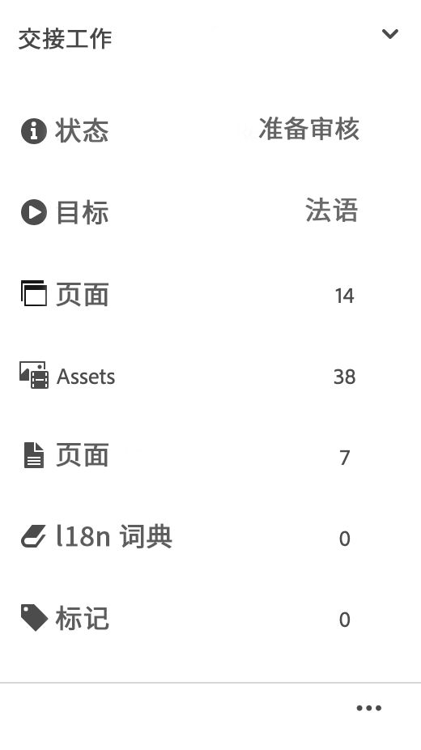

1. 在语言母版中选择页面，单击或点按&#x200B;**引用**，然后单击或点按&#x200B;**语言副本**。
1. 单击或点按要审查的语言副本。

   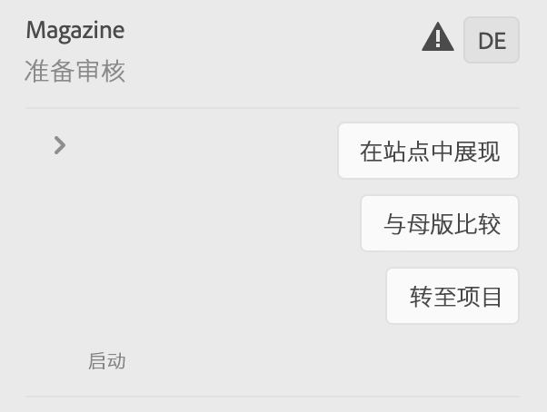

1. 单击或点按&#x200B;**启动项**&#x200B;以显示与启动项相关的命令。

   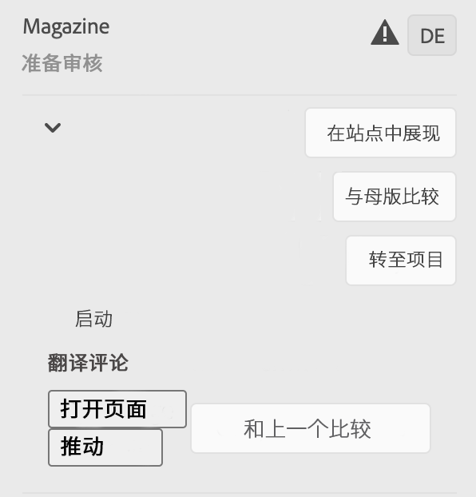

1. 要打开页面的启动项副本以审查和编辑内容，请单击&#x200B;**打开页面**。
1. 在审查内容并进行必要的更改后，要提升启动项副本，请单击&#x200B;**提升**。
1. 在&#x200B;**提升启动项**&#x200B;页面上，指定要提升的页面，然后单击或点按&#x200B;**提升**。

### 比较语言副本 {#comparing-language-copies}

要将语言副本与语言母版进行比较，请执行以下操作：

1. 在站点控制台中，导航到要比较的语言副本。
1. 打开[引用边栏](/help/sites-cloud/authoring/getting-started/basic-handling.md#references)。
1. 在&#x200B;**副本**&#x200B;标题下，选择&#x200B;**语言副本**。
1. 选择特定的语言副本，然后您可以单击&#x200B;**与母版比较**&#x200B;或&#x200B;**与上一个比较**（如果适用）。

   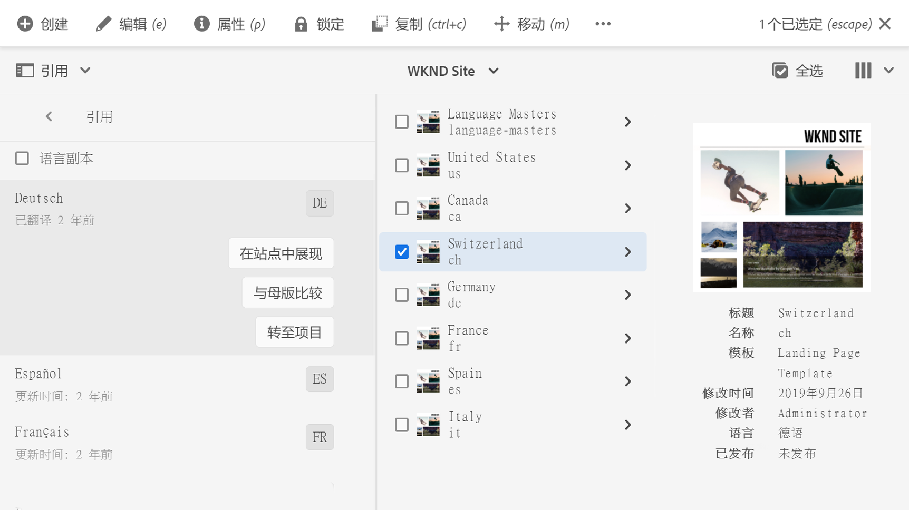

1. 此时将并列打开两个页面（启动页面和源页面）。
   * 有关使用此功能的完整信息，请参阅[页面差异](/help/sites-cloud/authoring/features/page-diff.md)。

## 导入和导出翻译作业 {#import-export}

虽然 AEM 提供了大量的翻译解决方案和界面，但也可以手动导入和导出翻译作业信息。

### 导出翻译作业 {#exporting-a-translation-job}

您可以下载翻译作业的内容，例如，通过连接器发送给未与 AEM 集成的翻译提供商，或审查内容。

1. 从翻译作业拼贴的下拉菜单中，单击或点按&#x200B;**导出**。
1. 在对话框中，单击或点按&#x200B;**下载导出的文件**，并（如有必要）使用 Web 浏览器对话框保持该文件。
1. 在该对话框中，单击或点按&#x200B;**关闭**。

### 导入翻译作业 {#importing-a-translation-job}

您可以将已翻译内容导入 AEM 中（例如，当翻译提供商将已翻译内容发送给您时），因为它们未通过连接器与 AEM 集成。

1. 从翻译作业拼贴的下拉菜单中，单击或点按&#x200B;**导入**。
1. 使用 Web 浏览器的对话框选择要导入的文件。
1. 在该对话框中，单击或点按&#x200B;**关闭**。
