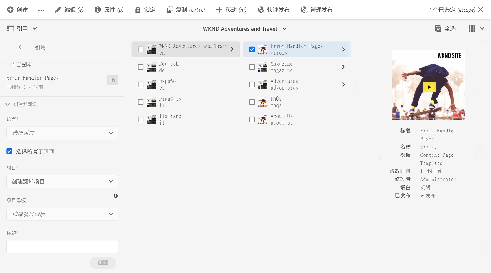
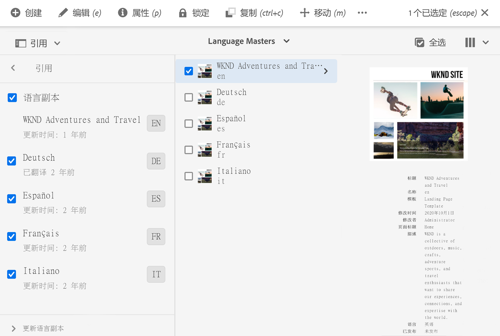

# 管理翻译项目 {#managing-translation-projects}

翻译项目使您能够管理AEM内容的翻译。 翻译项目是一种AEM [project](/help/sites-cloud/authoring/projects/overview.md)类型，其中包含要翻译成其他语言的资源。 这些资源是使用语言主控创建的[语言副本](preparation.md)的页面和资产。

将资源添加到翻译项目后，将为其创建翻译作业。 作业提供命令和状态信息，您可以使用这些命令和状态信息来管理对资源执行的人工翻译和机器翻译工作流。

翻译项目是长期运行的项目，由语言和翻译方法/提供商定义，以符合全球化的组织管理。 在初始翻译期间或手动翻译期间，应启动一次，并在整个内容和翻译更新活动中保持有效。

翻译项目和作业是使用翻译准备工作流创建的。 这些工作流有三个选项，分别用于初始翻译（创建和翻译）和更新（更新翻译）：

1. [创建新项目](#creating-translation-projects-using-the-references-panel)
1. [添加到现有项目](#adding-pages-to-a-translation-project)
1. [仅限内容结构](#creating-the-structure-of-a-language-copy)

AEM会检测是为内容的初始翻译创建翻译项目，还是更新已翻译的语言副本。 在为页面创建翻译项目并指示要翻译的语言副本时，AEM会检测源页面在目标语言副本中是否已存在：

* **语言副本不包括页面：** AEM将这种情况视为初始翻译。页面会立即复制到语言副本中，并包含在项目中。 将翻译后的页面导入AEM后，AEM会直接将其复制到语言副本。
* **语言副本已包含页面：** AEM将此情况视为更新的翻译。随即会创建启动项，并将页面的副本添加到启动项中，并包含在项目中。 启动项允许您在将更新的翻译提交到语言副本之前，先查看该翻译：

   * 将翻译后的页面导入AEM后，会覆盖启动项中的页面。
   * 仅当提升启动项时，翻译后的页面才会覆盖语言副本。

例如，为`/content/wknd/en`主控语言的法语翻译创建`/content/wknd/fr`语言根。 法语副本中没有其他页面。

* 将为`/content/wknd/en/products`页面和所有子页面创建翻译项目，以法语副本为目标。 由于语言副本不包含`/content/wknd/fr/products`页面，因此AEM会立即将`/content/wknd/en/products`页面和所有子页面复制到法语语言副本中。 翻译项目中也包含这些副本。
* 将为`/content/wknd/en`页面和所有子页面创建翻译项目，以法语副本为目标。 由于语言副本包含与`/content/wknd/en`页面（语言根）对应的页面，因此AEM会复制`/content/wknd/en`页面和所有子页面，并将它们添加到启动项中。 翻译项目中也包含这些副本。

## 从站点控制台进行翻译 {#performing-initial-translations-and-updating-existing-translations}

可以直接从站点控制台创建或更新翻译项目。

### 使用“引用”面板创建翻译项目 {#creating-translation-projects-using-the-references-panel}

创建翻译项目，以便您能够执行和管理用于翻译语言资源的工作流主控。 在创建项目时，您需要以要翻译的语言主控以及要执行翻译的语言副本指定页面：

* 与选定页面关联的翻译集成框架的云配置决定了翻译项目的许多属性，如要使用的翻译工作流。
* 将为选定的每个语言副本创建一个项目。
* 此时会创建选定页面的副本以及关联的资产，并将其添加到每个项目。 这些副本稍后会发送给翻译提供商以进行翻译。

您可以指定还选择选定页面的子页面。 在这种情况下，子页面的副本也会添加到每个项目中，以便翻译。 当任何子页面与不同的翻译集成框架配置关联时，AEM会创建其他项目。

您还可以[手动创建翻译项目](#creating-a-translation-project-using-the-projects-console)。

>[!NOTE]
>
>要创建项目，您的帐户必须是`project-administrators`组的成员。

### 初始翻译和更新翻译 {#initial-and-updating}

“引用”面板指示您是更新现有语言副本还是创建语言副本的第一个版本。 当选定页面存在语言副本时，将显示“更新语言副本”选项卡，提供对项目相关命令的访问。

翻译后，可以在使用翻译覆盖语言副本之前，[查看翻译](#reviewing-and-promoting-updated-content)。 当选定页面不存在语言副本时，将显示“创建并翻译”选项卡，提供对项目相关命令的访问。

### 为新语言副本创建翻译项目 {#create-translation-projects-for-a-new-language-copy}

1. 使用站点控制台选择要添加到翻译项目的页面。

1. 使用工具栏，打开&#x200B;**引用**&#x200B;边栏。

   

1. 选择&#x200B;**语言副本**，然后选择要翻译源页面的语言副本。
1. 单击或点按&#x200B;**创建并翻译**，然后配置翻译作业：

   * 使用&#x200B;**语言**&#x200B;下拉列表选择要翻译的语言副本。 根据需要选择其他语言。 列表中显示的语言与您创建的](preparation.md#creating-a-language-root)语言根对应。[
      * 选择多种语言将创建一个项目，并为每种语言创建一个翻译作业。
   * 要翻译您选择的页面和所有子页面，请选择&#x200B;**选择所有子页面**。 要仅翻译您选择的选定页面，请清除选项。
   * 对于&#x200B;**Project**，选择&#x200B;**创建翻译项目**。
   * （可选）对于&#x200B;**项目主控**，选择要从中继承用户角色和权限的项目。
   * 在&#x200B;**标题**&#x200B;中，键入项目的名称。

   

1. 单击或点按&#x200B;**创建**。

### 为现有语言副本创建翻译项目 {#create-translation-projects-for-an-existing-language-copy}

1. 使用站点控制台选择要添加到翻译项目的页面。

1. 使用工具栏，打开&#x200B;**引用**&#x200B;边栏。

   

1. 选择&#x200B;**语言副本**，然后选择要翻译源页面的语言副本。
1. 单击或点按&#x200B;**更新语言副本**，然后配置翻译作业：

   * 要翻译您选择的页面和所有子页面，请选择&#x200B;**选择所有子页面**。 要仅翻译您选择的选定页面，请清除选项。
   * 对于&#x200B;**Project**，选择&#x200B;**创建翻译项目**。
   * （可选）对于&#x200B;**项目主控**，选择要从中继承用户角色和权限的项目。
   * 在&#x200B;**标题**&#x200B;中，键入项目的名称。

   

1. 单击或点按&#x200B;**创建**。

### 将页面添加到翻译项目 {#adding-pages-to-a-translation-project}

创建翻译项目后，可以使用&#x200B;**资源**&#x200B;边栏将页面添加到项目。 当您在同一项目中包含来自不同分支的页面时，添加页面非常有用。

在将页面添加到翻译项目时，这些页面会包含在新的翻译作业中。 您还可以[将页面添加到现有作业](#adding-pages-assets-to-a-translation-job)。

与创建新项目时一样，在添加页面时，会在必要时将页面的副本添加到启动项，以避免覆盖现有语言副本。 （请参阅[为现有语言副本创建翻译项目](#performing-initial-translations-and-updating-existing-translations)。）

1. 使用站点控制台选择要添加到翻译项目的页面。

1. 使用工具栏，打开&#x200B;**引用**&#x200B;边栏。

   

1. 选择&#x200B;**语言副本**，然后选择要翻译源页面的语言副本。

   

1. 单击或点按&#x200B;**更新语言副本**，然后配置属性：

   * 要翻译您选择的页面和所有子页面，请选择&#x200B;**选择所有子页面**。 要仅翻译您选择的选定页面，请清除选项。
   * 对于&#x200B;**Project**，选择&#x200B;**添加到现有翻译项目**。
   * 在&#x200B;**现有翻译项目**&#x200B;中选择项目。

   >[!NOTE]
   >
   >翻译项目中设置的目标语言应与语言副本的路径相匹配，如引用边栏中所示。

1. 单击或点按&#x200B;**Update**。

### 创建语言副本的结构 {#creating-the-structure-of-a-language-copy}

可以仅创建语言副本的结构，从而将语言主控的内容和结构更改复制到（未翻译）语言副本。 这与翻译作业或项目无关。 您可以使用它保持语言母版同步，即使不进行翻译。

填充语言副本，以便包含您正在翻译的主控语言中的内容。 在填充语言副本之前，必须先创建语言副本的语言根](preparation.md#creating-a-language-root)。[

1. 使用站点控制台选择用作源的主控语言的语言根。
1. 单击或点按工具栏中的&#x200B;**引用**&#x200B;以打开引用边栏。

   

1. 选择&#x200B;**语言副本**，然后选择要填充的语言副本。

   

1. 单击或点按&#x200B;**更新语言副本**&#x200B;以显示翻译工具，并配置属性：

   * 选择&#x200B;**选择所有子页面**&#x200B;选项。
   * 对于&#x200B;**Project**，选择&#x200B;**仅创建结构**。

   

1. 单击或点按&#x200B;**Update**。

### 更新翻译内存 {#updating-translation-memory}

翻译内容的手动编辑可以同步回翻译管理系统(TMS)以培训其翻译记忆库。

1. 在站点控制台中，在更新翻译页面中的文本内容后，选择&#x200B;**更新翻译内存**。
1. 列表视图可并排显示编辑的每个文本组件的源和翻译比较。 选择应同步到翻译内存的翻译更新，然后选择&#x200B;**更新内存**。

AEM会将选定的字符串发送回翻译管理系统。

### 检查页面的翻译状态 {#check-translation-status}

可以在站点控制台的列表视图中选择一个属性，以显示页面是否已翻译、正在翻译或尚未翻译。

1. 在站点控制台中，切换到[列表视图。](/help/sites-cloud/authoring/getting-started/basic-handling.md#viewing-and-selecting-resources)
1. 点按或单击“视图”下拉列表中的&#x200B;**查看设置**。
1. 在对话框中，选中&#x200B;**Translated**&#x200B;属性，然后点按或单击&#x200B;**Update**。

站点控制台现在显示&#x200B;**Translated**&#x200B;列，其中显示了所列页面的翻译状态。

## 从项目控制台管理翻译项目

可以在项目控制台中访问许多翻译任务和高级选项。

### 了解项目控制台

AEM中的翻译项目使用标准[AEM项目控制台。](/help/sites-cloud/authoring/projects/overview.md) 如果您不熟悉AEM项目，请查阅该文档。

与任何其他项目一样，翻译项目由展示项目任务概述的图块组成。

* **摘要**  — 项目概述
* **任务**  — 一个或多个翻译任务
* **团队**  — 翻译项目的用户协作
* **任务**  — 需要在翻译工作中完成的项目

使用图块顶部和底部的命令和省略号按钮（分别）访问各种图块的控件和选项。

### 使用项目控制台创建翻译项目 {#creating-a-translation-project-using-the-projects-console}

如果您希望使用项目控制台而不是站点控制台，则可以手动创建翻译项目。

>[!NOTE]
>
>要创建项目，您的帐户必须是`project-administrators`组的成员。

手动创建翻译项目时，除了[基本属性](/help/sites-cloud/authoring/projects/managing.md#creating-a-project)之外，还必须为以下与翻译相关的属性提供值：

* **名称：** 项目名称
* **源语言：** 源内容的语言
* **目标语言：** 内容正在翻译到的语言或语言
   * 如果选择了多种语言，则会为项目中的每种语言创建一个作业。
* **翻译方法：** 选 **择** “人工翻译”以指示将手动执行翻译。

1. 在项目控制台的工具栏中，单击或点按&#x200B;**创建**。
1. 选择&#x200B;**翻译项目**&#x200B;模板，然后单击或点按&#x200B;**下一步**。
1. 输入&#x200B;**Basic**&#x200B;属性选项卡的值。
1. 单击或点按&#x200B;**高级**&#x200B;并提供与翻译相关的属性的值。
1. 单击或点按&#x200B;**创建**。在确认框中，单击或点按&#x200B;**完成**&#x200B;以返回到项目控制台，或单击或点按&#x200B;**打开项目**&#x200B;以打开并开始管理项目。

### 将页面和资产添加到翻译作业 {#adding-pages-assets-to-a-translation-job}

您可以向翻译项目的翻译作业添加页面、资产或标记。 要添加页面或资产，请执行以下操作：

1. 在翻译项目的翻译作业拼贴的底部，单击或点按省略号。

   

1. 在下一个窗口中，单击或点按工具栏中的&#x200B;**添加**&#x200B;按钮，然后选择&#x200B;**资产/页面**。

   

1. 在模式窗口中，选择要添加的分支的最上方的项目，然后单击或点按复选标记图标。 在此窗口中启用多选。

   

1. 或者，您也可以选择搜索图标，以轻松查找要添加到翻译作业的页面或资产。

   

1. 选择后，点按或单击&#x200B;**选择**。 您的页面和/或资产会添加到翻译作业中。

>[!TIP]
>
>此方法可将页面/资产及其子项添加到项目中。 如果您只想添加父项，请选择&#x200B;**资产/页面（不含子项）**。

### 向翻译作业添加标记 {#adding-tags-to-a-translation-job}

您可以向翻译项目添加标记，这与向项目添加资产和页面的方式类似。 只需在“添 **** 加”菜单下选 **** 择“标记”，然后执行相同的步骤。

### 查看翻译项目详细信息 {#seeing-translation-project-details}

翻译项目属性可通过项目摘要拼贴的省略号按钮访问。 除了通用的[项目信息](/help/sites-cloud/authoring/projects/overview.md#project-info)之外，翻译项目属性还包含特定于翻译的属性。

在您的翻译项目中，单击或点按“翻译摘要”拼贴底部的省略号。 大多数特定于项目的属性都位于&#x200B;**Advanced**&#x200B;选项卡上。

* **源语言：** 正在翻译的页面的语言
* **目标语言：** 页面正在翻译的语言或语言
* **云配置：** 用于项目的翻译服务连接器的云配置
* **翻译方法：** 翻译工作流程，人 **工** 翻译 **或机器翻译**
* **翻译提供程序：** 执行翻译的翻译服务提供程序
* **内容类别：** （机器翻译）用于翻译的内容类别
* **翻译提供程序凭据：** 要登录到提供程序的凭据
* **自动提升翻译启动项：** 在收到翻译内容后，翻译启动项将自动提升
   * **提升后删除启动项：** 如果翻译启动项自动提升，请在提升后删除启动项
* **自动批准翻译：** 在收到翻译内容后，翻译作业将自动批准
* **重复翻译：** 通过选择项目自动创建和执行翻译作业的频率，配置翻译项目的定期执行

使用页面的引用边栏创建项目时，将根据源页面的属性自动配置这些属性。

### 监控翻译作业的状态 {#monitoring-the-status-of-a-translation-job}

翻译项目的翻译作业拼贴提供了翻译作业的状态，以及作业中的页面和资产数量。

下表描述了作业或作业中的项目可以具有的每种状态：

| 状态 | 描述 |
|---|---|
| **草稿** | 尚未启动翻译作业。 创建翻译作业后，它们将处于&#x200B;**草稿****状态。 |
| **已提交** | 翻译作业中的文件在成功发送到翻译服务后会处于此状态。 在发出&#x200B;**请求范围**&#x200B;命令或&#x200B;**启动**&#x200B;命令后，可能会出现此状态。 |
| **已请求设定范围** | 对于人工翻译工作流，作业中的文件已提交给翻译供应商进行范围界定。 发出&#x200B;**请求范围**&#x200B;命令后，将显示此状态。 |
| **已完成范围的设定** | 供应商已确定翻译作业的范围。 |
| **承诺翻译** | 项目所有者已接受该范围。 此状态表示翻译供应商应开始翻译作业中的文件。 |
| **正在翻译** | 对于作业，作业中一个或多个文件的翻译尚未完成。 对于作业中的项目，该项目正在翻译。 |
| **已翻译** | 对于作业，作业中所有文件的翻译已完成。 对于作业中的项目，该项目已翻译。 |
| **准备审阅** | 作业中的项目已翻译，文件已导入AEM。 |
| **完成** | 项目所有者表示翻译合同已完成。 |
| **取消** | 指示翻译供应商应停止处理翻译作业。 |
| **错误更新** | 在AEM和翻译服务之间传输文件时出错。 |
| **未知状态** | 发生未知错误。 |

要查看作业中每个文件的状态，请单击或点按图块底部的省略号。

### 设置翻译作业的到期日期 {#setting-the-due-date-of-translation-jobs}

指定翻译供应商需要返回翻译文件的日期。 仅当您使用的翻译供应商支持此功能时，才能正确设置到期日期。

1. 单击或点按翻译摘要拼贴底部的省略号。

   

1. 在&#x200B;**Basic**&#x200B;选项卡上，使用&#x200B;**Due Date**&#x200B;属性的日期选取器选择到期日期。

   

1. 单击或点按&#x200B;**保存并关闭**。

### 规范翻译作业 {#scoping-a-translation-job}

对翻译作业进行范围设置，以从翻译服务提供商那里获取翻译成本的估算值。 在您查看作业时，会将源文件提交给翻译供应商，该供应商将文本与其存储的翻译池（翻译内存）进行比较。 通常，范围是需要翻译的词数。

要获取有关范围界定结果的更多信息，请与翻译供应商联系。

>[!NOTE]
>
>范围界定是可选的，仅适用于人类翻译。 您可以启动翻译作业，而无需进行范围分析。

当您对翻译作业进行作用域设置时，该作业的状态为&#x200B;**Scope Requested**。 当翻译供应商返回范围时，状态将更改为&#x200B;**范围已完成**。 完成范围界定后，可以使用&#x200B;**Show Scope**&#x200B;命令查看范围界定结果。

仅当您使用的翻译供应商支持此功能时，范围界定才能正确运行。

1. 在项目控制台中，打开您的翻译项目。
1. 在翻译作业的标题中，点按或单击命令菜单，然后点按或单击&#x200B;**请求范围**。
1. 当作业状态更改为&#x200B;**已完成的范围**&#x200B;时，单击或点按命令菜单，然后单击或点按&#x200B;**显示范围**。

### 启动翻译作业 {#starting-translation-jobs}

启动翻译作业以将源页面翻译为目标语言。 根据翻译摘要拼贴的属性值执行翻译。

您可以从项目中启动单个作业。

1. 在项目控制台中，打开翻译项目。
1. 在翻译作业拼贴中，单击或点按命令菜单，然后单击或点按&#x200B;**开始**。
1. 在确认翻译开始的操作对话框中，单击或点按&#x200B;**关闭**。

启动翻译作业后，翻译作业拼贴会显示“正在进行&#x200B;**”状态下的翻译。**

您还可以为项目启动所有翻译作业。

1. 在项目控制台中，选择翻译项目。
1. 在工具栏中，点按或单击&#x200B;**开始翻译作业**。
1. 在对话框中，查看要启动的作业列表，然后使用&#x200B;**Start**&#x200B;进行确认，或使用&#x200B;**Cancel**&#x200B;中止。

### 取消翻译作业 {#canceling-a-translation-job}

取消翻译作业以停止翻译过程并阻止翻译供应商执行任何进一步的翻译。 当作业具有&#x200B;**Committed For Translation**&#x200B;或&#x200B;**Translation In Progress**&#x200B;状态时，可以取消作业。

1. 在项目控制台中，打开翻译项目。
1. 在翻译作业拼贴中，单击或点按命令菜单，然后单击或点按&#x200B;**取消**。
1. 在确认取消翻译的操作对话框中，单击或点按&#x200B;**OK**。

### 接受和拒绝工作流 {#accept-reject-workflow}

当内容在翻译后返回且处于&#x200B;**准备审阅**&#x200B;状态时，您可以进入翻译作业并接受/拒绝内容。

如果选择&#x200B;**拒绝翻译**，则可以选择添加注释。

拒绝内容会将其发送回翻译供应商，以便他们能够在该供应商中看到评论。

### 完成和存档翻译作业 {#completing-and-archiving-translation-jobs}

在审核供应商提供的翻译文件后完成翻译工作。

1. 在项目控制台中，打开翻译项目。
1. 在翻译作业拼贴中，单击或点按命令菜单，然后单击或点按&#x200B;**Complete**。
1. 作业现在的状态为&#x200B;**Complete**。

对于人类翻译工作流，完成翻译会向供应商指示翻译合同已履行，他们应将翻译保存到其翻译记忆库。

在翻译作业完成后存档该作业，您不再需要查看作业状态详细信息。

1. 在项目控制台中，打开翻译项目。
1. 在翻译作业拼贴中，单击或点按命令菜单，然后单击或点按&#x200B;**Archive**。

存档作业时，将从项目中删除翻译作业拼贴。

## 审阅和使用翻译内容 {#reviewing-and-promoting-updated-content}

您可以使用站点控制台来查看内容、比较语言副本和激活内容。

### 提升更新内容 {#promoting-updated-content}

在为现有语言副本翻译内容时，请查看翻译，根据需要进行更改，然后提升翻译以将其移至语言副本。 当翻译作业显示&#x200B;**准备审阅**&#x200B;状态时，您可以查看已翻译的文件。

1. 使用语言主控选择页面，单击或点按&#x200B;**引用**，然后单击或点按&#x200B;**语言副本**。
1. 单击或点按要查看的语言副本。

   

1. 单击或点按&#x200B;**Launch**&#x200B;以显示与启动相关的命令。

   

1. 要打开要查看和编辑内容的页面启动副本，请单击&#x200B;**打开页面**。
1. 查看内容并进行必要更改后，要提升启动项副本，请单击&#x200B;**Promote**。
1. 在&#x200B;**提升启动项**&#x200B;页面上，指定要提升的页面，然后单击或点按&#x200B;**提升**。

### 比较语言副本 {#comparing-language-copies}

要将语言副本与语言主控进行比较，请执行以下操作：

1. 在站点控制台中，导航到要比较的语言副本。
1. 打开[引用边栏。](/help/sites-cloud/authoring/getting-started/basic-handling.md#references)
1. 在&#x200B;**副本**&#x200B;标题下，选择&#x200B;**语言副本。**
1. 选择您的特定语言副本，然后您可以单击&#x200B;**与主控的比较**&#x200B;或&#x200B;**与上一个比较**（如果适用）。

   

1. 此时将并列打开两个页面（启动页面和源页面）。
   * 有关使用此功能的完整信息，请参阅[页面差异](/help/sites-cloud/authoring/features/page-diff.md)。

## 导入和导出翻译作业 {#import-export}

尽管AEM提供了许多翻译解决方案和界面，但也可以手动导入和导出翻译作业信息。

### 导出翻译作业 {#exporting-a-translation-job}

您可以下载翻译作业的内容，例如，通过连接器发送到未与AEM集成的翻译提供商，或者查看内容。

1. 从翻译作业拼贴的下拉菜单中，单击或点按&#x200B;**导出**。
1. 在对话框中，单击或点按&#x200B;**下载导出的文件**，如有必要，可使用Web浏览器对话框保存文件。
1. 在对话框中，单击或点按&#x200B;**关闭**。

### 导入翻译作业 {#importing-a-translation-job}

您可以将翻译内容导入AEM，例如，当翻译提供商将翻译内容发送给您时，因为它们未通过连接器与AEM集成。

1. 从翻译作业拼贴的下拉菜单中，单击或点按&#x200B;**导入**。
1. 使用Web浏览器的对话框选择要导入的文件。
1. 在对话框中，单击或点按&#x200B;**关闭**。
