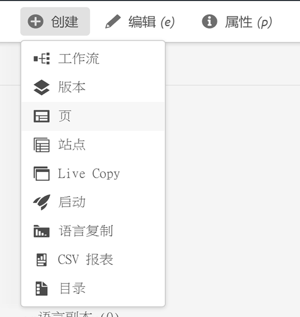
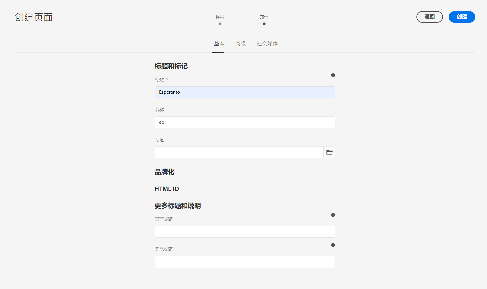
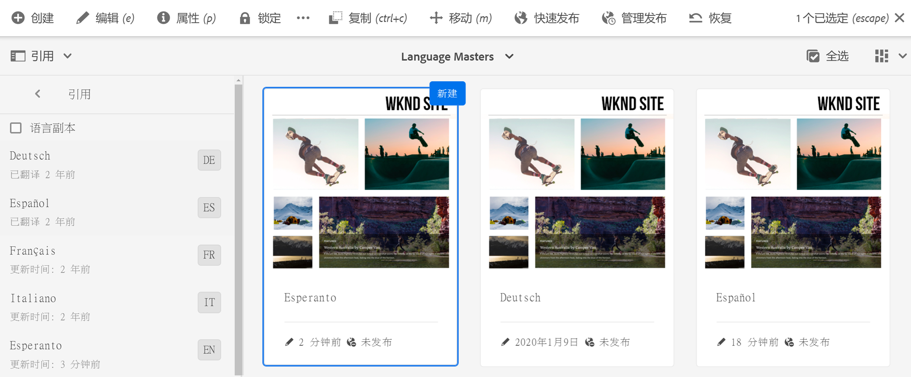
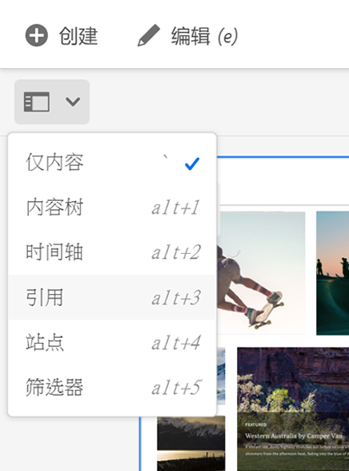

# 准备内容以进行翻译 {#preparing-content-for-translation}

多语言网站通常提供多种语言的一定数量的内容。 网站以一种语言创作，然后翻译成其他语言。 通常，多语言站点由页面的分支组成，其中每个分支包含使用不同语言的站点页面。

>[!TIP]
>
>如果您是翻译内容的新用户，请参阅 [站点翻译历程、](/help/journey-sites/translation/overview.md) 这是使用AEM强大的翻译工具翻译AEM Sites内容的指导路径，非常适合那些没有AEM或翻译经验的用户。

的 [WKND教程网站](/help/implementing/developing/introduction/develop-wknd-tutorial.md) 包括多个语言分支，并使用以下结构：

```text
/content
    |- wknd
        |- language-masters
            |- en
            |- de
            |- es
            |- fr
            |- it
        |- us
            |- en
            |- es
        |- ca
            |- en
            |- fr
        |- ch
            |- de
            |- fr
            |- it
        |- de
            |- de
        |- fr
            |- fr
        |- es
            |- es
        |- it
            |- it
```

最初为其创作网站内容的语言副本是语言主控。 语言主控是翻译成其他语言的源。

网站的每个语言分支都称为语言副本。 语言副本的根页面（称为语言根）标识语言副本中内容的语言。 例如， `/content/wknd/fr` 是法语语言副本的语言根。 语言副本必须使用 [正确配置的语言根](preparation.md#creating-a-language-root) 这样，在执行源站点的翻译时，就能找到正确的语言。

请按照以下步骤来准备网站进行翻译：

1. 创建语言的语言根主控。 例如，英语WKND演示网站的语言根目录为 `/content/wknd/language-masters/en`. 确保根据 [创建语言根](preparation.md#creating-a-language-root).
1. 创作语言的内容主控。
1. 为您的站点创建每个语言副本的语言根目录。 例如，WKND示例网站的法语语言副本为 `/content/wknd/language-masters/fr`.

在准备翻译内容后，您可以在语言副本和关联的翻译项目中自动创建缺失的页面。 (请参阅 [创建翻译项目](managing-projects.md).) 有关AEM中内容翻译流程的概述，请参阅 [翻译多语言网站的内容](overview.md).

## 创建语言根 {#creating-a-language-root}

将语言根创建为语言副本的根页面，以标识内容的语言。 创建语言根目录后，可以创建包含语言副本的翻译项目。

要创建语言根，请创建页面并使用ISO语言代码作为 **名称** 属性。 语言代码必须采用以下格式之一：

* `<language-code>`  — 支持的语言代码是由ISO-639-1定义的双字母代码，例如 `en`.
* `<language-code>_<country-code>` 或 `<language-code>-<country-code>`  — 支持的国家/地区代码是ISO 3166定义的小写或大写双字母代码，例如 `en_US`, `en_us`, `en_GB`, `en-gb`.

您可以根据为全局网站选择的结构，使用任一格式。  例如，WKND站点的法语语言副本的根页面具有 `fr` 作为 **名称** 属性。 请注意， **名称** 属性用作存储库中页面节点的名称，因此可确定页面的路径(`http://<host>:<4502>/content/wknd/language-masters/fr.html`)。

1. 导航到站点。
1. 单击或点按要创建语言副本的网站。
1. 单击或点按 **创建**，然后单击或点按 **页面**.

   

1. 选择页面模板，然后单击或点按 **下一个**.
1. 在 **名称** 字段，请使用 `<language-code>` 或 `<language-code>_<country-code>`，例如 `en`, `en_US`, `en_us`, `en_GB`, `en_gb`. 键入页面的标题。

   

1. 单击或点按&#x200B;**创建**。在确认对话框中，单击或点按任一 **完成** 返回站点控制台，或 **打开** 以打开语言副本。

## 语言根的地位 {#seeing-the-status-of-language-roots}

AEM提供 **引用** 用于显示已创建语言根列表的边栏。



使用 [边栏选择器。](/help/sites-cloud/authoring/getting-started/basic-handling.md#rail-selector)

1. 在站点控制台中，选择站点的某个页面，然后单击或点按 **引用**.

   

1. 在引用边栏中，单击或点按 **语言副本**. 边栏会显示网站的语言副本。

## 多级语言副本 {#multiple-levels}

语言根也可以分组到节点下，例如按区域，同时仍被识别为语言副本的根。

```text
/content
    |- wknd
        |- language-masters
            |- europe
                |- de
                |- fr
                |- it
                |- es
                ]- pt
            |- americas
                |- en
                |- es
                |- fr
                |- pt
            |- asia
                |- ...
            |- africa
                |- ...
            |- oceania
                |- ...
        |- europe
        |- americas
        |- asia
        |- africa
        |- oceania            
```

>[!NOTE]
>
>只允许一个级别。 例如，以下内容将不允许 `es` 要解析为语言副本的页面：
>
>* `/content/wknd/language-masters/en`
>* `/content/wknd/language-masters/americas/central-america/es`
>
> 此 `es` 将不会检测到语言副本，因为它是2个级别(`americas/central-america`)远离 `en` 节点。

>[!TIP]
>
>在此设置中，语言根可以具有任何页面名称，而不只是语言的ISO代码。 AEM将始终先检查路径和名称，但如果页面名称无法识别语言，AEM将检查 `cq:language` 用于语言标识的页面的属性。
