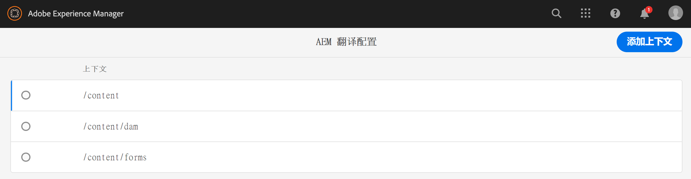
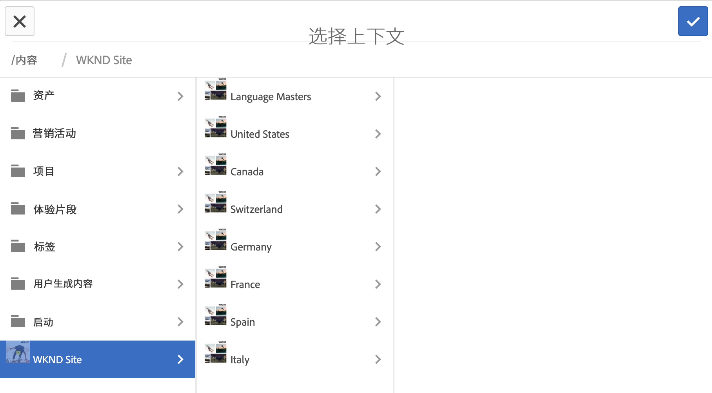
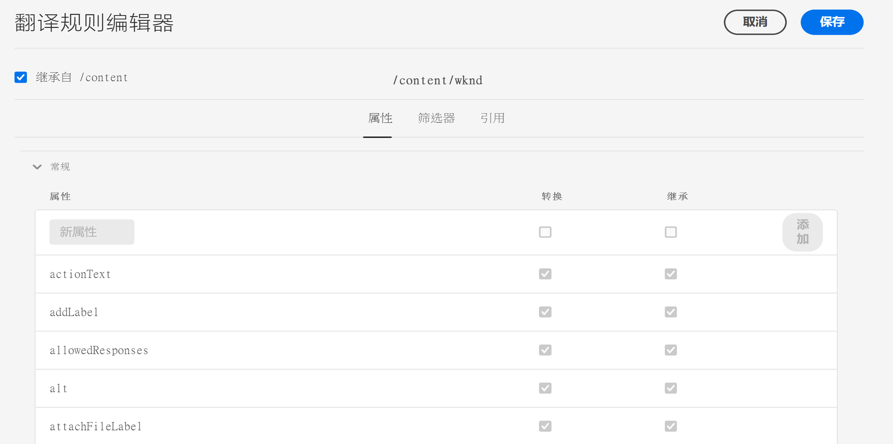
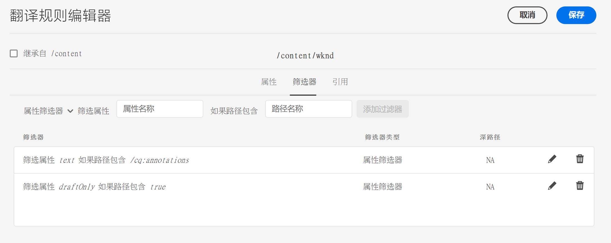
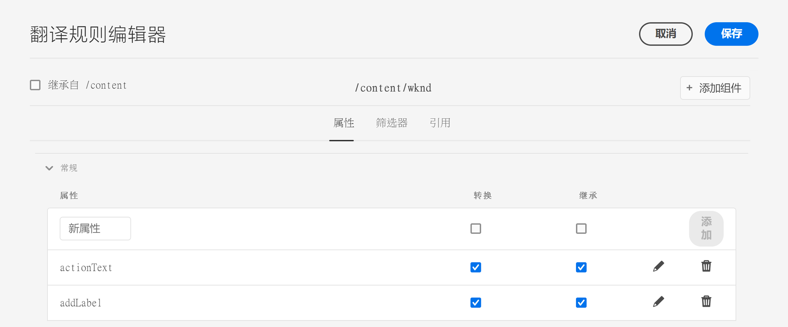

# 识别要翻译的内容{#identifying-content-to-translate}

翻译规则可识别要翻译的内容，这些内容适用于翻译项目中包含或排除的页面、组件和资产。 当页面或资产被翻译时，AEM会提取此内容，以便将其发送到翻译服务。

页面和资产在JCR存储库中以节点表示。 提取的内容是节点的一个或多个属性值。 翻译规则识别包含要提取内容的属性。

翻译规则以XML格式表示，并存储在以下可能的位置：

* `/libs/settings/translation/rules/translation_rules.xml`
* `/apps/settings/translation/rules/translation_rules.xml`
* `/conf/global/settings/translation/rules/translation_rules.xml`

该文件适用于所有翻译项目。

规则包括以下信息：

* 应用规则的节点的路径
   * 该规则也适用于该节点的子项。
* 包含要翻译的内容的节点属性的名称
   * 该属性可以特定于特定资源类型或所有资源类型。

例如，您可以创建一个规则，以将作者添加的内容转换为页面上的所有文本组件。 规则可以识别`/content`节点和`core/wcm/components/text/v2/text`组件的`text`属性。

添加了一个[console](#translation-rules-ui)，用于配置翻译规则。 UI中的定义将为您填充文件。

有关AEM中内容翻译功能的概述，请参阅[多语言站点的内容翻译](overview.md)。

>[!NOTE]
>
>AEM支持在资源类型和引用属性之间进行一对一映射，以转换页面上的引用内容。

## 页面、组件和资产的规则语法{#rule-syntax-for-pages-components-and-assets}

规则是一个`node`元素，其中包含一个或多个子元素`property`和零个或多个子元素`node`:

```xml
<node path="content path">
          <property name="property name" [translate="false"]/>
          <node resourceType="component path" >
               <property name="property name" [translate="false"]/>
          </node>
</node>
```

每个`node`元素都具有以下特征：

* `path`属性包含应用规则的分支的根节点的路径。
* 子`property`元素标识要转换的所有资源类型的节点属性：
   * `name`属性包含属性名称。
   * 如果属性未翻译，则可选的`translate`属性等于`false`。 默认情况下，值为`true`。 此属性在覆盖以前的规则时很有用。
* 子`node`元素标识要针对特定资源类型转换的节点属性：
   * `resourceType`属性包含解析到实现资源类型的组件的路径。
   * 子`property`元素标识要转换的节点属性。 此节点的使用方式与节点规则的子`property`元素相同。

以下示例规则会导致对`/content`节点下所有页面转换所有`text`属性的内容。 该规则对于存储`text`属性中内容的任何组件（如文本组件）都有效。

```xml
<node path="/content">
          <property name="text"/>
</node>
```

以下示例将转换所有`text`属性的内容，还转换图像组件的其他属性。 如果其他组件具有同名属性，则规则不会应用到这些属性。

```xml
<node path="/content">
      <property name="text"/>
      <node resourceType="core/wcm/components/image/v2/image">
         <property name="image/alt"/>
         <property name="image/jcr:description"/>
         <property name="image/jcr:title"/>
      </node>
</node>
```

## 从页面{#rule-syntax-for-extracting-assets-from-pages}提取资产的规则语法

使用以下规则语法来包含在组件中嵌入或从组件中引用的资产：

```xml
<assetNode resourceType="path to component" assetReferenceAttribute="property that stores asset"/>
```

每个`assetNode`元素具有以下特征：

* 一个`resourceType`属性，该属性等于解析到组件的路径
* 一个`assetReferenceAttribute`属性，该属性等于存储资产二进制文件（用于嵌入资产）或引用资产路径的属性名称

以下示例从图像组件中提取图像：

```xml
<assetNode resourceType="core/wcm/components/image/v2/image" assetReferenceAttribute="fileReference"/>
```

## 覆盖规则{#overriding-rules}

`translation_rules.xml`文件由具有多个子`node`元素的`nodelist`元素组成。 AEM从上到下读取节点列表。 当多个规则定向同一节点时，将使用文件中较低的规则。 例如，以下规则会导致除页面的`/content/mysite/en`分支之外，`text`属性中的所有内容都被翻译：

```xml
<nodelist>
     <node path="/content”>
           <property name="text" />
     </node>
     <node path=“/content/mysite/en”>
          <property name=“text” translate=“false" />
     </node>
<nodelist>
```

## 筛选属性{#filtering-properties}

您可以使用`filter`元素筛选具有特定属性的节点。

例如，以下规则会导致除将属性`draft`设置为`true`的节点之外，所有属性中的内容都被翻译。`text`

```xml
<nodelist>
    <node path="/content”>
     <filter>
   <node containsProperty="draft" propertyValue="true" />
     </filter>
        <property name="text" />
    </node>
<nodelist>
```

## 翻译规则UI {#translation-rules-ui}

控制台也可用于配置翻译规则。

要访问它，请执行以下操作：

1. 导航到&#x200B;**工具**，然后导航到&#x200B;**常规**。

1. 选择&#x200B;**翻译配置**。

在翻译规则UI中，您可以：

1. **添加上下文**，用于添加路径。

   

1. 使用路径浏览器选择所需的上下文，然后点按或单击要保存的&#x200B;**Confirm**&#x200B;按钮。

   

1. 然后，您需要选择上下文，然后单击&#x200B;**编辑**。 这将打开翻译规则编辑器。

   

您可以通过UI更改以下四个属性：

* `isDeep`
* `inherit`
* `translate`
* `updateDestinationLanguage`

### isDeep {#isdeep}

**`isDeep`**  适用于节点过滤器，且默认为true。它会检查节点（或其祖先）是否在筛选器中包含具有指定属性值的属性。 如果为false，则仅在当前节点进行检查。

例如，即使父节点的属性`draftOnly`设置为true以标记草稿内容，也会将子节点添加到翻译作业中。 此处`isDeep`开始发挥作用，并检查父节点是否将属性`draftOnly`设置为true并排除这些子节点。

在编辑器中，您可以选中/取消选中&#x200B;**过滤器**&#x200B;选项卡中的&#x200B;**Is Deep**。



以下是在UI中未选中&#x200B;**Is Deep**&#x200B;时生成的XML的示例：

```xml
 <filter>
    <node containsProperty="draftOnly" isDeep="false" propertyValue="true"/>
</filter>
```

### 继承 {#inherit}

**`inherit`** 适用于资产。默认情况下，每个属性都会继承，但如果您希望某个属性不会被子级继承，则可以将此属性标记为false，以便仅将其应用于该特定节点。

在UI中，您可以选中/取消选中&#x200B;**属性**&#x200B;选项卡中的&#x200B;**Inherit**。

### 翻译 {#translate}

**`translate`** 仅用于指定是否转换属性。

在UI中，您可以选中/取消选中&#x200B;**属性**&#x200B;选项卡中的&#x200B;**Translate**。

### updateDestinationLanguage {#updatedestinationlanguage}

**`updateDestinationLanguage`** 用于没有文本但是语言代码的属性，例如 `jcr:language`。用户不是在翻译文本，而是在语言区域设置从源到目标。 此类属性不会发送以进行翻译。

在UI中，您可以选中/取消选中&#x200B;**属性**&#x200B;选项卡中的&#x200B;**Translate**&#x200B;以修改此值，但是，对于具有语言代码作为值的特定属性，可选中/取消选中。

为了帮助阐明`updateDestinationLanguage`和`translate`之间的差异，以下是仅包含两个规则的上下文的简单示例：



xml的结果将如下所示：

```xml
<property inherit="true" name="text" translate="true" updateDestinationLanguage="false"/>
<property inherit="true" name="jcr:language" translate="false" updateDestinationLanguage="true"/>
```

## 手动编辑规则文件{#editing-the-rules-file-manually}

随AEM一起安装的`translation_rules.xml`文件包含一组默认的翻译规则。 您可以编辑文件以支持翻译项目的要求。 例如，您可以添加规则，以便对自定义组件的内容进行翻译。

如果编辑`translation_rules.xml`文件，请将备份副本保留在内容包中。 重新安装某些AEM包可将当前`translation_rules.xml`文件替换为原始文件。 要在这种情况下恢复规则，您可以安装包含备份副本的包。

>[!NOTE]
>
>创建内容包后，每次编辑文件时都重新构建包。

## 翻译规则文件{#example-translation-rules-file}示例

```xml
<?xml version="1.0" encoding="UTF-8"?><nodelist>
  <node path="/content">
    <property name="addLabel"/>
    <property name="allowedResponses"/>
    <property name="alt"/>
    <property name="attachFileLabel"/>
    <property name="benefits"/>
    <property name="buttonLabel"/>
    <property name="chartAlt"/>
    <property name="confirmationMessageToggle"/>
    <property name="confirmationMessageUntoggle"/>
    <property name="constraintMessage"/>
    <property name="contentLabel"/>
    <property name="denyText"/>
    <property name="detailDescription"/>
    <property name="emptyText"/>
    <property name="helpMessage"/>
    <property name="image/alt"/>
    <property name="image/jcr:description"/>
    <property name="image/jcr:title"/>
    <property name="jcr:description"/>
    <property name="jcr:title"/>
    <property name="heading"/>
    <property name="label"/>
    <property name="main"/>
    <property name="listLabel"/>
    <property name="moreText"/>
    <property name="pageTitle"/>
    <property name="placeholder"/>
    <property name="requiredMessage"/>
    <property name="resetTitle"/>
    <property name="subjectLabel"/>
    <property name="subtitle"/>
    <property name="tableData"/>
    <property name="text"/>
    <property name="title"/>
    <property name="navTitle"/>
    <property name="titleDivContent"/>
    <property name="toggleLabel"/>
    <property name="transitionLabel"/>
    <property name="untoggleLabel"/>
    <property name="name"/>
    <property name="occupations"/>
    <property name="greetingLabel"/>
    <property name="signInLabel"/>
    <property name="signOutLabel"/>
    <property name="pretitle"/>
    <property name="cq:panelTitle"/>
    <property name="actionText"/>
    <property name="cq:language" updateDestinationLanguage="true"/>
    <node pathContains="/cq:annotations">
      <property name="text" translate="false"/>
    </node>
    <node path="/content/wknd"/>
  </node>
  <node path="/content/forms">
    <property name="text" translate="false"/>
  </node>
  <node path="/content/dam">
    <property name="dc:description"/>
    <property name="dc:rights"/>
    <property name="dc:subject"/>
    <property name="dc:title"/>
    <property name="defaultContent"/>
    <property name="jcr:description"/>
    <property name="jcr:title"/>
    <property name="pdf:Title"/>
    <property name="xmpRights:UsageTerms"/>
    <property name="main"/>
    <property name="adventureActivity"/>
    <property name="adventureDescription"/>
    <property name="adventureDifficulty"/>
    <property name="adventureGearList"/>
    <property name="adventureGroupSize"/>
    <property name="adventureItinerary"/>
    <property name="adventurePrice"/>
    <property name="adventureTitle"/>
    <property name="adventureTripLength"/>
    <property name="adventureType"/>
    <node pathContains="/jcr:content/metadata/predictedTags">
      <property name="name"/>
    </node>
  </node>
  <assetNode assetReferenceAttribute="fragmentPath" resourceType="cq/experience-fragments/editor/components/experiencefragment"/>
  <assetNode assetReferenceAttribute="fragmentVariationPath" resourceType="core/wcm/components/experiencefragment/v1/experiencefragment"/>
  <assetNode assetReferenceAttribute="fileReference" resourceType="dam/cfm/components/contentfragment"/>
  <assetNode resourceType="docs/components/download"/>
  <assetNode resourceType="docs/components/image"/>
  <assetNode assetReferenceAttribute="fileReference" resourceType="foundation/components/image"/>
  <assetNode assetReferenceAttribute="asset" resourceType="foundation/components/video"/>
  <assetNode assetReferenceAttribute="fileReference" resourceType="foundation/components/download"/>
  <assetNode assetReferenceAttribute="fileReference" resourceType="core/wcm/components/download/v1/download"/>
  <assetNode assetReferenceAttribute="fileReference" resourceType="wcm/foundation/components/image"/>
  <assetNode assetReferenceAttribute="fragmentPath" resourceType="core/wcm/components/contentfragment/v1/contentfragment"/>
  <assetNode assetReferenceAttribute="fileReference" resourceType="core/wcm/components/image/v2/image"/>
</nodelist>
```
