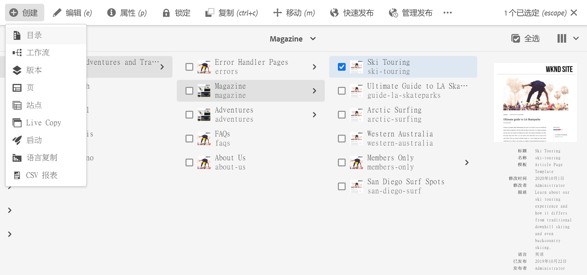
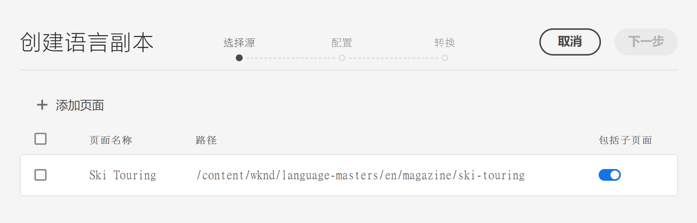
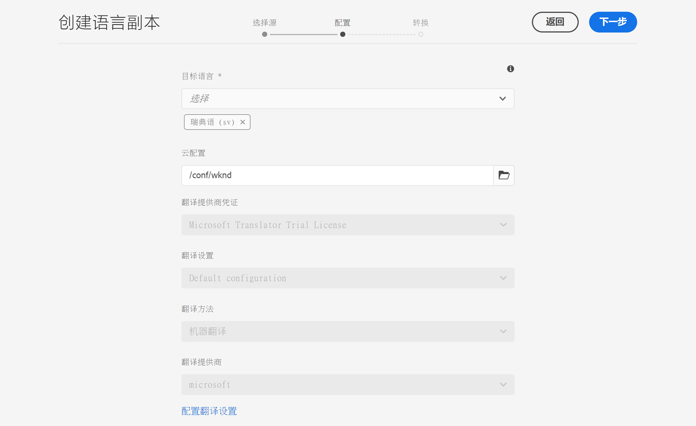
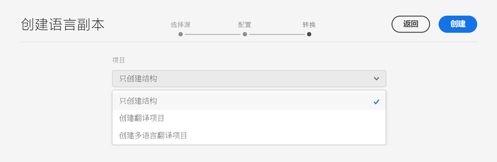
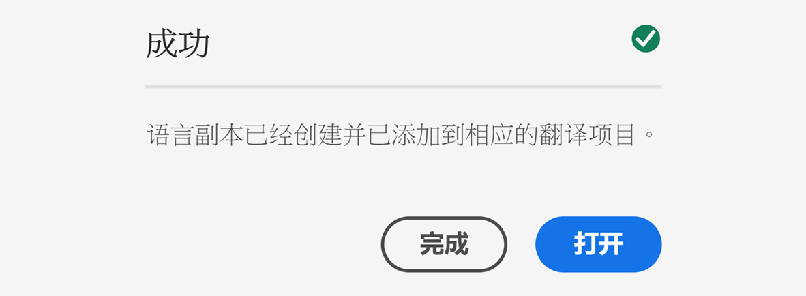

# 语言复制向导 {#language-copy-wizard}

语言复制向导是一种用于创建和检测多语言内容结构的引导式体验。利用此向导，可以轻松快速地创建语言副本。

>[!TIP]
>
>如果不熟悉如何翻译内容，请参阅我们的[站点翻译历程](/help/journey-sites/translation/overview.md)，将指导您使用 AEM 强大的翻译工具翻译您的 AEM Sites 内容，非常适合没有 AEM 或翻译经验的人士。

>[!NOTE]
>
>用户必须是 `project-administrators` 组的成员才能创建站点的语言副本。

要访问该向导，请执行以下操作：

1. 在站点控制台中，选择页面，然后点按或单击&#x200B;**创建**&#x200B;并选择&#x200B;**语言复制**。

   

1. 此向导将打开并显示&#x200B;**选择源**&#x200B;步骤，可让您添加/删除页面。您还可以选择包含或排除子页面。选择要包含的页面，然后点按或单击&#x200B;**下一步**。

   

1. 利用该向导的&#x200B;**配置**&#x200B;步骤，可以添加/删除语言并选择翻译方法。点按或单击&#x200B;**下一步**。

   

   >[!NOTE]
   >
   >默认情况下，只有一种翻译设置。要能够选择其他设置，您必须先配置云配置。请参阅[配置翻译集成框架](integration-framework.md)。

1. 在该向导的&#x200B;**翻译**&#x200B;步骤中，您可以选择仅创建结构、创建新翻译项目或添加到现有翻译项目。

   >[!NOTE]
   >
   >如果您在上一步中选择了多种语言，则将创建多个翻译项目。

   

1. 最后，该向导将显示&#x200B;**创建**&#x200B;按钮。点按或单击&#x200B;**完成**&#x200B;以关闭向导，或者，点按或单击&#x200B;**打开**&#x200B;以查看生成的翻译项目。

   
