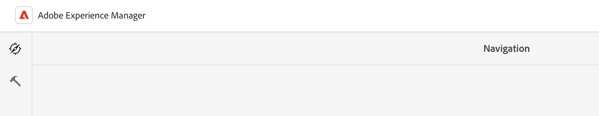
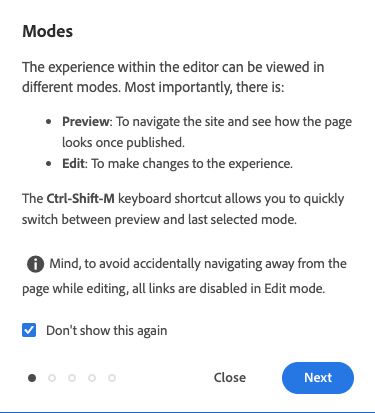

# 基本处理 {#basic-handling}

此文档旨在概述使用AEM创作环境时的基本处理。

>[!TIP]
>
>在整个AEM环境中都可以使用键盘快捷键。 尤其是当 [使用站点控制台](/help/sites-cloud/authoring/sites-console/keyboard-shortcuts.md) 和 [页面编辑器](/help/sites-cloud/authoring/page-editor/keyboard-shortcuts.md).

{{edge-delivery-authoring}}

## 触屏优化 UI {#a-touch-enabled-ui}

AEM 启用了针对触屏的用户界面。触屏界面允许您使用触屏，通过点按、点按并按住和轻扫之类的手势与软件进行交互。 由于 AEM UI 支持触控，因此您可以在手机或平板电脑等触控设备上使用触控手势。但是，您也可以使用传统桌面设备上的鼠标操作，灵活地选择创作内容的方式。

## 首要步骤 {#first-steps}

登录后，您将立即转到[“导航”面板](#navigation-panel)。选择其中一个选项会打开相应的控制台。

为了使您更好地了解 AEM 的基本用法，本文档基于&#x200B;**Sites**&#x200B;控制台进行了介绍。选择于 **站点** 以开始使用。

## 产品导航 {#product-navigation}

每当用户首次访问某个控制台时，都会启动一个产品导航教程。请花上一分钟时间选择以全面了解AEM的基本处理。

选择 **下一个** 以进入概述的下一页。 选择 **关闭** 或选择概述对话框外部以关闭。

该概述将在您下次访问控制台时重新启动，除非您查看所有幻灯片或者选中&#x200B;**不再显示此对话框**&#x200B;选项。

## 全局导航 {#global-navigation}

您可以使用全局导航面板在控制台之间导航。当您选择 **Adobe Experience Manager** 屏幕左上角的链接。

通过单击或点按&#x200B;**关闭**&#x200B;可关闭全局导航面板，以返回到您之前所在的位置。

全局导航有两个面板，它们由屏幕左侧的图标来表示：

* **[导航](#navigation-panel)**  — 登录到AEM时由一个指南针和默认面板表示
* **[工具](#tools-panel)** – 由一个锤子图标来表示

这些面板中的可用选项如下所述。

### “导航”面板 {#navigation-panel}

此 **导航** 面板：

当您在控制台和内容中导航时，浏览器选项卡的标题将更新以反映您的位置。

在“导航”中，可用的控制台有：

| 控制台 | 用途 |
|---|---|
| 项目 | 通过“项目”控制台，您可以直接访问您的项目。[项目是虚拟功能板](/help/sites-cloud/authoring/projects/overview.md)，可用于组建团队。然后，您可以为该团队提供对资源、工作流和任务的访问权限，从而让人们朝着一个共同目标努力。 |
| Sites | [站点控制台](/help/sites-cloud/authoring/sites-console/introduction.md) 允许您创建、查看和管理在AEM实例中运行的站点。 通过此，您可以创建、编辑、复制、移动和删除页面、启动工作流以及发布页面。 |
| 体验片段 | [体验片段](/help/sites-cloud/authoring/fragments/content-fragments.md)是独立的体验，可以跨渠道重复使用，也可以具有变体，从而避免反复地复制和粘贴体验或体验的部分内容。 |
| 资源 | 通过“资源”控制台，您可以导入和管理[数字资源，如图像、视频、文档和音频文件](/help/assets/overview.md)。随后，这些资源便可由同一 AEM 实例上运行的任何站点使用。您还可以从 Assets 控制台创建和管理[内容片段](/help/assets/content-fragments/content-fragments.md)。 |
| 个性化 | 此控制台为[创作目标内容和呈现个性化体验](/help/sites-cloud/authoring/personalization/overview.md)提供了一个工具框架。 |
| 内容片段 | 您可使用[内容片段](/help/sites-cloud/administering/content-fragments/overview.md)设计、创建、管理和发布独立于页面的内容。它们允许您准备结构化内容，以准备在多个位置/多个渠道上使用，非常适合于页面创作和 headless 投放。 |

## “工具”面板 {#tools-panel}

在 **工具** 面板有一个侧面板，其中包含一系列类别，这些类别将相似的控制台组合在一起。 此 **工具** 控制台让您可以访问一些专用工具和控制台，帮助您管理网站、数字资产及内容存储库的其他方面。 <!--The [Tools consoles](/help/sites-administering/tools-consoles.md) provide access to several specialized tools and consoles that help you administer your websites, digital assets, and other aspects of your content repository.-->

## 标题 {#the-header}

标题始终显示在屏幕顶部。无论您位于系统中的何处，标题中的大部分选项都将保持不变，但也有一些选项是特定于上下文的。

* [全局导航](#global-navigation)  — 选择 **Adobe Experience Manager** 用于在控制台之间导航的链接。

  

* 反馈

  

* 您的IMS组织 — 根据需要选择进行更改。

* [解决方案](https://www.adobe.com/cn/cn/experience-cloud.html)  — 选择此项以访问您的其他Adobe解决方案。

  

* [Search](/help/sites-cloud/authoring/search.md)  — 您也可以使用 [快捷键](/help/sites-cloud/authoring/sites-console/keyboard-shortcuts.md) `/` （正斜杠）以从任何控制台中调用搜索。

  

* [帮助](#accessing-help)

  

* [通知](/help/sites-cloud/authoring/inbox.md)  — 此图标带有当前分配的未完成通知的编号。

  

* [用户属性](/help/sites-cloud/authoring/account-environment.md)  — 选择此项以更改用户设置。

  

## 访问帮助 {#accessing-help}

有许多可用的帮助资源以及几种访问帮助资源的方法。

* **工具栏**  — 根据您所在的位置， **帮助** 图标可打开相应的资源：

  

* **控制台**  — 第一次导航系统时， [一系列幻灯片介绍AEM导航](#product-navigation).

  

* **页面编辑器**  — 首次编辑页面时，系统会通过一系列幻灯片来介绍页面编辑器。

  

   * 与在首次访问任何控制台时浏览[产品导航概述](#product-navigation)一样，浏览此概述。
   * 在&#x200B;[**页面信息**&#x200B;菜单中，可以随时通过选择&#x200B;**帮助**](#accessing-help)&#x200B;来再次显示这些幻灯片。

* **工具控制台**  — 从 **工具** 控制台您还可以访问外部 **资源**：

   * **文档** – 查看 Web 体验管理文档
   * **开发人员资源** – 开发人员资源和下载

>[!TIP]
>
>在控制台中，您可以随时使用热键 `?`（问号）访问提供的快捷键概述。
>
>有关所有键盘快捷键的概述，请参阅以下文档：
>
>* [用于编辑页面的键盘快捷键](/help/sites-cloud/authoring/page-editor/keyboard-shortcuts.md)
>* [控制台的键盘快捷键](/help/sites-cloud/authoring/sites-console/keyboard-shortcuts.md)
