# 使用 AEM 创建 Campaign 新闻稿 {#creating-newsletters}

在本文档中，您将了解到如何使用 AEM as a Cloud Service 来创建可与 Adobe Campaign Classic 一起发送的新闻稿。

通过利用 AEM as a Cloud Service 与 Adobe Campaign Classic 之间的集成，您可以使用 AEM 强大的创作工具创建新闻稿。然后，当您准备好发送新闻稿时，可以使用 Campaign 的收件人管理和分发功能进行发送。

## 前提条件 {#prerequisites}

在使用 AEM 创建新闻稿并将其与 Campaign 一起发送之前，您必须首先[将 Adobe Campaign Classic 和 AEM as a Cloud Service 集成。](/help/sites-cloud/integrating/integrating-campaign-classic.md)

## 创建新闻稿结构 {#create-structure}

新闻稿的内容由 AEM 管理，就像您管理网站内容一样。您首先会创建一个“站点”来保存您的内容。在这个“站点”中，您可以按品牌收集您的新闻稿。

1. 登录您的 AEM 作者实例。

1. 从主导航页面，打开&#x200B;**站点**&#x200B;控制台。

1. 在 AEM 的标准安装中，会有一个现成的 **Campaign** 文件夹。选择该文件夹，并单击&#x200B;**“创建”**&#x200B;按钮，然后单击&#x200B;**“页面”**。

   

1. 选择&#x200B;**品牌**&#x200B;作为您的网站模板，然后单击&#x200B;**下一个**。

   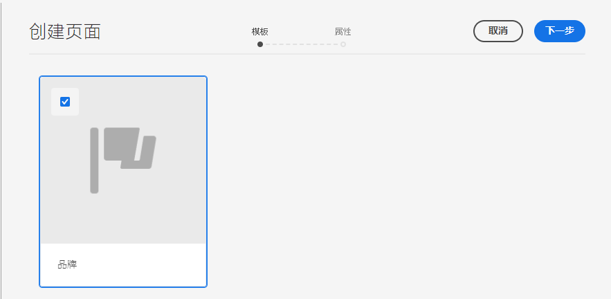

1. 输入&#x200B;**“标题”**，单击&#x200B;**“创建”**，然后单击&#x200B;**“完成”**。

   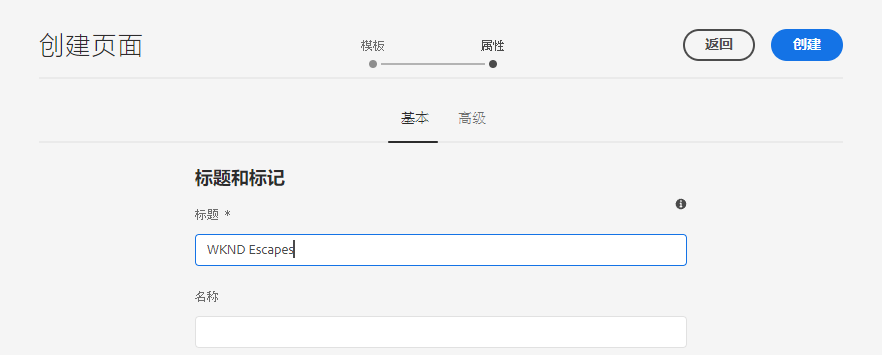

现在，您有了创建活动的基本内容结构。

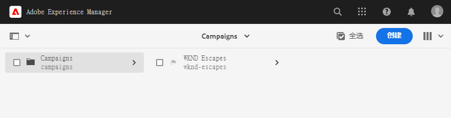

## 创建活动 {#create-campaign}

现在，您有了活动的基本内容结构，就可以创建活动本身了。该活动会用于组织可能存在的多个新闻稿。

1. 使用站点控制台中的[列视图](/help/sites-cloud/authoring/getting-started/basic-handling.md#viewing-and-selecting-resources)，选择您之前创建的品牌（在本例中，为 **WKND Escapes**），然后选择为您自动创建的&#x200B;**“主要区域”**，然后单击&#x200B;**“创建”**&#x200B;按钮，最后点击&#x200B;**“页面”**。

   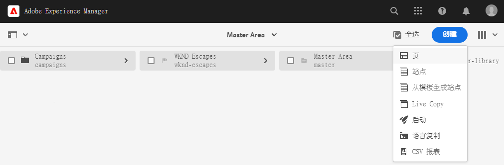

1. 选择 **Campaign** 作为模板，然后单击“**下一个**”和“**完成**”。

   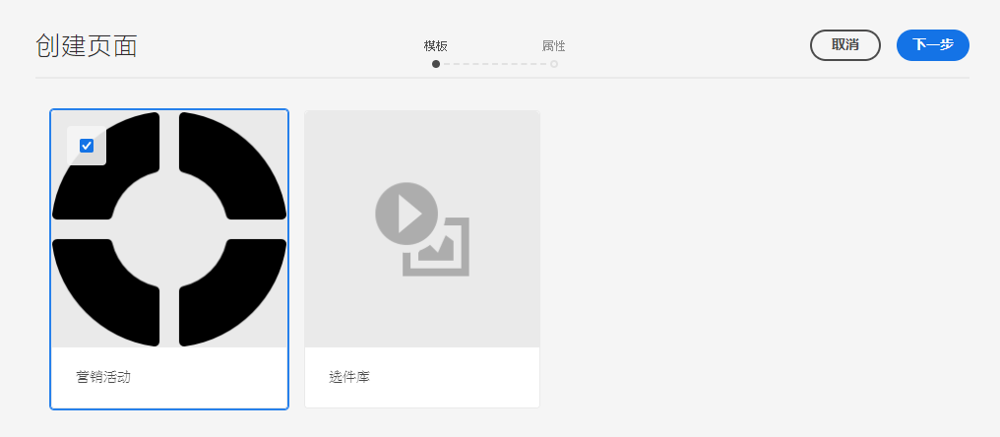

1. 为该活动输入&#x200B;**“标题”**，然后单击&#x200B;**“创建”**&#x200B;和&#x200B;**“完成”**。

   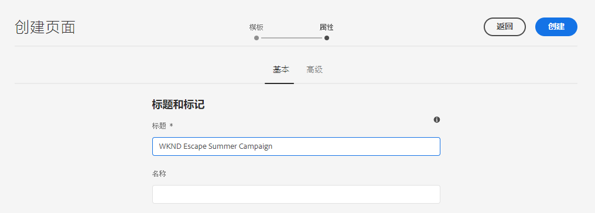

您现在有了一个活动，可以在其中创建新闻稿。

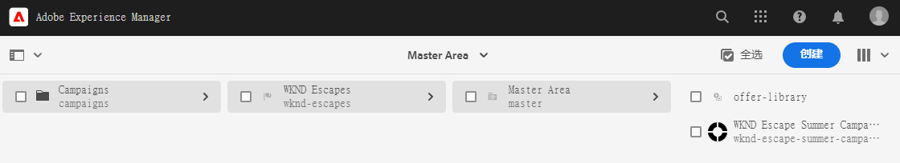

## 选择 Campaign 配置 {#campaign-configuration}

AEM 可以支持多种集成配置。对于新活动，您必须定义用于发送新闻稿内容的配置。

1. 使用站点控制台中的[列视图](/help/sites-cloud/authoring/getting-started/basic-handling.md#viewing-and-selecting-resources)，查找您之前创建的活动（在本例中为 **WKND Escape Summer Campaign**），然后使用复选框选择它，然后单击工具栏上的&#x200B;**“属性”**&#x200B;按钮。

   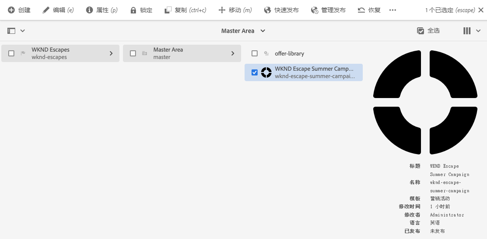

1. 在&#x200B;**属性**&#x200B;窗口中，选择 **Cloud Service** 选项卡以定义与此活动一起使用的集成。

   * 从 **Cloud Service 配置**&#x200B;下拉列表中选择&#x200B;**Adobe Campaign**。
   * 从 **Adobe Campaign** 下拉列表中选择所需的 Adobe Campaign 集成配置。
   * 单击“**保存并关闭**”。

   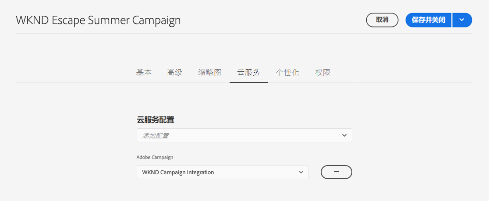

您的活动现在链接到您的 Adobe Campaign 集成。您现在可以在 AEM 中创建新闻稿，并将其与 Adobe Campaign 一起发送。

## 创建新闻稿 {#create-newsletter}

您可以在已创建和配置的活动内容结构下创建和管理新闻稿。

1. 使用站点控制台中的[列视图](/help/sites-cloud/authoring/getting-started/basic-handling.md#viewing-and-selecting-resources)，查找您之前配置的活动（在本例中为 **WKND Escape Summer Campaign**），选择它，然后单击&#x200B;**“创建”**&#x200B;按钮，最后点击&#x200B;**“页面”**。

   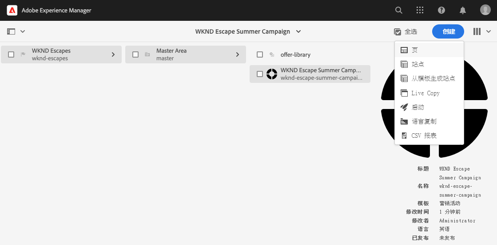

1. 在创建页面向导中，选择 **Adobe Campaign 电子邮件 (AC 6.1)**&#x200B;模板，然后单击&#x200B;**下一个**。

   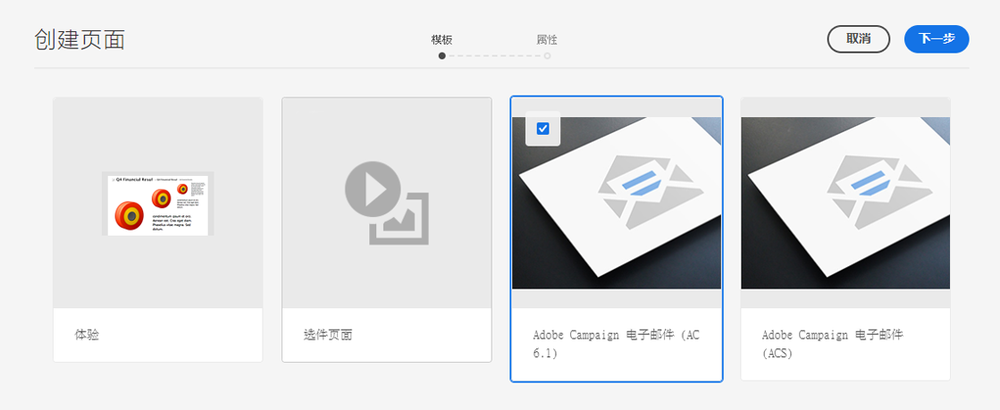

1. 对于向导中的&#x200B;**属性**&#x200B;步骤，输入新闻稿的&#x200B;**标题**，单击&#x200B;**创建**&#x200B;和&#x200B;**打开**。

   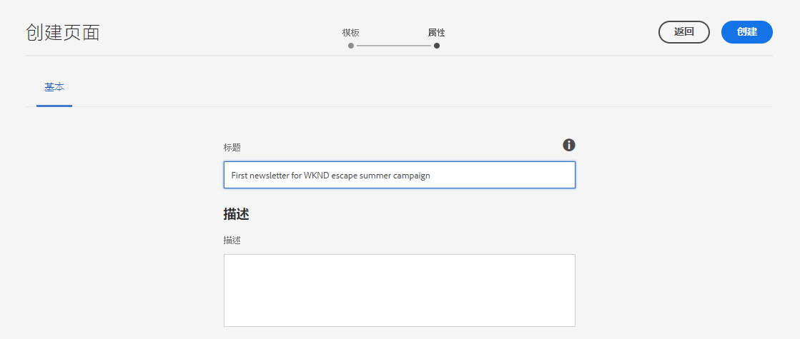

1. 编辑新闻稿页面，就像编辑任何其他 AEM 内容页面一样，以满足您的要求。

您现在有一份新闻稿可以与 Adobe Campaign 一起发送。

## 发布您的新闻稿 {#publishing-newsletter}

您必须发布您的新闻稿，这样才可以通过 Adobe Campaign 发送。

1. 使用站点控制台中的[列视图](/help/sites-cloud/authoring/getting-started/basic-handling.md#viewing-and-selecting-resources)，查找您之前创建的新闻稿（在本例中为 **WKND Escape Summer Campaign 的首份新闻稿**），选择它，然后单击左上方的&#x200B;**页面信息**&#x200B;按钮，最后点击&#x200B;**发布页面**。

1. 选择要发布页面的配置，然后单击&#x200B;**“发布”**。

   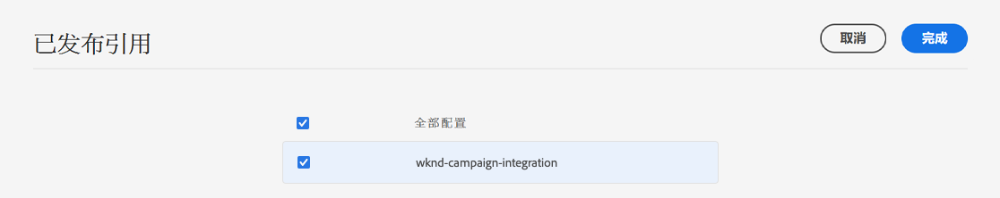

新闻稿页面现已发布到 AEM 发布实例，并在 Adobe Campaign Classic 中可见。若要能够在 Adobe Campaign 中选择它，它必须获得批准。

1. 再次点击新闻稿的&#x200B;**页面信息**&#x200B;按钮，然后选择&#x200B;**“启动工作流”**。

1. 选择&#x200B;**批准 Adobe Campaign**&#x200B;作为工作流模型（可以选择提供描述），然后单击&#x200B;**启动工作流**&#x200B;按钮。

   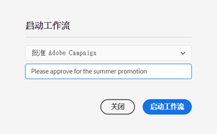

1. 新闻稿页面编辑器顶部会出现一条横幅，其中提供审批流程中接下来步骤的信息。单击&#x200B;**“完成”**。

   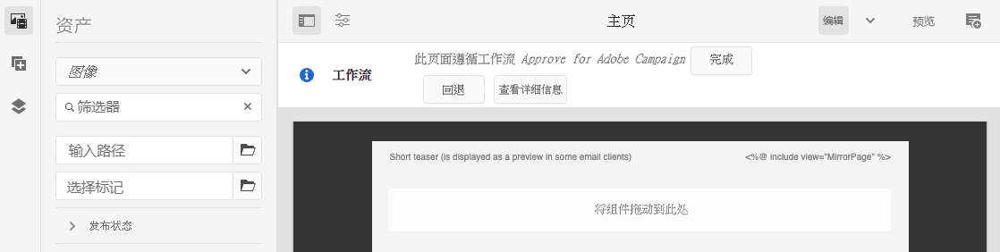

1. 在&#x200B;**完成工作项目**&#x200B;对话框中，选择“**下一个**”下拉列表中的&#x200B;**新闻稿评审（管理员）**，然后单击“**确定**”按钮。

   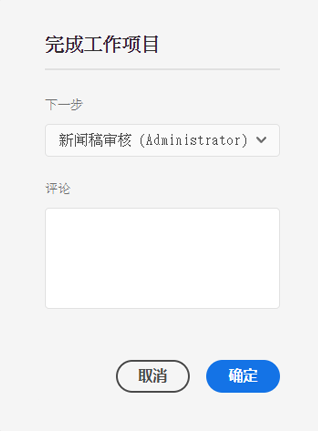

1. 在新闻稿页面编辑器顶部出现的横幅中，再次单击&#x200B;**”完成“**。

1. 在&#x200B;**完成工作项目**&#x200B;对话框中，选择“**下一个**”下拉列表中的&#x200B;**新闻稿批准**，然后单击“**确定**”按钮。

   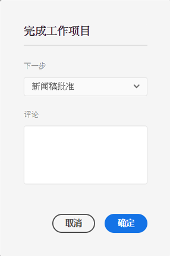

1. 对话框关闭时，出现在新闻稿页面编辑器顶部的横幅将会消失，这是因为审批工作流已完成。

该新闻稿现已在 AEM 中发布，并获准可在 Adobe Campaign 中使用。

>[!TIP]
>
>此处简化了所描述的工作流步骤，以说明流程。在正常的工作流程中，创建新闻稿和批准新闻稿通常是不同的角色
>
>有关使用工作流的详细信息，请参阅文档[使用工作流](/help/sites-cloud/authoring/workflows/overview.md)。

## 正在创建收件人 {#creating-recipient}

为了能够发送您在 AEM 中创建的新闻稿，您必须首先在 Adobe Campaign Classic 中定义收件人。

1. 使用客户端控制台登录 Adobe Campaign Classic。

1. 从菜单栏选择&#x200B;**“工具”** -> **“资源管理器”**。

1. 在资源管理器中，导航到&#x200B;**配置文件和目标**->**收件人**&#x200B;节点。

   

1. 单击工具栏中的“**新建**”，并提供收件人的详细信息。

   * 名字
   * 姓氏
   * 电子邮件地址

1. 单击“**保存**”。

您现在有了一个收件人，您可以使用 Adobe Campaign Classic 向其发送新闻稿。

## 创建电子邮件投放 {#create-delivery}

最后一步是将您在 AEM 中创建的新闻稿发送给您在 Adobe Campaign Classic 中添加的收件人。

1. 使用客户端控制台登录 Adobe Campaign Classic。

1. 从菜单栏选择&#x200B;**“工具”** -> **“资源管理器”**。

1. 在资源管理器中，导航到&#x200B;**“活动管理”** -> **“投放“**&#x200B;节点，然后单击&#x200B;**”新建“**。

   

1. 在“**投放**”对话框中，从下拉列表中选择&#x200B;**带有 AEM 内容的电子邮件投放**&#x200B;作为&#x200B;**投放模板**，然后单击&#x200B;**继续**。

   

1. 在&#x200B;**电子邮件参数**&#x200B;部分，单击&#x200B;**发件人**&#x200B;链接，输入发件人信息，然后单击“**确定**”。

   * 发件人地址
   * 发件人字段

   

1. 在&#x200B;**电子邮件参数**&#x200B;部分，单击&#x200B;**收件人**&#x200B;链接，打开&#x200B;**选择目标**&#x200B;对话框，然后点击“**添加**”。

   

1. 在&#x200B;**选择目标元素**&#x200B;对话框中，选择&#x200B;**一个收件人**，然后单击&#x200B;**下一个**。

   

1. 使用过滤器，选择您[之前创建的](#creating-recipient)收件人，然后单击&#x200B;**完成**。

   

1. 返回&#x200B;**选择目标**&#x200B;对话框，单击“**确定**”。

1. 在投放窗口中，单击“**同步**”。

   

1. 在&#x200B;**与 AEM 内容同步**&#x200B;对话框中，从列表中选择您之前创建的新闻稿，单击“**确定**”。

1. Adobe Campaign 的电子邮件内容与您在 AEM 中创建的新闻稿内容同步。

   * 如果内容未自动加载，请单击&#x200B;**刷新内容**。

1. 单击“**发送**”，发送电子邮件。

1. 在“**发送到主要投放目标**”对话框中，选择&#x200B;**尽快投放**，然后单击“**分析**”。

   

1. 分析步骤会构建投放流程，并将内容与收件人相结合。现在已创建了投放项目，请单击“**确认投放**”来发送电子邮件。单击&#x200B;**“是”**&#x200B;以确认。

1. 已开始投放。单击&#x200B;**关闭**。

   

1. 单击&#x200B;**“保存”**，以保存投放操作。

新闻稿已发送！

>[!TIP]
>
>此示例展示了向单个收件人投放新闻稿的简化版投放流程。 当然，正常的投放会包含许多不同的收件人，Adobe Campaign 可简化该流程。有关投放和收件人管理的更多信息，请参阅[ Adobe Campaign Classic 文档。](https://experienceleague.adobe.com/docs/campaign-classic.html)
