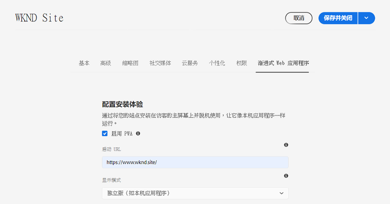
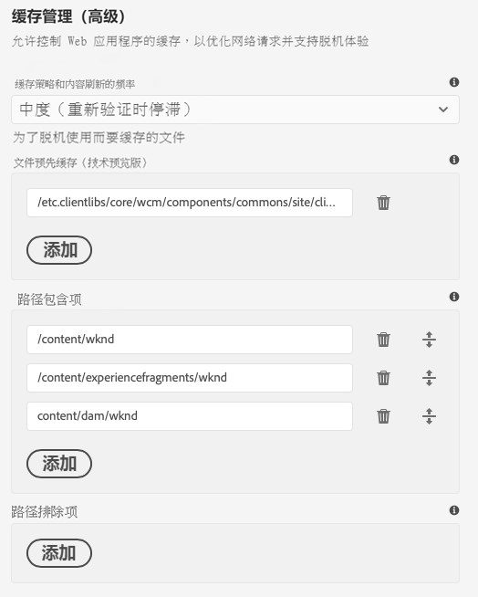

# 启用渐进式Web应用程序功能{#enabling-pwa}

通过简单的配置，内容作者现在可以为在AEM Sites中创建的体验启用渐进式Web应用程序(PWA)功能。

>[!CAUTION]
>
>这是一项高级功能，它需要：
>
>* PWA知识
>* 了解您的网站和内容结构
>* 了解缓存策略
>* 开发团队的支持

>
>
在使用此功能之前，建议您与开发团队讨论此问题，以定义将其用于项目的最佳方式。

>[!NOTE]
>
>本文档中描述的功能计划于2021年3月发行的AEM作为Cloud Service提供。](https://experienceleague.adobe.com/docs/experience-manager-release-information/aem-release-updates/update-releases-roadmap.html)[

## 简介 {#introduction}

[渐进式Web应用程序(PWA)](https://developer.mozilla.org/en-US/docs/Web/Progressive_web_apps) 为AEM网站提供沉浸式应用程序样的体验，方法是允许将这些体验存储在用户计算机上的本地，并且可以离线访问。即使丢失了Internet连接，用户仍可以在移动中浏览网站。 即使网络丢失或不稳定，PWA也能提供无缝体验。

内容作者无需对网站进行任何重新编码，而是能够将PWA属性配置为站点[页面属性](/help/sites-cloud/authoring/fundamentals/page-properties.md)中的附加选项卡。

* 保存或发布后，此配置将触发一个事件处理程序，该处理程序会写出[清单文件](https://developer.mozilla.org/en-US/docs/Web/Manifest)和[服务工作程序](https://developer.mozilla.org/en-US/docs/Web/API/Service_Worker_API)，以启用站点上的PWA功能。
* 还维护了Sling映射，以确保从应用程序的根提供服务工作程序，以启用允许应用程序内离线功能的代理内容。

通过PWA，用户可以拥有网站的本地副本，从而即使没有Internet连接，也能提供类似应用程序的体验。

>[!NOTE]
>
>渐进式Web应用程序是一项不断发展的技术，支持本地应用程序安装和其他功能[取决于您使用的浏览器。](https://developer.mozilla.org/en-US/docs/Web/Progressive_web_apps/Installable_PWAs#Summary)

## 前提条件 {#prerequisites}

为了能够在您的网站中使用PWA功能，您的项目环境有两项要求：

1. [使用核](#adjust-components) 心组件来利用此功能
1. [调整调](#adjust-dispatcher) 度程序规则以公开所需文件

这些是作者需要与开发团队协调的技术步骤。 每个站点只需执行一次这些步骤。

### 使用核心组件 {#adjust-components}

核心组件2.15.0版及更高版本完全支持AEM站点的PWA功能。 由于AEMaCS始终包含最新版本的核心组件，因此您可以开箱即用地利用PWA功能。 您的AEMaCS项目会自动满足此要求。

>[!NOTE]
>
>Adobe不建议对自定义组件或未从核心组件中扩展的组件使用PWA功能。](https://experienceleague.adobe.com/docs/experience-manager-core-components/using/developing/customizing.html)[
<!--
Your components need to include the [manifest files](https://developer.mozilla.org/en-US/docs/Web/Manifest) and [service worker,](https://developer.mozilla.org/en-US/docs/Web/API/Service_Worker_API) which supports the PWA features.

 To do this, the developer will need to add the following link to the `customheaderlibs.html` file of your page component.

```xml
<link rel="manifest" href="/content/<projectName>/manifest.webmanifest" crossorigin="use-credentials"/>
```

The developer will also need to add the following link to the `customfooterlibs.html` file of your page component.

```xml
<script>
        // Check that service workers are supported
        if ('serviceWorker' in navigator) {
            // Use the window load event to make sure the page load performs well
            window.addEventListener('load', () => {
                let serviceWorker = '/<projectName>sw.js';
                navigator.serviceWorker.register(serviceWorker);
            });
        }
</script>
```
-->

### 调整调度程序{#adjust-dispatcher}

PWA功能生成并使用`/content/<sitename>/manifest.webmanifest`文件。 默认情况下，[调度程序](/help/implementing/dispatcher/overview.md)不公开此类文件。 要显示这些文件，开发人员必须将以下配置添加到您的站点项目。

```text
File location: [project directory]/dispatcher/src/conf.dispatcher.d/filters/filters.any >

# Allow webmanifest files
/0102 { /type "allow" /extension "webmanifest" /path "/content/*/manifest" }
```

根据您的项目，您可能希望将不同类型的扩展包含到重写规则中。 当您引入规则以隐藏请求并将请求重定向到`/content/<projectName>`时，`webmanifest`扩展在重写条件中可能会很有用。

```text
RewriteCond %{REQUEST_URI} (.html|.jpe?g|.png|.svg|.webmanifest)$
```

## 为您的网站启用PWA{#enabling-pwa-for-your-site}

满足[先决条件](#prerequisites)后，内容作者可以非常轻松地为站点启用PWA功能。 以下是如何执行此操作的基本概要。 [Detailed Options.](#detailed-options)一节中详细介绍了各个选项

1. 登录AEM。
1. 在主菜单中，点按或单击&#x200B;**导航** -> **站点**。
1. 选择您的站点项目，然后点按或单击&#x200B;[**属性**](/help/sites-cloud/authoring/fundamentals/page-properties.md)&#x200B;或使用热键`p`。
1. 选择&#x200B;**渐进式Web应用程序**&#x200B;选项卡并配置适用的属性。 您至少需要：
   1. 选择选项&#x200B;**启用PWA**。
   1. 定义&#x200B;**启动URL**。

      

   1. 将512x512png图标上传到DAM，并将该图标引用作应用程序的图标。

      

   1. 配置您希望服务工作者脱机的路径。 典型的路径有：
      * `/content/<sitename>`
      * `/content/experiencefragements/<sitename>`
      * `/content/dam/<sitename>`
      * 任何第三方字体引用
      * `/etc/clientlibs/<sitename>`

      


1. 点按或单击&#x200B;**保存并关闭**。

您的网站现已配置完成，您可以[将其安装为本地应用程序。](#using-pwa-enabled-site)

## 使用启用PWA的站点{#using-pwa-enabled-site}

现在，您已将[的站点配置为支持PWA,](#enabling-pwa-for-your-site)您便可以自己体验到它。

1. 在[支持的浏览器中访问该站点。](https://developer.mozilla.org/en-US/docs/Web/Progressive_web_apps/Installable_PWAs#Summary)
1. 您将在浏览器的地址栏中看到一个新图标，表示该网站可以作为本地应用程序进行安装。
   * 根据浏览器的不同，图标可能会有所不同，并且浏览器还可能显示一则通知（如横幅或对话框），指示可以将安装为本地应用程序。
1. 安装应用程序。
1. 应用程序将安装在设备的主屏幕上。
1. 打开应用程序，浏览一下，然后查看页面是否离线可用。

## 详细选项{#detailed-options}

以下部分提供了有关[配置站点以进行PWA时可用选项的更多详细信息。](#enabling-pwa-for-your-site)

### 配置可安装的体验{#configure-installable-experience}

这些设置允许您的网站像本机应用程序一样运行，具体方法是：将其安装在访客的主屏幕上，然后脱机使用。

* **启用PWA**  — 这是为网站启用PWA的主要切换开关。
* **启动URL**  — 这是用户加 [载本](https://developer.mozilla.org/en-US/docs/Web/Manifest/start_url) 地安装的应用程序时，应用程序将打开的首选启动URL。
   * 这可以是内容结构中的任何路径。
   * 这不必是根，通常是应用程序的专用欢迎页面。
   * 如果此URL是相对的，则使用清单URL作为解析此URL的基本URL。
   * 如果留空，则该功能将使用安装我们应用程序的网页的地址。
   * 建议设置一个值。
* **显示模式**  — 启用PWA的应用程序仍然是通过浏览器交付的AEM网站。[这些显](https://developer.mozilla.org/en-US/docs/Web/Manifest/display) 示选项定义如何隐藏浏览器或以其他方式显示给本地设备上的用户。
   * **独立**  — 浏览器对用户完全隐藏，看起来像是本机应用程序。这是默认值。
      * 使用此选项，必须使用网站页面上的链接和组件完全通过您的内容进行应用程序导航，而无需使用浏览器的导航控件。
   * **浏览器**  — 浏览器与访问网站时的常规情况相同。
   * **最低的UI**  — 浏览器大多处于隐藏状态，就像本机应用程序一样，但基本的导航控件会公开。
   * **全屏**  — 浏览器与本机应用程序一样处于完全隐藏状态，但以全屏模式呈现。
      * 使用此选项，必须使用网站页面上的链接和组件完全通过您的内容进行应用程序导航，而无需使用浏览器的导航控件。
* **屏幕方向**  — 作为本地应用程序，PWA需要知道如何处理设 [备方向。](https://developer.mozilla.org/en-US/docs/Web/Manifest/orientation)
   * **任意**  — 应用程序会根据用户设备的方向进行调整。这是默认值。
   * **纵向**  — 无论用户设备的方向如何，此操作都会强制应用程序以纵向布局打开。
   * **横向**  — 这会强制应用程序以横向布局打开，而不考虑用户设备的方向。
* **主题颜色**  — 此选项定义 [应用程](https://developer.mozilla.org/en-US/docs/Web/Manifest/theme_color) 序的颜色，该颜色会影响本地用户操作系统显示本机UI工具栏和导航控件的方式。根据浏览器的不同，它可能会影响其他应用程序演示元素。
   * 使用颜色井弹出窗口选择颜色。
   * 颜色也可以由十六进制或RGB值定义。
* **背景颜色**  — 此颜色定义 [应用程序的背景颜色，](https://developer.mozilla.org/en-US/docs/Web/Manifest/background_color) 将在应用程序加载时显示。
   * 使用颜色井弹出窗口选择颜色。
   * 颜色也可以由十六进制或RGB值定义。
   * 某些浏览器[会从应用程序名称、背景颜色和图标自动](https://developer.mozilla.org/en-US/docs/Web/Manifest#Splash_screens)生成启动屏幕。
* **图标**  — 此图标定 [义](https://developer.mozilla.org/en-US/docs/Web/Manifest/icons) 表示用户设备上应用程序的图标。
   * 该图标必须是大小512x512像素的png文件。
   * 该图标必须存储在DAM中[。](/help/assets/overview.md)

### 缓存管理（高级）{#offline-configuration}

这些设置使此站点的某些部分离线可用，并可在访客设备上本地使用。 这允许控制Web应用程序的缓存，以优化网络请求和支持离线体验。

* **缓存策略和内容刷新频率**  — 此设置为PWA定义缓存模型。
   * **适度**  -  [此设](https://web.dev/stale-while-revalidate/) 置适用于大多数网站，为默认值。
      * 通过此设置，用户首次查看的内容将从缓存中加载，当用户使用该内容时，将重新验证缓存中的其余内容。
   * **经常**  — 对于需要快速更新的网站（例如拍卖行），情况就是这样。
      * 通过此设置，应用程序将首先通过网络查找最新的内容，如果不可用，则将回退到本地缓存。
   * **很少**  — 对于几乎为静态的网站（如引用页面），情况并非如此。
      * 通过此设置，应用程序将首先在缓存中查找内容，如果不可用，则会回退到网络以检索内容。
* **文件预缓存**  — 在安装服务工作程序时以及在使用服务工作程序之前，在AEM上托管的这些文件将保存到本地浏览器缓存中。这可确保Web应用程序在离线时能够完全正常工作。
* **路径包含**  — 将根据配置的缓存策略和内容刷新频率，拦截已定义路径的网络请求并返回 **缓存的内容**。
* **缓存排除**  — 无论文件预缓存和路径包含 **下的设置如何，都** 不会缓 ****&#x200B;存这些文件。

>[!TIP]
>
>您的开发人员团队可能在如何设置离线配置方面有宝贵的意见。

## 限制和Recommendations {#limitations-recommendations}

并非所有PWA功能都适用于AEM Sites。 以下是一些显着的限制。

* 如果用户未使用应用程序，则不会自动同步或更新页面。

Adobe在实施PWA时还会提出以下建议。

### 最大限度地减少要预缓存的资源数量。{#minimize-precache}

Adobe建议您限制要预缓存的页数。

* 嵌入库，以减少预缓存时要管理的条目数。
* 将图像变体的数量限制为预缓存。

### 在项目脚本和样式表稳定后启用PWA。{#pwa-stabilized}

添加缓存选择器后，将交付客户端库，并遵循以下模式`lc-<checksumHash>-lc`。 每当构成库的一个文件（和依赖项）发生更改时，此选择器都会发生更改。 如果列出了要由服务工作人员预缓存的客户端库，并且您想引用新版本，则需要手动检索和更新条目。 因此，我们建议您在项目脚本和样式表稳定后将站点配置为PWA。

### 最大限度地减少图像变化的数量。{#minimize-variations}

AEM核心组件的图像组件确定要获取的最佳呈现版本的前端之一。 此机制还包含对应于该资源上次修改时间的时间戳。 此机制使PWA预缓存的配置变得复杂。

配置预缓存时，用户需要列出可获取的所有路径变量。 这些变量由质量和宽度等参数组成。 强烈建议将这些变体的数量减少到最多3个（小、中、大）。 您可以通过[图像组件的content-policy对话框来执行此操作。](https://experienceleague.adobe.com/docs/experience-manager-core-components/using/components/image.html)

如果未仔细配置，内存和网络消耗会严重影响PWA的性能。 此外，如果您打算预缓存50张图像，并且每张图像的宽度为3，则维护网站的用户必须在页面属性的PWA预缓存部分中保留最多150个条目的列表。

Adobe还建议您在项目使用图像稳定后，将网站配置为PWA。
