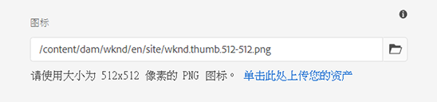

# 启用渐进式 Web 应用程序功能 {#enabling-pwa}

通过简单配置，内容作者现在可以为在 AEM Sites 中创建的体验启用渐进式 Web 应用程序 (PWA) 功能。

>[!CAUTION]
>
>这是一项高级功能，需要您：
>
>* 了解 PWA
>* 了解您的站点和内容结构
>* 了解缓存策略
>* 来自开发团队的支持
>
>在使用此功能之前，建议您与开发团队进行讨论以确定将它用于项目的最佳方式。

## 简介 {#introduction}

利用[渐进式 Web 应用程序 (PWA)](https://developer.mozilla.org/en-US/docs/Web/Progressive_web_apps)，可以将 AEM 站点本地存储在用户计算机上并使其可供脱机访问，从而实施针对 AEM 站点的像应用程序一样的沉浸式体验。即使失去 Internet 连接，用户也可以在旅途中浏览站点。即使网络丢失或不稳定，PWA 也能提供无缝体验。

内容作者无需对站点进行任何重新编码，而是能够将 PWA 属性配置为站点的[页面属性](/help/sites-cloud/authoring/fundamentals/page-properties.md)中的附加选项卡。

* 在保存或发布后，此配置会触发一个写出[清单文件](https://developer.mozilla.org/en-US/docs/Web/Manifest)的事件处理程序和一个在站点上启用 PWA 功能的 [Service Worker](https://developer.mozilla.org/en-US/docs/Web/API/Service_Worker_API)。
* 此外，还将维护 Sling 映射，确保从应用程序根提供 Service Worker 以启用代理内容，从而允许应用程序内的离线功能。

利用 PWA，用户可以获得站点的本地副本，并提供像应用程序一样的体验，即使没有 Internet 连接也是如此。

>[!NOTE]
>
>渐进式 Web 应用程序是一项不断发展的技术，并且支持本地应用程序安装和其他功能，[具体取决于您使用的浏览器。](https://developer.mozilla.org/en-US/docs/Web/Progressive_web_apps/Installable_PWAs#Summary)

## 前提条件 {#prerequisites}

要为您的站点启用 PWA 功能，您的项目环境需达到两个要求：

1. [使用核心组件](#adjust-components)以利用此功能
1. [调整 Dispatcher](#adjust-dispatcher) 规则以公开所需文件

这些是作者将需要与开发团队协调的技术步骤。每个站点只需执行一次这些步骤。

### 使用核心组件 {#adjust-components}

核心组件版本 2.15.0 及更高版本完全支持 AEM Sites 的 PWA 功能。由于 AEMaaCS 始终包含最新版本的核心组件，因此您可以利用现成的 PWA 功能。您的 AEMaaCS 项目将自动满足此要求。

>[!NOTE]
>
>Adobe 建议不要在自定义组件或未[从核心组件扩展](https://experienceleague.adobe.com/docs/experience-manager-core-components/using/developing/customizing.html)的组件上使用 PWA 功能。
<!--
Your components need to include the [manifest files](https://developer.mozilla.org/en-US/docs/Web/Manifest) and [service worker,](https://developer.mozilla.org/en-US/docs/Web/API/Service_Worker_API) which supports the PWA features.

 To do this, the developer will need to add the following link to the `customheaderlibs.html` file of your page component.

```xml
<link rel="manifest" href="/content/<projectName>/manifest.webmanifest" crossorigin="use-credentials"/>
```

The developer will also need to add the following link to the `customfooterlibs.html` file of your page component.

```xml
<script>
        // Check that service workers are supported
        if ('serviceWorker' in navigator) {
            // Use the window load event to make sure the page load performs well
            window.addEventListener('load', () => {
                let serviceWorker = '/<projectName>sw.js';
                navigator.serviceWorker.register(serviceWorker);
            });
        }
</script>
```
-->

### 调整您的 Dispatcher {#adjust-dispatcher}

PWA 功能会生成和使用 `/content/<sitename>/manifest.webmanifest` 文件。默认情况下，[Dispatcher](/help/implementing/dispatcher/overview.md) 不会公开此类文件。要公开这些文件，开发人员必须将以下配置添加到您的站点项目中。

```text
File location: [project directory]/dispatcher/src/conf.dispatcher.d/filters/filters.any >

# Allow webmanifest files
/0102 { /type "allow" /extension "webmanifest" /path "/content/*/manifest" }
```

根据您的项目，您可能需要在重写规则中包含不同类型的扩展。当您引入隐藏请求并将请求重定向到 `/content/<projectName>` 的规则时，将 `webmanifest` 扩展包含在重写条件中会很有用。

```text
RewriteCond %{REQUEST_URI} (.html|.jpe?g|.png|.svg|.webmanifest)$
```

## 为站点启用 PWA {#enabling-pwa-for-your-site}

满足[前提条件](#prerequisites)后，内容作者可以很轻松地为站点启用 PWA 功能。以下是有关如何执行此操作的基本概览。[详细选项](#detailed-options)部分中详述了各个选项。

1. 登录 AEM。
1. 从主菜单中，点按或单击&#x200B;**导航** -> **站点**。
1. 选择您的站点项目，然后点按或单击&#x200B;[**属性**](/help/sites-cloud/authoring/fundamentals/page-properties.md)&#x200B;或使用热键 `p`。
1. 选择&#x200B;**渐进式 Web 应用程序**&#x200B;选项卡，并配置适用的属性。至少您需要：
   1. 选择&#x200B;**启用 PWA** 选项。
   1. 定义&#x200B;**启动 URL**。

      

   1. 将 512x512 png 图标上传到 DAM 并将它引用为应用程序的图标。

      

   1. 配置您希望 Service Worker 离线使用的路径。典型路径为：
      * `/content/<sitename>`
      * `/content/experiencefragements/<sitename>`
      * `/content/dam/<sitename>`
      * 任何第三方字体引用
      * `/etc/clientlibs/<sitename>`

      


1. 点按或单击&#x200B;**保存并关闭**。

您的站点现已配置，您可以[将它作为本地应用程序安装。](#using-pwa-enabled-site)

## 使用已启用 PWA 的站点 {#using-pwa-enabled-site}

现在，您[已配置站点以支持 PWA](#enabling-pwa-for-your-site)，您可以自行体验它。

1. 在[受支持的浏览器](https://developer.mozilla.org/en-US/docs/Web/Progressive_web_apps/Installable_PWAs#Summary)中访问站点。
1. 您将在浏览器的地址栏中看到一个新图标，这表明该站点可作为本地应用程序安装。
   * 此图标可能会因浏览器而异，并且浏览器也可能会显示一个通知（例如，横幅或对话框），指示可以作为本地应用程序安装。
1. 安装应用程序。
1. 应用程序将安装在设备的主屏幕上。
1. 打开应用程序，浏览一下，看看页面是否可供离线使用。

## 详细选项 {#detailed-options}

以下部分提供了有关在[为 PWA 配置站点](#enabling-pwa-for-your-site)时可用的选项的更多详细信息。

### 配置安装体验 {#configure-installable-experience}

利用这些设置，可以将您的站点安装在访客的主屏幕上并离线使用，从而使它像本机应用程序一样运行。

* **启用 PWA** – 这是为站点启用 PWA 的主开关。
* **启动 URL** – 这是用户加载本地安装的应用程序时应用程序将打开的[首选启动 URL](https://developer.mozilla.org/en-US/docs/Web/Manifest/start_url)。
   * 它可以是您的内容结构中的任意路径。
   * 它不一定是根，通常是应用程序的专用欢迎页面。
   * 如果此 URL 是相对的，则清单 URL 将用作基础 URL 以对其进行解析。
   * 如果保留为空，该功能将使用从中安装 Web 应用程序的网页的地址。
   * 建议设置一个值。
* **显示模式** – 启用了 PWA 的应用程序仍然是通过浏览器交付的 AEM 站点。[这些显示选项](https://developer.mozilla.org/en-US/docs/Web/Manifest/display)定义应如何隐藏浏览器或如何以其他方式将浏览器提供给本地设备上的用户。
   * **独立** – 浏览器对用户完全隐藏，看起来像一个本地应用程序。这是默认值。
      * 利用此选项，必须能够使用站点页面上的链接和组件完全通过内容进行应用程序导航，而无需使用浏览器的导航控件。
   * **浏览器** – 在访问站点时，浏览器将正常显示。
   * **最小化 UI** – 浏览器的大部分组件是隐藏的，就像本地应用程序一样，但会显示基础导航控件。
   * **全屏** – 浏览器是完全隐藏的，就像本地应用程序，但在全屏模式下将呈现。
      * 利用此选项，必须能够使用站点页面上的链接和组件完全通过内容进行应用程序导航，而无需使用浏览器的导航控件。
* **屏幕方向** – 作为本地应用程序，PWA 需要了解如何处理[设备转向](https://developer.mozilla.org/en-US/docs/Web/Manifest/orientation)。
   * **任意** – 该应用程序会根据用户设备的方向进行调整。 这是默认值。
   * **纵向** – 强制应用程序以纵向布局打开，而不管用户设备的方向如何。
   * **横向** – 强制应用程序以横向布局打开，而不管用户设备的方向如何。
* **主题颜色** – 定义[应用程序的颜色](https://developer.mozilla.org/en-US/docs/Web/Manifest/theme_color)，将影响本地用户的操作系统显示本机 UI 工具栏和导航控件的方式。它可能会影响其他应用程序演示元素，具体取决于浏览器。
   * 使用颜色井弹出窗口选择颜色。
   * 颜色也可以由十六进制值或 RGB 值定义。
* **背景颜色** – 定义[应用程序的背景颜色](https://developer.mozilla.org/en-US/docs/Web/Manifest/background_color)，此颜色在应用程序加载时显示。
   * 使用颜色井弹出窗口选择颜色。
   * 颜色也可以由十六进制值或 RGB 值定义。
   * 某些浏览器会自动从应用程序名称、背景颜色和图标[构建启动画面](https://developer.mozilla.org/en-US/docs/Web/Manifest#Splash_screens)。
* **图标** – 这将定义在用户设备上表示应用程序的[图标](https://developer.mozilla.org/en-US/docs/Web/Manifest/icons)。
   * 图标必须是大小为 512x512 像素的 png 文件。
   * 图标必须[存储在 DAM 中](/help/assets/overview.md)。

### 缓存管理（高级） {#offline-configuration}

这些设置使该站点的某些部分可以离线使用，并且可以在访客的设备上本地使用。这将允许控制 Web 应用程序的缓存，优化网络请求并支持离线体验。

* **缓存策略和内容刷新频率** – 此设置定义 PWA 的缓存模型。
   * **适度** – [此设置](https://web.dev/stale-while-revalidate/)适用于大多数站点，并且是默认值。
      * 利用此设置，将从缓存中加载用户首先查看的内容，而当用户使用该内容时，缓存中的其余内容将被重新验证。
   * **频繁** – 这适用于拍卖行等需要快速更新的站点。
      * 利用此设置，应用程序将首先通过网络查找最新内容，如果该内容不可用，则将回滚到本地缓存。
   * **很少** – 这适用于几乎静态的站点（例如参考页）。
      * 利用此设置，应用程序将首先在缓存中查找内容，如果该内容不可用，则将回滚到网络来检索它。
* **文件预缓存** – 这些托管于 AEM 上的文件将在安装 Service Worker 时和使用它之前保存到本地浏览器缓存中。这可保证 Web 应用程序在离线时具有完整功能。
* **路径包含** – 根据配置的&#x200B;**缓存策略和内容刷新频率**，拦截定义路径的网络请求并返回缓存内容。
* **缓存排除** – 绝不会缓存这些文件，不管&#x200B;**文件预缓存**&#x200B;和&#x200B;**路径包含**&#x200B;下的设置如何。

>[!TIP]
>
>您的开发人员团队很可能对如何设置离线配置提出宝贵意见。

## 限制和建议 {#limitations-recommendations}

并非所有 PWA 功能都可用于 AEM Sites。这些是几项值得注意的限制。

* 如果用户不使用应用程序，则页面不会自动同步或更新。

在您实施 PWA 时，Adobe 还提出了以下建议。

### 最大程度地减少要预缓存的资源数量。 {#minimize-precache}

Adobe 建议您限制要预缓存的页数。

* 嵌入库以减少预缓存时要管理的条目数。
* 限制要预缓存的图像变体的数量。

### 在使项目脚本和样式表稳定后启用 PWA。 {#pwa-stabilized}

客户端库在交付时添加了一个缓存选择器，并遵循以下模式 `lc-<checksumHash>-lc`。当构成库的某个文件（和依赖项）发生更改时，此选择器也会发生更改。如果您列出了要由 service-worker 预缓存的客户端库，并且想引用新版本，您可以手动检索并更新该条目。因此，我们建议您在使项目脚本和样式表稳定后将站点配置为 PWA。

### 最大程度地减少图像变体的数量。 {#minimize-variations}

AEM 核心组件的图像组件决定了要获取的前端的最佳演绎版。此机制还包括与该资源的最后修改时间对应的时间戳。此机制使 PWA 预缓存的配置难以理解。

在配置预缓存时，用户需要列出所有可获取的路径变体。这些变体由质量和宽度等参数组成。强烈建议将这些变体的数量减少到最多三个：小、中、大。 您可以通过[图像组件](https://experienceleague.adobe.com/docs/experience-manager-core-components/using/components/image.html)的内存策略对话框来执行此操作。

如果不仔细配置，内存和网络消耗会严重影响 PWA 的性能。此外，如果您打算预缓存 50 个图像，并且每个图像具有 3 个宽度，则维护站点的用户将必须在页面属性的 PWA 预缓存部分中维护最多 150 个条目的列表。

Adobe 还建议您在使用图像的项目稳定后将站点配置为 PWA。
