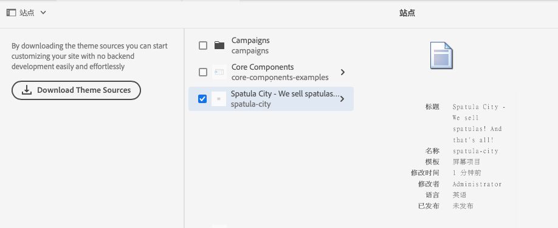

# 基本操作 {#basic-handling}

此文档旨在概述使用 AEM 创作环境时的基本操作。它使用&#x200B;**站点**&#x200B;控制台作为基础。

>[!NOTE]
>
>* 某些功能并不是在所有控制台中均可用，而且某些控制台可能会提供额外的功能。其他页面中会更详细地介绍有关具体控制台及其相关功能的特定信息。
>* 用户在整个 AEM 环境中都可以使用各种键盘快捷键，尤其是在[使用控制台](/help/sites-cloud/authoring/getting-started/keyboard-shortcuts.md)和[编辑页面](/help/sites-cloud/authoring/fundamentals/keyboard-shortcuts.md)时。

## 触屏优化 UI {#a-touch-enabled-ui}

AEM 启用了针对触屏的用户界面。触屏界面允许您使用触屏，通过点按、触摸并按住及轻扫之类的手势与软件进行交互。由于 AEM UI 支持触控，因此您可以在手机或平板电脑等触控设备上使用触控手势。但是，您也可以使用传统桌面设备上的鼠标操作，灵活地选择创作内容的方式。

## 首要步骤 {#first-steps}

登录后，您将立即转到[“导航”面板](#navigation-panel)。选择其中一个选项会打开相应的控制台。

为了使您更好地了解 AEM 的基本用法，本文档基于&#x200B;**站点**&#x200B;控制台进行了介绍。请单击或点按&#x200B;**站点**&#x200B;以开始操作。

## 产品导航 {#product-navigation}

每当用户首次访问某个控制台时，都会启动一个产品导航教程。请花上一分钟的时间，通过单击或点按通读该教程，以大致了解 AEM 的基本操作。

单击或点按&#x200B;**下一步**&#x200B;以前进至概述的下一个页面。单击或点按&#x200B;**关闭**，或者单击或点按概述对话框外部可将其关闭。

该概述将在您下次访问控制台时重新启动，除非您查看所有幻灯片或者选中&#x200B;**不再显示此对话框**&#x200B;选项。

## 全局导航 {#global-navigation}

您可以使用全局导航面板在控制台之间导航。单击或点按屏幕左上角的 Adobe Experience Manager 链接，将显示一个全屏下拉菜单以供全局导航。

通过单击或点按&#x200B;**关闭**&#x200B;可关闭全局导航面板，以返回到您之前所在的位置。

全局导航有两个面板，它们由屏幕左侧的图标来表示：

* **[导航](#navigation-panel)** - 登录到 AEM 时由一个指南针图标和默认面板来表示
* **[工具](#tools-panel)** - 由一个锤子图标来表示

这些面板中的可用选项如下所述。

### “导航”面板 {#navigation-panel}

“导航”面板：

当您在控制台和内容中导航时，浏览器选项卡的标题将更新以反映您的位置。

在“导航”中，可用的控制台有：

| 控制台 | 用途 |
|---|---|
| 项目 | 通过“项目”控制台，您可以直接访问您的项目。[项目是虚拟功能板](/help/sites-cloud/authoring/projects/overview.md)，可用于组建团队。然后，您可以为该团队提供对资源、工作流和任务的访问权限，从而让人们朝着一个共同目标努力。 |
| 站点 | “站点”控制台让您可以[创建、查看和管理](/help/sites-cloud/authoring/fundamentals/organizing-pages.md)在 AEM 实例中运行的站点。通过此控制台，您可以创建、编辑、复制、移动和删除页面、启动工作流以及发布页面。 |
| 体验片段 | [体验片段](/help/sites-cloud/authoring/fundamentals/experience-fragments.md)是独立的体验，可以跨渠道重复使用，也可以具有变量，从而避免反复地复制和粘贴体验或体验的部分内容。 |
| 资产 | 通过“资产”控制台，您可以导入和管理[数字资产，如图像、视频、文档和音频文件](/help/assets/overview.md)。 随后，这些资产便可由同一 AEM 实例上运行的任何站点使用。您还可以从“资产”控制台创建和管理[内容片段](/help/assets/content-fragments/content-fragments.md)。 |
| 个性化 | 此控制台为[创作目标内容和呈现个性化体验](/help/sites-cloud/authoring/personalization/overview.md)提供了一个工具框架。 |

## “工具”面板 {#tools-panel}

在“工具”面板中，有一个侧面板，其中包含一系列类别，这些类别将类似的“工具”控制台组合在一起。“工具”控制台让您可以访问一些专用工具和控制台，帮助您管理网站、数字资产及内容存储库的其他方面。<!--The [Tools consoles](/help/sites-administering/tools-consoles.md) provide access to a number of specialized tools and consoles that help you administer your websites, digital assets, and other aspects of your content repository.-->

## 标题 {#the-header}

标题始终显示在屏幕顶部。无论您位于系统中的何处，标题中的大部分选项都将保持不变，但也有一些选项是特定于上下文的。

* [全局导航](#global-navigation)

   选择 **Adobe Experience Manager** 链接可在各控制台之间进行导航。

   

* [搜索](/help/sites-cloud/authoring/getting-started/search.md)

   

   您还可以使用[快捷键](/help/sites-cloud/authoring/getting-started/keyboard-shortcuts.md) `/`（正斜杠）从任何控制台中调用搜索。

* [解决方案](https://www.adobe.com/cn/experience-cloud.html)

   

* [帮助](#accessing-help)

   

* [通知](/help/sites-cloud/authoring/getting-started/inbox.md)

   

   此图标将带有一个标记，显示当前分配的未完成通知的数量。

* [用户属性](/help/sites-cloud/authoring/getting-started/account-environment.md)

   

* [边栏选择器](#rail-selector)

   

   显示的选项取决于您当前所在的控制台。例如，在&#x200B;**站点**&#x200B;中，您可以选择仅限内容（默认）、时间线、引用或过滤器侧面板。

   

* 痕迹导航

   

   痕迹导航位于边栏中间，且始终显示当前选定项的描述，它允许您在特定控制台内导航。在&#x200B;**站点**&#x200B;控制台中，您可以导航浏览网站的各个级别。

   只需单击痕迹导航文本，即会显示一个下拉列表，其中列出了当前选定项的结构层级。单击某个条目可跳转到该位置。

   

* **创建**&#x200B;按钮

   

   单击此按钮后，会根据当前的控制台/上下文显示相应的选项。

* [视图](#viewing-and-selecting-resources)

   视图图标位于 AEM 工具栏的最右侧。因为它也表示当前视图，它会发生变化。例如，在默认视图&#x200B;**列视图**&#x200B;中显示：

   

   您可以在列视图、卡片视图和列表视图之间切换。在列表视图中，还会显示视图设置。

   

   >[!NOTE]
   >
   >**查看设置**&#x200B;选项仅在&#x200B;**列表视图**&#x200B;模式下可用。

* 键盘导航

   您可以只使用键盘导航网站。它使用 **TAB** 键（或 **OPT+TAB**）的标准浏览器功能，在页面上可聚焦的元素之间移动。

   在 **Sites** 控制台中，添加了&#x200B;**跳至主要内容**&#x200B;的选项。当您按 TAB 键浏览标题选项时，该选项将变得可见，并且它可以通过允许您跳过（产品）工具栏中的标准元素并直接进入主要内容来加快导航速度。

   

## 访问帮助 {#accessing-help}

有各种可用的帮助资源：

* **控制台工具栏**

   **帮助**&#x200B;图标将根据您所在的位置打开相应的资源：

   

* **导航**

   首次在系统中导航时，[系统会提供一系列幻灯片来介绍 AEM 导航知识](#product-navigation)。

   

* **页面编辑器**

   首次编辑某个页面时，系统会提供一系列幻灯片来介绍该页面编辑器。

   

   与在首次访问任何控制台时浏览[产品导航概述](#product-navigation)一样，浏览此概述。

   在&#x200B;[**页面信息**&#x200B;菜单中，可以随时通过选择&#x200B;**帮助**](/help/sites-cloud/authoring/fundamentals/environment-tools.md#accessing-help)&#x200B;来再次显示这些幻灯片。

* **“工具”控制台**

   通过&#x200B;**工具**&#x200B;控制台，还可以访问外部&#x200B;**资源**：

   * **文档** - 
查看 Web Experience Management 文档
   * **开发人员资源** - 
开发人员资源和下载

   >[!NOTE]
   >
   >在控制台中，您可以随时使用热键 `?`（问号)访问提供的快捷键概述。
   >
   >有关所有键盘快捷键的概述，请参阅以下文档：
   >
   >* [用于编辑页面的键盘快捷键](/help/sites-cloud/authoring/fundamentals/keyboard-shortcuts.md)
   >* [控制台的键盘快捷键](/help/sites-cloud/authoring/getting-started/keyboard-shortcuts.md)

## “操作”工具栏 {#actions-toolbar}

每当选择资源（例如一个页面或资产）时，工具栏中都会显示一些包含说明性文本的图标以指示各种操作。这些操作取决于以下要素：

* 当前控制台
* 当前上下文
* 是否处于[选择模式](#viewing-and-selecting-resources)

工具栏中可用的操作会发生更改，以反映您可对特定的选定项目执行的操作。

[选择资源](#viewing-and-selecting-resources)的方式依视图而定。

由于某些窗口存在空间限制，因此工具栏的长度可能很快就会超过可用空间。如果发生此情况，将会显示额外的选项。单击或点按省略号（三个点或 **...**）会打开一个下拉选择器，其中包含所有其余的操作。例如，在&#x200B;**站点**&#x200B;控制台中选择了一个页面之后：

>[!NOTE]
>
>各个可用图标根据相应控制台/功能/方案提供。

## 快速操作 {#quick-actions}

在[卡片视图](#card-view)中，某些操作以快速操作图标的形式呈现，同时也在工具栏中提供。快速操作图标一次只能用于一个项目，因此无需预先选择。

当您将鼠标（桌面设备）悬停在资源卡片上时，会见到快速操作。可用的快速操作取决于控制台和上下文。例如，下面是适用于&#x200B;**站点**&#x200B;控制台中的页面的快速操作：

## 查看和选择资源 {#viewing-and-selecting-resources}

从概念上讲，所有视图中的查看、导航和选择操作都相同，只是操作方法根据所使用的视图而略有差异。

在任意可用视图中，您都可以查看、导航和选择资源（以对其执行进一步操作），可通过右上方的图标选择各个视图：

* [列视图](#column-view)
* [卡片视图](#card-view)
* [列表视图](#list-view)

>[!NOTE]
>
>默认情况下，AEM Assets 不会在 UI 中将资产的原始呈现版本显示为任何视图中的缩略图。如果您是管理员，可以使用叠加来配置 AEM Assets，以将原始呈现版本显示为缩略图。

### 选择资源 {#selecting-resources}

选择特定的资源取决于视图和设备的组合：

| 查看 | 选择触控 | 选择桌面 | 取消选择触控 | 取消选择桌面 |
|---|---|---|---|---|
| 列 | 点按缩略图 | 单击缩略图 | 点按缩略图 | 单击缩略图 |
| 卡片 | 点按并按住卡片 | 将鼠标悬停在上方，然后使用勾号快速操作 | 点按卡片 | 单击卡片 |
| 列表 | 点按缩略图 | 单击缩略图 | 点按缩略图 | 单击缩略图 |

#### 全选 {#select-all}

您可以通过单击控制台右上角的&#x200B;**全选**&#x200B;选项来选择任何视图中的所有项目。

* 在&#x200B;**卡片视图**&#x200B;中，选择所有卡片。
* 在&#x200B;**列表视图**&#x200B;中，选择列表中的所有项目。
* 在&#x200B;**列视图**&#x200B;中，选择最左侧列中的所有项目。

#### 取消全选 {#deselecting-all}

在任何情况下，当您选择项目时，即会在工具栏的右上角显示选定项目的计数。

您可以通过以下方式取消选择所有项并退出选择模式：

* 单击或点按计数旁边的 **X**
* 使用 **ESC** 键

在所有视图中，点按键盘上的 Esc 键，均可取消选择所有项目（如果您使用的是桌面设备）。

#### 选择示例 {#selecting-example}

1. 例如在卡片视图中：

   

1. 在选择了某个资源后，顶部标题被[操作工具栏](#actions-toolbar)覆盖，通过该工具栏可访问当前适用于选定资源的操作。

   要退出选择模式，请选择右上角的 **X**，或者使用 **Esc** 键。

### 列视图 {#column-view}

列视图允许通过一系列的级联列，对内容树进行可视化导航。通过此视图，可以查看和遍历您网站的树结构。

选择最左侧列中的资源，将在右侧的列中显示子资源。接着选择右侧列中的资源，又将在右侧的另一个列中显示子资源，然后如此反复。

* 点按或单击资源名称或资源名称右侧的 V 形标记，可以在树中向上和向下导航。

   * 资源名称和 V 形标记在被点按或单击时将会突出显示。
   * 单击/点按的资源的子资源将在其右侧的列中显示。
   * 如果点按或单击的资源名称没有子资源，将在最后的列中显示其详细信息。

* 点按或单击缩略图会选择该资源。

   * 选择后，缩略图上将叠加一个勾号，并且资源名称也会突出显示。
   * 最后的列中将显示选定资源的详细信息。
   * 操作工具栏将变得可用。

   在列视图中选择页面后，选定的页面将与以下详细信息一起显示在最后的列中：

   * 页面标题
   * 页面名称（页面 URL 的一部分）
   * 页面所基于的模板
   * 修改详细信息
   * 页面语言
   * 发布和预览详细信息

### 卡片视图 {#card-view}

* 卡片视图显示各个项目在当前级别的信息卡片。它们提供如下信息：

   * 页面内容的可视表示形式
   * 页面标题
   * 重要日期（如上次编辑时间、上次发布时间）
   * 该页面是否被锁定、隐藏或是 Live Copy 的一部分
   * （在适当时）您何时需要在工作流中采取相应的操作
      * 指示必需操作的标记可能与您的[收件箱](/help/sites-cloud/authoring/getting-started/inbox.md)中的条目相关。

* 此视图中还提供了[快速操作](#quick-actions)，例如选择以及编辑之类的常用操作。

   

* 您可以通过点按/单击卡片对树进行向下导航（注意避免快速操作），或使用[标题中的痕迹导航](#the-header)再次向上导航。

### 列表视图 {#list-view}

* 列表视图列出各项资源在当前级别的信息。
* 您可以通过点按/单击资源名称对树进行向下导航，并使用[标题中的痕迹导航](#the-header)再次向上导航。
* 要轻松选择列表中的所有项目，请使用列表左上角的复选框。

   

   * 如果选择了列表中的所有项目，此复选框即会显示为选中状态。

      * 单击或点按此复选框可取消选择全部。
   * 如果只选择了部分项目，此复选框中会显示一个减号。

      * 单击或点按此复选框可选择全部。
      * 再次单击或点按此复选框可取消选择全部。

* 可使用位于“视图”按钮下方的&#x200B;**查看设置**&#x200B;选项选择要显示的列。可以显示以下列：

   * **名称** - 页面名称，在多语言创作环境中非常有用，因为它是页面 URL 的一部分，无论用户使用何种语言，都不会发生更改
   * **修改时间** - 上次修改日期和上次修改用户
   * **发布时间** - 发布状态
   * **预览** – 预览状态
   * **模板** – 页面所基于的模板
   * **工作流** - 当前应用于页面的工作流。当您鼠标悬停或打开时间线时，会提供更多信息。
   * **页面分析**
   * **独特访客**
   * **页面停留时间**

      
   默认将显示&#x200B;**名称**&#x200B;列，它构成了页面 URL 的一部分。在某些情况下，作者可能需要访问采用不同语言的页面，在作者不知道页面语言的情况下，查看页面的名称（通常不会更改）会非常有用。

* 可使用列表中每个项目最右侧的点状垂直栏更改项目的顺序。

   >[!NOTE]
   >
   >只有在 `jcr:primaryType` 值为 `sling:OrderedFolder` 的已排序文件夹内才能更改顺序。

   

   单击或点按垂直选择栏并将项目拖到列表中的新位置。

   

## 边栏选择器 {#rail-selector}

**边栏选择器**&#x200B;位于窗口的左上角，会根据您当前的控制台显示相应的选项。

例如，在&#x200B;**站点**&#x200B;控制台中，您可以选择“仅限内容”（默认）、“内容树”、“时间线”、“引用”、“站点详细信息”或“过滤器”侧面板。

如果选择“仅限内容”，则只会显示边栏图标。如果选择其他任何选项，则边栏图标旁边会显示选项名称。

>[!NOTE]
>
>可使用[键盘快捷键](/help/sites-cloud/authoring/getting-started/keyboard-shortcuts.md)快速地在各边栏显示选项之间进行切换。

### 内容树 {#content-tree}

使用内容树，可以快速地在侧面板内的站点层次结构中进行导航，并详细查看当前文件夹中的页面相关信息。

通过将内容树侧面板与列表视图或卡片视图结合使用，用户可以方便地查看项目的层次结构，并通过内容树侧面板在内容结构中轻松导航，还可以在列表视图中查看详细的页面信息。

>[!NOTE]
>
>在层次结构视图中选择某个条目后，可以使用箭头键在层次结构中快速导航。
>
>有关更多信息，请参阅[键盘快捷键](/help/sites-cloud/authoring/getting-started/keyboard-shortcuts.md)。

### 时间线 {#timeline}

时间线可用于查看和/或启动所选资源上已发生的事件。要打开时间线列，请使用边栏选择器：

通过时间线列可以：

* 查看与选定项目相关的各种事件。

   * 可以从下拉列表中选择事件类型：

      * 评论
      * [注释](/help/sites-cloud/authoring/fundamentals/annotations.md)
      * [活动](/help/sites-cloud/authoring/personalization/activities.md)
      * [启动项](/help/sites-cloud/authoring/launches/overview.md)
      * [版本](/help/sites-cloud/authoring/features/page-versions.md)
      * [工作流](/help/sites-cloud/authoring/workflows/overview.md)
         * 临时工作流除外，因为不会保存它们的历史记录信息 <!--With the exception of [transient workflows](/help/sites-developing/workflows.md#transient-workflows) as no history information is saved for these-->
      * 显示全部

* 添加/查看有关选定项目的评论。**评论**&#x200B;框显示在事件列表的底部。键入评论后按回车键将记录该评论。在选择&#x200B;**评论**&#x200B;或&#x200B;**显示全部**&#x200B;时，将显示该评论。

* 特定的控制台还具有其他一些功能。例如，在“站点”控制台中，您可以：

   * [保存版本](/help/sites-cloud/authoring/features/page-versions.md)
   * [启动工作流](/help/sites-cloud/authoring/workflows/applying.md)

这些选项可通过&#x200B;**评论**&#x200B;字段旁边的 V 形标记访问。

### 引用 {#references}

**引用**&#x200B;显示与所选资源的所有关联。例如，在&#x200B;**站点**&#x200B;控制台中，页面的[引用](/help/sites-cloud/authoring/fundamentals/environment-tools.md#references)会显示以下项目：

* [启动项](/help/sites-cloud/authoring/launches/overview.md#launches-in-references-sites-console)
* [Live Copy](/help/sites-cloud/administering/msm/overview.md#openingthelivecopyoverviewfromreferences)
* [语言副本](/help/sites-cloud/administering/translation/preparation.md#seeing-the-status-of-language-roots)
* 内容引用：

   * 从其他页面到所选页面的链接
   * 引用组件在所选页面中借用的内容和/或借出的内容

### 站点 {#site}

**站点**&#x200B;显示[使用站点模板创建的](/help/sites-cloud/administering/site-creation/create-site.md)站点的详细信息。

参阅文档[使用站点边栏管理站点主题](/help/sites-cloud/administering/site-creation/site-rail.md)，了解有关如何使用边栏管理[站点主题](/help/sites-cloud/administering/site-creation/site-themes.md)的更多详细信息。

>[!TIP]
>
>可以在[快速站点创建历程](/help/journey-sites/quick-site/overview.md)中找到从模板创建新站点并自定义其主题的过程的端到端描述。

### 过滤器 {#filter}

这将打开一个与[搜索](/help/sites-cloud/authoring/getting-started/search.md)类似的面板，其中已设置相应的位置过滤器，允许您进一步筛选希望查看的内容。

