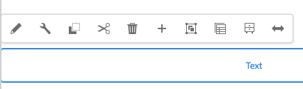

# 使用AEM页面编辑器编辑页面内容 {#edit-content}

AEM页面编辑器是一个用于创作页面内容的强大工具。 了解如何使用它来就地拖放内容和编辑内容。

## 概述 {#overview}

您可以在页面编辑器中执行三个基本操作来编辑内容：

1. [添加新组件](#adding-components) 将它们拖放到页面上。
1. [添加新资源](#adding-asset) 将它们拖放到页面上。
1. [就地编辑组件](#edit-in-place) 页面上已存在的重复项。

AEM页面编辑器提供了用于执行这些任务的直观的UI，并且还提供了对更高级功能的访问权限。

此外，该编辑器允许您组织页面上的现有内容，方法是

* [移动组件](#moving-components)
* [编辑组件布局](#editing-component-layout)
* [编辑组件继承](#inherited-components)

## 添加组件 {#adding-components}

您可以通过从组件库中选择新组件来将这些组件拖放到页面上 [侧面板中的组件浏览器](/help/sites-cloud/authoring/page-editor/editor-side-panel.md#components-browser) 并将其放置在组件占位符中。

### 组件占位符 {#component-placeholder}

组件占位符是一个指示器，用于显示组件在放置时将放置的位置。 它有两种外观。

* 向页面添加新组件（从组件浏览器中拖动）时，它将显示为灰色框，其中包含您放置的组件的详细信息。

  

* 时间 [移动现有组件，](#movging-components) 它将显示为蓝色方块。

  

在这两种情况下，所选目标都将在您拖动的组件下显示为蓝色轮廓。 目标（在释放组件时将放置该组件的位置）。

### 从组件浏览器添加组件 {#adding-a-component-from-the-components-browser}

您可以使用[组件浏览器](/help/sites-cloud/authoring/page-editor/editor-side-panel.md#components-browser)添加新组件。此 [组件占位符](#component-placeholder) 显示了组件所在的位置。

1. 确保页面编辑器位于 [**编辑** 模式。](/help/sites-cloud/authoring/page-editor/introduction.md#mode-selector)
1. 打开 [组件浏览器。](/help/sites-cloud/authoring/page-editor/editor-side-panel.md#components-browser)
1. 将所需的组件拖动到 [所需职位](#component-placeholder) 然后释放。
1. [编辑](#edit-content) 新放置的元件。

>[!NOTE]
>
>在移动设备上，组件浏览器将填满整个屏幕。在开始拖动组件后，浏览器将关闭以再次显示页面，以便您能够放置组件。

### 从段落系统添加组件 {#adding-a-component-from-the-paragraph-system}

您可以使用来添加新组件 **将组件拖动到此处** 段落系统的占位符：

1. 确保页面编辑器位于 [**编辑** 模式。](/help/sites-cloud/authoring/page-editor/introduction.md#mode-selector)
1. 可通过以下两种方式在段落系统中选择和添加新组件：

   * 从现有组件的工具栏或&#x200B;**将组件拖动到此处**&#x200B;框中选择&#x200B;**插入组件**&#x200B;选项 (+)。

     

   * 如果您使用的是桌面设备，则可以双击 **将组件拖动到此处** 盒子。

1. 此 **插入新组件** 对话框打开，允许您选择所需的组件。 点按或单击要添加的组件。

   * 使用搜索筛选器查找组件。
   * 使用组件名称旁边的信息图标了解有关该组件的更多信息。

   

1. 所选的组件即添加到您选择的目标中。 根据需要[编辑](#edit-content)组件。

## 添加资产 {#adding-asset}

您还可以通过从以下位置拖动资产，向页面中添加新组件： [资产浏览器。](/help/sites-cloud/authoring/page-editor/editor-side-panel.md#assets-browser) 这会自动创建相应类型的组件（并包含资产）。

可针对您的安装配置此行为。请参阅文档 [组件参考指南](/help/implementing/developing/components/reference.md#component-placeholders) 以了解更多详细信息。

要通过拖动以上某一资源类型创建组件，请执行以下操作：

1. 确保您的页面位于 [**编辑** 模式。](/help/sites-cloud/authoring/page-editor/introduction.md#mode-selector)
1. 打开[资源浏览器](/help/sites-cloud/authoring/page-editor/editor-side-panel.md#assets-browser)。
1. 将所需的资源拖动到所需位置。此 [组件占位符](#component-placeholder) 显示组件的放置位置，以及插入组件时显示的目标。
1. 将资产发布到目标上。 在包含选定资产的所需位置创建一个适合该资产类型的组件。
1. [编辑](#edit-content) 组件（如有必要）。

>[!NOTE]
>
>在移动设备上，资源浏览器将填满整个屏幕。在开始拖动资源后，浏览器将关闭以再次显示页面，以便您能够放置资源。

如果您在浏览资源时发现需要对某个资源进行快速更改，则可以直接从浏览器中单击该资源名称旁边的编辑图标，以启动[资源编辑器](/help/assets/manage-digital-assets.md)。

## 就地编辑组件 {#edit-in-place}

选择组件会打开组件工具栏。 这提供了对可对组件执行的各种操作的访问权限。

组件工具栏中可用的操作适用于所选的组件。 您可能会看到更多或更少的内容，具体取决于您选择的组件，此处可能会介绍这些组件，也可能不介绍这些组件。

* **编辑** 用于修改组件的内容，通常是就地修改。 其行为取决于组件。

  

* **配置** 用于更改某些不直接与其内容相关的组件参数，通常在对话框中。 其行为取决于组件。

  

* **复制** 将组件复制到剪贴板以粘贴到其他位置。 原始元件保持不变。

  

* **剪切** 将组件复制到剪贴板。 原始组件将被删除。

  

* **删除** 使用您的确认从页面中删除组件。

  

* **插入组件** 打开对话框，转到 [添加新组件。](#adding-a-component-from-the-paragraph-system)

  

* **粘贴** 将组件从剪贴板粘贴到页面。 原件是否保留，取决于您是否使用了 **复制** 或 **剪切**.

   * 您可以粘贴到同一页面或其他页面。
   * 如果粘贴到剪切/复制操作之前已打开的其他页面，则必须刷新该页面才能看到粘贴的内容。
   * 粘贴的项目会被粘贴到选择粘贴操作时所在的项目上方。
   * 仅当剪贴板中含有内容时，才会显示“粘贴”操作。

  

* **组** 允许您同时选择多个组件。 在桌面设备上&#x200B;**按住 Ctrl 并单击**&#x200B;或&#x200B;**按住 Command 并单击**&#x200B;可实现同样的操作。

  

* **父级** 选择选定组件的父组件。

  

* **布局** 可让您修改 [布局](#editing-component-layout) 选定组件的。

   * 此操作仅适用于选定组件，而不会激活整个页面的[布局模式](/help/sites-cloud/authoring/page-editor/introduction.md#mode-selector)。

  

* **转换为体验片段变量** 允许您创建 [体验片段](/help/sites-cloud/authoring/fragments/content-fragments.md) 或将它添加到现有的体验片段中。

  

### 组件编辑对话框 {#component-edit-dialog}

某些组件提供了就地可用内容以外的其他编辑选项。 您可以打开组件的“编辑”对话框，它会 [组件工具栏的“编辑”（铅笔）图标](#component-toolbar) 以访问其他配置选项。

确切的编辑选项取决于组件。对于某些组件 [某些操作将仅在全屏模式下可用](#edit-content-full-screen-mode). 例如：

* 文本组件

  

* 图像组件

  

### 以全屏模式编辑组件 {#edit-content-full-screen-mode}

许多组件提供了用于编辑的全屏模式，可通过此按钮访问这些模式。

全屏编辑允许显示比就地编辑器（如图像组件）更多的编辑选项。

使用 **最小化** 按钮以存在全屏模式。

## 移动组件 {#moving-components}

要移动组件，请执行以下操作：

1. 通过长按或长按选择要移动的组件。
1. 将组件拖动到新位置。

   * 页面编辑器通过指示组件的位置 [占位符](#component-placeholder) 以及可以与目标一起删除段落的位置。

   

1. 将其拖放到所需位置。

>[!TIP]
>
>您也可以使用[剪切并粘贴](#component-toolbar)来移动组件。

## 编辑组件布局 {#editing-component-layout}

您无需为了调整组件而反复不停地从编辑模式切换到[布局模式](/help/sites-cloud/authoring/page-editor/responsive-layout.md)，而是可以为组件选择&#x200B;**布局**&#x200B;操作来更改该组件的布局，在此过程中，由于不必离开编辑模式，从而节省了大量时间。

1. 时间 **编辑** 在站点控制台的模式下，选择一个组件以显示该组件的工具栏。

1. 选择 **布局** 用于调整组件布局的操作。

   

1. 在选择Layout操作后，您可以像在中一样修改组件的布局 [布局模式。](/help/sites-cloud/authoring/page-editor/responsive-layout.md#defining-layouts-layout-mode)

   * 将显示用于调整组件大小的手柄。
   * 在屏幕的顶部将显示模拟器工具栏。
   * 在组件工具栏中将显示布局操作而不是标准编辑操作。

   

1. 在进行必要的布局更改后，点按或单击 **关闭** 组件操作菜单中的按钮以停止修改组件的布局，组件工具栏将返回到其正常的编辑状态。

   

>[!TIP]
>
>“布局”操作仅限用于选定的组件。例如，如果您正在编辑一个组件的布局，然后单击另一个组件，则将为新选择的组件显示标准编辑工具栏（而不是布局工具栏），并且大小调整手柄和模拟器工具栏将会消失。
>
>如果您需要编辑影响到多个组件的总体页面布局，请切换到[布局模式](/help/sites-cloud/authoring/page-editor/responsive-layout.md)。

## 编辑组件继承 {#inherited-components}

继承是一种机制，通过该机制，可以链接内容，以便更改一个内容会自动更改另一个内容。 继承组件可能是多种情况的产物，包括：

* [多站点管理](/help/sites-cloud/administering/msm/overview.md)
* [启动项](/help/sites-cloud/authoring/launches/overview.md)

您可以取消并重新启用继承。 根据组件的不同，如果组件是Live Copy或启动项的一部分，则可以从组件工具栏中使用这些选项。

* **取消继承**

  

* **重新启用继承** 如果继承已取消

  

* **转出** 也在Blueprint或Live Copy源中可用

  
