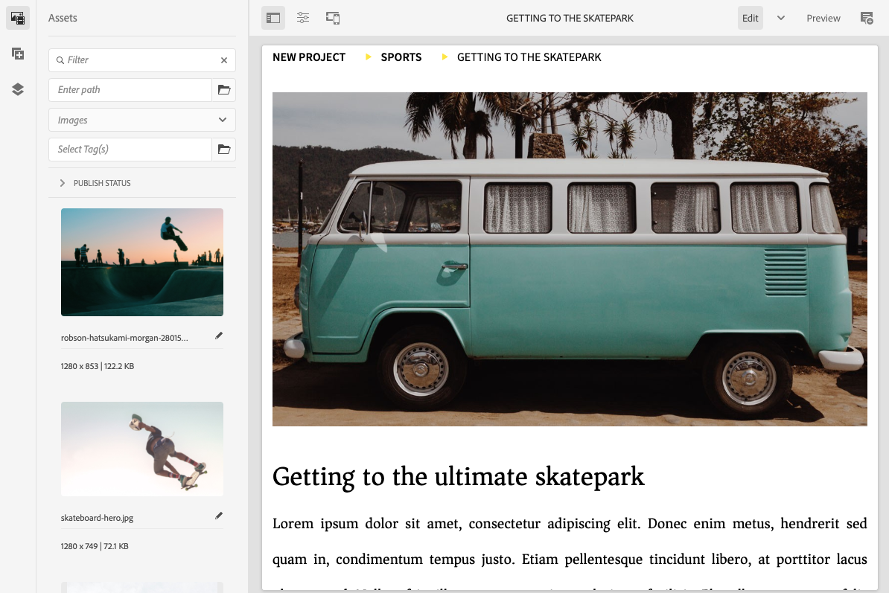
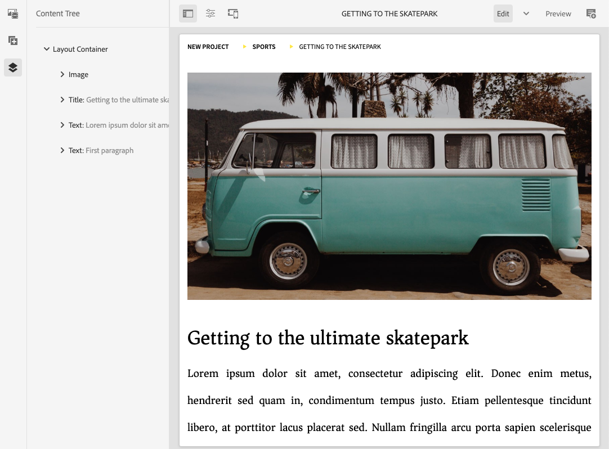

# 页面编辑器侧面板 {#side-panel}

了解如何使用AEM站点编辑器中的侧面板将组件和资产添加到页面。

## 侧面板模式 {#modes}

通过点按或单击 **切换侧面板** 图标（位于页面编辑器工具栏中）。

打开侧面板时，它将从左侧滑开，然后可以从三个重要选项卡中进行选择：

* [组件浏览器](#components-browser) 以向页面添加新内容
* [资产浏览器](#assets-browser) 以向页面中添加新资产
* [内容树](#content-tree) 浏览页面的结构

## 组件浏览器 {#components-browser}

[组件](/help/implementing/developing/components/overview.md) 是用于通过AEM页面编辑器创建内容的构建块。 您可以将多个组件放在一个页面上，并配置其选项以构建内容页面。

组件浏览器会显示当前页面上可用的所有组件。这些组件可拖动至相应的位置，然后进行编辑以添加您的内容。

点按或单击 **组件** 选项卡访问 **组件** 浏览器。

实际外观和操作取决于您所使用的设备类型。

### 移动设备 {#mobile-device-components-browser}

在移动设备上打开组件浏览器时，它将完全覆盖正在编辑的页面。

要将组件添加到页面，请选择并拖动该组件，然后将其向右移动。 组件浏览器将关闭以再次显示页面，您可以在其中放置组件。

>[!NOTE]
>
>当宽度小于1024像素时检测移动设备。

### 桌面设备 {#desktop-device-components-browser}

在桌面设备上打开组件浏览器时，该浏览器显示在窗口的左侧。

要将组件添加到页面，请单击所需的组件，然后将其拖动到所需的位置。

### 使用组件浏览器 {#using-component-browser}

中的组件 **组件** 浏览器代表为：

* 组件名称
* 组件组（灰色）
* 图标或缩写
   * 标准组件的图标是单色的。
   * 缩写始终由组件名称的前两个字符组成。

从&#x200B;**组件**&#x200B;浏览器顶部的工具栏可以：

* 按名称筛选组件。
* 使用下拉选择框将显示内容限定为特定组。

有关组件的更多详细说明，您可以选择中组件旁边的信息图标 **组件** 浏览器（如果可用）。 例如，对于&#x200B;**内容片段**：

有关可供您使用的组件的更多详细信息，请参阅 [组件控制台。](/help/sites-cloud/authoring/components-console.md)

## 资源浏览器 {#assets-browser}

此 **资产** 浏览器显示所有 [资产](/help/assets/overview.md) 当前页面上可用的区段。

点按或单击 **资产** 选项卡以浏览资产。

无限滚动用于在滚动时根据需要展开资源列表。

实际外观和操作取决于您所使用的设备类型：

### 移动设备 {#mobile-device-assets-browser}

在移动设备上打开资产浏览器时，它完全覆盖正在编辑的页面。

要将资源添加到页面，请选择并拖动所需的资源，然后将其向右移动。 资产浏览器将关闭以再次显示页面，您可以在其中将资产添加到所需的组件。

>[!NOTE]
>
>当宽度小于1024像素时检测移动设备。

### 桌面设备 {#desktop-device-assets-browser}

在桌面设备上打开资产浏览器时，它会在窗口的左侧打开。

要将资源添加到页面，请选择所需的资源，然后将其拖动到所需的组件或位置。

### 使用资产浏览器 {#using-assets-browser}

要向页面添加资源，请选择资源并将其拖动到所需的位置。可以添加的资源包括：

* 相应类型的现有组件。
   * 例如，可以将图像类型的资源拖动到图像组件上。
* A [占位符](/help/sites-cloud/authoring/page-editor/edit-content.md#component-placeholder) 在段落系统中创建相应类型的组件。
   * 例如，可以将图像类型的资源拖动到段落系统中，以创建图像组件。

>[!NOTE]
>
>资源拖放适用于特定资源和组件类型。 有关更多详细信息，请参阅[使用资源浏览器插入组件](/help/sites-cloud/authoring/page-editor/edit-content.md#adding-a-component-from)。

从资源浏览器的顶部工具栏中，可以按以下条件筛选资源：

* 名称
* 路径
* 资源类型，如图像、视频、文档、段落、内容片段和体验片段
* 资源特性，如方向和样式
   * 仅适用于某些资源类型

如果您需要快速更改资源，可以直接从资源浏览器启动[资源编辑器](/help/assets/manage-digital-assets.md)，方法是单击资源名称旁边显示的编辑图标。

## 内容树 {#content-tree}

此 **内容树** 以层次结构概览页面上的所有组件，以便您一览页面的构成方式。

>[!NOTE]
>
>如果您正在浏览器宽度小于 1024 像素的移动设备上编辑页面，则内容树将不可用。

点按或单击 **内容树** 选项卡以访问内容树。

打开该选项卡后，您会看到页面或模板的树视图表现形式，以便您更方便地了解其内容的层次构成方式。此外，在复杂的页面上，还可以更轻松地在页面的组件之间跳转。

页面可以由许多相同类型的组件轻松组成，因此内容树会在组件类型名称（黑色）之后显示描述性文本（灰色）。 描述性文本来自组件的常见属性，例如标题或文本。

组件类型会以用户语言显示，而组件描述文本将来自页面语言。

单击组件旁边的 V 形图标将折叠或展开该级别。

单击组件将在页面编辑器中突出显示组件。可用的操作将取决于页面状态。 例如：

## 基本页面 {#basic-page}

基本页面的组件将具有常用选项。

如果在树中单击的组件是可编辑的，则会在其名称右侧显示一个扳手图标。单击此图标将启动组件的编辑对话框。

### Live Copy {#live-copy}

属于的页面 [活动副本](/help/sites-cloud/administering/msm/overview.md)（其中组件继承自其他页面）将具有不同的选项。

## 关联的内容浏览器 {#associated-content-browser}

如果您的页面包含内容片段，您还可以访问 [浏览器查找关联内容。](/help/sites-cloud/authoring/fragments/content-fragments.md#using-associated-content)
