# 使用 ContextHub 配置分段{#configuring-segmentation-with-contexthub}

分段是创建营销活动时的主要考虑事项。有关分段的工作方式和关键术语的信息，请参阅[了解分段](segmentation.md)。

根据您收集到的有关网站访客的信息以及要实现的目标，您将需要定义目标内容所需的区段和策略。

之后，这些区段可用于为访客提供具体的目标内容。此处定义的[活动](activities.md)可以包含在任何页面上，并定义专用内容适用于的访客区段。

AEM 可让您轻松个性化用户体验。它还允许您验证区段定义的结果。

## 访问区段 {#accessing-segments}

[受众](audiences.md)控制台用于管理 ContextHub 的区段以及 Adobe Target 帐户的受众。本文档介绍了如何管理 ContextHub 的区段。

要访问您的区段，请在全局导航中，选择&#x200B;**导航 > 个性化 > 受众**。


## 区段编辑器 {#segment-editor}

<!--The **Segment Editor** allows you to easily modify a segment. To edit a segment, select a segment in the [list of segments](/help/sites-administering/segmentation.md#accessing-segments) and click the **Edit** button.-->
**区段编辑器**&#x200B;可让您轻松修改区段。要编辑区段，请在区段列表中选择一个区段，然后单击&#x200B;**编辑**&#x200B;按钮。

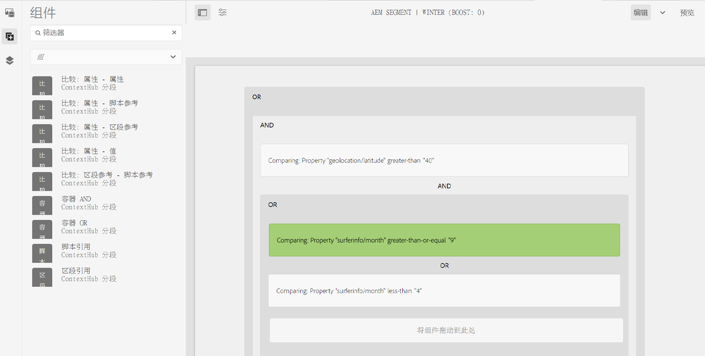

利用组件浏览器，您可以添加 **AND** 和 **OR** 容器来定义区段逻辑，然后添加其他组件以比较属性和值，或参考脚本和其他区段以定义选择标准（请参阅[创建新区段](#creating-a-new-segment)），从而定义选择区段的确切场景。

当整个语句的计算结果为 true 时，表示该区段已解析。在适用多个区段的情况下，也将使用 **Boost** 因素。有关 Boost 因素的详细信息，请参阅[创建新区段](#creating-a-new-segment)。

>[!CAUTION]
>
>区段编辑器不检查任何循环引用。例如，区段 A 引用另一个区段 B，而后者又引用区段 A。您必须确保您的区段不包含任何循环引用。

### 容器 {#containers}

以下容器是现成可用的，可让您将比较和引用分组在一起以进行布尔评估。可以将它们从组件浏览器拖到编辑器中。有关更多信息，请参阅下面的[使用 AND 和 OR 容器](#using-and-and-or-containers)部分。

|  |  |
|---|---|
| 容器 AND | 布尔 AND 运算符 |
| 容器 OR | 布尔 OR 运算符 |

### 比较 {#comparisons}

以下区段比较是现成可用的，可用于评估区段属性。可以将它们从组件浏览器拖到编辑器中。

|  |  |
|---|---|
| Property-Value | 将存储的一个属性与一个定义的值进行比较 |
| Property-Property | 将存储的一个属性与另一个属性进行比较 |
| Property-Segment 引用 | 将存储的一个属性与另一个引用的区段进行比较 |
| Property-Script 引用 | 将存储的一个属性与脚本结果进行比较 |
| 区段 Reference-Script 引用 | 将引用的区段与脚本的结果进行比较 |

>[!NOTE]
>
>在比较值时，如果未设置比较的数据类型（即设置为自动检测），则 ContextHub 的分段引擎将像 javascript 那样简单地比较值。它不会将值转换为预期类型，这可能导致误导性的结果。例如：
>
>`null < 30 // will return true`
>
>因此，在[创建区段](#creating-a-new-segment)时，只要比较的值的类型是已知的，就应选择&#x200B;**数据类型**。例如：
>
>在比较属性 `profile/age` 时，您已知道比较的类型将为 **number**，因此即使未设置 `profile/age`，比较 `profile/age` 小于 30 将返回 **false**，如您预期的那样。

### 引用 {#references}

以下引用是现成可用的，可直接链接到脚本或另一个区段。可以将它们从组件浏览器拖到编辑器中。

|  |  |
|---|---|
| 区段引用 | 评估引用的区段 |
| 脚本引用 | 评估引用的脚本。有关更多信息，请参阅下面的[使用脚本引用](#using-script-references)。 |

## 创建新区段 {#creating-a-new-segment}

要定义新区段，请执行以下操作：

1. 在[访问区段](#accessing-segments)后，[导航到文件夹](#organizing-segments)（您要在该文件夹中创建区段）或将它留在根中。

1. 点按或单击&#x200B;**创建**&#x200B;按钮并选择&#x200B;**创建 ContextHub 区段**。

   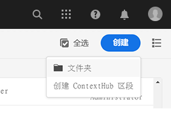

1. 在&#x200B;**新 ContextHub 区段**&#x200B;中，输入区段的标题以及 boost 值（如果需要），然后点按或单击&#x200B;**创建**。

   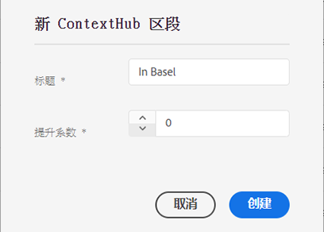

   每个区段都有一个 boost 参数，该参数用作加权因素。较大数字表示，如果存在多个有效区段，则具有较大数字的区段优先于具有较小数字的区段。

   * 最小值：`0`
   * 最大值：`1000000`

1. 在区段控制台中，编辑新创建的区段以在区段编辑器中打开它。
1. 将比较或引用拖动到区段编辑器中，它将显示在默认的 AND 容器中。
1. 双击或点按新引用或区段的配置选项以编辑特定参数。在此示例中，我们正在对巴塞尔的人员进行测试。

   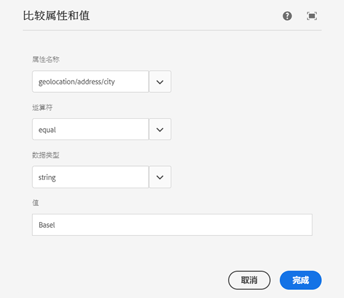

   始终设置&#x200B;**数据类型**（如果可能）以确保正确评估比较。有关更多信息，请参阅[比较](#comparisons)。

1. 单击&#x200B;**完成**&#x200B;以保存您的定义：
1. 根据需要添加更多组件。您可以使用用于 AND 和 OR 比较的容器组件来制定布尔表达式（请参阅下面的[使用 AND 和 OR 容器](#using-and-and-or-containers)）。利用区段编辑器，您可以删除不再需要的组件，或将它们拖到语句中的新位置。

### 使用 AND 和 OR 容器 {#using-and-and-or-containers}

通过使用 AND 和 OR 容器组件，您可以在 AEM 中构建复杂的区段。在执行此操作时，了解一些基本要点会有所帮助：

* 定义的顶层始终是最初创建的 AND 容器。虽然这是无法更改的，但不会影响区段定义的其余部分。
* 确保容器的嵌套有意义。可以将容器视为布尔表达式的括号。

以下示例用于选择我们的瑞士目标组中考虑的访客：

```text
 People in Basel

 OR

 People in Zürich
```

首先，在默认的 AND 容器中放置一个 OR 容器组件。在 OR 容器中，您可以添加属性或引用组件。

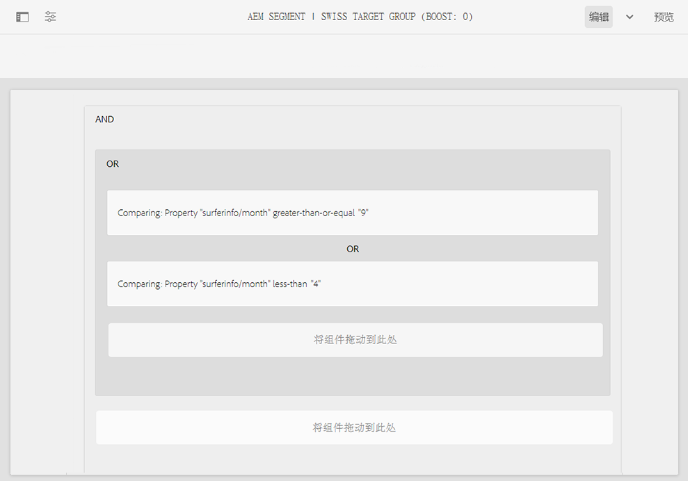

可以根据需要嵌套多个 AND 和 OR 运算符。

### 使用脚本引用 {#using-script-references}

通过使用脚本引用组件，可以将区段属性的评估委派给外部脚本。正确配置脚本后，可将脚本用作区段条件的任何其他组件。

#### 定义要引用的脚本 {#defining-a-script-to-reference}

1. 将文件添加到 `contexthub.segment-engine.scripts` clientlib。
1. 实施返回值的函数。例如：

   ```javascript
   ContextHub.console.log(ContextHub.Shared.timestamp(), '[loading] contexthub.segment-engine.scripts - script.profile-info.js');
   
   (function() {
       'use strict';
   
       /**
        * Sample script returning profile information. Returns user info if data is available, false otherwise.
        *
        * @returns {Boolean}
        */
       var getProfileInfo = function() {
           /* let the SegmentEngine know when script should be re-run */
           this.dependOn(ContextHub.SegmentEngine.Property('profile/age'));
           this.dependOn(ContextHub.SegmentEngine.Property('profile/givenName'));
   
           /* variables */
           var name = ContextHub.get('profile/givenName');
           var age = ContextHub.get('profile/age');
   
           return name === 'Joe' && age === 123;
       };
   
       /* register function */
       ContextHub.SegmentEngine.ScriptManager.register('getProfileInfo', getProfileInfo);
   
   })();
   ```

1. 将脚本注册到 `ContextHub.SegmentEngine.ScriptManager.register`。

如果脚本依赖于其他属性，则脚本应调用 `this.dependOn()`。例如，如果脚本依赖于 `profile/age`，则：

```javascript
this.dependOn(ContextHub.SegmentEngine.Property('profile/age'));
```

#### 引用脚本 {#referencing-a-script}

1. 创建 ContextHub 区段。
1. 在区段的所需位置添加&#x200B;**脚本引用**&#x200B;组件。
1. 打开&#x200B;**脚本引用**&#x200B;组件的编辑对话框。如果[已正确配置](#defining-a-script-to-reference)，则应该可以在&#x200B;**脚本名称**&#x200B;下拉列表中使用脚本。

## 组织区段 {#organizing-segments}

如果您有多个区段，则可能很难采用平面列表形式管理这些区段。在这种情况下，创建文件夹来管理区段会很有用。

### 创建新文件夹 {#create-folder}

1. 在[访问区段](#accessing-segments)后，单击或点按&#x200B;**创建**&#x200B;按钮并选择&#x200B;**文件夹**。

   

1. 提供文件夹的&#x200B;**标题**&#x200B;和&#x200B;**名称**。
   * **标题**&#x200B;应为描述性的。
   * **名称**&#x200B;将成为存储库中的节点名称。
      * 它会根据标题自动生成，并根据 [AEM 命名约定](/help/implementing/developing/introduction/naming-conventions.md)进行调整。
      * 如有必要可以调整。

   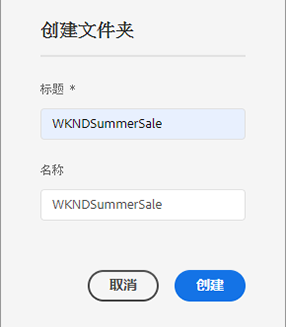

1. 点按或单击&#x200B;**创建**。

   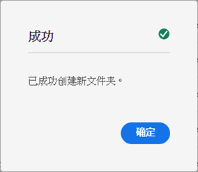

1. 此文件夹将显示在区段列表中。
   * 您的列排序方式将影响新文件夹在列表中的显示位置。
   * 您可以点按或单击列标题来调整您的排序。
      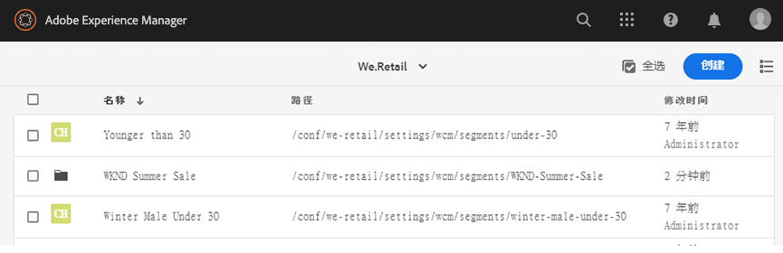

### 修改现有文件夹 {#modify-folders}

1. 在[访问区段](#accessing-segments)后，单击或点按要修改的文件夹以将其选定。

   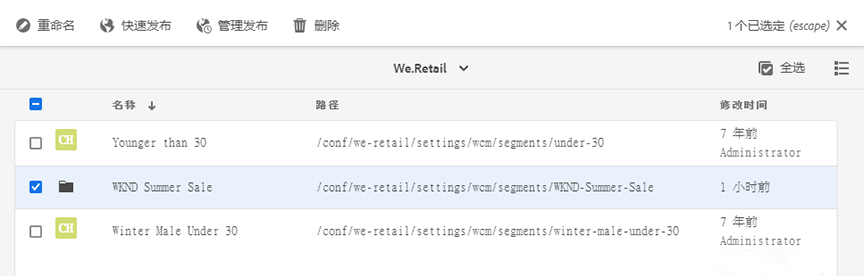

1. 点按或单击工具栏中的&#x200B;**重命名**&#x200B;以重命名文件夹。

1. 提供新的&#x200B;**文件夹标题**&#x200B;并点按或单击&#x200B;**保存**。

   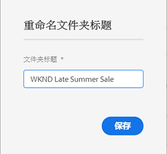

>[!NOTE]
>
>在重命名文件夹时，只能更改标题。无法更改名称。

### 删除文件夹

1. 在[访问区段](#accessing-segments)后，单击或点按要修改的文件夹以将其选定。

   

1. 点按或单击工具栏中的&#x200B;**删除**&#x200B;以删除文件夹。

1. 这将显示一个对话框，其中包含已选择删除的文件夹的列表。

   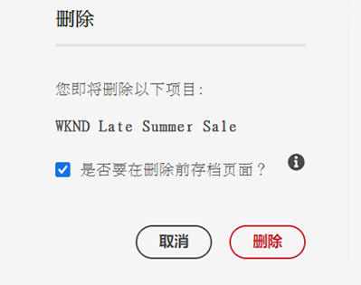

   * 点按或单击&#x200B;**删除**&#x200B;以进行确认。
   * 点按或单击&#x200B;**取消**&#x200B;以中止。

1. 如果任意选定文件夹包含子文件夹或区段，则必须确认将其删除。

   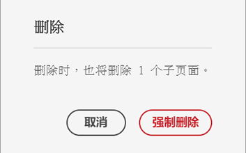

   * 点按或单击&#x200B;**强制删除**&#x200B;以进行确认。
   * 点按或单击&#x200B;**取消**&#x200B;以中止。

>[!NOTE]
>
> 无法将区段从一个文件夹移动到另一个文件夹。

## 测试区段的应用程序 {#testing-the-application-of-a-segment}

定义区段后，可以借助 **[ContextHub](contexthub.md) 测试潜在结果。**

1. 预览页面
1. 单击 ContextHub 图标以显示 ContextHub 工具栏
1. 选择与您创建的区段匹配的角色
1. ContextHub 将为所选角色解析适用的区段

例如，用于标识巴塞尔的用户的简单区段定义基于用户的位置。加载符合这些条件的特定角色会显示是否已成功解析该区段：

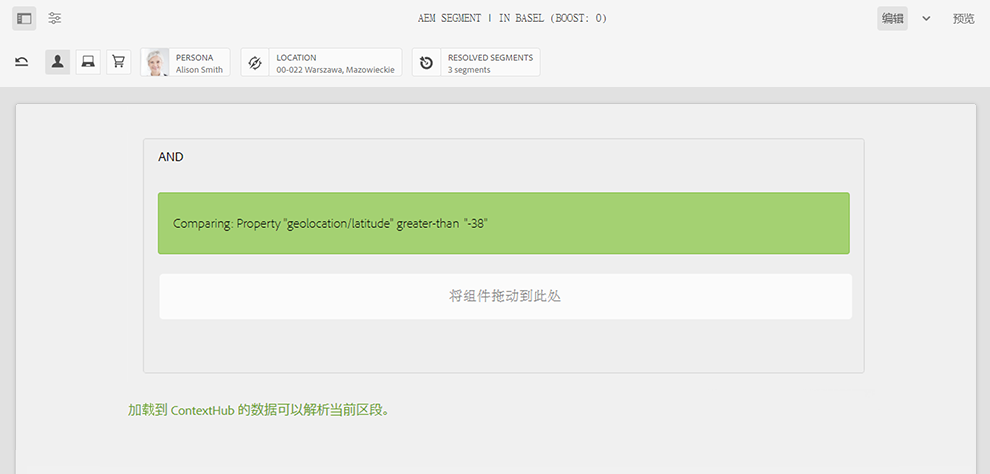

如果未解析：

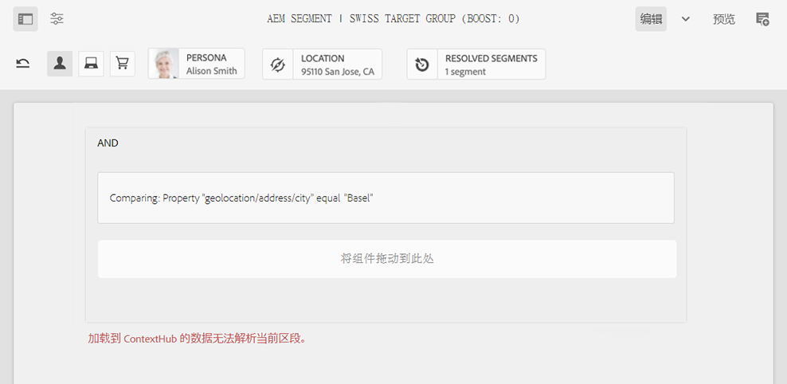

>[!NOTE]
>
>将立即解析所有特征，尽管大多数特征仅在页面重新加载时发生变化。

此类测试也可在内容页面上执行，并与目标内容以及相关的&#x200B;**活动**&#x200B;和&#x200B;**体验**&#x200B;相结合。

如果您已设置活动和体验，则可使用活动轻松测试您的区段。有关设置活动的详细信息，请参阅[有关创作目标内容的文档](targeted-content.md)。

1. 在已设置目标内容的页面的编辑模式下，您可以看到已通过内容上的箭头图标来目标内容。
1. 切换到预览模式并使用 ContextHub，切换到与为体验配置的分段不匹配的角色。
1. 切换到与为体验配置的分段不匹配的角色，并查看体验的相应变化。

## 使用区段 {#using-your-segment}

区段用于控制特定目标受众看到的实际内容。请参阅[管理受众](audiences.md)以详细了解受众和区段，并查看[创作目标内容](targeted-content.md)以了解如何使用受众和区段来目标内容。
