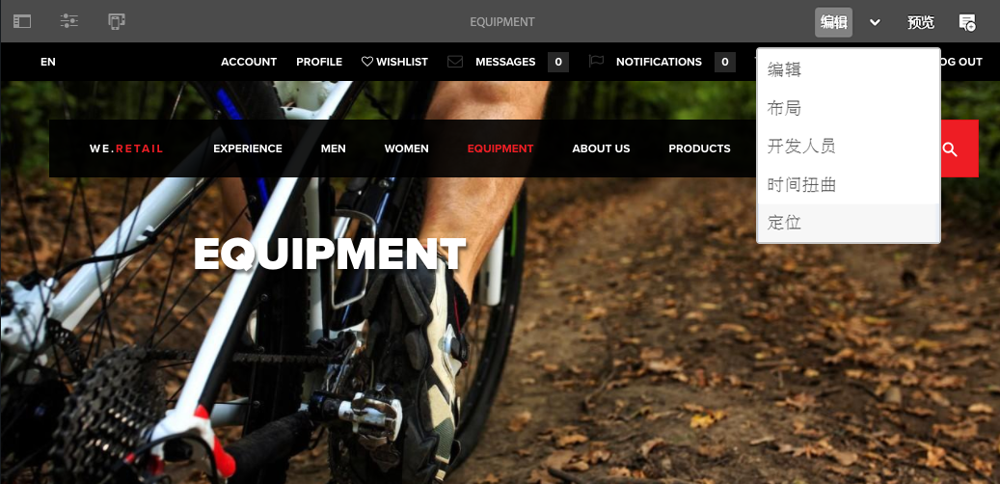
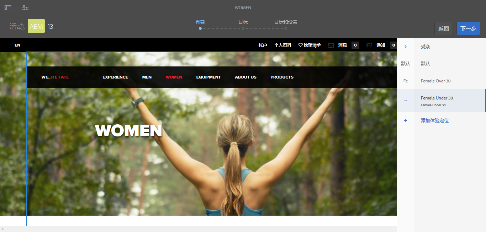
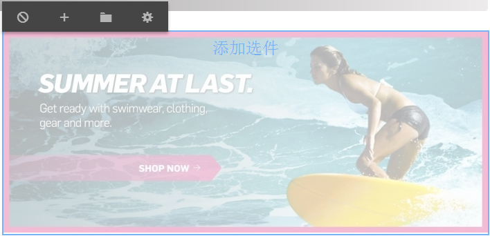
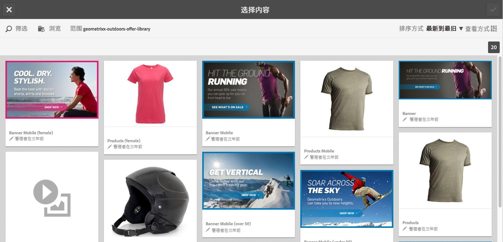
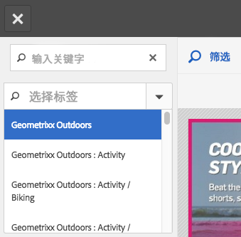
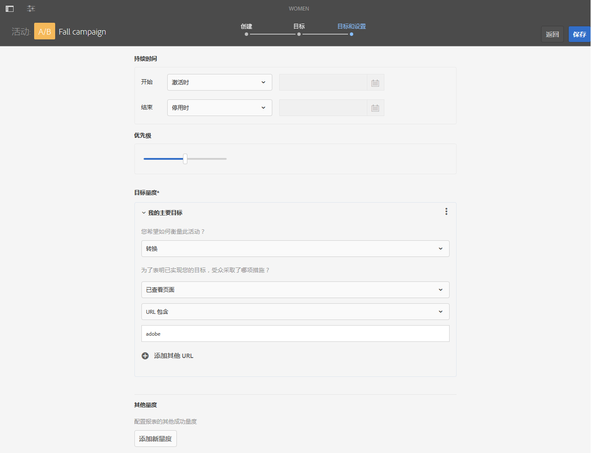
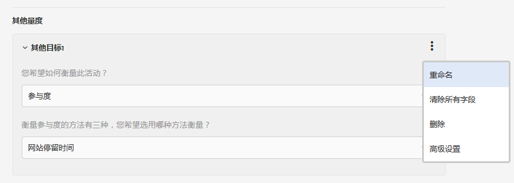
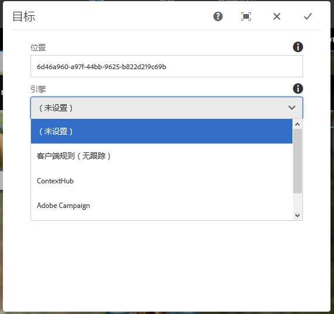

# 使用定位模式创作目标内容 {#authoring-targeted-content-using-targeting-mode}

可使用 AEM 的定位模式创作目标内容。通过定位模式和 Target 组件，可以创建体验的内容：

* 轻松识别页面上的目标内容。所有目标内容周围都有一个虚线组成的边框。
* 选择品牌和活动以查看体验。
* 将体验添加到活动或删除体验。
* 执行 A/B 测试并转换入选方（仅限 Adobe Target）。
* 通过创建选件或使用库中的选件将选件添加到体验。
* 配置目标并监测业绩。
* 模拟用户体验。
* 配置 Target 组件，以进行更多自定义。

>[!NOTE]
>
>定位模式在页面编辑器和体验片段编辑器中均可用。
>
>以下文档适用于两者（因为它们都在相同的基础上运行），尽管该文档是为页面编辑器编写的。

>[!CAUTION]
>
>在页面编辑器中定位时，只能定位体验片段组件。
>
>其他组件类型可以使用组件工具栏上的&#x200B;**转化为体验片段变体**&#x200B;图标。

<!--
>Other component types can be converted to an Experience Fragment using the **Convert to experience fragment variation** icon on the component toolbar:
>
>
-->

您可以将 AEM 或 Adobe Target 用作定位引擎（您必须拥有有效的 Adobe Target 帐户才能使用 Adobe Target）。如果您使用的是 Adobe Target，则必须先配置集成。请参阅[有关集成 Adobe Target 的说明](/help/sites-cloud/integrating/integrating-adobe-target.md)。

您在定位模式下看到的活动和体验反映了[“活动”控制台](/help/sites-cloud/authoring/personalization/activities.md)中的内容：

* 使用定位模式对活动和体验所做的更改会反映在“活动”控制台中。
* 在“活动”控制台中所做的更改也会反映在定位模式中。

>[!NOTE]
>
>在 Adobe Target 中创建营销活动时，会为每个营销活动分配名为 `thirdPartyId` 的属性。在 Adobe Target 中删除营销活动时，不会删除 thirdPartyId。您不能为不同类型（AB、XT）的营销活动重复使用 `thirdPartyId`，也不能手动删除此属性。为避免出现此问题，请为每个营销活动指定唯一的名称；这样，营销活动名称便无法在不同的营销活动类型中重复使用。
>
>如果在同一种营销活动类型中使用相同的名称，则会覆盖现有的营销活动。
>
>如果在同步时遇到错误“请求失败。`thirdPartyId` 已存在”，请更改营销活动的名称，然后重新进行同步。

>[!NOTE]
>
>在定位时，品牌和活动组合会在用户级别保留下来，但不会在通道级别保留。

## 切换到定位模式 {#switching-to-targeting-mode}

切换到定位模式可访问用于创作目标内容的工具。

要切换到定位模式，请执行以下操作：

1. 打开要在其中创作目标内容的页面。
1. 在页面顶部的工具栏上，选择模式下拉菜单以显示可用的模式类型。

   

1. 选择 **定位**. 定位选项随即会显示在页面顶部。

   

## 使用定位模式添加活动 {#adding-an-activity-using-targeting-mode}

可使用定位模式向品牌中添加活动。添加活动时，活动中会包含默认体验。添加活动后，便可以启动活动的内容定位流程。

您也可以在 AEM 中通过选择定位引擎（AEM 或 Adobe Target）和活动类型（体验定位或 A/B 测试），创建并管理 Adobe Target 活动。

此外，您还可以管理所有 Adobe Target 活动的目标和量度，以及管理 Adobe Target 受众。Adobe Target 活动报表（包括 A/B 测试的入选方转换）也包含在内。

添加活动时，活动也会显示在[“活动”控制台](/help/sites-cloud/authoring/personalization/activities.md)中。

要添加活动，请执行以下操作：

1. 使用&#x200B;**品牌**&#x200B;下拉菜单选择要为其创建活动的品牌。

   >[!NOTE]
   >
   >建议[通过活动控制台创建品牌](/help/sites-cloud/authoring/personalization/activities.md#creating-a-brand-using-the-activities-console)。
   >
   >
   >如果您以任何其他方式创建品牌，请确保存在节点 `/campaigns/<brand>/master`，否则在您尝试创建活动时将产生错误。

1. 选择旁边的+ **活动** 下拉菜单。
1. 键入活动的名称。

   >[!NOTE]
   >
   >在创建活动时，如果已将Adobe Target云配置附加到页面或其某个父页面，则AEM会自动将Adobe Target视为引擎。

1. 在&#x200B;**定位**&#x200B;引擎下拉菜单中，选择您的定位引擎。

   * 如果您选择 **ContextHub AEM**，则其余字段会变暗且不再可用。选择&#x200B;**创建**。

   * 如果选择 **Adobe Target**，则可以选择配置（默认情况下，所用的配置是您在配置帐户时提供的配置）和活动类型。<!--If you select **Adobe Target**, you can select a configuration (by default, it is the configuration you provided when you [configured the account](/help/sites-administering/opt-in.md)) and Activity Type.-->

1. 在“活动”菜单中，选择&#x200B;**体验定位**&#x200B;或 **A/B 测试**。

   * “体验定位”- 从 AEM 中管理 Adobe Target 活动。
   * “A/B 测试”- 从 AEM 中创建/管理 Adobe Target 中的 A/B 测试活动。

## 定位流程：创建、定位以及目标和设置 {#the-targeting-process-create-target-and-goals-settings}

在定位模式下，您可以配置活动的多个方面。请使用下面的三步式流程，为品牌活动创建目标内容：

1. [创建](#create-authoring-the-experiences)：添加或删除体验，并为每个体验添加选件。
1. [定位](#target-configuring-the-audiences)：指定每个体验所定位的受众。您可以定位特定的受众，而且如果使用 A/B 测试，则还可以决定每个体验的流量百分比。
1. [目标和设置](#goals-settings-configuring-the-activity-and-setting-goals)：计划活动并设置优先级。您还可以设置成功量度目标。

请使用以下操作过程，启动活动的内容定位流程。

>[!NOTE]
>
>要使用该定位流程，您必须是“Target 活动作者”用户组的成员。

要添加活动，请执行以下操作：

1. 在&#x200B;**品牌**&#x200B;下拉菜单中，选择包含要处理的活动的品牌。
1. 在&#x200B;**活动**&#x200B;下拉菜单中，选择要为其创作目标内容的活动。
1. 要显示引导您完成定位过程的控件，请选择 **开始定位**.

   

   >[!NOTE]
   >
   >要更改正在使用的活动，请选择 **返回**.

## 创建：创作体验 {#create-authoring-the-experiences}

内容定位的“创建”步骤涉及创建体验。在此步骤中，您可以创建或删除活动体验，并为每个体验添加选件。

### 在定位模式下查看体验选件 {#seeing-experience-offers-in-targeting-mode}

[启动定位流程](#the-targeting-process-create-target-and-goals-settings)后，选择某个体验可查看为该体验提供的选件。选择体验后，页面上的目标组件会发生更改，以显示该体验的选件。

>[!CAUTION]
>
>在对创作实例中已定位的组件禁用定位时务必小心。相应的活动也会自动从发布实例中删除。

>[!NOTE]
>
>选件是目标组件的内容。

体验显示在“受众”窗格中。在以下示例中，体验包 **括Default**、 **Female**、Female 30 **岁以上的体验和****** Female 30以下的体验。此示例显示了目标图像组件的默认 **选件** 。

选择其他体验后，图像组件会显示该所选体验的选件。

选择某个体验且目标组件不包含该体验的选件时，该组件会在半透明的默认选件上叠加显示 **添加选件** 。尚未为体验创建选件时，系统会为映射 **到该体验的区段显示** “默认选件”。

如果访客属性与映射到体验的任何区段都不匹配，则也会显示默认体验。请参阅[使用定位模式添加体验](#adding-and-removing-experiences-using-targeting-mode)。

### 自定义选件和库选件 {#custom-offers-and-library-offers}

[在页面上创作](#adding-a-custom-offer)的用于单个体验的选件称为自定义选件。以下图像将叠加显示在自定义选件的内容上：

以下图像将叠加显示在[从选件库添加](#adding-an-offer-from-an-offer-library)的选件上：

如果您决定要重复使用自定义选件，则可以将其保存到选件库中。如果您想要修改体验的内容，则也可以将库选件转换为自定义选件。编辑后，您可以再次将选件保存回库中。

### 使用定位模式添加和删除体验 {#adding-and-removing-experiences-using-targeting-mode}

使用[定位流程](#the-targeting-process-create-target-and-goals-settings)的“创建”步骤，您可以添加和删除体验。此外，您还可以复制体验并对其重命名。

#### 使用定位模式添加体验 {#adding-experiences-using-targeting-mode}

要添加体验，请执行以下操作：

1. 要添加体验，请选择 **+** **添加体验定位** 显示在中现有体验的下方 **受众** 窗格。
1. 选择受众。默认情况下，受众名称是体验的名称。如有需要，您可以键入其他名称。选择 **确定**.

#### 使用定位模式删除体验 {#removing-experiences-using-targeting-mode}

要删除体验，请执行以下操作：

1. 选择体验名称旁边的箭头。

   

1. 单击&#x200B;**删除**。

#### 使用定位模式重命名体验 {#renaming-experiences-using-targeting-mode}

要使用定位模式重命名体验，请执行以下操作：

1. 选择体验名称旁边的箭头。
1. 单击&#x200B;**重命名体验**，然后键入新名称。
1. 选择屏幕上的其他位置以保存更改。

#### 使用定位模式编辑受众 {#editing-audiences-using-targeting-mode}

要使用定位模式编辑受众，请执行以下操作：

1. 选择体验名称旁边的箭头。
1. 单击&#x200B;**编辑受众**，然后选择新受众。
1. 单击&#x200B;**确定**。

#### 使用定位模式复制体验 {#duplicating-experiences-using-targeting-mode}

要使用定位模式复制体验，请执行以下操作：

1. 选择体验名称旁边的箭头。
1. 单击&#x200B;**复制**，然后选择受众。
1. 重命名体验（如有需要），然后单击&#x200B;**确定**。

### 使用定位模式创建选件 {#creating-offers-using-targeting-mode}

可为体验定位组件或创建选件。目标组件所提供的内容将用作体验的选件。

* [定位现有组件](#creating-a-default-offer-by-targeting-an-existing-component)。内容会成为默认体验的选件。
* [添加 Target 组件](#creating-an-offer-by-adding-a-target-component)，然后向该组件中添加内容。

定位某个组件后，您可以为每个体验添加选件：

* [添加自定义选件](#adding-a-custom-offer)。
* [添加库选件](#adding-an-offer-from-an-offer-library)。

可以对选件执行以下操作：

* [将自定义选件添加到选件库](#adding-a-custom-offer-to-a-library)。
* [将库选件转换为自定义选件](#converting-a-library-offer-to-a-custom-library)。
* [打开库选件并编辑其内容](#editing-a-library-offer)。

#### 通过定位现有组件创建默认选件 {#creating-a-default-offer-by-targeting-an-existing-component}

可定位页面上的某个组件，以将其用作活动默认体验的选件。定位某个组件后，该组件会包含在 Target 组件中，并且其内容会成为默认体验的选件。

定位某个组件后，只有该组件才能在选件中使用。您无法从选件中删除该组件，也无法将其他组件添加到选件中。

[启动定位流程](#the-targeting-process-create-target-and-goals-settings)后，请执行以下操作过程。

1. 选择要定位的组件。 此时会显示该组件的工具栏（与以下示例类似）。

   

1. 选择Target图标。

   

   该组件内容随即会成为默认体验的选件。定位某个组件后，其默认节点会被复制到每个体验中。在进行特定于体验的创作时，需要具有此默认节点，才能编辑正确的内容节点。对于默认体验之外的其他体验，可[添加自定义选件](#adding-a-custom-offer)或[添加库选件](#adding-an-offer-from-an-offer-library)。

#### 通过添加 Target 组件创建选件 {#creating-an-offer-by-adding-a-target-component}

可添加 Target 组件，以创建默认体验的选件。Target 组件是用于存放其他组件的容器，放置在其中的组件会成为目标组件。使用 Target 组件时，可以在其中添加多个组件以创建选件。此外，您还可以在每个体验中使用不同的组件，以创建不同的选件。

有关自定义 Target 组件的信息，请参阅[配置 Target 组件选项](#configuring-target-component-options)。

>[!NOTE]
>
>使用[“选件”控制台](/help/sites-cloud/authoring/personalization/offers.md)创建的选件也可以包含多个组件。此类选件是库选件，可以在多个体验中使用。

由于 Target 组件是一个容器，因此它显示为用于放置其他组件的拖放区域。

在定位模式下，Target 组件具有一个蓝色边框，且会显示拖放目标消息以指示定位性质。

在编辑模式下，Target 组件具有一个靶心图标。

将组件拖放到 Target 组件后，它们即成为目标组件。

将组件添加到 Target 组件后，该组件提供的内容便会用于特定体验。要指定体验，请先选择体验，然后再添加组件。

您可以在编辑模式或定位模式下将 Target 组件添加到页面。但是，您只能在定位模式下向 Target 组件中添加组件。Target 组件属于个性化组件组中的组件。

如果编辑目标内容，则必须选择 **开始定位** 在这样做之前。

1. 将 Target 组件拖动到要在其中显示选件的页面。
1. 默认情况下，不会设置任何位置 ID。选择配置齿轮来设置位置。

   >[!NOTE]
   >
   >如果管理员进行了相应设置，您可能需要明确设置此位置。
   >
   >管理员可以决定是否需要在以下位置设置此配置：`https://<host>:<port>/system/console/configMgr/com.day.cq.personalization.impl.servlets.TargetingConfigurationServlet`
   >
   >要让用户输入位置，请选中&#x200B;**强制位置**&#x200B;复选框。

1. 选择要为其创建选件的体验。
1. 创建选件：

   * 对于默认体验，请将组件拖动到目标拖放区域，然后按常规方式编辑组件属性以创建选件内容。
   * 对于默认体验之外的其他体验，请[添加自定义选件](#adding-a-custom-offer)或[添加库选件](#adding-an-offer-from-an-offer-library)。

#### 添加自定义选件 {#adding-a-custom-offer}

可通过在定位模式下创作目标组件的内容来创建选件。创建自定义选件时，它会用作单个体验的选件。

如果您决定要将选件用于其他体验，则可以先创建自定义选件，然后再[将其添加到库](#adding-a-custom-offer-to-a-library)。有关如何使用“选件”控制台创建可重复使用的选件的信息，请参阅[将选件添加到选件库](/help/sites-cloud/authoring/personalization/offers.md#add-an-offer-to-an-offer-library)。

1. 选择要添加选件的体验。
1. 要显示组件菜单，请选择要将选件添加到其中的目标组件。

   

1. 选择+图标。

   默认选件的内容会用作当前体验的选件。

1. 选择优惠以显示优惠菜单，然后选择编辑图标。

   

1. 编辑组件的内容。

#### 添加选件库中的选件 {#adding-an-offer-from-an-offer-library}

可将[选件库](/help/sites-cloud/authoring/personalization/offers.md)中的选件添加到体验。您可以添加当前定位的品牌的库中包含的任何选件。

您不能将库选件添加到默认体验。

1. 选择要添加选件的体验。
1. 要显示组件菜单，请选择要将选件添加到其中的目标组件。

   

1. 选择文件夹图标。

   

1. 从库中选择选件，然后选择复选标记图标。

   

   您可以使用选件选取器浏览或筛选选件。浏览或筛选选件时，您可能还希望对选件进行排序，并更改查看选件的方式。右上方的数字指示当前选件库中可用的选件数量。

   * 选择 **浏览** 以导航到其他文件夹。 导航窗格随即会打开，单击箭头可向下浏览文件夹。选择 **浏览** 再次关闭导航窗格。

   

   * 选择 **筛选** 根据关键字或标记筛选选件。 可输入关键字，并从下拉菜单中选择标记。选择 **筛选** 以关闭筛选窗格。

   

   * 单击或点按&#x200B;**最新到最旧**&#x200B;旁边的箭头可更改选件排序方式。可以按“最新到最旧”或“最旧到最新”方式对选件进行排序。

   

   选择旁边的图标 **查看方式** 以图块或列表形式查看选件。

   

#### 将自定义选件添加到库 {#adding-a-custom-offer-to-a-library}

如果您希望将自定义选件重复用作多个体验的选件，需将其添加到[选件库](/help/sites-cloud/authoring/personalization/offers.md)。您可以将选件添加到当前定位的品牌的库。

有关如何使用“选件”控制台创建可重复使用的选件的信息，请参阅[将选件添加到选件库](/help/sites-cloud/authoring/personalization/offers.md#add-an-offer-to-an-offer-library)。

1. 选择体验以显示自定义选件。
1. 选择自定义选件以显示选件菜单，然后选择 **将选件保存到选件库** 图标。

   

1. 键入选件的名称，选择要将选件添加到其中的库，然后选择复选标记图标。

#### 将库选件转换为自定义选件 {#converting-a-library-offer-to-a-custom-library}

将库选件转换为自定义选件后，当该选件在当前体验中发生更改时，其他体验中的该选件不会随之更改。

1. 选择体验以显示库选件。
1. 选择库选件以显示选件菜单，然后选择转换为内联选件图标。

   

#### 编辑库选件 {#editing-a-library-offer}

可在定位模式下打开体验中的库选件，以对其进行编辑。使用了该选件的所有体验中都会显示所做的更改。

1. 选择体验以显示库选件。
1. 将库选件转换为本地/自定义选件。请参阅[将库选件转换为自定义选件](#converting-a-library-offer-to-a-custom-library)。
1. 编辑选件的内容。

1. 将选件重新保存到库。请参阅[将自定义选件添加到库](#adding-a-custom-offer-to-a-library)。

## 定位：配置受众 {#target-configuring-the-audiences}

[定位流程](#the-targeting-process-create-target-and-goals-settings)的“定位”步骤涉及将受众与您在“创建”步骤中创建的体验进行映射。“定位”页面会显示每个体验所定位的受众。您可以指定或更改每个体验的受众。如果您使用的是 Adobe Target，则还可以创建 A/B 测试，以便将受众的流量百分比定位到特定体验。

### 如果您使用的是 AEM 定位或 Adobe Target（体验定位） {#if-you-are-using-aem-targeting-or-adobe-target-experience-targeting}

受众会显示在映射图左侧，而体验则会显示在右侧。

可使用区段定义受众。页面的云配置决定您可以使用的区段。如果页面没有与任何 Adobe Target 云配置关联，则可以使用 AEM 区段来定义受众。如果页面已与某个 Adobe Target 云配置关联，则可以使用 Target 区段。

有关定位引擎的信息，请参阅[定位引擎](/help/sites-cloud/authoring/personalization/overview.md#targeting-engine)。

一个受众不能由多个体验使用。如果将某个体验映射到的受众已映射到其他体验，则该体验旁边会显示一个警告符号。

### 将体验与受众关联（AEM 或 Adobe Target） {#associating-experiences-with-audiences-aem-or-adobe-target}

使用 AEM 定位（或 Adobe Target 体验定位）时，请使用以下操作过程将体验与受众关联：

1. 选择映射到体验的受众框旁边的下拉箭头。
1. （可选）选择 **编辑** 然后键入关键字以搜索所需的区段。
1. 在受众列表中，选择受众，然后选择 **确定**.

### 如果您使用的是 A/B 测试 (Adobe Target) {#if-you-are-using-a-b-testing-adobe-target}

如果您具有 A/B 测试活动，则受众会显示在左侧，每个体验的访问流量百分比会显示在中间，而体验则会显示在右侧。

您可以更改百分比，但前提是这些百分比的总和为 100%。在 A/B 测试中，一个受众可由多个体验使用。

### 在 A/B 测试中关联受众和流量百分比 {#associating-audiences-and-traffic-percentages-with-a-b-testing}

1. 选择映射到体验的受众旁边的下拉框。
1. （可选）单击&#x200B;**编辑**，然后键入关键字以搜索所需区段。
1. 选择 **好的。**
1. 输入百分比，以配置路由到每个体验的受众流量。总和必须等于 100。
1. （可选）单击体验名称旁边的下拉菜单，以编辑体验名称。

## 目标和设置：配置活动并设置目标 {#goals-settings-configuring-the-activity-and-setting-goals}

[定位流程](#the-targeting-process-create-target-and-goals-settings)的“目标和设置”步骤涉及配置品牌活动的行为。这包括指定活动的开始和结束时间，以及指定活动优先级。此外，还可以跟踪目标。具体来说，您可以决定要通过活动衡量的内容。

仅当使用 Adobe Target 作为定位引擎时，才可以使用目标量度。您必须至少定义一个目标量度。如果您已经配置 Adobe Analytics，且具有 A4T 分析云配置，则可以选择要使用 Adobe Target 还是 Adobe Analytics 作为报表源。

只会衡量已发布营销活动的目标量度。

如果使用 AEM 作为定位引擎：

如果使用 Adobe Target 作为定位引擎：

如果使用 Adobe Target 作为定位引擎，并且您为帐户配置了 A4T 分析，则您还有一个额外的&#x200B;**报告源**&#x200B;下拉菜单：

可以使用以下成功量度（仅用于发布）：

| 量度 | 描述 | 选项 |
|---|---|---|
| 转化 | 已单击正在测试的体验的任何部分的访客的百分比。转化可以按每个访客计数一次，也可以在每次访客完成转化时计数一次。转化量度设置为以下项之一 | 查看页面 – 您可以通过选择 URL，然后定义 URL 或多个 URL，或者通过选择 URL 包含，然后添加路径或关键字来定义访问者查看的页面。已查看 mbox – 您可以通过输入 mbox 的名称来定义受众查看的 mbox。您可以通过单击“添加 Mbox”来输入多个 mbox。 |
| 收入 | 访问产生的收入。您可以从列出的收入量度中进行选择。对于这些选项中的任一选项，是否已查看 mbox 指示是否已达到目标。您可以定义一个或多个 mbox。 | 每位访客产生的收入 (RPV)、平均订单价值 (AOV)、总销售额、订单数 |
| 参与 | 您可以衡量三种类型的参与 | 页面查看次数、自定义评分、网站停留时间 |

此外，您还可以使用高级设置来确定成功量度的计数方式。您可以选择在每次展示时计数量度，或按每个访客计数一次，还可以选择要在活动中保留用户还是删除用户。

使用高级设置可以确定用户遇到目标量度&#x200B;**后**&#x200B;所发生的情况。下表显示了可用的选项。

| 在用户遇到此目标量度后... | 您选择以下操作... |
|---|---|
| 增量计数并保持用户处于活动状态 | 指定计数的递增方式：每位新访客递增一次、每次展示时都递增（不包括页面刷新）、每次展示时都递增 |
| 增量计数、释放用户和允许再次进入 | 选择访客重新进入活动时看到的体验：相同体验、随机体验、未见过的体验 |
| 增量计数、释放用户和禁止再次进入 | 确定用户看到的内容而非活动内容：相同的体验（无跟踪）、默认内容或其他活动内容 |

有关成功量度的更多信息，请参阅 [Adobe Target 文档。](https://experienceleague.adobe.com/docs/target/using/activities/success-metrics/success-metrics.html)

### 配置设置（AEM 定位） {#configuring-settings-aem-targeting}

使用 AEM 定位时，要配置设置，请执行以下操作：

1. 要指定活动的开始时间，请使用&#x200B;**开始**&#x200B;下拉菜单选择以下某个值：

   * **激活时**：活动在包含目标内容的页面被激活时开始。
   * **指定的日期和时间**：特定的时间。选择此选项时，选择日历图标，选择日期，然后指定活动开始的时间。

1. 要指定活动的结束时间，请使用&#x200B;**结束**&#x200B;下拉菜单选择以下某个值：

   * **停用时**：活动在包含目标内容的页面被停用时结束。
   * **指定的日期和时间**：特定的时间。选择此选项时，选择日历图标，选择日期，然后指定活动结束时间。

1. 要指定活动的优先级，请使用滑块选择&#x200B;**低**、**标准**&#x200B;或&#x200B;**高。**

### 配置目标和设置 (Adobe Target) {#configuring-goals-settings-adobe-target}

使用 Adobe Target 时，要配置目标和设置，请执行以下操作：

1. 要指定活动的开始时间，请使用&#x200B;**开始**&#x200B;下拉菜单选择以下某个值：

   * **激活时**：活动在包含目标内容的页面被激活时开始。
   * **指定的日期和时间**：特定的时间。选择此选项时，选择日历图标，选择日期，然后指定活动开始的时间。

1. 要指定活动的结束时间，请使用&#x200B;**结束**&#x200B;下拉菜单选择以下某个值：

   * **停用时**：活动在包含目标内容的页面被停用时结束。
   * **指定的日期和时间**：特定的时间。选择此选项时，选择日历图标，选择日期，然后指定活动结束时间。

1. 要指定活动的优先级，请使用滑块选择&#x200B;**低**、**标准**&#x200B;或&#x200B;**高。**
1. 如果您已使用Adobe Target帐户配置Adobe Analytics，则会显示“报 **告源** ”下拉菜单。选 **择Adobe Target****或Adobe Analytics** 作为源。

   如果选择 **Adobe Analytics**，请选择公司和报表包。如果选择 **Adobe Target**，则不需要执行任何操作。

   

1. 在“目 **标量度** ”区域的“我的主要目标 **** ”下，选择要跟踪的成功量度——转化率、收入、参与度——并输入度量的度量方式（或受众采取什么操作指示已达到目标）。请参阅上表中目标量度的定义，并参阅 [Adobe Target成功量度相关文档](https://experienceleague.adobe.com/docs/target/using/activities/success-metrics/success-metrics.html) 。

   您可以通过单击右上角的三个圆点，然后选择&#x200B;**重命名**&#x200B;来重命名目标。

   如果需要清除所有字段，请单击右上角的三个圆点，然后选择&#x200B;**清除所有字段**。

   您还可以定义所有量度的高级设置。选择&#x200B;**高级设置**&#x200B;可访问这些设置。请参阅上一个表中的成功量度计数方式的定义以及 [Adobe Target 文档](https://experienceleague.adobe.com/docs/target/using/activities/success-metrics/success-metrics.html)。

   >[!NOTE]
   >
   >您必须至少定义一个目标。

   

   >[!NOTE]
   >
   >如果量度中缺少信息，则量度周围会出现红线。

1. 单击&#x200B;**添加新量度**，以配置其他成功量度。

   

   >[!NOTE]
   >
   >您也可以删除其他目标，方法是单击或点按三个圆点，然后再单击或点按&#x200B;**删除。** AEM 要求您至少定义一个目标。

1. 如果您希望更好地控制成功量度的计数方式，请选择 **高级设置** 来访问这些文件。
1. 单击&#x200B;**保存**。

配置完成后，对于使用 Adobe Target（体验定位或 A/B 测试定位）的活动，您可以[查看活动业绩。](/help/sites-cloud/authoring/personalization/activities.md#viewing-performance-and-converting-winning-experiences-a-b-test)此外，对于 A/B 测试定位，您还可以[转换入选方。](/help/sites-cloud/authoring/personalization/activities.md#viewing-performance-and-converting-winning-experiences-a-b-test)

## 模拟体验 {#simulating-an-experience}

可模拟访客的体验，以验证页面内容是否根据目标内容的设计按预期显示。模拟体验时，需加载不同的用户配置文件，并查看该用户的目标内容。

模拟访客的体验时所显示的内容由以下条件决定：

* 用户会话存储中的数据（通过 Context Hub）。
* [已开启的活动。](/help/sites-cloud/authoring/personalization/activities.md)
* [定义区段的规则。](/help/sites-cloud/authoring/personalization/segmentation.md)
* Target 组件中的体验内容。
* [定位引擎的配置。](/help/sites-cloud/authoring/personalization/activities.md)

加载配置文件时，如果页面上出现异常内容，请检查上面列出的每一项的配置。

>[!NOTE]
>
>如果您在使用 A/B 测试，模拟体验时会根据流量百分比显示体验。这是由 Adobe Target 来控制的，可能会为作者带来意外的结果。（_author 活动已与允许在模拟过程中重新评估的特定设置进行同步。）根据体验的流量设置，作者可能需要刷新，才能看到其他体验。

要模拟访客的体验，请使用以下工具：

* 定位模式下的模拟活动：该页面显示用于当前在 Context Hub 中选择的用户的选件。您可以编辑以该用户作为目标的选件。
* 预览模式：使用 Context Hub 选择满足体验所基于的区段标准的用户和位置。如果在 Context Hub 中所做的选择发生更改，目标内容也会相应地更改。

1. 要切换到预览模式，请在工具栏中选择 **预览**.
1. 在工具栏上，选择Context Hub图标。

   

1. 使用 Context Hub 更改上下文属性。例如，选择Persona属性以选择其他用户。

   

   页面会相应地发生更改，以显示当前上下文的目标内容。

1. 要对显示的选件进行更改，请切换到定位模式。选择模拟活动后，编辑在预览模式下配置的上下文的选件。

## 配置 Target 组件选项 {#configuring-target-component-options}

您可以使用以下两种方式之一访问 Target 组件的选项，以便对该组件进行自定义：

1. 定位组件后，在Target组件中，选择组件，然后选择设置图标（齿轮）。

   

   AEM 随即会显示 Target 组件选项窗口。

   

1. 或者，要在全屏模式下访问这些设置，请在Target组件选项窗口中，选择全屏图标。

   

   AEM 随即会显示 Target 组件选项全屏窗口。

   

1. 请按下表中所述配置 Target 组件设置。

| 选项 | 描述 |
|---|---|
| 位置 | 位置是一个字符串，它为目标内容位置提供一个名称，并将选件与其在页面上的放置位置（或组件）连接起来。此字段是一个通用值。如果您将选件放置在某个组件中，则选件会记住位置 ID。执行页面时，引擎会对用户区段进行评估，并据此解析应显示的活跃营销活动中的体验。然后，引擎会检查页面上的位置 ID，并尝试将选件与其对应的位置 ID 进行匹配。 |
| 引擎 | 根据您要使用的引擎，在客户端规则（无跟踪）、Adobe Target、ContextHub 和 Adobe Campaign 之间进行选择。 |

如果选择 Adobe Target 作为引擎：

| 选项 | 描述 |
|---|---|
| 准确定位 | 启用“准确定位”可告知组件等到客户端上下文或上下文中心数据可用之后，再将请求发送到 Adobe Target。这可能会增加加载时间。在创作时，“准确定位”始终处于启用状态。如果选中“准确定位”复选框，在数据可用后，mbox 会首先执行 mboxDefine，然后再执行 mboxUpdate，从而生成 Ajax 请求。如果未选中“准确定位”复选框，mbox 会执行 mboxCreate，从而立即生成同步请求（在这种情况下，并非所有上下文数据都可用）。注意：对特定组件启用或禁用“准确定位”不会影响已设置的全局设置。您始终可以通过在组件中选择“准确定位”来覆盖全局设置。 |
| 包含已解析的区段 | 选中此复选框可包括 mbox 调用中的所有已解析的区段以及页面和框架中配置的任何参数。这仅适用于通过 XML API 同步 AEM 区段的情况。如果您的 AEM 中存在不由 Adobe Target 处理的区段（如脚本区段），则此选项让您在 AEM 中解析这些区段，并发送信息告知 Adobe Target 这些区段处于活动状态。 |
| 继承的上下文参数 | 列出从 Adobe Target 框架继承的与所选页面关联的上下文参数（如果有）。 |
| 上下文参数 | 选择添加字段以配置其他上下文参数（与Target框架中可用的参数相同）。 添加到某个组件的上下文参数仅适用于该组件，而不适用于其他组件，这与将上下文参数直接添加到框架的情况相同。 |
| 静态参数 | 选择添加字段以配置其他静态参数（与Target框架中可用的参数相同）。 添加到某个组件的静态参数仅适用于该组件，而不适用于其他组件，这与将静态参数直接添加到框架的情况相同。静态参数不是来自于上下文（内容中心的客户端上下文）。 |

>[!NOTE]
>
>选择某个组件并将其设为可定位后，AEM 还会替换该组件并插入一个 Adobe Target 组件。（在以下两种情形中均会使用插入的 Adobe Target 组件：将该组件手动添加到页面时，以及定位现有组件时。）
>
>如果要将 AEM 与 Adobe Campaign 集成，请选择 **Adobe Campaign** 作为引擎。有关更多信息，请参阅将 AEM 与 Adobe Campaign 集成。
>
>如果要使用 ContextHub 进行定位，请选择 **ContextHub** 作为引擎。有关更多信息，请参阅“配置 ContextHub”。
<!--You select **Adobe Campaign** as the engine if you are integrating AEM with Adobe Campaign. See [Integrating AEM with Adobe Campaign](/help/sites-administering/campaign.md) for more information.-->
<!--Select **ContextHub** as the engine if you are using ContextHub for targeting. See [Configuring ContextHub](/help/sites-administering/contexthub-config.md).-->
