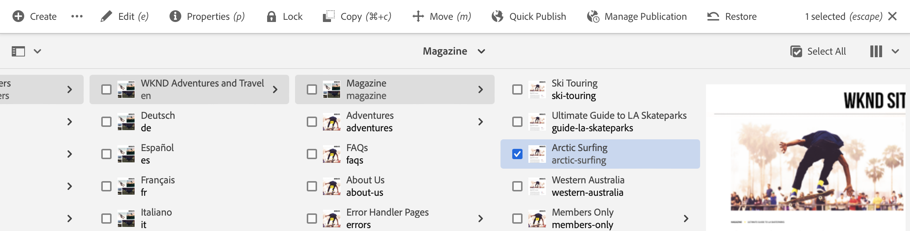

# 创作快速入门指南 {#quick-guide-to-authoring}

从此处开始，快速大致了解如何使用&#x200B;**站点**&#x200B;控制台开始创作内容。

>[!TIP]
>
>本快速入门指南重点介绍Sites创作，但大多数概念可以广泛地应用于其他控制台。

## 一切从站点控制台开始。 {#sites-console}

无论您是要创建新内容，还是要查看并管理现有内容，您都可以使用&#x200B;**站点**&#x200B;控制台作为中心概述。

首次登录AEM时，您将进入全局导航屏幕。 只需点按或单击&#x200B;**站点**&#x200B;以打开&#x200B;**站点**&#x200B;控制台。

要从AEM中的任何其他位置访问全局导航，请点按或单击任意AEM屏幕左上角的&#x200B;**Adobe Experience Manager**&#x200B;链接，这会打开全局导航的下拉叠加图。

进入&#x200B;**站点**&#x200B;控制台后，您的内容将非常易于导航，并且默认情况下会显示在列视图中。

## 视图 {#views}

默认情况下，**站点**&#x200B;控制台将在&#x200B;**列**&#x200B;视图中打开。 每个层次结构级别都显示为列，这使其非常适合基于Web的层次结构式内容。

点击或单击列中的条目可将其选中或打开层次结构中的下一级别。 选定的项目以勾号表示。

提供了两个其他视图：

* **卡片视图** — 此视图将每个条目显示为易于操作的卡片，使其他选项易于访问。
* **列表视图** — 这会将层次结构的单个级别显示为单个列表，提供有关各个项目的更多详细信息。

使用屏幕左上角的视图切换器可在视图之间切换。 此文档使用默认列视图。

## 导航内容 {#navigating}

**列视图**&#x200B;以一系列级联列的形式呈现您的内容。 选择当前列中的项目时，如果该项目是文档，则会在右侧的下一列中显示其详细信息；如果该项目是文件夹，则会在下一层次结构级别中显示内容。

详细查看

这样，您就可以上下遍历内容结构。

要在不同级别之间快速跳转，您可以使用页面顶部的痕迹导航。

您还可以随时使用屏幕右上角的搜索图标来查找特定内容。

搜索显示为覆盖整个控制台的下拉列表。 输入搜索词以查找内容。

## 创建内容 {#creating}

要创建新页面，只需导航到内容层次结构中您希望它出现的位置，然后点按或单击工具栏中的&#x200B;**创建**&#x200B;按钮即可。

可用的选项取决于上下文。 如果您位于内容结构的根目录，则能够创建一个全新的站点。 否则，您可以创建新页面或其他与页面相关的内容。

根据您选择的创建内容，相应的向导将引导您完成创建过程。

## 编辑内容 {#editing}

要编辑页面，请点击或单击以在&#x200B;**站点**&#x200B;控制台中选择该页面。 然后在显示的工具栏中，点按或单击&#x200B;**编辑**&#x200B;图标。

这将在适合内容的编辑器中打开页面。

如果您只想更新页面的属性（如标签或其名称），则可以点按或单击工具栏中的&#x200B;**属性**&#x200B;图标。

## 组织内容 {#organizing}

要移动或复制页面，请在控制台中选择该页面，然后在工具栏中点按或单击&#x200B;**移动**&#x200B;或&#x200B;**复制**。 这将启动一个向导，引导您完成移动或复制的步骤，并定义所生成页面的名称和位置。

## 发布内容 {#publishing}

当您使用&#x200B;**站点**&#x200B;控制台完成针对您的内容进行的更改后，您可以发布该内容。 选择要发布的内容，然后点按或单击工具栏中的&#x200B;**快速Publish**&#x200B;图标。

再次点击或单击对话框中的&#x200B;**Publish**&#x200B;以确认发布。

## 其他资源 {#additional-resources}

这只是对Sites内容创作功能的简单介绍，因此并未涵盖每个主题或每个选项。

下面是深入了解控制台所有功能的更多资源，并讨论有关一般内容创作的主题。

* [基本处理](/help/sites-cloud/authoring/basic-handling.md)
* [创作概念](/help/sites-cloud/authoring/author-publish.md)
* [Sites 控制台](/help/sites-cloud/authoring/sites-console/introduction.md)
* [页面编辑器](/help/sites-cloud/authoring/page-editor/introduction.md)
* [发布页面](/help/sites-cloud/authoring/sites-console/publishing-pages.md)
