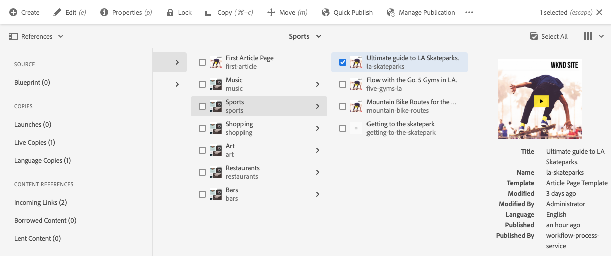
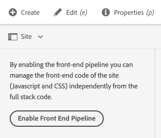
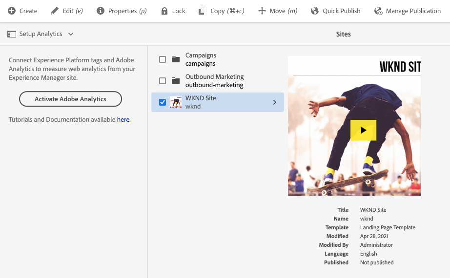

# 站点控制台侧面板 {#side-panel}

了解如何使用AEM中的侧面板 **站点** 控制台以更好地了解和导航您的内容。

## 方向 {#orientation}

默认情况下，当您输入 **站点** 控制台。 这样，屏幕就完全专用于您的内容。

点按或单击 **侧面板** 图标 **站点** 控制台工具栏以激活侧面板并选择内容的视图。

* [仅限内容](#content-only)
* [内容树](#content-tree)
* [时间线](#timeline)
* [引用](#references)
* [站点](#site)
* [过滤器](#filter)
* [设置 Analytics](#setup-analytics)

下拉列表中显示有蓝色复选标记，并且工具栏中的侧面板图标会更新为所选视图的名称。

## 仅限内容 {#content-only}

此侧面板视图实际上将其关闭，即它仅显示站点的内容。

>[!TIP]
>
>使用抑音符/反撇号 `´` 用于切换到侧面板的“仅限内容”视图的键盘快捷键。

## 内容树 {#content-tree}

侧面板的此视图以树层次结构显示您的内容。 使用内容树，可以快速地在侧面板内的站点层次结构中进行导航，并详细查看当前文件夹中的页面相关信息。

树中项目旁边的右指V形标记表示可以展开以显示其子节点的节点。 点按或单击V形标记以显示子项。

控制台在内容树中显示当前选定项目的内容。

通过将内容树侧面板与列表视图或信息卡视图结合使用，您可以轻松地查看项目的层次结构，并通过内容树侧面板在内容结构中轻松导航，并在列表视图中查看详细的页面信息。

>[!TIP]
>
>* 使用 `Alt+1` 用于切换到侧面板的内容树视图的键盘快捷键。
>* 在层次结构视图中选择某个条目后，可以使用箭头键在层次结构中快速导航。
>* 有关更多信息，请参阅[键盘快捷键。](/help/sites-cloud/authoring/sites-console/keyboard-shortcuts.md)

## 时间线 {#timeline}

时间线可用于查看影响所选资源的事件。 您还可以使用它来启动某些事件，例如工作流或版本。

此 **时间线** 侧面板用于查看与选定项相关的各种事件，这些选定项可以从下拉列表中选择为类型：

* 评论
* [注释](/help/sites-cloud/authoring/page-editor/annotations.md)
* [活动](/help/sites-cloud/authoring/personalization/activities.md)
* [启动项](/help/sites-cloud/authoring/launches/overview.md)
* [版本](/help/sites-cloud/authoring/sites-console/page-versions.md)
* [工作流](/help/sites-cloud/authoring/workflows/overview.md)
   * 请注意，不会显示临时工作流的信息，因为不会保存这些工作流的历史记录信息。<!--With the exception of [transient workflows](/help/sites-developing/workflows.md#transient-workflows) as no history information is saved for these-->
* 显示全部

此外，您还可以使用添加/查看有关所选项目的注释 **注释** 框显示在事件列表的底部。 键入评论，然后按下 `Return` 将注册该评论。 选择“注释”或“显 **示全部** ” **时，将显示** “注释”。

在 **站点** 控制台您还可以通过 **注释** 字段。

* [保存版本](/help/sites-cloud/authoring/sites-console/page-versions.md)
* [启动工作流](/help/sites-cloud/authoring/workflows/applying.md)

>[!TIP]
>
>* 使用 `Alt+2` 用于切换到侧面板的时间轴视图的键盘快捷键。
>* 有关更多信息，请参阅[键盘快捷键。](/help/sites-cloud/authoring/sites-console/keyboard-shortcuts.md)

## 引用 {#references}

此 **引用** 视图显示在控制台中选择的资源的引用类型列表。

选择相应的引用类型可获取详细信息。在某些情况下，当您选择了某个特定引用后，您还可以执行其他操作，包括：

* **传入链接**，提供引用该页面的页面的列表，并可在选择特定链接时直接&#x200B;**编辑**&#x200B;这些页面之一。
   * 这只能显示静态链接，而不能显示动态生成的链接，例如来自List组件的链接。
* [启动项](/help/sites-cloud/authoring/launches/overview.md)，提供对相关启动项的访问权
* [Live Copy](/help/sites-cloud/administering/msm/overview.md) 显示基于选定资源的所有 Live Copy 的路径。
* [Blueprint](/help/sites-cloud/administering/msm/best-practices.md)，提供详细信息和各种操作
* [语言副本](/help/sites-cloud/administering/translation/managing-projects.md#creating-translation-projects-using-the-references-panel)，提供详细信息和各种操作

## 站点 {#site}

此 **站点** 侧面板视图显示站点的详细信息 [使用站点模板创建。](/help/sites-cloud/administering/site-creation/create-site.md)

查看文档 [使用站点面板管理站点主题](/help/sites-cloud/administering/site-creation/site-rail.md) 有关如何使用面板管理 [站点主题。](/help/sites-cloud/administering/site-creation/site-themes.md).

如果尚未将前端管道设置为启用基于主题的站点创建，则侧面板将提供该选项。

>[!TIP]
>
>可以在[快速站点创建历程](/help/journey-sites/quick-site/overview.md)中找到从模板创建站点并自定义其主题的过程的端到端描述。

## 过滤器 {#filter}

此 **筛选** 面板类似于 [搜索功能](/help/sites-cloud/authoring/search.md) 设置相应的位置筛选器后，允许您进一步筛选要查看的内容。

与侧面板的其他视图不同，要切换到其他视图，请点按或单击 `X` 在搜索字段中。

## 设置 Analytics {#setup-analytics}

此视图允许您为所选站点快速设置Adobe Analytics。

