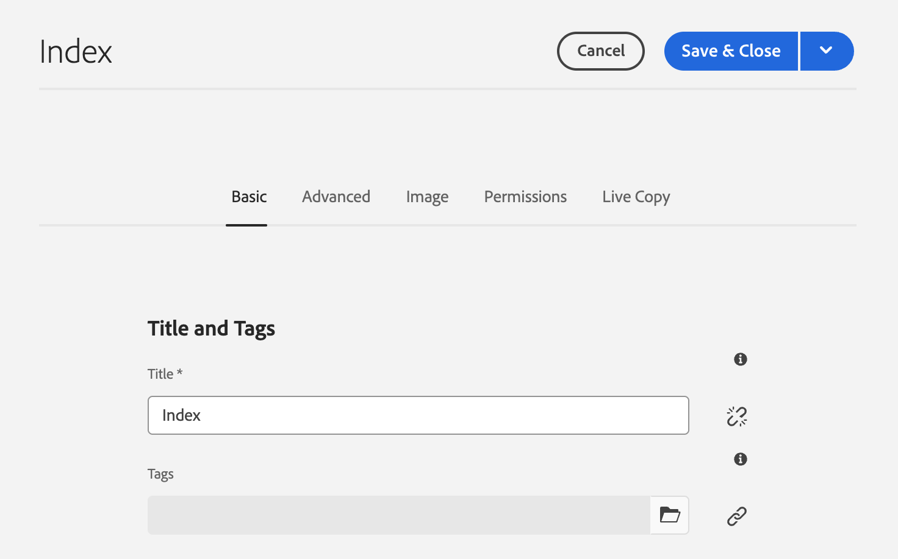

# 编辑页面属性 {#page-properties}

了解如何编辑[页面的属性](/help/sites-cloud/authoring/sites-console/page-properties.md)以及更改页面的行为和管理方式。

>[!TIP]
>
>有关可用的单个页面属性的详细信息，请参阅文档[页面属性。](/help/sites-cloud/authoring/sites-console/page-properties.md)

## 在何处编辑页面属性 {#where}

您可以在AEM中的多个位置编辑页面属性。

* [从 ](#from-the-sites-console)
* [从页面编辑器](#from-the-page-editor)
* [从通用编辑器](#from-the-universal-editor)

使用站点控制台，您还可以[一次编辑多个页面的属性。](#editing-multiple-pages)

### 从站点控制台中 {#from-the-sites-console}

在&#x200B;**站点**&#x200B;控制台中浏览内容时，您可以使用工具栏中的&#x200B;**属性**&#x200B;按钮编辑页面属性：

1. 使用&#x200B;[**站点**&#x200B;控制台，](/help/sites-cloud/authoring/sites-console/introduction.md)导航到要查看和编辑属性的页面位置。
1. 使用以下任一方式为所需的页面选择&#x200B;**属性**&#x200B;选项：
   * [快速操作](/help/sites-cloud/authoring/basic-handling.md#quick-actions)
   * [选择模式](/help/sites-cloud/authoring/basic-handling.md#selecting-resources)
   * 此时会使用相应的选项卡显示页面属性。
1. 查看或编辑所需的属性。
1. 然后，使用&#x200B;**保存**&#x200B;来保存您的更新，接着使用&#x200B;**关闭**&#x200B;返回到控制台。

### 从页面编辑器 {#from-the-page-editor}

使用页面编辑器编辑页面时，您可以使用&#x200B;**页面信息**&#x200B;来定义页面属性：

1. 在[页面编辑器](/help/sites-cloud/authoring/page-editor/introduction.md)中，打开要编辑属性的页面。
1. 选择&#x200B;**页面信息**&#x200B;图标以打开选择菜单：
1. 选择&#x200B;**打开属性**，将打开一个对话框，允许您编辑按相应选项卡排序的属性。 工具栏右侧提供了以下按钮：
   * **取消**
   * **保存并关闭**
1. 使用&#x200B;**保存并关闭**&#x200B;按钮以保存更改。

## 从通用编辑器 {#from-the-universal-editor}

使用通用编辑器编辑页面时，您可以使用&#x200B;**页面属性**&#x200B;图标来编辑属性：

1. 在[通用编辑器](/help/sites-cloud/authoring/universal-editor/authoring.md#page-properties)中，打开要编辑属性的页面。
1. 在工具栏中选择&#x200B;**页面属性**&#x200B;图标。
1. AEM的页面属性窗口将在一个新的浏览器选项卡中打开，就像您从[页面编辑器编辑页面属性一样。](#from-the-page-editor)工具栏右侧提供了以下按钮：
   * **取消**
   * **保存并关闭**
1. 使用&#x200B;**保存并关闭**&#x200B;按钮以保存更改。
1. 返回到通用编辑器的浏览器选项卡。

## 编辑多个页面的属性 {#editing-multiple-pages}

从&#x200B;[**站点**&#x200B;控制台](/help/sites-cloud/authoring/sites-console/introduction.md)中，您可以选择多个页面，然后使用&#x200B;**查看属性**&#x200B;查看和/或编辑页面属性。 这称为批量编辑页面属性。

可以通过多种方法选择要批量编辑的多个页面，这些方法包括：

* 在浏览 **Sites** 控制台时
* 在使用&#x200B;**搜索**&#x200B;找到一组页面后

选择页面，然后单击或点按&#x200B;**属性**&#x200B;选项后，将显示批量属性：

只有符合以下条件的页面才能进行批量编辑：

* 属于同一资源类型
* 不是Live Copy的一部分
   * 如果任意选定页面是Live Copy的一部分，则会在打开属性时显示一条消息。

批量编辑窗口垂直分为两半：

* 左侧是您选择进行批量编辑的页面的列表。

   * 您可以根据需要选择/取消选择页面。
   * 默认情况下，选择全部。

* 右侧是可进行批量编辑的[属性的列表。](/help/implementing/developing/extending/bulk-editor.md)

   * 与查看单页面的属性时一样，这些属性按选项卡进行排序。
   * 将显示所有选定页面的可用属性，这些属性已明确定义为可批量编辑。
   * 如果将选择的页面减少到一页，则会显示所有属性。
   * 只显示具有相同值的属性。
   * 当字段为多值（例如，标记）时，只有在&#x200B;*所有*&#x200B;为通用时，才会显示值。 如果只有一些是通用的，则仅在编辑时才显示它们。

* 如果不同页面具有相同的字段，但这些字段的值不同，则会用一个特殊的值表示它们，例如，文本 `<Mixed Entries>`。

您可以更新所选页面上可用字段中的值。 当您选择&#x200B;**完成**&#x200B;时，新值将应用于所有选定页面。 当字段有多个值时（例如，“标记”），您可以附加新值或删除公共值。

## 属性继承 {#inheritance}

如果页面基于Blueprint或从其他页面继承内容，则继承会反映在单个字段的&#x200B;**页面属性**&#x200B;窗口中。

无法编辑继承的属性。 点按或单击特定字段旁边的&#x200B;**取消继承**&#x200B;图标以中断其继承。

在&#x200B;**取消继承**&#x200B;模式中确认取消。

取消字段的继承后，该字段将变为可编辑。

要恢复继承，请点击或单击字段旁边的&#x200B;**还原继承**&#x200B;图标。

在&#x200B;**还原继承**&#x200B;模式中确认还原。

选择&#x200B;**恢复继承后同步页面**&#x200B;以使用Blueprint中的最新值更新字段。 如果不这样做，则下次同步LiveCopy时将更新值。

>[!TIP]
>
>有关继承的详细信息，请参阅文档[多站点管理器和翻译](/help/sites-cloud/administering/msm-and-translation.md)
