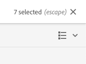

# Sites 控制台 {#sites-console}

了解如何使用&#x200B;**站点**&#x200B;控制台来管理和组织AEM页面。

## 方向 {#orientation}

**站点**&#x200B;控制台允许您查看页面层次结构。

它提供了不同的视图和工具栏，以帮助您管理和组织页面。

* [控制台工具栏](#toolbar)始终存在，可帮助您导航。
* [三个不同的视图](#views)允许您轻松地查找并选择您的页面。
* [选定要对其执行操作的项后，将显示操作工具栏](#action-toolbar)。
* [侧面板](#side-panel)有多个选项可显示选定页面的详细信息。

## 控制台工具栏 {#console-toolbar}

控制台工具栏始终显示在控制台上，可帮助您在内容中定向自己并导航内容。

### 侧面板选择器 {#side-panel-selector}

利用侧面板选择器，可在控制台中显示有关所选项目的其他信息。

显示的选项取决于您当前所在的控制台。例如，在&#x200B;**Sites**&#x200B;中，您可以选择仅限内容（默认）、时间线、引用或过滤器侧面板。

有关侧面板的详细信息，请参阅文档[站点控制台侧面板。](/help/sites-cloud/authoring/sites-console/console-side-panel.md)

### 痕迹导航 {#breadcrumbs}

痕迹导航位于边栏中间，始终显示当前选定项目的描述，它允许您在网站的各个级别之间进行导航。

点按或单击痕迹导航文本以显示一个下拉列表，其中列出了当前选定项目的层次结构级别。 点击或单击条目可跳转到该位置。

### 全选 {#select-all}

点击或单击&#x200B;**全选**&#x200B;按钮可选择控制台当前视图中的所有项目。

选择所有项目后，所选项目的计数将显示在显示&#x200B;**全选**&#x200B;按钮的工具栏的右上方。

您可以通过以下方式取消选择所有项并退出选择模式：

* 单击或点按计数旁边的&#x200B;**X**。
* 使用&#x200B;**ESC**&#x200B;键。

### 创建按钮 {#create-button}

使用&#x200B;**创建**&#x200B;按钮，可以向站点添加新页面以及创建其他Sites对象，如活动副本或启动项。

单击后，显示的选项将适用于控制台/上下文。 最常见的是：

* [页面](/help/sites-cloud/authoring/sites-console/creating-pages.md)
* [站点](/help/sites-cloud/administering/site-creation/create-site.md)
* [Live Copy](/help/sites-cloud/administering/msm/overview.md)
* [启动](/help/sites-cloud/authoring/launches/overview.md)
* [语言复制](/help/sites-cloud/administering/translation/overview.md)
* [CSV 报表](/help/sites-cloud/authoring/sites-console/csv-export.md)

有关这些功能的功能的功能的详细信息，请参阅这些功能的链接。

## 查看次数和选择页面 {#views}

**Sites**&#x200B;控制台为您的内容层次结构提供了三种不同的视图。 您可以在任何可用视图中查看、导航和选择资源（以便执行进一步操作）。

* [列视图](#column-view)
* [信息卡视图](#card-view)
* [列表视图](#list-view)

AEM工具栏最右侧的&#x200B;**视图**&#x200B;图标表示当前选定的视图。

通过点按或单击该视图，可选择其他视图。

您可以在列视图、信息卡视图和列表视图之间切换。在列表视图中，还会显示视图设置。

>[!NOTE]
>
>**查看设置**&#x200B;选项仅在&#x200B;**列表视图**&#x200B;模式下可用。

从概念上讲，所有视图中的查看、导航和选择操作都相同，只是操作方法根据所使用的视图而略有差异。

>[!NOTE]
>
>默认情况下，AEM Assets 不会在 UI 中将资源的原始呈现版本显示为任何视图中的缩略图。如果您是管理员，可以使用叠加来配置 AEM Assets，以将原始呈现版本显示为缩略图。

### 选择资源 {#selecting-resources}

选择特定的资源取决于视图和设备的组合：

| 查看 | 选择触控 | 选择桌面 | 取消选择触控 | 取消选择桌面 |
|---|---|---|---|---|
| 列 | 选择缩略图 | 单击缩略图 | 选择缩略图 | 单击缩略图 |
| 信息卡 | 选择并按住卡片 | 将鼠标悬停在上方，然后使用勾号快速操作 | 选择卡 | 单击信息卡 |
| 列表 | 选择缩略图 | 单击缩略图 | 选择缩略图 | 单击缩略图 |

#### 选择示例 {#selecting-example}

1. 例如在信息卡视图中：

   

1. 在选择了某个资源后，顶部标题被[操作工具栏](#actions-toolbar)覆盖，通过该工具栏可访问当前适用于选定资源的操作。

1. 要退出选择模式，请选择右上角的 **X**，或者使用 **Esc** 键。

### 列视图 {#column-view}

列视图允许通过一系列级联列对内容树进行可视化导航。 通过此视图，可以查看和遍历您网站的树结构。

选择最左侧列中的资源，将在右侧的列中显示子资源。接着选择右侧列中的资源，又将在右侧的另一个列中显示子资源，然后如此反复。

* 点按或单击资源名称或资源名称右侧的 V 形标记，可以在树中向上和向下导航。

   * 资源名称和 V 形标记在被点按或单击时会突出显示。
   * 单击/点按的资源的子资源将在其右侧的列中显示。
   * 如果选择没有子级的资源名称，则其详细信息将显示在最终列中。

* 点按或单击缩略图会选择该资源。

   * 选择后，缩略图上会叠加一个勾号，并且资源名称也会突出显示。
   * 最后的列中会显示选定资源的详细信息。
   * 操作工具栏会变得可用。

* 在列视图中选择页面后，选定的页面将与以下详细信息一起显示在最后的列中：

   * 页面标题
   * 页面名称（页面 URL 的一部分）
   * 页面所基于的模板
   * 修改详细信息
   * 页面语言
   * 发布和预览详细信息

### 信息卡视图 {#card-view}

在卡片视图中，层次结构中当前级别的每个项目均显示为大卡片。

* 信息卡提供如下信息：

   * 页面内容的可视表示形式。
   * 页面标题。
   * 重要日期（如上次编辑时间、上次发布时间）。
   * 页面被锁定、隐藏或是LiveCopy的一部分时。
   * 指示您是否需要在工作流中对项目执行操作。

卡片视图还为项目提供[快速操作](#quick-actions)，例如选择和常用操作，例如编辑。

您可以通过点按/单击卡片对树进行向下导航（注意避免点按快速操作），或使用标题](#the-header)中的[痕迹导航再次向上导航。

### 列表视图 {#list-view}

列表视图提供列表中当前级别上每个资源的信息。

* 您可以通过点按/单击资源名称对树进行向下导航，并使用[标题中的痕迹导航](#the-header)再次向上导航。
* 要轻松选择列表中的所有项目，请使用工具栏中的&#x200B;[**全选**&#x200B;复选框。](#select-all)

* 可使用位于“视图”按钮下方的&#x200B;**查看设置**&#x200B;选项选择要显示的列。可以显示以下列：

   * **名称** – 页面名称，在多语言创作环境中非常有用，因为它是页面 URL 的一部分，无论用户使用何种语言，都不会发生更改
   * **修改时间** – 上次修改日期和上次修改用户
   * **发布时间** – 发布状态
   * **预览** – 预览状态
   * **模板** – 页面所基于的模板
   * **操作**
   * **工作流** – 当前应用于页面的工作流。当您将鼠标悬停在上面或打开时间轴时，会提供更多信息。
   * **已翻译**
   * **页面查看次数**
   * **独特访客**
   * 第&#x200B;**页上的**&#x200B;时间

默认将显示&#x200B;**名称**&#x200B;列，它构成了页面 URL 的一部分。在某些情况下，作者可能需要访问采用不同语言的页面，在作者不知道页面语言的情况下，查看页面的名称（通常不会更改）会非常有用。

* 可使用列表中每个项目最右侧的点状垂直栏更改项目的顺序。

选择垂直选择栏并将项目拖到列表中的新位置。

>[!NOTE]
>
>只有在 `jcr:primaryType` 值为 `sling:OrderedFolder` 的已排序文件夹内才能更改顺序。

## “操作”工具栏 {#actions-toolbar}

每当选择资源时，您都可以对选定项目执行各种操作。 这些操作将显示在操作工具栏中。

仅在控制台中选择资源时，才会显示操作工具栏。 操作工具栏中可用的操作会发生更改，以反映您可对特定选定项目执行的操作。 最常见的操作包括：

* [**创建**](#create-action) — 创建新内容或与内容相关的操作
* **编辑** — 根据所选页面的创建方式，**编辑**&#x200B;操作将打开相应的编辑器。
   * [页面编辑器](/help/sites-cloud/authoring/page-editor/introduction.md) — 对于使用AEM页面编辑器创建的页面
   * [通用编辑器](/help/sites-cloud/authoring/universal-editor/authoring.md) — 对于使用通用编辑器创建的页面
* [**属性**](/help/sites-cloud/authoring/sites-console/page-properties.md) — 打开页面属性窗口
* [**锁定**](/help/sites-cloud/authoring/sites-console/managing-pages.md#locking-a-page) — 锁定页面以防止其他人更改它
* [**复制**](/help/sites-cloud/authoring/sites-console/managing-pages.md#copying-and-pasting-a-page) — 复制页面
* [**移动**](/help/sites-cloud/authoring/sites-console/managing-pages.md#moving-or-renaming-a-page) — 移动或重命名页面
* [**快速Publish**](/help/sites-cloud/authoring/sites-console/publishing-pages.md#quick-publish) — 立即Publish一个或多个页面
* [**管理发布**](/help/sites-cloud/authoring/sites-console/publishing-pages.md#manage-publication) — 计划发布一个或多个页面
* [**还原**](/help/sites-cloud/authoring/sites-console/page-versions.md#restore-version) — 还原页面或页面树的版本
* [**删除**](/help/sites-cloud/authoring/sites-console/managing-pages.md#deleting-a-page) — 删除一个或多个页面

由于某些窗口存在空间限制，因此工具栏的长度可能很快就会超过可用空间。如果发生此情况，将会显示额外的选项。单击或点按省略号（三个点或&#x200B;**...**）会打开一个下拉选择器，其中包含所有其余的操作。

### 创建操作 {#create-action}

创建操作提供了与&#x200B;[**创建**&#x200B;工具栏按钮](#create-button)类似的选项，用于创建新页面和类似项目。

此外，它还提供了创建与页面相关的操作的能力。

* [**工作流**](/help/sites-cloud/authoring/workflows/overview.md) — 将工作流应用到页面
* [**版本**](/help/sites-cloud/authoring/sites-console/page-versions.md) — 创建页面的版本

## 模板

在&#x200B;[**列视图**](/help/sites-cloud/authoring/basic-handling.md#column-view)&#x200B;或&#x200B;[**列表视图**](/help/sites-cloud/authoring/basic-handling.md#list-view)&#x200B;中选择页面时，您可以轻松查看该页面所基于的模板。
