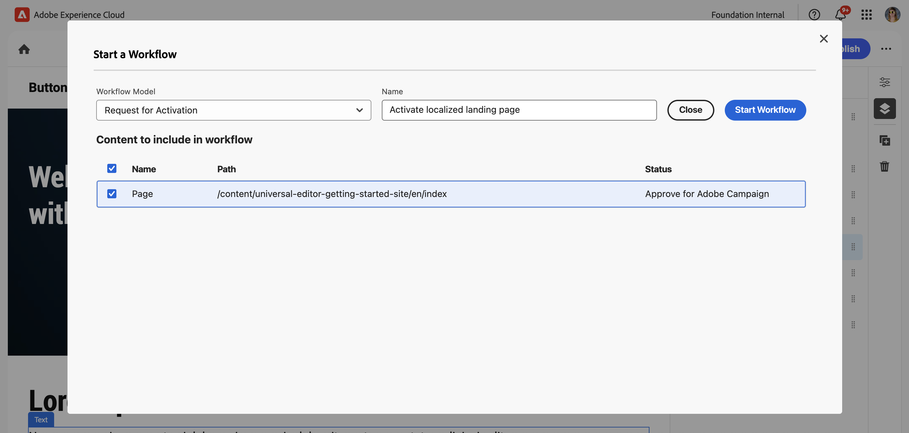

# 使用 Universal Editor 创作内容 {#authoring}

了解内容作者使用 Universal Editor 创建内容是多么轻松和直观。

## 简介 {#introduction}

通用编辑器支持在任何实施中编辑任何内容的任何方面，因此您可以提供卓越的体验并提高内容速度。

为此，Universal Editor 为内容作者提供了一个直观的 UI，只需少量培训即可开始编辑内容。本文档介绍了 Universal Editor 的创作体验。

>[!NOTE]
>
>本文档假设您已熟悉如何访问和导航通用编辑器。 如果没有，请参阅[访问和导航通用编辑器](/help/sites-cloud/authoring/universal-editor/navigation.md)。

>[!TIP]
>
>有关通用编辑器的更详细介绍，请参阅[通用编辑器简介](/help/implementing/universal-editor/introduction.md)。

## 编辑内容 {#editing-content}

编辑内容是简单而直观的。将鼠标悬停在编辑器中的内容上时，可编辑内容会以蓝色细轮廓突出显示。

>[!TIP]
>
>默认情况下，点击或单击内容会选择进行编辑。 如果要通过以下链接导航内容，请切换到[预览模式](/help/sites-cloud/authoring/universal-editor/navigation.md#preview-mode)。

根据您选择的内容，您可能有不同的就地编辑选项，并且您可能会在[属性面板](/help/sites-cloud/authoring/universal-editor/navigation.md#properties-rail)中为该内容提供其他信息和选项。

### 编辑纯文本 {#edit-plain-text}

您可以通过双击或双击组件就地编辑文本。

蓝色细轮廓变为蓝色粗轮廓以指示选择，并且出现光标。 进行更改，然后按Enter/Return或选择文本框外部以保存更改。

当您选择文本组件时，其详细信息将显示在[属性面板](/help/sites-cloud/authoring/universal-editor/navigation.md#properties-rail)中。 您还可以在面板中编辑文本。

此外，可在属性面板中找到有关文本的详细信息。 一旦焦点离开属性面板中已编辑的字段，更改将自动保存。

### 编辑富文本 {#edit-rich-text}

您可以通过双击或双击组件就地编辑文本。

为方便起见，文本上的格式选项和详细信息可在两个位置使用。

#### 上下文菜单 {#context-menu}

上下文菜单在RTF块上方打开，并在上下文中提供基本的格式选项。 由于空间限制，某些选项可能隐藏在省略号按钮后面。

一旦焦点离开已编辑的字段，更改将自动保存。

#### “属性”面板 {#properties-rail}

[属性面板](/help/sites-cloud/authoring/universal-editor/navigation.md#properties-rail)显示选定文本的项目。 点击条目可打开一个显示较大画布的对话框以编辑文本。

点击或单击&#x200B;**取消**&#x200B;或&#x200B;**完成**&#x200B;可分别放弃或保存更改。

### 编辑媒体 {#edit-media}

您可以在[属性面板](/help/sites-cloud/authoring/universal-editor/navigation.md#properties-rail)中查看其详细信息。

1. 在属性面板中，点按或单击所选图像的预览。
1. [资源选择器](/help/assets/overview-asset-selector.md#using-asset-selector)窗口会打开，以供您选择资源。
1. 选择以选择新资源。
1. 选择&#x200B;**选择**&#x200B;以返回到资产被替换的属性面板。

更改将会自动保存到您的内容中。

### 编辑内容片段 {#edit-content-fragment}

如果选择[内容片段](/help/sites-cloud/administering/content-fragments/overview.md)，则可以在[属性面板](/help/sites-cloud/authoring/universal-editor/navigation.md#properties-rail)中编辑其详细信息。

在选定内容片段的内容模型中定义的字段将在属性面板中显示和编辑。

如果您选择与内容片段相关的字段，则内容片段将在组件面板中加载，并且字段会自动滚动到。

一旦焦点离开属性面板中已编辑的字段，更改将自动保存。

如果要改在[内容片段编辑器](/help/sites-cloud/administering/content-fragments/authoring.md)中编辑内容片段，请点按或单击“属性”面板中的&#x200B;[**在CF编辑器中打开**&#x200B;按钮](/help/sites-cloud/authoring/universal-editor/navigation.md#edit)。

>[!TIP]
>
>使用热键`e`在内容片段编辑器中编辑选定的内容片段。

根据工作流的需求，您可能需要在通用编辑器中或直接在内容片段编辑器中编辑内容片段。

>[!NOTE]
>
>通用编辑器[根据其模型验证内容片段字段](/help/assets/content-fragments/content-fragments-models.md#validation)，允许您实施数据完整性规则，如正则表达式模式和唯一性约束。
>
>这可确保您的内容在发布之前满足特定的业务要求。

### 向容器添加组件 {#adding-components}

1. 在[内容树](/help/sites-cloud/authoring/universal-editor/navigation.md#content-tree-mode)或编辑器中选择容器组件。

   

1. 然后，在属性面板中选择添加图标。

   

该组件被插入到容器中并可以在编辑器中进行编辑。

>[!TIP]
>
>使用热键 `a` 可将组件添加到选定容器。

### 在容器中复制组件 {#duplicating-components}

1. 使用[内容树](/help/sites-cloud/authoring/universal-editor/navigation.md#content-tree-mode)或编辑器在容器中选择组件。
1. 然后在属性面板中选择&#x200B;**复制**&#x200B;图标。

   
1. 该组件将被复制并插入到选定组件的下方。

该组件被插入到容器中并可以在编辑器中进行编辑。

### 从容器中删除组件 {#deleting-components}

1. 在[内容树](/help/sites-cloud/authoring/universal-editor/navigation.md#content-tree-mode)或编辑器中选择容器组件。
1. 选择容器的V形图标以在内容树中展开其内容。
1. 然后，在内容树中，选择容器内的一个组件。
1. 在属性面板中选择删除图标。

   

选定的组件已删除。

>[!TIP]
>
>使用热键 `Shift+Backspace` 可从容器中删除选定组件。

### 重新排序组件 {#reordering-components}

1. 如果尚未处于[内容树模式](/help/sites-cloud/authoring/universal-editor/navigation.md#content-tree-mode)，请切换到它。
1. 在内容树或编辑器中选择一个容器组件。
1. 选择容器的V形图标以在内容树中展开其内容。
1. 拖动容器内组件旁边的手柄图标表明您可以重新排列它们。拖动组件以对它们在容器内重新排序。

   

1. 拖动的组件在内容树中变为灰色，而您的插入点以蓝线表示。 释放组件以将其放置在新位置。

组件在内容树和编辑器中都会重新排序。

>[!NOTE]
>
>如果目标容器[组件筛选器](/help/implementing/universal-editor/filtering.md)允许所选组件，则组件只能在容器之间移动。

## 预览内容 {#previewing-content}

编辑完内容后，您通常需要导航内容以查看它在其他页面内容中的外观。在[预览模式](/help/sites-cloud/authoring/universal-editor/navigation.md#preview-mode)中，您可以单击链接来像阅读器一样导航您的内容。内容在编辑器中呈现，就像它将要发布的那样。

在预览模式下，点按或单击内容的反应与对内容的读者一样。 如果要选择要编辑的内容，请切换出[预览模式](/help/sites-cloud/authoring/universal-editor/navigation.md#preview-mode)。

## 编辑组件继承 {#inheritance}

继承是一种机制，通过该机制，可以链接内容，以便更改一个内容会自动更改另一个内容。

使用通用编辑器，您可以通过简单地更新内容来取消内容的继承。 编辑器会自动禁用作者在该页面上所做所有更改的继承，确保在从Blueprint同步更新时保留修改的内容。

如果您的程序启用了&#x200B;**AEM多站点管理(MSM)扩展**，则您有[额外的工具栏选项](#inheritance-extension)来查看和更改通用编辑器中单个组件的继承状态。

有关使用通用编辑器继承如何工作的更多详细信息，请参阅通用编辑器中的[内容继承](/help/sites-cloud/authoring/universal-editor/inheritance.md)。

## 可选工具栏功能 {#toolbar-options}

附加功能可作为通用编辑器的扩展使用，以帮助您进一步管理页面和内容。 [这些扩展必须由管理员在程序中启用](/help/implementing/universal-editor/extending.md)，然后才能在[通用编辑器工具栏中作为内容作者显示给您。](/help/sites-cloud/authoring/universal-editor/navigation.md#universal-editor-toolbar)

### 继承 {#inheritance-extension}

**AEM多站点管理(MSM)扩展**&#x200B;显示所选组件的当前继承状态，并允许您[中断或恢复继承。](/help/sites-cloud/authoring/universal-editor/inheritance.md)

通用编辑器工具栏中的&#x200B;**安装的继承**&#x200B;图标显示继承对于所选组件仍然有效。

点击或单击图标可中断选定组件的继承。 如果编辑组件，继承会自动中断。

**继承中断**&#x200B;图标显示选定组件的继承已中断。

点击或单击图标可恢复所选组件的继承。 您需要重新加载页面以刷新内容以显示继承的内容。

有关如何启用此扩展的信息，[请参阅Extension Manager文档。](https://developer.adobe.com/uix/docs/extension-manager/feature-highlights/#enablingdisabling-extensions)

>[!NOTE]
>
>**安装的继承**&#x200B;和&#x200B;**继承中断**&#x200B;图标仅在选择组件并且该页面基于Blueprint时显示。

>[!NOTE]
>
>**AEM多站点管理(MSM)扩展**&#x200B;仅适用于页面，不适用于内容片段。

### 访问页面属性 {#page-properties}

**AEM页面属性扩展**&#x200B;允许快速访问当前编辑的页面的[页面属性窗口](/help/sites-cloud/authoring/sites-console/page-properties.md)。

点按或单击通用编辑器工具栏中的&#x200B;**页面属性**&#x200B;图标，在新的浏览器选项卡中打开该页面的页面属性。

有关如何启用此扩展的信息，[请参阅Extension Manager文档。](https://developer.adobe.com/uix/docs/extension-manager/feature-highlights/#enablingdisabling-extensions)

>[!NOTE]
>
>**AEM页面属性扩展**&#x200B;仅适用于页面，不适用于内容片段。

### 访问站点控制台 {#sites-console}

**AEM站点管理扩展**&#x200B;允许快速访问AEM的[站点控制台](/help/sites-cloud/authoring/sites-console/introduction.md)中正在编辑的页面，从而允许您在控制台中导航站点树或执行页面级操作。

点按或单击图标可在新的浏览器选项卡中打开站点控制台，导航到编辑器中当前的页面。

有关如何启用此扩展的信息，[请参阅Extension Manager文档。](https://developer.adobe.com/uix/docs/extension-manager/feature-highlights/#enablingdisabling-extensions)

### 锁定和解锁页面 {#locking-pages}

**AEM Page Lock扩展**&#x200B;在编辑器中显示页面的当前锁定状态，并允许您[锁定或解锁页面。](/help/sites-cloud/authoring/sites-console/managing-pages.md#locking-a-page)

通用编辑器工具栏中的&#x200B;**已解锁**&#x200B;图标显示编辑器中当前未锁定页面。

点击或单击图标可锁定页面。

通用编辑器工具栏中的&#x200B;**已锁定**&#x200B;图标显示当前在编辑器中的页面已锁定。 将鼠标悬停在图标上可查看工具提示，指示锁定页面的用户。

如果您是锁定页面的用户，请点击或单击图标以解锁该页面。

有关如何启用此扩展的信息，[请参阅Extension Manager文档。](https://developer.adobe.com/uix/docs/extension-manager/feature-highlights/#enablingdisabling-extensions)

>[!NOTE]
>
>**AEM Page Lock扩展**&#x200B;仅适用于页面，不适用于内容片段。

### 工作流 {#workflows}

**AEM Workflows扩展**&#x200B;允许您[在编辑器的当前页面上启动工作流](/help/sites-cloud/authoring/workflows/overview.md)。

点按或单击通用编辑器工具栏中的&#x200B;**工作流**&#x200B;图标以打开&#x200B;**启动工作流**&#x200B;模式。 该窗口列出了可应用工作流的可能内容。

1. 在&#x200B;**工作流模型**&#x200B;下拉列表中，选择要应用的工作流。
1. 在&#x200B;**名称**&#x200B;字段中提供工作流的描述。
1. 在要包含在工作流&#x200B;**列表中的**&#x200B;内容中，使用复选框定义要包含在工作流中的内容。
1. 点按或单击&#x200B;**启动工作流**&#x200B;启动工作流，或者点按或单击&#x200B;**关闭**&#x200B;中止。

有关如何启用此扩展的信息，[请参阅Extension Manager文档。](https://developer.adobe.com/uix/docs/extension-manager/feature-highlights/#enablingdisabling-extensions)

### 开发人员登录 {#developer-login}

**AEM Universal Editor开发登录扩展**&#x200B;对于在本地进行开发的开发人员很有用，它提供了一种便捷的方式来验证本地AEM SDK以进行测试。

点按或单击Universal Editor工具栏中的&#x200B;**开发人员登录**&#x200B;图标，提供用于登录本地AEM SDK的本地登录凭据。

有关如何启用此扩展的信息，[请参阅Extension Manager文档。](https://developer.adobe.com/uix/docs/extension-manager/feature-highlights/#enablingdisabling-extensions)

## 可选属性面板功能 {#properties-panel-options}

附加功能可作为通用编辑器的扩展使用，以帮助您进一步管理页面内容。 [这些扩展必须由管理员在程序中启用](/help/implementing/universal-editor/extending.md)，然后才能在[通用编辑器属性面板](/help/sites-cloud/authoring/universal-editor/navigation.md#properties-rail)中作为内容作者显示给您。

### 生成变体 {#generate-variations}

**生成变体**&#x200B;扩展允许您使用生成人工智能(AI)直接在属性面板中为内容创建变体。

点按或单击“通用编辑器”属性面板中的&#x200B;**生成变体**&#x200B;图标以接收推荐和创建变体。 有关生成变体的工作方式的更多详细信息，请参阅文档[生成变体 — 集成在AEM编辑器中](/help/generative-ai/generate-variations-integrated-editor.md)。

有关如何启用此扩展的信息，[请参阅Extension Manager文档。](https://developer.adobe.com/uix/docs/extension-manager/feature-highlights/#enablingdisabling-extensions)

## 其他资源 {#additional-resources}

要了解如何使用通用编辑器发布内容，请参阅此文档。

* [使用 Universal Editor 发布内容](publishing.md) – 了解 Universal Editor 如何发布内容以及您的应用程序如何处理发布的内容。

要了解有关通用编辑器的技术详细信息的更多信息，请参阅这些开发人员文档。

* [通用编辑器简介](/help/implementing/universal-editor/introduction.md) — 了解通用编辑器如何启用在任何实施中编辑任何内容的任何方面，以便您能够提供卓越的体验并提高内容速度。
* [AEM Universal Editor 快速入门 ](/help/implementing/universal-editor/getting-started.md) – 了解如何获取 Universal Editor 访问权限以及如何对第一个 AEM 应用程序插桩以使用 Universal Editor。
* [Universal Editor 架构](/help/implementing/universal-editor/architecture.md) – 了解 Universal Editor 的架构以及数据如何在其服务和层之间流动。
* [属性和类型](/help/implementing/universal-editor/attributes-types.md) – 了解 Universal Editor 所需的数据属性和类型。
* [Universal Editor 身份验证](/help/implementing/universal-editor/authentication.md) – 了解 Universal Editor 如何进行身份验证。
