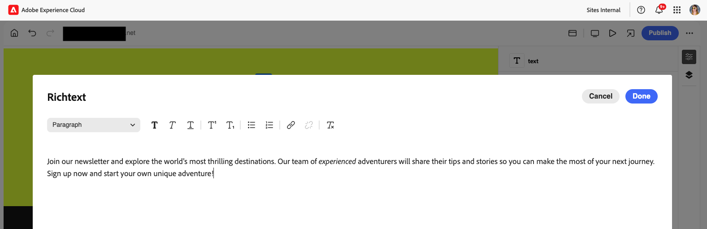
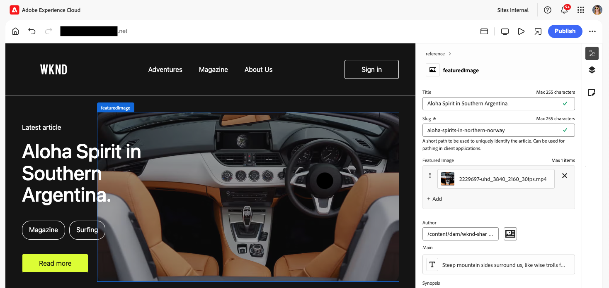
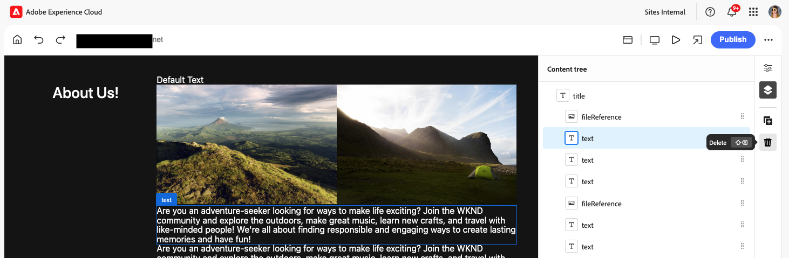

# 使用 Universal Editor 创作内容 {#authoring}

了解内容作者使用 Universal Editor 创建内容是多么轻松和直观。

## 简介 {#introduction}

Universal Editor 支持在任意实施中编辑任何内容的任何方面，以提供卓越的体验，提升内容速度并提供最先进的开发人员体验。

为此，Universal Editor 为内容作者提供了一个直观的 UI，只需少量培训即可开始编辑内容。本文档介绍了 Universal Editor 的创作体验。

>[!NOTE]
>
>本文档假设您已熟悉如何访问和导航通用编辑器。 如果不是，请参阅文档[访问和导航通用编辑器。](/help/sites-cloud/authoring/universal-editor/navigation.md)

>[!TIP]
>
>有关 Universal Editor 的更详细介绍，请参阅文档 [Universal Editor 简介](/help/implementing/universal-editor/introduction.md)。

## 编辑内容 {#editing-content}

编辑内容是简单而直观的。将鼠标悬停在编辑器中的内容上时，可编辑内容会以蓝色细轮廓突出显示。

>[!TIP]
>
>默认情况下，点击或单击内容会选择进行编辑。 如果要通过以下链接导航内容，请切换到[预览模式。](/help/sites-cloud/authoring/universal-editor/navigation.md#preview-mode)

根据您选择的内容，您可能有不同的就地编辑选项，并且您可能会在[属性边栏中为该内容提供其他信息和选项。](/help/sites-cloud/authoring/universal-editor/navigation.md#properties-rail)

### 编辑纯文本 {#edit-plain-text}

您可以通过双击或双击组件就地编辑文本。

蓝色细轮廓变为蓝色粗轮廓以指示选择，并且出现光标。 进行更改，然后按Enter/Return或选择文本框外部以保存更改。

当您选择文本组件时，其详细信息将显示在[属性边栏中。](/help/sites-cloud/authoring/universal-editor/navigation.md#properties-rail)您还可以编辑边栏中的文本。

此外，可在属性边栏中找到有关文本的详细信息。 一旦焦点离开属性边栏中已编辑的字段，更改将自动保存。

### 编辑富文本 {#edit-rich-text}

您可以通过双击或双击组件就地编辑文本。

为方便起见，文本上的格式选项和详细信息可在两个位置使用。

#### 上下文菜单 {#context-menu}

上下文菜单在RTF块上方打开，并在上下文中提供基本的格式选项。 由于空间限制，某些选项可能隐藏在省略号按钮后面。

一旦焦点离开已编辑的字段，更改将自动保存。

#### “属性”边栏 {#properties-rail}

[属性边栏](/help/sites-cloud/authoring/universal-editor/navigation.md#properties-rail)显示选定文本的项目。 点击条目可打开一个显示较大画布的对话框以编辑文本。

点击或单击&#x200B;**取消**&#x200B;或&#x200B;**完成**&#x200B;可分别放弃或保存更改。

### 编辑媒体 {#edit-media}

您可以在[属性边栏中查看其详细信息。](/help/sites-cloud/authoring/universal-editor/navigation.md#properties-rail)

1. 点按或单击属性边栏中选定图像的预览。
1. [资源选择器](/help/assets/overview-asset-selector.md#using-asset-selector)窗口会打开，以供您选择资源。
1. 选择以选择新资源。
1. 选择&#x200B;**选择**&#x200B;以返回到替换资产的属性边栏。

更改将会自动保存到您的内容中。

### 编辑内容片段 {#edit-content-fragment}

如果选择[内容片段，](/help/sites-cloud/administering/content-fragments/overview.md)，则可以在[属性边栏](/help/sites-cloud/authoring/universal-editor/navigation.md#properties-rail)中编辑其详细信息。

在选定内容片段的内容模型中定义的字段在属性边栏中显示和可编辑。

如果您选择与内容片段相关的字段，则内容片段会加载到组件边栏中，并且会自动滚动到该字段。

一旦焦点离开属性边栏中已编辑的字段，更改将自动保存。

如果要改在[内容片段编辑器](/help/sites-cloud/administering/content-fragments/authoring.md)中编辑内容片段，请点按或单击属性边栏中的&#x200B;[**在CF编辑器中打开**&#x200B;按钮](/help/sites-cloud/authoring/universal-editor/navigation.md#edit)。

>[!TIP]
>
>使用热键`e`在内容片段编辑器中编辑选定的内容片段。

根据工作流的需求，您可能需要在通用编辑器中或直接在内容片段编辑器中编辑内容片段。

>[!NOTE]
>
>通用编辑器[根据其模型验证内容片段字段](/help/assets/content-fragments/content-fragments-models.md#validation)，允许您实施数据完整性规则，如正则表达式模式和唯一性约束。
>
>这可确保在内容发布之前满足特定的业务要求。

### 向容器添加组件 {#adding-components}

1. 在[内容树](/help/sites-cloud/authoring/universal-editor/navigation.md#content-tree-mode)或编辑器中选择容器组件。
1. 然后，在属性边栏中选择添加图标。

   

该组件被插入到容器中并可以在编辑器中进行编辑。

>[!TIP]
>
>使用热键 `a` 可将组件添加到选定容器。

### 从容器中删除组件 {#deleting-components}

1. 在[内容树](/help/sites-cloud/authoring/universal-editor/navigation.md#content-tree-mode)或编辑器中选择容器组件。
1. 选择容器的V形图标以在内容树中展开其内容。
1. 然后，在内容树中，选择容器内的一个组件。
1. 在属性边栏中选择删除图标。

   

选定的组件已删除。

>[!TIP]
>
>使用热键 `Shift+Backspace` 可从容器中删除选定组件。

### 对容器中的组件重新排序 {#reordering-components}

1. 如果尚未进入[内容树模式，](/help/sites-cloud/authoring/universal-editor/navigation.md#content-tree-mode)切换到它。
1. 在内容树或编辑器中选择一个容器组件。
1. 选择容器的V形图标以在内容树中展开其内容。
1. 拖动容器内组件旁边的手柄图标表明您可以重新排列它们。拖动组件以对它们在容器内重新排序。

   

1. 拖动的组件在内容树中变为灰色，而您的插入点以蓝线表示。 释放组件以将其放置在新位置。

组件在内容树和编辑器中都会重新排序。

>[!NOTE]
>
>如果在源容器和目标容器之间设置了不同的[组件筛选器](/help/implementing/universal-editor/customizing.md#filtering-components)，则无法在容器之间移动组件。

## 预览内容 {#previewing-content}

编辑完内容后，您通常需要导航内容以查看它在其他页面内容中的外观。在[预览模式](/help/sites-cloud/authoring/universal-editor/navigation.md#preview-mode)中，您可以单击链接来像阅读器一样导航您的内容。内容在编辑器中呈现，就像它将要发布的那样。

在预览模式下，点按或单击内容的反应与对内容的读者一样。 如果要选择要编辑的内容，请切换出[预览模式。](/help/sites-cloud/authoring/universal-editor/navigation.md#preview-mode)

## 其他资源 {#additional-resources}

要了解如何使用通用编辑器发布内容，请参阅此文档。

* [使用 Universal Editor 发布内容](publishing.md) – 了解 Universal Editor 如何发布内容以及您的应用程序如何处理发布的内容。

要了解有关通用编辑器的技术详细信息的更多信息，请参阅这些开发人员文档。

* [Universal Editor 简介](/help/implementing/universal-editor/introduction.md) – 了解 Universal Editor 如何支持在任意实施中编辑任何内容的任何方面，以提供卓越的体验，提升内容速度并提供最先进的开发人员体验。
* [AEM Universal Editor 快速入门 ](/help/implementing/universal-editor/getting-started.md) – 了解如何获取 Universal Editor 访问权限以及如何对第一个 AEM 应用程序插桩以使用 Universal Editor。
* [Universal Editor 架构](/help/implementing/universal-editor/architecture.md) – 了解 Universal Editor 的架构以及数据如何在其服务和层之间流动。
* [属性和类型](/help/implementing/universal-editor/attributes-types.md) – 了解 Universal Editor 所需的数据属性和类型。
* [Universal Editor 身份验证](/help/implementing/universal-editor/authentication.md) – 了解 Universal Editor 如何进行身份验证。

## 编辑组件继承 {#inheritance}

继承是一种机制，通过该机制，可以链接内容，以便更改一个内容会自动更改另一个内容。

使用通用编辑器，您可以通过简单地更新内容来取消内容的继承。 编辑器会自动禁用作者在该页面上所做所有更改的继承，确保在从Blueprint同步更新时保留修改的内容。

有关使用通用编辑器继承如何工作的更多详细信息，请参阅通用编辑器中的文档[内容继承。](/help/sites-cloud/authoring/universal-editor/inheritance.md)
