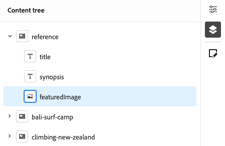

# 访问和导航通用编辑器 {#navigating}

了解访问和导航通用编辑器的基础知识。

## 简介 {#introduction}

Universal Editor 支持在任意实施中编辑任何内容的任何方面，以提供卓越的体验，提升内容速度并提供最先进的开发人员体验。

为此，Universal Editor 为内容作者提供了一个直观的 UI，只需少量培训即可开始编辑内容。本文档介绍如何导航通用编辑器。

>[!TIP]
>
>* 有关使用通用编辑器创作的详细信息，请参阅文档[使用通用编辑器创作内容。](/help/sites-cloud/authoring/universal-editor/authoring.md)
>* 有关 Universal Editor 的更详细介绍，请参阅文档 [Universal Editor 简介](/help/implementing/universal-editor/introduction.md)。

## 准备应用程序 {#prepare-app}

要使用 Universal Editor 为应用程序创作内容，应用程序必须由开发人员进行检测以支持编辑器。

>[!TIP]
>
>请参阅 [AEM Universal Editor 快速入门](/help/implementing/universal-editor/getting-started.md)，查看有关如何配置 AEM 应用程序以使用 Universal Editor 的示例。

## 访问通用编辑器 {#accessing}

一旦检测到应用程序可以使用通用编辑器，则可在AEM as a Cloud Service内部直接访问通用编辑器，而无需访问AEM。

### 在AEM as a Cloud Service中访问 {#accessing-aem}

1. 登录您的AEM as a Cloud Service创作实例。
1. 使用&#x200B;[**站点**&#x200B;控制台](/help/sites-cloud/authoring/sites-console/introduction.md)导航到为与要编辑的通用编辑器一起使用而创建的页面。
1. 编辑页面。
1. 将打开通用编辑器以编辑选定的页面。

>[!NOTE]
>
>在&#x200B;[**站点**&#x200B;控制台](/help/sites-cloud/authoring/sites-console/introduction.md)中编辑页面时，控制台将打开适用于该页面的[模板](/help/sites-cloud/authoring/page-editor/templates.md)的编辑器，可以是本文档中描述的通用编辑器，也可以是[页面编辑器。](/help/sites-cloud/authoring/page-editor/introduction.md)

### 直接访问 {#accessing-directly}

1. 登录通用编辑器。 您需要Adobe ID才能登录，[才能访问通用编辑器。](/help/implementing/universal-editor/getting-started.md#request-access)

1. 登录后，将要编辑的页面的 URL 输入到[地址栏](#location-bar)，以便您可以开始编辑文本内容或媒体内容等内容。

## 了解 UI {#ui}

UI分为以下几个主要区域。

* [Experience Cloud 标题](#experience-cloud-header)
* [通用编辑器工具栏](#universal-editor-toolbar)
* [编辑器](#editor)
* [属性边栏](#properties-rail)

### Experience Cloud 标题 {#experience-cloud-header}

Experience Cloud 标题始终显示在屏幕顶部。它是一个锚点，可让您知道您在 Experience Cloud 中的位置，并帮助您导航到其他 Experience Cloud 应用程序。

#### Experience Manager {#experience-manager}

选择标题左侧的 Adobe Experience Cloud 链接可导航到 Experience Manager 解决方案的根来访问工具，例如 [Cloud Manager](/help/onboarding/cloud-manager-introduction.md)、[Cloud Acceleration Manager](/help/journey-migration/cloud-acceleration-manager/introduction/overview-cam.md) 和 [Software Distribution](https://experienceleague.adobe.com/docs/experience-cloud/software-distribution/home.html)。

#### 组织 {#organization}

这将显示您当前登录的组织。如果您的Adobe ID与多个组织关联，请选择切换到其他组织。

#### 解决方案 {#solutions}

点按或单击解决方案切换器可快速跳转到其他 Experience Cloud 解决方案。

#### 帮助 {#help}

可使用帮助图标快速访问学习和支持资源。

#### 通知 {#notifications}

此图标带有一个标记，显示当前分配的未完成[通知](/help/implementing/cloud-manager/notifications.md)的数量。

#### 用户属性 {#user-properties}

选择代表用户的图标来访问用户设置。如果您尚未配置用户图片，系统会随机分配一个图标。

### 通用编辑器工具栏 {#universal-editor-toolbar}

Universal Editor工具栏始终出现在屏幕顶部[Experience Cloud标题的正下方。](#experience-cloud-header)它为您提供了快速访问权限，以便导航到另一个页面进行编辑以及发布当前页面。

#### “主页”按钮 {#home-button}

使用主页按钮可返回到通用编辑器的起始页

在起始页上，您可以输入要用通用编辑器编辑的站点的URL。

>[!NOTE]
>
>要使用通用编辑器编辑的任何页面都必须进行[检测以支持通用编辑器。](/help/implementing/universal-editor/getting-started.md)

#### 位置栏 {#location-bar}

位置栏为您显示正在编辑的页面的位置。选择可输入另一个要编辑的页面的地址。

>[!TIP]
>
>使用热键`l`（字母l）打开地址栏。

>[!NOTE]
>
>要使用通用编辑器编辑的任何页面都必须进行[检测以支持通用编辑器。](/help/implementing/universal-editor/getting-started.md)

#### 身份验证标头设置 {#authentication-settings}

如果需要[设置自定义身份验证标头以进行本地开发，请选择身份验证标头设置图标。](/help/implementing/universal-editor/developer-overview.md#auth-header)

#### 模拟器设置 {#emulator}

选择模拟图标以定义通用编辑器呈现页面的方式。

点按或单击模拟图标将显示选项。

默认情况下，编辑器会在桌面布局中打开，其中高度和宽度由浏览器自动定义。

您还可选择模拟移动设备并在 Universal Editor 中：

* 定义其方向
* 定义宽度和高度
* 更改方向

#### 预览模式 {#preview-mode}

在预览模式中，编辑器中呈现的页面与在您发布的服务上看到的一样。这允许内容作者通过单击链接等来导航内容。

>[!TIP]
>
>使用热键`p`切换到预览模式或从预览模式切换。

#### 打开应用程序预览 {#open-app-preview}

选择打开应用程序预览图标可在自身浏览器选项卡中打开您当前编辑的页面，无需编辑即可预览您的内容。

>[!TIP]
>
>使用热键`o`（字母o）打开应用程序预览。

>[!TIP]
>
>可以自定义应用[的预览URL。](/help/implementing/universal-editor/customizing.md#custom-preview-urls)

#### 发布 {#publish}

选择“发布”按钮，以便将更改发布到实时内容以供读者使用。

>[!TIP]
>
>有关使用 Universal Editor 发布内容的更多信息，请参阅文档[使用 Universal Editor 发布内容](publishing.md)。

#### 省略号 {#ellipsis}

使用省略号按钮可访问其他标准选项。

例如，可通过省略号按钮访问取消发布页面的功能(即反向&#x200B;[**Publish**&#x200B;按钮](#publish)的操作)。

#### 其他按钮 {#additional-toolbar-buttons}

通用编辑器提供了可自定义且可扩展的创作体验。 如果您在工具栏中看到其他按钮，则表示您的通用编辑器已扩展。

* 有关扩展可能性的详细信息，请参阅[自定义和扩展通用编辑器。](/help/implementing/universal-editor/customizing.md)
* 有关单个扩展如何工作的详细信息，请参阅[Extension Manager文档。](https://developer.adobe.com/uix/docs/extension-manager/extension-developed-by-adobe/)

### 编辑器 {#editor}

编辑器占据窗口的大部分区域，并在其中呈现在[地址栏](#location-bar)中指定的页面。

如果编辑器处于[预览模式](#preview-mode)下，则可在内容中导航并可访问链接，但无法编辑内容。

### 属性边栏 {#properties-rail}

属性边栏始终位于编辑器的右侧。 根据其模式的不同，它可显示在内容中选择的某个组件或页面内容的层次结构的详细信息。

#### 属性模式 {#properties-mode}

在属性模式中，边栏显示当前在编辑器中选择的组件的属性。这是加载页面时属性边栏的默认模式。

根据选择的组件类型，可以在属性边栏中显示和修改详细信息。

并非所有组件都具有可以显示和/或编辑的详细信息。

>[!TIP]
>
>使用热键 `d` 可切换到属性模式。

#### 内容树模式 {#content-tree-mode}

在内容树模式中，边栏显示页面内容的层次结构。

在内容树中选择某个项目时，编辑器将滚动到该内容并将其选定。

>[!TIP]
>
>使用热键 `f` 可切换到内容树模式。

##### 在 CF 编辑器中打开 {#edit}

编辑时，所选组件的选项会显示在属性边栏中，您可以在此处编辑所选组件。 如果选定的组件是内容片段，您还可以选择&#x200B;**在CF编辑器中打开**&#x200B;按钮。

点击或单击&#x200B;**在CF编辑器中打开**&#x200B;按钮将在新选项卡中打开[内容片段编辑器](/help/assets/content-fragments/content-fragments-managing.md#opening-the-fragment-editor)。 这允许您完全访问内容片段编辑器以编辑关联的内容片段。

根据工作流的需求，您可能需要在通用编辑器中或直接在内容片段编辑器中编辑内容片段。

>[!TIP]
>
>使用热键`e`在内容片段编辑器中打开选定的内容片段。

##### 添加 {#add}

如果在内容树或编辑器中选择了容器组件，则属性边栏上会显示添加选项。

点击或单击“添加”按钮将打开一个可用组件的下拉菜单[添加到选定的容器。](/help/sites-cloud/authoring/universal-editor/authoring.md#adding-components)

>[!TIP]
>
>使用热键`a`将组件添加到选定的容器组件。

##### 复制 {#duplicate}

如果在内容树或编辑器中选择容器组件中的组件，则属性边栏上会显示复制选项。

点击或单击重复按钮[将复制选定的组件。](/help/sites-cloud/authoring/universal-editor/authoring.md#duplicating-components)

##### 删除 {#delete}

如果在内容树或编辑器中选择容器组件中的组件，则属性边栏上会显示删除选项。

点击或单击删除按钮[删除该组件。](/help/sites-cloud/authoring/universal-editor/authoring.md#deleting-components)

>[!TIP]
>
>使用热键 `Shift+Backspace` 从容器中删除选定的组件。

#### 其他按钮 {#additional-properties-rail-buttons}

通用编辑器提供了可自定义且可扩展的创作体验。 如果在属性边栏中看到其他按钮，则表示已扩展通用编辑器。

* 有关扩展可能性的详细信息，请参阅[自定义和扩展通用编辑器。](/help/implementing/universal-editor/customizing.md)
* 有关单个扩展如何工作的详细信息，请参阅[Extension Manager文档。](https://developer.adobe.com/uix/docs/extension-manager/extension-developed-by-adobe/)

## 后续步骤 {#next-steps}

现在您已经知道如何访问和导航通用编辑器，您可以使用该编辑器[创作内容了。](/help/sites-cloud/authoring/universal-editor/authoring.md)
