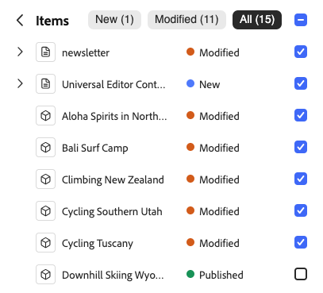

# 使用 Universal Editor 发布内容 {#publishing}

了解 Universal Editor 如何发布内容以及您的应用程序如何处理发布的内容。

>[!TIP]
>
>此处介绍的发布过程是通用编辑器的现成标准功能。
>
>通用编辑器还支持[扩展和UI可扩展性](/help/implementing/universal-editor/extending.md)，以允许工作流支持您的发布过程，因此您的发布流程可能会有所不同。

## 从通用编辑器中发布内容 {#publishing-content}

当您作为内容作者准备发布内容时，您只需点按或单击通用编辑器工具栏中的&#x200B;**发布**&#x200B;图标即可。

1. 在通用编辑器中，点按或单击通用编辑器工具栏中的[发布&#x200B;**图标。](/help/sites-cloud/authoring/universal-editor/navigation.md#publish)**
1. 如果您有可用的[预览服务](/help/sites-cloud/authoring/sites-console/previewing-content.md)，则可以选择将内容发布到的位置，即&#x200B;**预览**&#x200B;或&#x200B;**发布**。
1. **项目**&#x200B;部分列出了发布中包含的内容，包括：
   * **个新的**&#x200B;项目尚未发布。
   * 已修改&#x200B;**已发布但自上次发布以来修改的**&#x200B;内容。
   * **已发布**&#x200B;自该发布以来已发布且未修改的内容。

   根据需要点按或单击这些项目旁边的复选框以包含/排除它们。 点击或单击&#x200B;**扩展**&#x200B;可查看三个类别总计中包含的单个项目，并可单独将其纳入/排除。

   

   点按或单击&#x200B;**项目**&#x200B;标题旁边的返回箭头可返回概述。

1. 点按或单击&#x200B;**发布**&#x200B;以进行发布或单击&#x200B;**取消**&#x200B;中止。

## 从通用编辑器中取消发布内容 {#unpublishing-content}

取消发布内容的工作方式与发布内容类似。 当您作为内容作者准备从出版物中删除内容时，请点按或单击通用编辑器工具栏中的省略号图标，然后&#x200B;**取消发布**。

然后，您可以使用与[发布内容时相同的选项来取消发布内容。](#publishing-content)包括从预览实例取消发布（如果可用）以及要包含在取消发布中的项。

## 从站点控制台中发布和取消发布 {#publishing-sites-console}

您还可以从站点控制台[&#128279;](/help/sites-cloud/authoring/sites-console/publishing-pages.md)发布，当您希望发布多个内容页面或计划发布或取消发布时，这非常有用。

## 与页面编辑器的相似之处 {#similarities}

对于[AEM页面编辑器的用户，](/help/sites-cloud/authoring/page-editor/introduction.md)使用通用编辑器发布内容的过程按您习惯的方式进行：在AEM中发布时，内容将从创作层复制到发布层。

## 差异 {#differences}

使用 Universal Editor 进行发布的不同之处，与其说是与编辑器本身相关，不如说是 Universal Editor 使应用程序的外部托管成为可能。

在外部托管时，Web 应用程序需要注意的是，确保当作者在编辑器中打开应用程序时从作者层加载内容，并在访问者访问应用程序时从发布层加载内容。

## 检测应用程序中的层级 {#detecting}

确定是否应访问作者或发布层可以通过在应用程序中加入简单的条件语句来完成，以便在检测到它正在编辑器中打开时选择适当的作者或发布端点。

另一种选择是将应用程序部署到配置不同的两个不同环境，以便一个从作者层检索其内容，另一个从发布层检索。要允许作者在通用编辑器中打开已发布的URL，可以创建一个小型脚本将发布端URL“转换”为创作环境中的等效项（例如，通过在前面`author`个子域中添加前缀），以便自动重定向作者。

## 摘要 {#summary}

Universal Editor 的目标是不强加任何特定模式，以便以完全解耦的方式最大限度地实现实施目标，同时仍然保持简单和直接的实施。

同样，Universal Editor 不对任何特定项目应如何确定从哪一层交付内容作出任何要求。相反，它可以启用多种可能性，并允许项目确定哪种解决方案最适合其自身需求。

## 其他资源 {#additional-resources}

要了解如何使用通用编辑器创作内容，请参阅此文档。

* [使用 Universal Editor 创作内容](authoring.md) – 了解内容作者使用 Universal Editor 创建内容是多么轻松和直观。

要了解有关通用编辑器的技术详细信息的更多信息，请参阅这些开发人员文档。

* [Universal Editor 简介](/help/implementing/universal-editor/introduction.md) – 了解 Universal Editor 如何支持在任意实施中编辑任何内容的任何方面，以提供卓越的体验，提升内容速度并提供最先进的开发人员体验。
* [AEM Universal Editor 快速入门 ](/help/implementing/universal-editor/getting-started.md) – 了解如何获取 Universal Editor 访问权限以及如何对第一个 AEM 应用程序插桩以使用 Universal Editor。
* [Universal Editor 架构](/help/implementing/universal-editor/architecture.md) – 了解 Universal Editor 的架构以及数据如何在其服务和层之间流动。
* [属性和类型](/help/implementing/universal-editor/attributes-types.md) – 了解 Universal Editor 所需的数据属性和类型。
* [Universal Editor 身份验证](/help/implementing/universal-editor/authentication.md) – 了解 Universal Editor 如何进行身份验证。
